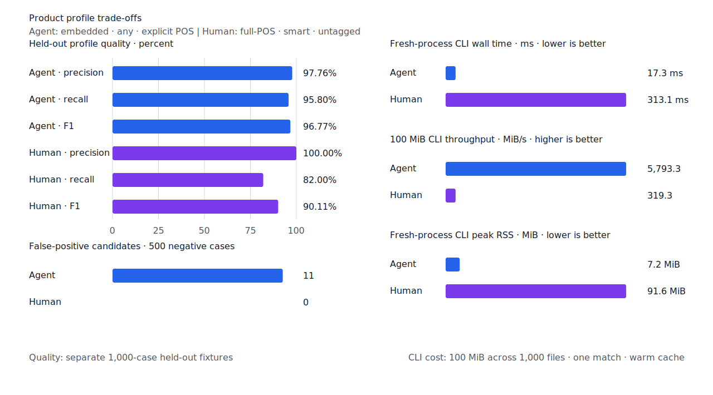
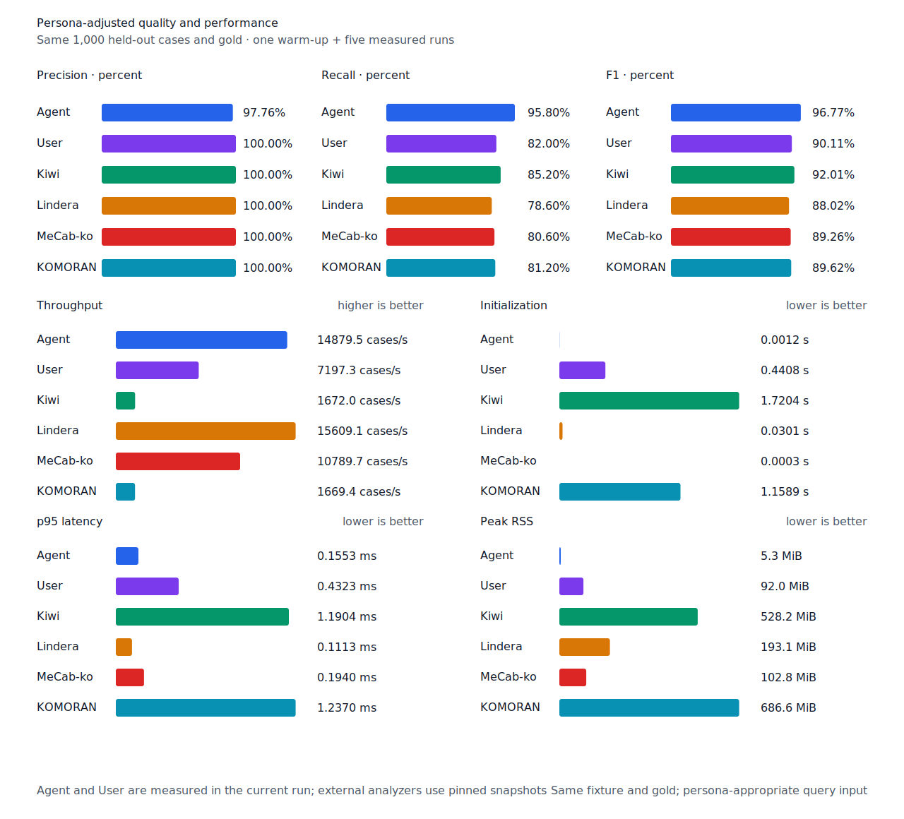

# kfind

[English](README.md) | [한국어](README.ko.md) |
[Documentation & playground](https://kfind.pages.dev)

Fast Korean lemma and inflection search for code and documents.

`kfind` analyzes the query once, compiles bounded surface anchors and verifiers,
and scans files without running a morphology analyzer over the corpus. It finds
inflected forms while retaining grep-like path filtering, context, and output
modes.

```console
$ kfind -n 걷다 src docs
docs/guide.md:12: 길을 걸어 갔다.
src/example.txt:8: 손님이 오래 걸었습니다.
```

## Purpose

`kfind` is a query-directed text matcher for agents and interactive search. It
turns a short Korean lemma or phrase into a bounded search plan, then returns
candidate spans and morphology provenance from files or in-memory text. Agents
can retrieve a broad candidate set quickly and use surrounding context for the
final judgment; people can choose the more selective default workflow.

Morphology is a means of planning and verifying a search, not the product's
output. `kfind` does not analyze every sentence in the input corpus.

## Goals and non-goals

Goals:

- Compile short queries into bounded plans and scan large text collections with
  low overhead.
- Provide tested recall and precision for the supported Korean morphology while
  preserving matched spans, lemmas, POS, and rule provenance.
- Offer reproducible offline behavior through the CLI, Rust library, and
  JavaScript/WebAssembly package.

Non-goals:

- A general-purpose sentence tokenizer or morphology analyzer, or a backend
  optimized to lead morphology-analyzer throughput rankings.
- Semantic search, synonym or paraphrase expansion, and contextual homonym
  disambiguation.
- Complete reverse analysis of arbitrary surface forms or unrestricted coverage
  of every Korean construction.

## Features

- Finds noun-particle combinations, predicate endings, irregular inflections,
  and selected productive derivations from a lemma.
- Searches ordered, same-line phrases with per-atom part-of-speech tags.
- Offers `smart` boundaries for interactive precision and `any` boundaries for
  recall-oriented automation.
- Walks files in parallel with ignore rules, globs, named file types, hidden-file
  control, stdin, and explicit encodings.
- Produces terminal text, context, counts, file lists, JSON Lines, and query or
  match provenance.
- Runs offline. Core rules are embedded; Homebrew installs the optional full POS
  and morphology-component resources.
- Exposes the query compiler and matcher through Rust and WebAssembly libraries.

## Install

Homebrew releases are published through the personal tap:

```sh
brew install seokminhong/brew/kfind
```

To build the current checkout with Rust 1.85 or newer:

```sh
cargo install --locked --path crates/kfind-cli
```

## Quick start

```sh
# Infer the part of speech and find inflections.
kfind 걷다 src docs

# Search a lemma as a noun and consume valid particles.
kfind --pos noun 사용자 src

# Search an ordered phrase. Each atom can have its own part of speech.
kfind 'n:권한 v:검증하다' src --max-gap 24

# Search bytes as a literal without morphology expansion.
kfind --literal '걸어' data.txt

# Restrict files and print two lines of context.
kfind 걷다 . --type-add 'docs:*.{md,mdx,txt}' --type docs -C 2

# Emit stable machine-readable records for automation.
kfind --embedded --boundary any --pos verb --json 걷다 src docs
```

With no `PATH`, `kfind` reads piped stdin or searches `.` when stdin is a
terminal. `-` selects stdin explicitly.

## Search model

### Morphology expansion

The default `inflection` mode includes noun plurals and particle chains,
predicate endings, copula forms, and the irregular classes covered by the
versioned rules and lexicon. `derivation` adds registered productive forms such
as `-적`, `-하다`, `-되다`, and `-시키다`. `literal` disables morphology
expansion.

The query is expanded; the corpus is not fully tokenized or analyzed. This keeps
file scanning fast, but it is not semantic search. For example,
`v:검증하다` does not match a paraphrase such as `검증을 수행했다`; search
`n:검증` separately when that wording matters. A surface form such as `걸어`
also is not reverse-analyzed into every possible lemma unless the lemma or POS is
given explicitly.

### Query language

Atoms are separated by whitespace. Quotes keep a phrase inside one literal
atom, and backslashes escape the next character. The supported POS tags are:

| Tag | Part of speech |
| --- | --- |
| `n:` | noun |
| `pro:` | pronoun |
| `num:` | numeral |
| `v:` | verb |
| `adj:` | adjective |
| `det:` | determiner |
| `adv:` | adverb |
| `j:` | particle |
| `intj:` | interjection |
| `lit:` | literal |

```sh
kfind 'n:권한 "접근 제어" v:검증하다' src
kfind 'det:새 n:기능' docs
kfind 'lit:걸어' data.txt
```

Phrase atoms must appear in order on the same line. `--max-gap` measures the
Unicode scalar distance from the end of one verified token to the start of the
next. A global `--pos` may be combined with atom tags only when they name the
same POS.

### Boundary policies

| Policy | Behavior | Typical use |
| --- | --- | --- |
| `smart` | Applies POS-aware verification and checks the completed token span. It can use the optional component resource for compound nouns and lexical predicates. | Interactive search; default |
| `token` | Requires token boundaries around every core and completed token span. | Strict standalone tokens |
| `any` | Does not require left or right token boundaries. | Recall-oriented automation with downstream context review |

A one-syllable query remains conservative under `smart`. Explicit particle POS
can expand registered allomorphs such as `은/는`, `이/가`, and `으로/로`; an
untagged query searches only the particle surface that was written.

### Human and agent workflows

For interactive use, omit the POS. The default `auto` POS and `smart` boundary
favor precision and use the installed full POS lexicon when available:

```sh
kfind 걷다 src
kfind 사용자 src docs
```

For agent automation, specify every morphology atom, use `any`, the embedded
lexicon, and JSON Lines:

```sh
kfind --embedded --boundary any --pos verb --json 걷다 src docs
kfind --embedded --boundary any --json 'n:사용자 v:검증하다' src
```

The agent workflow returns a broader candidate set. Inspect the surrounding
text, narrow paths or globs, or retry with `smart` if the set is too large.

## CLI reference

```text
kfind [OPTIONS] <QUERY> [PATH]...
```

### Query and compilation

| Option | Values and default | Description |
| --- | --- | --- |
| `--pos <POS>` | `auto` (default), `noun`, `pronoun`, `numeral`, `verb`, `adjective`, `determiner`, `adverb`, `particle`, `interjection`, `literal` | Forces one POS for the entire query. |
| `--expand <LEVEL>` | `inflection` (default), `literal`, `derivation` | Chooses the morphology expansion level. `derivation` includes inflection. |
| `--boundary <POLICY>` | `smart` (default), `token`, `any` | Chooses match-boundary verification. |
| `--literal` | off | Shortcut for `--expand literal --pos literal`; conflicting `--expand` or `--pos` values are errors. |
| `--embedded` | off | Skips full POS discovery and decoding. A `smart` plan may still require the component resource. |
| `--max-gap <NUM>` | `24` | Sets the maximum Unicode scalar gap between adjacent phrase atoms. |
| `--unicode-normalization <MODE>` | `nfc` (default), `canonical`, `none` | Uses NFC only, generates NFC and NFD patterns, or matches input bytes without normalization. |

### Files and input

| Option | Values and default | Description |
| --- | --- | --- |
| `--encoding <ENCODING>` | `auto` (default), `utf-8`, `utf-16le`, `utf-16be`, `euc-kr` | Selects input decoding. `auto` detects BOM-marked UTF-16 and otherwise uses UTF-8; it does not guess EUC-KR. |
| `--glob <GLOB>` | repeatable | Adds an include glob or an exclude glob prefixed with `!`. |
| `--type <TYPE>` | repeatable | Searches only files in a named type. |
| `--type-add <NAME:GLOB>` | repeatable | Defines or extends a named file type. |
| `--hidden` | off | Includes hidden files and directories. |
| `--no-ignore` | off | Disables `.gitignore`, `.ignore`, global Git ignore, and parent ignore rules. |
| `--threads <NUM>` | automatic | Sets the number of file-search worker threads. |

Directory walks exclude hidden and ignored entries by default and do not follow
symbolic links. An explicitly named file is searched even when an ignore rule
would exclude it. Input stops at the first NUL byte and treats the file as
binary.

### Output and diagnostics

| Option | Default | Description |
| --- | --- | --- |
| `-n`, `--line-number` | off | Prints one-based line numbers. |
| `-H`, `--with-filename` | automatic | Always prints file names; conflicts with `-h`. |
| `-h`, `--no-filename` | automatic | Never prints file names; conflicts with `-H`. |
| `-C`, `--context <NUM>` | `0` | Prints `NUM` lines before and after each match. |
| `-B`, `--before-context <NUM>` | context value | Overrides the number of lines before each match. |
| `-A`, `--after-context <NUM>` | context value | Overrides the number of lines after each match. |
| `-l`, `--files-with-matches` | off | Prints each matching file once and stops that file after its first match; conflicts with `--count`, `--quiet`, and `--json`. |
| `-c`, `--count` | off | Prints the number of lines with at least one verified match per file; conflicts with `--quiet` and `--json`. |
| `-q`, `--quiet` | off | Prints no matches and stops globally after the first match; conflicts with `--json`. |
| `--json` | off | Writes one JSON object per match or context record; conflicts with `--explain-query`. |
| `--color <WHEN>` | `auto`; `auto`, `always`, `never` | Controls terminal highlighting. `auto` enables color only for standard output to a terminal. |
| `--column` | off | Prints a one-based Unicode scalar column and implies line-number output. |
| `--explain-query` | off | Prints inferred analyses, anchors, verifier counts, normalization, and lexicon status before results. |
| `--explain-match` | off | Adds the lemma and rule path behind each text match. JSON already includes origin metadata. |
| `--sort path` | unsorted parallel stream | Buffers completed file results and emits path order; this uses memory proportional to results and can reduce parallel throughput. |

File names are printed automatically when searching a directory or multiple
inputs. Match and context lines use `:` and `-` separators respectively.

JSON Lines records contain `type`, path, line, optional column, text, spans,
core and token byte ranges, matched surface, lemma/POS origins, rule paths, and
an `offset_unit`. Non-UTF-8 paths and text use Base64 fields rather than lossy
conversion.

### Data and command information

| Option | Default | Description |
| --- | --- | --- |
| `--data-dir <PATH>` | automatic discovery | Reads `lexicon.bin` and `morphology-component-compact.kfc` from one explicit directory. |
| `--user-lexicon <PATH>` | XDG config path | Loads a TOML user lexicon instead of the default config lookup. |
| `--help` | — | Prints localized command help. `-h` is reserved for `--no-filename`. |
| `-V`, `--version` | — | Prints the version. |

The CLI checks `--user-lexicon`, `KFIND_USER_LEXICON`, and then
`$XDG_CONFIG_HOME/kfind/lexicon.toml` or `$HOME/.config/kfind/lexicon.toml`:

```toml
[[predicate]]
lemma = "플러그인하다"
pos = "verb"
alternation = "Ha"

[[nominal]]
surface = "LLM"
```

Entries extend the bundled data. Set `replace = true` on an entry to replace
existing analyses in the same morphology category for that lemma.

### Exit status and display language

| Code | Meaning |
| ---: | --- |
| `0` | At least one match was found. |
| `1` | No match was found. |
| `2` | Usage, query compilation, data, I/O, or search error. |

Human-readable help, errors, diagnostics, and `--explain-*` output follow the
first non-empty value of `LC_ALL`, `LC_MESSAGES`, and `LANG`. A `ko` locale
selects Korean; all other values use English. Option names, accepted values,
JSON fields, and exit codes do not change with the locale.

## Lexicon data

Core irregular predicates and rules are embedded in the binary. Homebrew also
installs the pinned full POS lexicon and compact morphology-component resource
under `share/kfind`; runtime network access is never required.

Without the full POS file, searches continue with the core lexicon and
heuristics. `--explain-query` reports that preview state. `--data-dir` or
`KFIND_DATA_DIR` selects an explicit resource directory. `--embedded` skips only
full POS resolution. A compiled `smart` plan that requires component evidence
still resolves and validates the component resource; plans that do not need it
leave it unloaded.

The full POS artifact is reproducible from the pinned, checksum-verified
`mecab-ko-dic` source:

```sh
scripts/build-full-pos.sh
cargo run --locked -p kfind-testkit --bin verify-gold -- \
  data/generated/full-pos/lexicon.bin
```

## Benchmarks

These results summarize separate workloads; morphology quality, end-to-end CLI
throughput, resource startup, and literal scanning are not one combined score.
Each linked report records the environment, input digest, revision, warm-up,
and repetitions.

### Product workflows

The latest smart-precision measurement used fresh processes after one warm-up
and reports the median of five runs on Linux/aarch64. Quality fixtures contain
1,000 cases; the CLI workload scans a fixed 100 MiB corpus split across 1,000
files.

| Workflow | Quality (TP / FP / FN) | CLI wall | Throughput | Peak RSS |
| --- | ---: | ---: | ---: | ---: |
| Agent: embedded + `any` + explicit POS | 479 / 11 / 21 | 17.3 ms | 5,793.3 MiB/s | 7.2 MiB |
| Human: full POS + `smart` + untagged | 410 / 0 / 90 | 313.1 ms | 319.3 MiB/s | 91.6 MiB |



The agent and human quality rows use different negative-query contracts, so
they describe their product workflows rather than a head-to-head backend rank.
The human row is from the 2026-07-14 candidate revision `b2d3c93`; the unchanged
agent quality contract is detailed in the 2026-07-13 workflow report.

- [2026-07-14 smart-precision quality and performance](docs/benchmarks/2026-07-14-user-smart-precision.md)
- [2026-07-13 product workflow methodology and external snapshots](docs/benchmarks/2026-07-13-product-workflows.md)

### External analyzer comparison

The table below uses the same 1,000-case explicit-POS fixture and gold. The
Agent row and the pinned external analyzers receive explicit POS; the User row
removes POS from the same queries to represent interactive use. Agent and User
were measured on 2026-07-14. External rows reuse snapshots whose fixture,
schema, version, and configuration did not change.

| Backend | Input and version | TP / FP / FN | Precision | Recall | F1 | Init | Cases/s | p95 | Peak RSS |
| --- | --- | ---: | ---: | ---: | ---: | ---: | ---: | ---: | ---: |
| Agent | embedded + `any`, explicit POS | 479 / 11 / 21 | 97.76% | 95.80% | 96.77% | 0.0012 s | 14,879.5 | 0.1553 ms | 5.3 MiB |
| User | full POS + `smart`, untagged | 410 / 0 / 90 | 100.00% | 82.00% | 90.11% | 0.4408 s | 7,197.3 | 0.4323 ms | 92.0 MiB |
| Kiwi | snapshot 0.23.2, model 0.23.0, explicit POS | 426 / 0 / 74 | 100.00% | 85.20% | 92.01% | 1.7204 s | 1,672.0 | 1.1904 ms | 528.2 MiB |
| Lindera | snapshot 4.0.0, embedded-ko-dic, explicit POS | 393 / 0 / 107 | 100.00% | 78.60% | 88.02% | 0.0301 s | 15,609.1 | 0.1113 ms | 193.1 MiB |
| MeCab-ko | snapshot 1.0.2, dictionary 1.0.0, explicit POS | 403 / 0 / 97 | 100.00% | 80.60% | 89.26% | 0.0003 s | 10,789.7 | 0.1940 ms | 102.8 MiB |
| KOMORAN | snapshot 3.3.9, FULL, explicit POS | 406 / 0 / 94 | 100.00% | 81.20% | 89.62% | 1.1589 s | 1,669.4 | 1.2370 ms | 686.6 MiB |



This is a product task workload comparison, not a same-input backend ranking or
pure tokenizer benchmark. Each backend includes its own query preparation,
analysis, and matching costs; the User row additionally includes automatic POS
planning and ambiguity.

### Scan, startup, and query compilation

| Workload | Result | Measurement |
| --- | --- | --- |
| 1 GiB warm-cache, no-hit literal scan | 0.047 s median, 21,787 MiB/s, 7.23 MiB RSS | 2026-07-12, revision `a7b3c28`; the paired `rg -F` run had the same median wall and throughput |
| Full POS native warm startup, 632,667 entries | 0.08 s, 39.5 MiB peak RSS | 2026-07-13, revision `8845f33` |
| Query compile p95 | 0.077875 ms for one atom; 0.153838 ms for eight atoms | 2026-07-11, revision `026ff81` |

The 1 GiB result is a low-hit I/O regression check, not a claim that morphology
search and `rg -F` provide the same features.

- [1 GiB mixed-corpus report](docs/benchmarks/2026-07-12-1gib-mixed.md)
- [Full POS startup report](docs/benchmarks/2026-07-13-full-pos-startup.md)
- [Query compile report](docs/benchmarks/2026-07-11-query-compile.md)
- [Benchmark contract and report index](docs/benchmarks/README.md)

## Library

### Rust

The `kfind` crate exposes the same query compiler and morphology matcher for
in-memory UTF-8 input:

```rust
use kfind::{CompileOptions, Engine};

let engine = Engine::new()?;
let matcher = engine
    .compile("걷다", &CompileOptions::default())
    .expect("query should compile");
let text = "길을 걸어 갔다.";
let matches = matcher.find_all(text.as_bytes());

assert_eq!(&text[matches[0].span.clone()], "걸어");
```

Component-aware smart searches require explicit initialization. Use
`Engine::with_component_resource` when constructing the engine or call
`load_component_resource` on an existing mutable engine before compiling a plan
that needs it.

The library and its core dependencies support Rust 1.85's
`wasm32-unknown-unknown` target:

```sh
rustup target add wasm32-unknown-unknown --toolchain 1.85.0
cargo +1.85.0 build --locked --package kfind-wasm --target wasm32-unknown-unknown
```

### JavaScript

The unscoped `kfind` npm package provides ESM WebAssembly bindings and generated
TypeScript declarations for browser bundlers:

```js
import { Kfind } from "kfind";

const engine = new Kfind();
const matcher = engine.compile("걷다");
const text = "😀 길을 걸어 갔다.";
const matches = matcher.findAll(text);

console.log(text.slice(matches[0].start, matches[0].end)); // 걸어
```

JavaScript offsets use UTF-16 code units. The package publishes the component
resource as `kfind/assets/morphology-component-compact.kfc`, separate from the
WASM binary. Constructing `Kfind` without it avoids loading the 45.6 MiB asset.
Applications can pass the bytes to the constructor or call
`loadComponentResource` before compiling plans that need it.

The package has not been published to the registry yet. Its release artifact
can be built and checked locally:

```sh
pnpm --dir packages/kfind run pack:check
```

## Development

```sh
cargo fmt --all -- --check
cargo clippy --workspace --all-targets --locked -- -D warnings
cargo test --workspace --locked
cargo bench -p kfind-testkit --bench query_matcher
scripts/benchmark-morphology.sh
pnpm --dir packages/kfind run benchmark:startup
pnpm --dir packages/kfind run pack:check
```

The morphology fixture contains 452 positive and negative regression cases. The
Docker benchmark measures `kfind` on 1,000 cases generated from independent UD
Korean-Kaist and KSL test splits, then compares it with pinned Kiwi, Lindera,
MeCab-ko, and KOMORAN snapshots. Fuzz targets for query parsing and malformed
matcher input live in `fuzz/`.

The implementation contract and release acceptance criteria are in
[`specs/kfind.md`](specs/kfind.md).

## License

kfind source code and project-authored data are available under the
[MIT License](LICENSE). The Homebrew full POS resource preserves the separate
Apache-2.0 notice from `mecab-ko-dic` under `share/doc/kfind/LICENSES`. UD source
and derived fixtures in the benchmark image remain under CC BY-SA 4.0, with a
per-source notice included in the image.

## Release

Pushing a matching `vX.Y.Z` tag runs the release workflow. It rebuilds and
verifies the full POS resource, publishes source/data/CLI assets, and opens a
Formula PR against `SeokminHong/homebrew-brew`. The tap's `pr-pull` label is
applied only after its Formula tests pass.

The release workflow requires a `TAP_GITHUB_TOKEN` secret with write access to
the tap. It validates the MIT Cargo package metadata before publishing.
