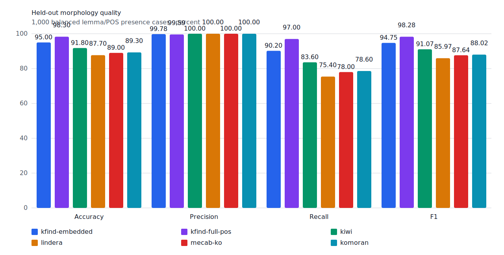
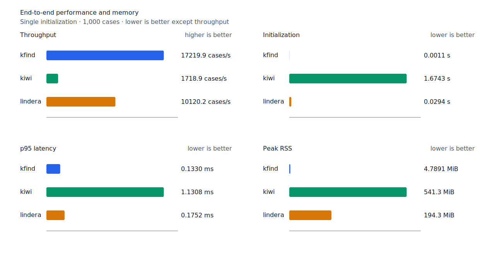

# kfind / Kiwi / Lindera 형태소 검색 비교 분석

측정일: 2026-07-12

벤치마크 구현 기준: `82dd177`

fixture SHA-256: `933bc12197da866d2363d7df9107d4d9be89a65ddaafd73968ad5384832b21ff`

## 결론

동일한 lemma/POS/span 기준에서는 Kiwi가 가장 높은 품질을 보였다. kfind는 F1 82.67%로
Kiwi보다 9.34%p, Lindera보다 5.35%p 낮았다. 차이는 대부분 false negative이며 특히 명사,
형용사, 동사에서 컸다.

kfind의 장점은 실행 비용이다. 이 측정에서 처리량은 Kiwi의 약 10배, Lindera의 약 1.7배였고
peak RSS는 각각의 약 1/113, 1/40이었다. 따라서 현재 결과는 “품질 우위”가 아니라 “낮은
자원 비용과 낮은 recall의 교환”으로 읽어야 한다.

## 평가 대상

Universal Dependencies 2.18의 Korean-Kaist와 Korean-KSL test split에서 source별 250개
positive를 추출하고, 같은 source에서 gold lemma/POS가 없는 문장 250개를 대응시켰다.

| 항목 | 값 |
| --- | --- |
| 전체 case | 1,000 |
| Positive / Negative | 500 / 500 |
| Source | UD Korean-Kaist, UD Korean-KSL |
| 품사 | 명사, 동사, 형용사, 부사, 대명사, 관형사, 수사 |
| kfind profile | embedded core lexicon |
| Kiwi | 0.23.2 |
| Lindera | 4.0.0, embedded ko-dic |
| 실행 환경 | Linux/aarch64 Docker VM, 10 logical CPUs, 약 7.7 GiB memory |

positive는 같은 lemma/POS를 반환하는 것만으로 충분하지 않다. 반환 span이 gold 어절의
UTF-8 byte span과 겹쳐야 정답이다. negative는 문장 어디에서든 같은 lemma/POS를 반환하면
오답이다.

## 메트릭 의미

### 품질 메트릭

| 메트릭 | 계산 | 의미 |
| --- | --- | --- |
| TP | gold positive이며 예측 span도 일치 | 있어야 할 표제어를 올바른 위치에서 찾음 |
| FP | gold negative인데 positive로 예측 | 없는 표제어·품사를 잘못 찾음 |
| TN | gold negative이며 negative로 예측 | 없어야 할 표제어를 찾지 않음 |
| FN | gold positive인데 찾지 못함 | 실제 표제어를 놓침 |
| Accuracy | `(TP + TN) / 전체 case` | 전체 판정 중 맞은 비율. class 비율에 영향을 받음 |
| Precision | `TP / (TP + FP)` | 찾았다고 한 결과가 실제로 맞을 확률 |
| Recall | `TP / (TP + FN)` | 실제로 있는 표제어를 찾아낸 비율 |
| F1 | `2 × Precision × Recall / (Precision + Recall)` | precision과 recall의 조화평균 |

이번 fixture는 positive와 negative가 1:1이라 accuracy 왜곡이 작다. 다만 negative가 다른
문장에서 deterministic하게 선택되어 대부분 쉬운 사례다. 따라서 99.72~100% precision은
실서비스의 hard-negative precision을 대표하지 않는다. 현재 품질 비교에서는 recall과 F1을
우선해서 봐야 한다.

### 성능 메트릭

| 메트릭 | 의미 |
| --- | --- |
| Initialization | 사전·모델을 한 번 준비하는 시간 |
| Evaluation | 초기화 후 1,000개 case를 처리한 전체 시간 |
| Cases/s | `1,000 / Evaluation`으로 계산한 end-to-end 처리량 |
| p50 latency | case 절반이 이 시간 이내에 끝나는 중앙 지연 |
| p95 latency | case 95%가 이 시간 이내에 끝나는 tail latency |
| Peak RSS | 프로세스가 사용한 최대 resident memory |

kfind는 질의 컴파일과 검색을 수행하고 Kiwi·Lindera는 문장 전체를 분석한 뒤 lemma/POS를
조회한다. 따라서 cases/s는 제품 검색 경로 비교이지 순수 tokenizer 속도 비교가 아니다.
또한 한 번 실행한 결과이므로 회귀 기준으로 사용하려면 반복 측정과 분산 보고가 필요하다.

`by_source`와 `by_pos`는 같은 메트릭을 source 또는 품사별 subset에 다시 계산한 값이다.
전체 평균에서 가려지는 특정 도메인·품사의 약점을 찾는 용도다. fixture digest와 seed는
입력 사례와 순서가 바뀌지 않았음을 검증한다.

## 전체 품질

| 도구 | TP | FP | TN | FN | Accuracy | Precision | Recall | F1 |
| --- | ---: | ---: | ---: | ---: | ---: | ---: | ---: | ---: |
| kfind | 353 | 1 | 499 | 147 | 85.20% | 99.72% | 70.60% | 82.67% |
| Kiwi | 426 | 0 | 500 | 74 | 92.60% | 100.00% | 85.20% | 92.01% |
| Lindera | 393 | 0 | 500 | 107 | 89.30% | 100.00% | 78.60% | 88.02% |

kfind가 놓친 147개 중 113개는 Kiwi와 Lindera가 모두 찾았다. 세 도구가 모두 놓친 case는
23개다. 전자는 kfind의 사전·활용·boundary 경로를 우선 조사할 근거이고, 후자는 gold와 세
adapter의 정규화 계약을 함께 검토할 후보이다.

kfind의 유일한 FP는 adjective `이다`를 `매일 아러바이트가도 있습니다.`에서 찾은
case다. match span은 `매일`의 마지막 음절에 해당한다. 한 음절 VCP 지정사 anchor의 왼쪽
boundary 검증을 우선 확인해야 한다.

## 품사별 결과

| 품사 | kfind Recall / F1 | Kiwi Recall / F1 | Lindera Recall / F1 | kfind FN |
| --- | ---: | ---: | ---: | ---: |
| 명사 | 60.56% / 75.43% | 92.22% / 95.95% | 83.89% / 91.24% | 71 |
| 형용사 | 68.75% / 80.88% | 81.25% / 89.66% | 73.75% / 84.89% | 25 |
| 동사 | 72.50% / 84.06% | 80.83% / 89.40% | 78.33% / 87.85% | 33 |
| 수사 | 65.00% / 78.79% | 55.00% / 70.97% | 50.00% / 66.67% | 7 |
| 대명사 | 80.00% / 88.89% | 66.67% / 80.00% | 76.67% / 86.79% | 6 |
| 관형사 | 90.00% / 94.74% | 100.00% / 100.00% | 55.00% / 70.97% | 2 |
| 부사 | 94.00% / 96.91% | 94.00% / 96.91% | 90.00% / 94.74% | 3 |

명사 FN 71개가 전체 kfind FN의 48.3%를 차지한다. embedded core lexicon만 사용한 결과이므로
정규 full-POS resource를 연결한 profile을 먼저 측정해야 사전 범위와 matcher 규칙의 영향을
분리할 수 있다. 형용사·동사 FN은 불규칙 활용, 보조 용언, 합성 용언, continuation 검증을
세분화해야 한다.

수사·대명사에서는 kfind가 두 외부 분석기보다 높은 recall을 보였다. 다만 positive가 각각
20개, 30개로 작아 일반화하기 어렵다.

## 성능 결과

| 도구 | Initialization | Cases/s | p50 | p95 | Peak RSS |
| --- | ---: | ---: | ---: | ---: | ---: |
| kfind | 0.0011 s | 17,219.9 | 0.0202 ms | 0.1330 ms | 4.8 MiB |
| Kiwi | 1.6743 s | 1,718.9 | 0.5012 ms | 1.1308 ms | 541.3 MiB |
| Lindera | 0.0294 s | 10,120.2 | 0.0778 ms | 0.1752 ms | 194.3 MiB |

kfind runner는 embedded core lexicon을 사용하므로 full-POS profile의 RSS와 초기화 시간은 이
수치보다 커질 수 있다. Kiwi의 peak RSS에는 Python runtime과 model이 포함되고 Lindera는
embedded ko-dic Rust runner를 포함한다.

## 해석 한계

- test split 실패 목록을 이미 관찰했으므로 같은 case에 맞춘 개선 뒤에는 더 이상 blind
  benchmark라고 부를 수 없다. 개선 작업은 dev split에서 수행하고 별도 blind source로
  최종 검증해야 한다.
- negative는 source 내 다른 문장과의 조합이라 쉬운 사례가 많다. 동음이의어, 잘못된 띄어쓰기,
  합성어 내부 substring을 포함하는 hard-negative slice가 필요하다.
- Korean-Kaist의 lemma/XPOS는 비-UD 형태 주석에서 변환되며 `OrigLemma` 복원이 포함된다.
  Korean-KSL은 학습자 문장과 `Typo=Yes` 사례를 포함한다.
- 성능값은 단일 Docker VM 실행이다. 절대 수치보다 같은 환경의 반복 측정 차이에 의미가 있다.

재현 명령과 전체 실패 span은 각각 `scripts/benchmark-morphology.sh`와
`target/morph-benchmark/report.json`에 있다.
