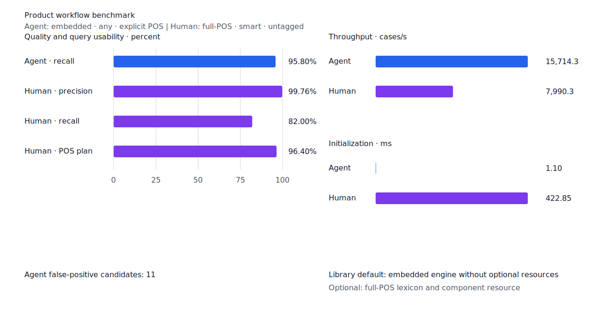
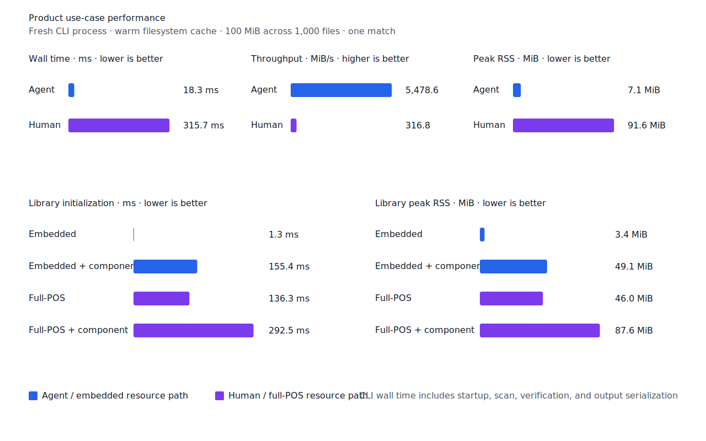
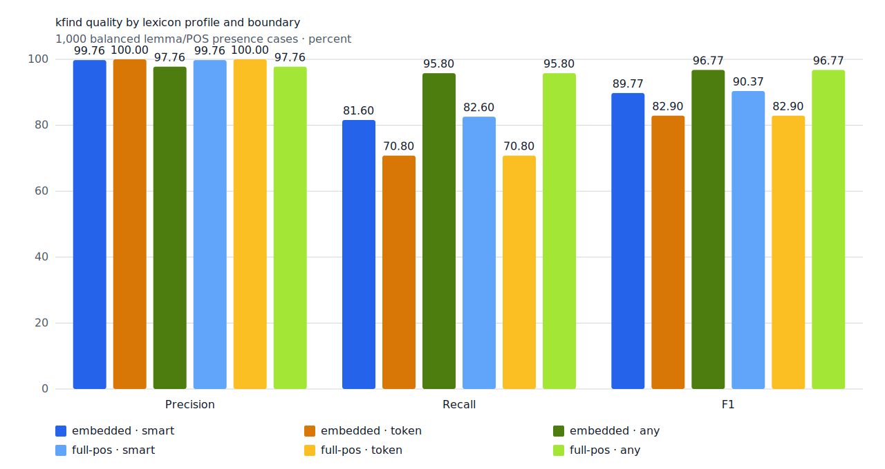
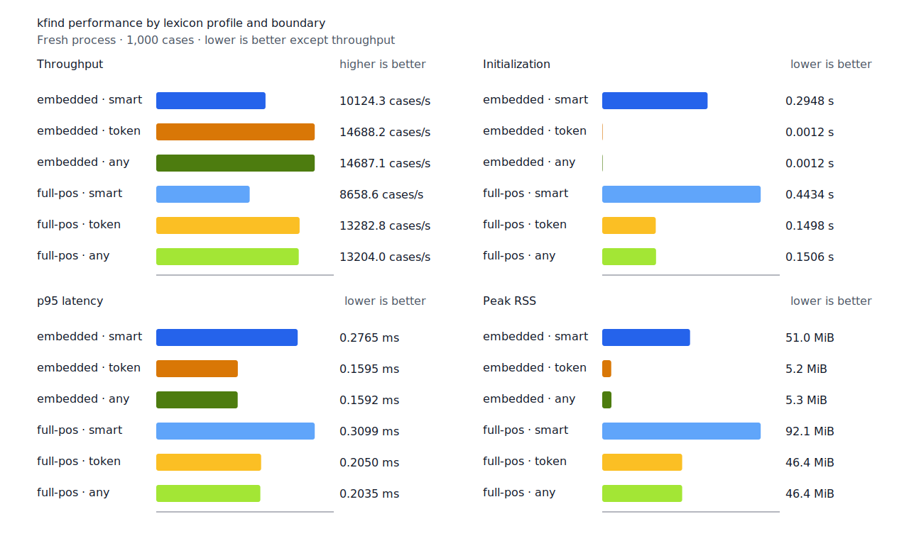
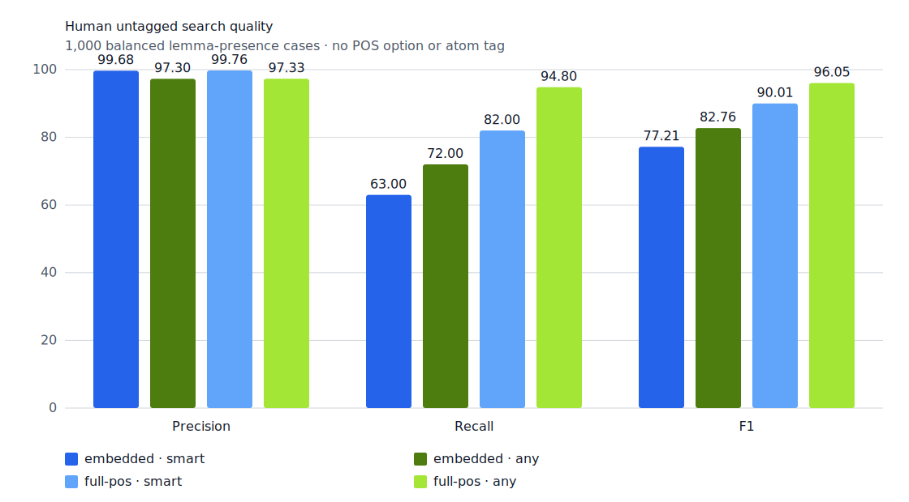
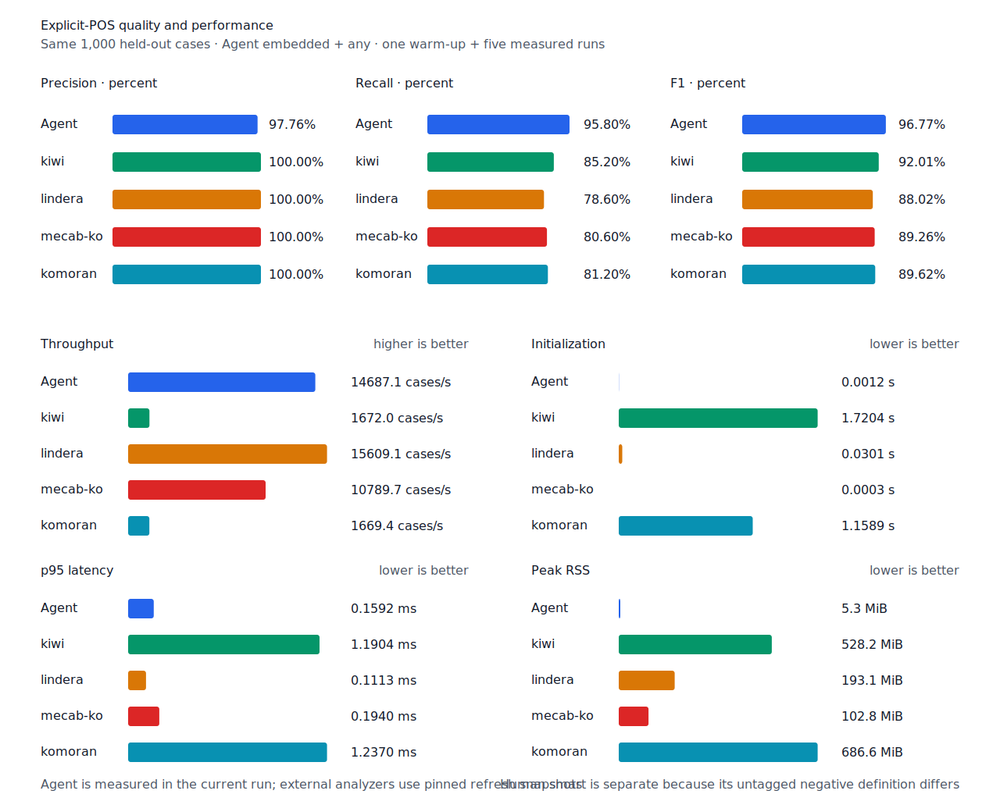

# 제품 workflow 형태소 벤치마크

- 측정일: 2026-07-13
- 측정 revision: `ca1359d`
- 환경: Linux/aarch64, 10 logical CPUs, Python 3.12.13, Docker
- 반복: 1회 warm-up 뒤 5회 측정의 중앙값

## 결론

- 에이전트 CLI는 `embedded + any + 명시적 품사`를 기준으로 본다. 주 지표는 recall과
  처리량이며 FP는 문맥 검토 대상 수로 기록한다.
- 사용자 CLI는 `full-POS + smart + 무품사`를 기준으로 본다. 주 지표는 precision, recall과
  자동 품사 계획 coverage다.
- 라이브러리 기본값은 optional resource가 없는 embedded engine이다. full-POS lexicon과
  component resource는 초기화 시간과 메모리를 감수하는 명시적 선택지다.

## 제품 profile trade-off



Agent profile은 recall 95.80%와 5,478.6 MiB/s 처리량을 얻는 대신 FP 후보가 11건이다.
사람 CLI profile은 precision 99.76%와 FP 1건을 얻지만 recall은 82.00%, 처리량은
316.8 MiB/s다. 품질은 profile별 1,000-case held-out fixture, CLI 비용은 아래 고정 source
corpus에서 측정했으며 하나의 종합 점수로 합치지 않는다.

## 실제 CLI 사용 케이스 성능



| use case | wall | throughput | peak RSS | 출력 |
| --- | ---: | ---: | ---: | --- |
| Agent: embedded + any + explicit POS | 18.3 ms | 5,478.6 MiB/s | 7.1 MiB | JSON Lines |
| Human: full-POS + smart + untagged | 315.7 ms | 316.8 MiB/s | 91.6 MiB | 기본 text |

100 MiB를 1,000개 파일에 나눈 고정 코퍼스에서 `학교`가 포함된 한 줄만 반환했다. 각 행은
독립 CLI process로 시작하며 query compile, 파일 순회, scan, verification과 출력 직렬화를
모두 포함한다. 파일시스템 cache warm-up 1회 뒤 5회 측정한 중앙값이다. 코퍼스 SHA-256은
`7692072cb7bff9261c1fa5933bde41b27e558170818eeac6d07cabdd673815ff`다.

| library resource | initialization | peak RSS |
| --- | ---: | ---: |
| embedded | 1.3 ms | 3.4 MiB |
| embedded + component | 155.4 ms | 49.1 MiB |
| full-POS | 136.3 ms | 46.0 MiB |
| full-POS + component | 292.5 ms | 87.6 MiB |

라이브러리는 검색 workload와 합산하지 않고 resource 조합별 초기화 비용을 따로 기록한다.

## fixture 단위 workflow 품질과 성능

| workflow | TP / FP / FN | precision | recall | init | cases/s | p95 | peak RSS |
| --- | ---: | ---: | ---: | ---: | ---: | ---: | ---: |
| Agent: embedded + any + explicit POS | 479 / 11 / 21 | 97.76% | 95.80% | 1.26 ms | 14,763.5 | 0.1585 ms | 5.35 MiB |
| Human: full-POS + smart + untagged | 410 / 1 / 90 | 99.76% | 82.00% | 440.46 ms | 7,339.9 | 0.4007 ms | 92.09 MiB |

에이전트 workflow의 FP 11건은 strict boundary 오류 수보다 후속 문맥 검토 후보 수로 해석한다.
사람용 workflow에서는 기대 품사가 자동 plan에 포함된 비율이 96.4%(482/500), literal
fallback은 1.0%(5/500)였다.

이 표의 throughput은 CLI 파일 검색이 아니라 초기화된 runner에서 query와 문장을 평가한
속도다. 두 workflow는 각각 explicit-POS fixture와 untagged fixture를 사용한다. positive gold span은
같지만 negative의 의미가 다르므로 두 행의 F1을 합쳐 순위를 매기지 않는다. 두 fixture는 각각
1,000건이며 positive와 negative가 500건씩이다.

## profile 진단

전체 lexicon/boundary 행렬은 제품 기본값을 정하는 표가 아니라 원인 진단 자료다.





명시적 품사에서 `any`는 embedded와 full-POS가 같은 recall 95.8%를 냈다. full-POS를 읽어도
추가 품질 이득이 없으므로 에이전트 경로에서는 embedded가 맞다. `smart`는 component
resource를 읽고 경계를 검증하므로 더 느리지만 FP를 1건으로 줄인다.

무품사 입력에서는 full-POS가 query의 품사 후보를 보강한다. embedded `smart`의 recall은
63.0%이고 full-POS `smart`는 82.0%다.



## 제품 persona와 외부 분석기 비교

모든 행은 같은 1,000-case explicit-POS fixture와 gold를 사용한다. Agent는
`embedded + any`에 품사를 명시하고, User는 같은 query에서 품사를 제거해
`full-POS + smart`로 실행한다. 외부 분석기 4종은 품사를 명시한 고정 버전·설정의 품질·성능
snapshot이다. Agent와 User는 현재 run이며, 모든 성능값은 별도 process에서 warm-up 1회 뒤
5회 측정한 중앙값이다.



| backend | 실행 조건 | TP / FP / FN | precision | recall | F1 | init | cases/s | p95 | peak RSS |
| --- | --- | ---: | ---: | ---: | ---: | ---: | ---: | ---: | ---: |
| Agent | current, embedded + any, 품사 명시 | 479 / 11 / 21 | 97.76% | 95.80% | 96.77% | 1.26 ms | 14,763.5 | 0.1585 ms | 5.3 MiB |
| User | current, full-POS + smart, 품사 생략 | 410 / 2 / 90 | 99.51% | 82.00% | 89.91% | 445.05 ms | 7,291.4 | 0.4017 ms | 92.1 MiB |
| Kiwi | snapshot 0.23.2, model 0.23.0, 품사 명시 | 426 / 0 / 74 | 100.00% | 85.20% | 92.01% | 1,720.42 ms | 1,672.0 | 1.1904 ms | 528.2 MiB |
| Lindera | snapshot 4.0.0, embedded-ko-dic, 품사 명시 | 393 / 0 / 107 | 100.00% | 78.60% | 88.02% | 30.11 ms | 15,609.1 | 0.1113 ms | 193.1 MiB |
| MeCab-ko | snapshot 1.0.2, dictionary 1.0.0, 품사 명시 | 403 / 0 / 97 | 100.00% | 80.60% | 89.26% | 0.25 ms | 10,789.7 | 0.1940 ms | 102.8 MiB |
| KOMORAN | snapshot 3.3.9, FULL, 품사 명시 | 406 / 0 / 94 | 100.00% | 81.20% | 89.62% | 1,158.93 ms | 1,669.4 | 1.2370 ms | 686.6 MiB |

그래프 행 label은 persona와 backend명만 사용하며 품사 입력 조건은 위 설명과 표에 둔다.
Agent가 가장 높은 recall과 F1을 내면서 Lindera 다음의 처리량을 보인다. User의 F1 89.91%는
외부 분석기의 88.02~92.01% 범위 안이고, 처리량은 Kiwi와 KOMORAN보다 높지만 Agent, Lindera,
MeCab-ko보다 낮다.

이 결과는 동일 입력의 backend 순위가 아니라 실제 사용 시나리오에 맞춘 persona 비교다. User는
수동 품사 입력이 드물다는 전제에서 품사를 생략하므로 자동 품사 계획과 모호성 비용을 포함한다.
또한 같은 explicit-POS gold를 유지해 다른 품사의 lemma match도 오답으로 계산하므로 유리한
조건이 아니다. 별도 `Human untagged search`는 production-like negative를 검증하며 이 표에는
섞지 않는다.

기본 benchmark는 kfind만 다시 실행하고 외부 품질·성능은 fixture digest와 버전·설정이 맞는
스냅샷에서 읽는다. test fixture, 정규화 adapter, 성능 schema 또는 고정 버전·설정이 바뀔
때만 다음 명령으로 외부 결과를 갱신한다.

```console
scripts/refresh-morph-baselines.sh
```

일반 측정과 차트 생성은 다음 명령을 사용한다.

```console
scripts/benchmark-morphology.sh
python3 tools/morph-compare/render_charts.py \
  target/morph-benchmark/report.json docs/benchmarks/assets
```

explicit-POS fixture SHA-256은
`933bc12197da866d2363d7df9107d4d9be89a65ddaafd73968ad5384832b21ff`, untagged fixture
SHA-256은 `94ccd70a093ee7af8435371b2ffdb81534ec97e29ada705ea72c940938d0c592`다.
