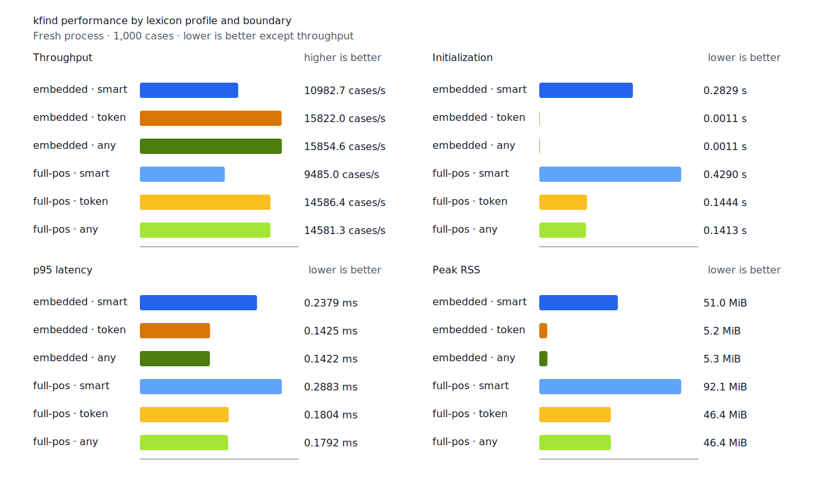
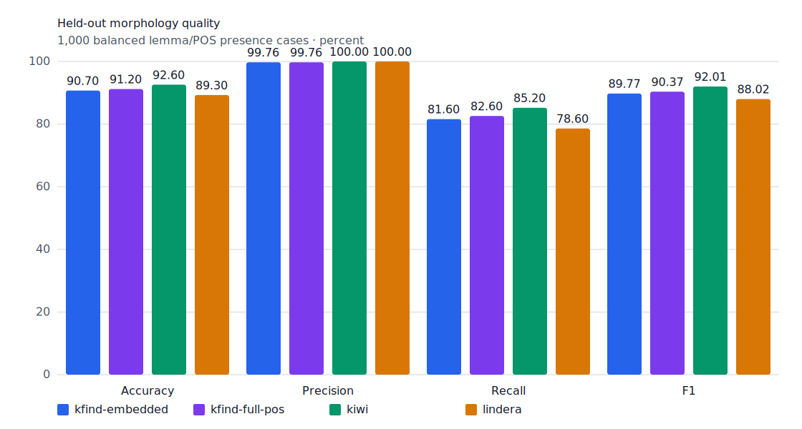
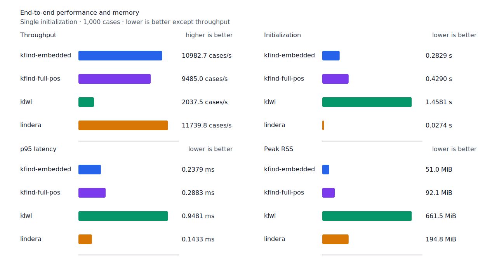

# smart component 검색 근거

측정일: 2026-07-13

기준 보고서: `target/morph-benchmark-component-projection-equivalence/report.json`,
`target/morph-benchmark-product/report.json`,
`target/morph-benchmark-optional-init/report.json`,
`target/morph-benchmark-boundary/report.json`

## 결정

`smart`는 query가 문자열 token의 바깥 경계에 있을 때뿐 아니라, 검증된 형태 분석의 완전한
component span과 일치할 때도 검색 결과로 인정한다. 이 증명은 query component의 왼쪽과
오른쪽 내부 경계를 모두 다룬다.

따라서 다음은 positive다.

- `중국요리`의 `요리`
- `문학작품`의 `문학`
- `사용자권한`과 `권한관리`의 `권한`

`대학교`의 `학교`처럼 source 분석의 component를 가로지르거나, `매일`의 `일`처럼 query
품사와 일치하는 component 근거가 없는 substring은 계속 거부한다. `산길을`의 `길`도
`산길+을` 경로 비용 1111이 `산+길+을` 경로 비용 2770보다 낮으므로 거부한다.

## dev evidence

현재 dev의 명사 FN 70개 중 64개가 `boundary-rejected`다. gold 어절 안 query 위치는 다음과
같다.

| 위치 | case |
| --- | ---: |
| gold 어절 prefix | 49 |
| gold 어절 내부 | 13 |
| gold 어절 suffix | 2 |
| 합계 | 64 |

prefix에는 `문학작품`, `고집스러운`, `환경보호`처럼 오른쪽 component 경계가 필요한 case가
포함된다. 내부에는 `기록도구의`, `요코씨는`, `금속활자는`처럼 양쪽 component 경계와 뒤의
조사까지 함께 검증해야 하는 case가 있다. suffix에는 `2014년`, `중국요리`가 있다.

같은 lemma/POS와 gold span 기준으로 외부 분석기 결과를 교차 확인했다.

| Kiwi | Lindera | case |
| --- | --- | ---: |
| match | match | 57 |
| match | no-match | 4 |
| no-match | match | 3 |
| no-match | no-match | 0 |

64개 모두 적어도 한 분석기가 찾았고 57개는 두 분석기가 함께 찾았다. 이는 단순 표제어
추가보다 corpus-side component 분석이 recall 상한을 높일 가능성이 크다는 근거다. 제품
판정은 외부 분석기 출력이 아니라 고정 morphology resource의 source 분석으로 다시 측정한다.

## fixture 변경 방향

현재 `사용자권한 → 권한`을 no-match로 둔 fixture와 hard-negative는 승인된 계약과 충돌한다.
제품 결과를 바꾸는 구현 단위에서 positive로 전환한다. `대학교 → 학교`는 source component
근거가 없을 때 거부하는 경계-crossing negative로 유지하고, `역사과목 → 사과` 같은
component 경계 교차 case를 추가한다.

## shadow 결과

기존 `smart` 경계에서 거부된 명사 branch만 평가했다. component exact node 포함·제외 완전
경로의 최저 비용을 비교한 결과는 다음과 같다.

| profile | candidate case | accept evidence | reject evidence | 고유 accept case |
| --- | ---: | ---: | ---: | ---: |
| embedded | 75 | 70 | 17 | 61 |
| full-POS | 75 | 74 | 41 | 65 |

full-POS는 같은 candidate에서 복수 분석을 보존하므로 evidence 합계가 더 크다. revised
hard-negative의 component candidate 5개는 두 profile에서 모두 reject했다. 기본 test·dev
검색 결과는 변하지 않았다.

## 제품 전환 결과

embedded accept 61개는 derivational continuation 23, nominal compound 22, particle
continuation 8, copular continuation 7, mixed 1이다. P1 일반 규칙 후보는 derivational 23개이고
numeric unit 후보는 없다. reject evidence 16개는 positive 14개 case에 걸쳐 nominal 경쟁 9,
unknown 3, predicate 경쟁 2개 case로 분류됐다.

고정 source에서 compact lattice projection은 full artifact의 66.32%인 47,859,711 bytes다.
mmap peak RSS는 49.47 MiB, 초기화는 138.60~139.14 ms이며 exact/common-prefix analysis hit와
scoring checksum은 full resource와 동일하다. compact projection을 다음 shadow 판정 동등성
검증 대상으로 선택한다. CLI·API·출력과 resource 실패 정책을 확정한 뒤에만 기본 `smart`
변경을 검토한다.

shadow 비교는 동일 candidate의 decision, 비용, node 수와 N-best path provenance 전체를
대조한다. compact artifact 오류나 불일치는 benchmark를 실패시킨다. 제품은 검증된 compact
artifact만 사용하며 초기화 오류를 기존 경계 판정으로 fallback하지 않는다.

report schema 8 실행에서 embedded test/dev/hard-negative 84/87/5건과 full-POS
123/115/8건의 비교가 모두 일치했다. compact artifact SHA-256은
`5fc46a151e41485dc4b4a3a931135c0f490913f2c2c908b9d87adb87a7c14efd`다. 제품은 component
branch가 있는 `smart` 계획에서 이 resource를 필수로 검증하고 오류를 초기화 실패로 처리한다.
WASM은 bytes를 포함하지 않고 외부 호스팅 또는 별도 정적 asset에서 전달받는다.

제품 matcher를 적용한 1,000-case test와 dev 결과는 다음과 같다.

| split/profile | TP | FP | FN | recall |
| --- | ---: | ---: | ---: | ---: |
| test embedded | 408 | 1 | 92 | 81.6% |
| test full-POS | 413 | 1 | 87 | 82.6% |
| dev embedded | 432 | 2 | 68 | 86.4% |
| dev full-POS | 436 | 2 | 64 | 87.2% |

shadow 기준과 비교하면 test TP는 embedded 53건, full-POS 58건 증가했고 FP는 변하지 않았다.
dev TP는 각각 56건, 60건 증가했고 FP는 변하지 않았다. test의 compact/full projection 비교는
embedded 84건과 full-POS 123건 모두 일치했다. revised hard-negative의 component candidate
5건은 두 profile에서 모두 거부됐다.

component resource는 engine 생성이나 첫 smart compile에서 자동으로 읽지 않는다. resource 없는
engine도 literal과 component branch가 없는 smart query를 compile할 수 있다. component branch가
필요한 query는 명시적 load 전까지 오류를 반환하며 기존 경계 판정으로 fallback하지 않는다.
생성자 선로딩과 생성 후 수동 load를 모두 지원하고, 수동 교체 검증이 실패하면 기존 resource를
유지한다.

Linux/aarch64 native 공개 API를 새 process에서 1회 warm-up 뒤 5회 측정한 결과는 다음과 같다.
component profile은 resource 없는 engine을 먼저 만든 뒤 47,859,711-byte artifact를 파일에서
읽어 `load_component_resource`로 초기화한다.

| profile | base init 중앙값 | component load 중앙값 | 최종 peak RSS |
| --- | ---: | ---: | ---: |
| embedded | 1.09 ms | 미로드 | 3.4 MiB |
| embedded + component | 1.15 ms | 149.82 ms | 49.1 MiB |
| full-POS | 127.47 ms | 미로드 | 46.0 MiB |
| full-POS + component | 127.66 ms | 150.00 ms | 87.6 MiB |

같은 artifact를 macOS arm64의 Node 24/WASM에서 1회 warm-up 뒤 3회 측정했다. WASM module load는
공통 선행 비용으로 제외하고 engine 초기화와 process RSS를 기록했다.

| profile | base init 중앙값 | component load 중앙값 | base / 최종 RSS |
| --- | ---: | ---: | ---: |
| embedded | 11.20 ms | 미로드 | 68.8 / 68.9 MiB |
| embedded + component | 11.13 ms | 913.47 ms | 69.1 / 186.1 MiB |
| full-POS | 101.48 ms | 미로드 | 123.1 / 123.1 MiB |
| full-POS + component | 101.67 ms | 908.00 ms | 123.1 / 214.6 MiB |

제품 smart 경로가 component를 사용하는 기존 end-to-end 5회 중앙값은 embedded
0.2829초·51.0 MiB, full-POS 0.4290초·92.1 MiB다. Homebrew는 별도 formula resource로
설치하고 npm은 1,134,114-byte WASM과 분리된 정적 asset으로 게시한다.

## embedded/full-POS와 경계 정책 비교

embedded는 불규칙 활용, 품사 중의성, 기능어와 표면형 override를 담는 core 예외 계층이다.
full-POS는 이 계층에 MeCab 기반 632,667개 품사 entry와 614,794개 표제어의 지연 lookup index를
추가한다. 두 profile은 같은 query compiler와 matcher를 사용하며, 차이는 query 표제어의 분석
후보 coverage다.

동일한 1,000-case test를 Linux/aarch64의 fresh process에서 1회 warm-up 뒤 5회 측정했다.
`smart`만 component resource를 읽고, `token`과 `any`는 읽지 않는다. 시간은 query compile과
match를 포함한다.

| lexicon | boundary | TP / FP / FN | precision | recall | F1 | init | cases/s | p95 | RSS |
| --- | --- | ---: | ---: | ---: | ---: | ---: | ---: | ---: | ---: |
| embedded | smart | 408 / 1 / 92 | 99.76% | 81.6% | 89.77% | 282.94 ms | 10,982.7 | 0.2379 ms | 51.0 MiB |
| embedded | token | 354 / 0 / 146 | 100.00% | 70.8% | 82.90% | 1.13 ms | 15,822.0 | 0.1425 ms | 5.2 MiB |
| embedded | any | 479 / 11 / 21 | 97.76% | 95.8% | 96.77% | 1.11 ms | 15,854.6 | 0.1422 ms | 5.3 MiB |
| full-POS | smart | 413 / 1 / 87 | 99.76% | 82.6% | 90.37% | 428.96 ms | 9,485.0 | 0.2883 ms | 92.1 MiB |
| full-POS | token | 354 / 0 / 146 | 100.00% | 70.8% | 82.90% | 144.39 ms | 14,586.4 | 0.1804 ms | 46.4 MiB |
| full-POS | any | 479 / 11 / 21 | 97.76% | 95.8% | 96.77% | 141.27 ms | 14,581.3 | 0.1792 ms | 46.4 MiB |

full-POS `smart`는 embedded `smart`보다 recall 1.0%p, F1 0.60%p 높다. 추가로 찾은 5건은
`기지`, `것`, `옥스브리지`, `삼성`, `한국`이며 모두 명사다. 그 대가로 초기화는 146.02 ms,
peak RSS는 41.11 MiB 늘고 처리량은 13.64% 낮으며 p95는 21.19% 높다. `token`은 추가 분석을
경계에서 거부하고 `any`는 분석 없이 이미 span을 허용하므로 이 fixture에서 full-POS의 품질
이점이 없다.

embedded `smart`는 `token`보다 recall 10.8%p와 F1 6.87%p를 얻는 대신 처리량이 30.59%
낮고 p95가 66.95% 높다. `any`는 recall과 F1이 가장 높지만 FP가 11건으로 `smart`의 1건보다
10건 많다. 따라서 `any`의 balanced fixture F1은 형태·경계 검증을 생략한 부분 문자열 검색의
정확성을 뜻하지 않는다.

## 외부 분석기 비교

Linux/aarch64에서 동일한 1,000-case test fixture를 1회 warm-up 뒤 5회 측정했다. kfind 두
profile은 component resource를 사용하는 제품 `smart` 경로다.

full-POS의 F1은 90.37%로 Kiwi 92.01%보다 1.64%p 낮고 Lindera 88.02%보다 2.35%p 높다.
embedded 처리량은 Kiwi의 5.39배이고 peak RSS는 51.0 MiB로 Kiwi 661.5 MiB의 7.7%다.

재현 명령은 `scripts/benchmark-morphology.sh`와
`pnpm --dir packages/kfind run benchmark:startup`이다.

## 다음 단계

정상 지정사 gold reject 13개는 별도 P3 범위에서 dev 원인을 분류한다. 이후 제품 판정은 결과를
보기 전에 고정한 unseen source로 검증하며 Korean-GSD 결과에 맞춰 비용이나 threshold를 바꾸지 않는다.
