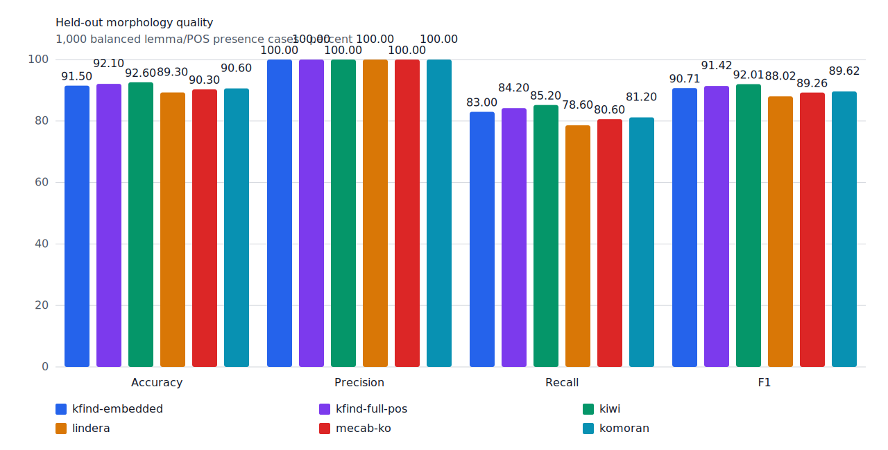
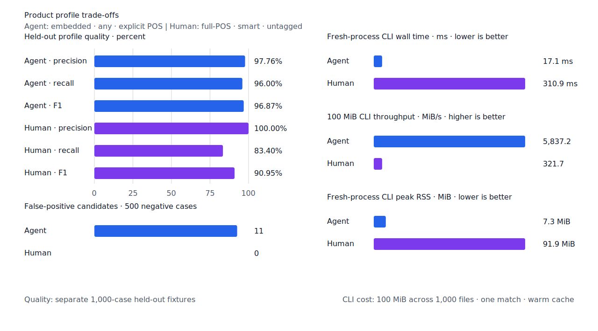
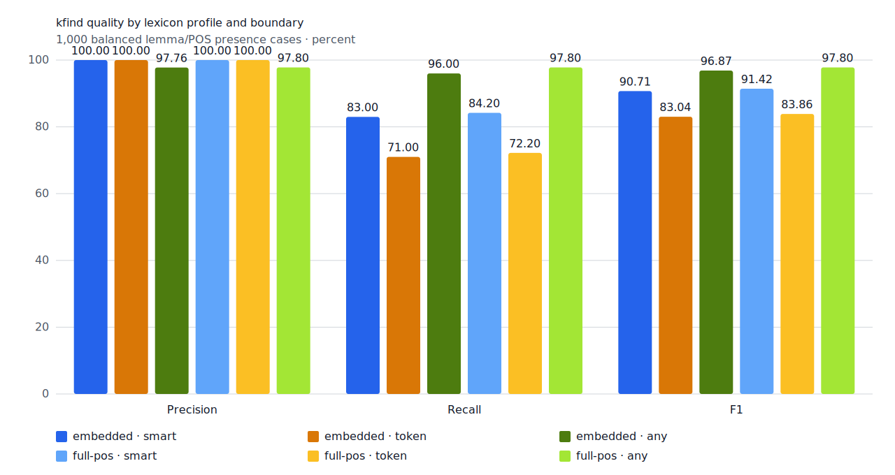
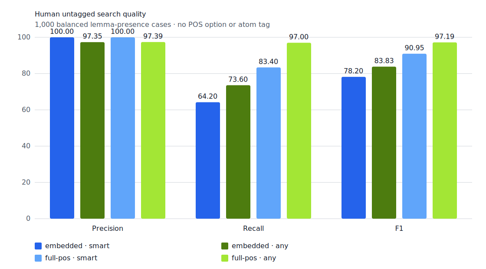
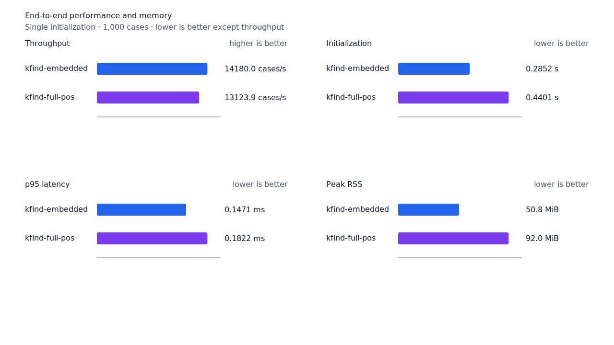
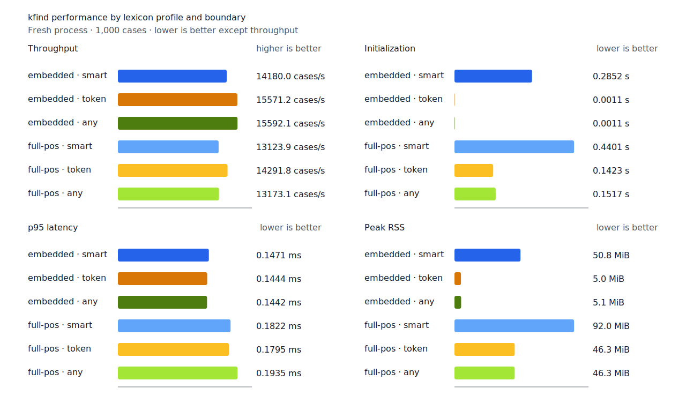
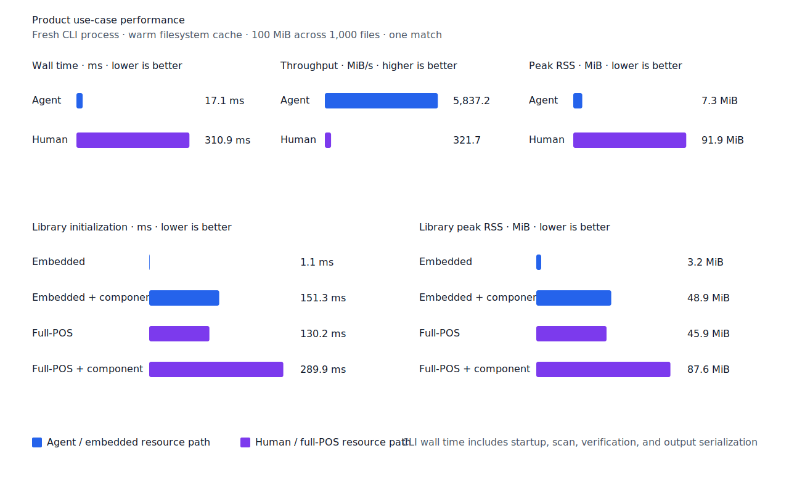
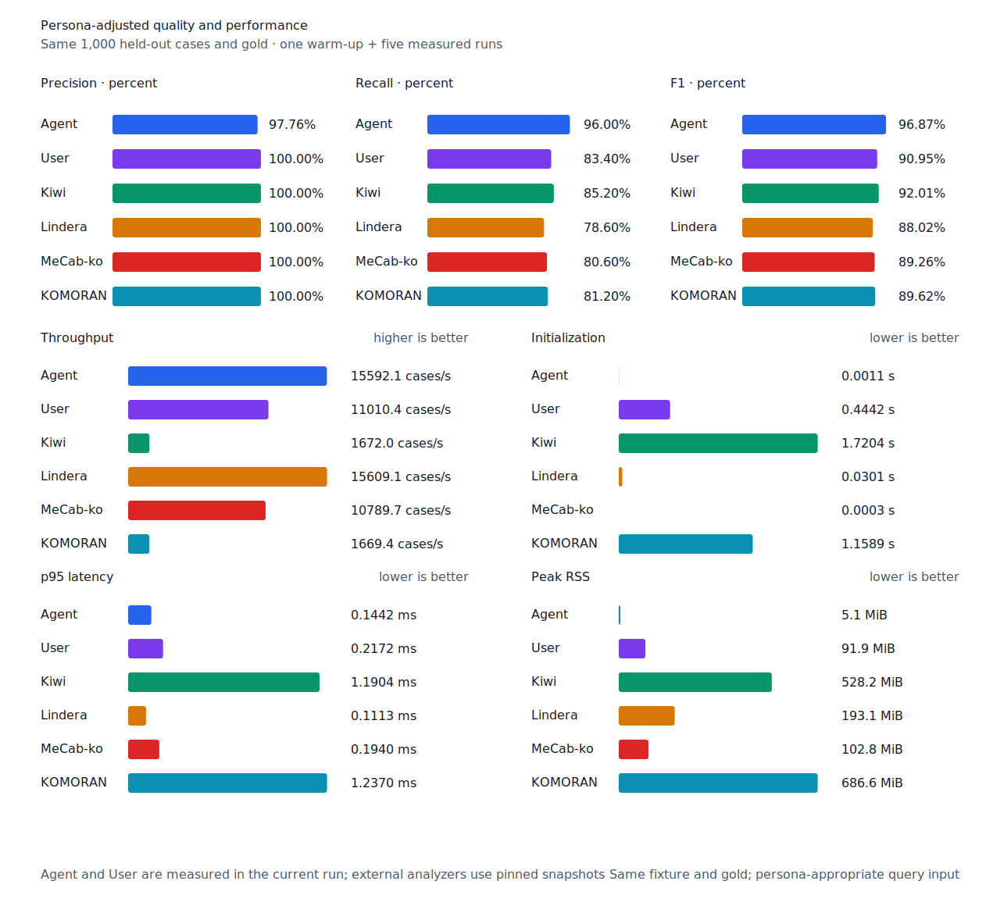

# ㄷ·ㅅ·ㅂ·ㅎ 불규칙 enriched 용언 lexicon

- 측정일: 2026-07-14
- 기준 revision: `e8f99c2e75662eda4e437f76c364b0f4593a9ac7`
- 후보 revision: `b6cd0a9e8debb6e81d2325e533625755c73ec575`
- 환경: Linux/aarch64, 10 logical CPUs, 7.7 GiB memory, Python 3.12.13, Docker 29.6.1
- Rust: 1.97.0
- 반복: fresh process 1회 warm-up 뒤 5회 측정의 중앙값
- test fixture: `933bc12197da866d2363d7df9107d4d9be89a65ddaafd73968ad5384832b21ff`
- development fixture: `604c3a139854fcf59570392f48ab85028785f4a3561ea3c5e702f88b841f907c`
- hard-negative fixture: `068f0ea1f9083dfcbdcbae9aae1d265c4c978e34c0d991b0578f64ed859c6546`
- 무품사 fixture: `94ccd70a093ee7af8435371b2ffdb81534ec97e29ada705ea72c940938d0c592`
- 100 MiB corpus: `7692072cb7bff9261c1fa5933bde41b27e558170818eeac6d07cabdd673815ff`
- enriched artifact: `53b11a74537ca7478efd93a855432a9863bc0af935c8fed5e288d9506b670392`
- 기준 report SHA-256: `ad13fe2de781431e5df92e80d0a7be9b6cd187fedb2744be541bc615cc0c2ce7`
- 후보 report SHA-256: `99d5fbf471bebc8b8067b94b1ed592d2c3e0f4a54186fe6e4d726a0952a0c96c`

## 결론

같은 종성에서 규칙형과 불규칙형이 갈리는 ㄷ·ㅅ·ㅂ·ㅎ 활용은 표제어별 사전 판별이 필요하다.
고정한 국립국어원 snapshot의 활용형을 kfind generator의 진단형과 대조해 신규 불규칙 분석
176개를 full-POS 제품 경로에 추가했다. 기존 르·러 분석 102개도 같은 파이프라인으로 유지한다.
`푸다 → 퍼`는 `UToEo`로 재확인됐지만 core 중복이라 새 행을 만들지 않았다.

한국어기초사전과 표준국어대사전의 서로 다른 source record가 같은 분석을 지지할 때만 승격한다.
우리말샘은 audit 근거로 보존한다. core 중복과 `-스럽다`, `-답다`, `-롭다` 생산 접미 분석은
artifact에서 제외한다. `곱다/VA`, `굽다/VV`처럼 규칙형과 불규칙형 동형어가 독립적으로
확인되면 두 분석을 함께 배포한다.

고정 test에서 full-POS `smart`는 FP 증가 없이 FN 6건을 줄였다. 사람용 무품사 full-POS
`smart`도 같은 6건을 복구했다. development와 hard-negative는 변하지 않았다. 제품 CLI의
측정 범위는 겹쳤다. full-POS `smart`와 isolated full-POS 초기화 차이도 측정 범위
안이었다. peak RSS 중앙값은 각각 64 KiB와 132 KiB 늘었다.

## 데이터

220,738개 정규화 source record에서 2,069개 진단 후보를 판정했다. artifact는 불규칙 분석
278개와 혼합 동형어의 규칙형 companion 2개로 구성된다.

| 분류 | promoted | core 중복 | 비고 |
| --- | ---: | ---: | --- |
| `DToL` | 17 | 4 | `깨닫다 → 깨달아` 포함 |
| `DropS` | 26 | 3 | `결정짓다 → 결정지어` 포함 |
| `BToWa` | 4 | 1 | `곱다 → 고와` 포함 |
| `BToWo` | 86 | 8 | 생산 접미 중복 932개 제외 |
| `DropH` | 43 | 5 | `노랗다 → 노래` 포함 |
| `ReuDoubleL` | 99 | 10 | 기존 승격 범위 유지 |
| `Reo` | 3 | 3 | 기존 승격 범위 유지 |
| `UToEo` | 0 | 1 | `푸다` core 유지 |

전체 상태는 promoted 278, mixed regular 2, core 중복 40, 생산 접미 중복 932, 규칙형 대조군
399, review 418이다. 같은 source record가 둘 이상의 진단형을 포함하면 자동 집계하지 않는다.

## 품질

| fixture/profile | 기준 TP / FP / FN | 후보 TP / FP / FN | 기준 recall | 후보 recall |
| --- | ---: | ---: | ---: | ---: |
| development embedded/full-POS `smart` | 442 / 2 / 58 | 442 / 2 / 58 | 88.4% | 88.4% |
| test embedded `smart` | 415 / 0 / 85 | 415 / 0 / 85 | 83.0% | 83.0% |
| test full-POS `smart` | 415 / 0 / 85 | 421 / 0 / 79 | 83.0% | 84.2% |
| test full-POS `token` | 355 / 0 / 145 | 361 / 0 / 139 | 71.0% | 72.2% |
| test full-POS `any` | 480 / 11 / 20 | 489 / 11 / 11 | 96.0% | 97.8% |
| hard-negative full-POS | 0 / 4 / 0 | 0 / 4 / 0 | - | - |
| 무품사 full-POS `smart` | 411 / 0 / 89 | 417 / 0 / 83 | 82.2% | 83.4% |
| 무품사 full-POS `any` | 476 / 13 / 24 | 485 / 13 / 15 | 95.2% | 97.0% |

`smart`가 복구한 test 항목은 `부끄럽다`, `우습다`, `어렵다`, `즐겁다`, `힘겹다`,
`가깝다`다. enriched를 읽지 않는 embedded 결과는 품질 대조군으로 유지됐다.









## 성능

global benchmark lock 아래에서 후보-기준 순서로 연속 측정했다. lock 대기 시간은 workload
측정에 포함하지 않았다.

| profile | 지표 | 기준 median [min, max] | 후보 median [min, max] | 증감 |
| --- | --- | ---: | ---: | ---: |
| full-POS `smart` | initialization | 0.431514 s [0.431172, 0.433172] | 0.440128 s [0.431485, 0.450088] | +2.00% |
| full-POS `smart` | cases/s | 13,255.5 [12,167.8, 13,302.6] | 13,123.9 [12,375.1, 13,223.9] | -0.99% |
| full-POS `smart` | p95 | 0.1826 ms [0.1791, 0.2038] | 0.1822 ms [0.1787, 0.1967] | -0.22% |
| full-POS `smart` | peak RSS | 94,124 KiB [94,044, 94,128] | 94,188 KiB [94,124, 94,192] | +0.07% |
| isolated full-POS | initialization | 0.129920 s [0.129324, 0.135101] | 0.130188 s [0.130162, 0.132646] | +0.21% |
| isolated full-POS | peak RSS | 46,856 KiB [46,844, 46,856] | 46,988 KiB [46,976, 46,988] | +0.28% |
| 100 MiB Human CLI | wall | 0.313002 s [0.309601, 0.320632] | 0.310877 s [0.307396, 0.312708] | -0.68% |
| 100 MiB Human CLI | throughput | 319.487 MiB/s [311.884, 322.996] | 321.671 MiB/s [319.787, 325.313] | +0.68% |

제품 `smart`, CLI와 isolated 초기화 범위는 겹친다. 처리량과 latency도 기준·후보 범위가
겹쳐 성능 회귀 근거는 없다. full-POS `smart` RSS 범위는 일부 겹쳤고 isolated full-POS RSS는
132 KiB 증가했다. 확대된 artifact의 관측 비용으로 남긴다.









## 재현

```console
git worktree add --detach /tmp/kfind-baseline-e8f99c2 \
  e8f99c2e75662eda4e437f76c364b0f4593a9ac7
git worktree add --detach /tmp/kfind-candidate-b6cd0a9 \
  b6cd0a9e8debb6e81d2325e533625755c73ec575

cd /tmp/kfind-candidate-b6cd0a9
KFIND_MORPH_RUNS=5 \
  scripts/benchmark-morphology.sh \
  <candidate-worktree>/target/morph-dsbh-candidate-b6cd0a9

cd /tmp/kfind-baseline-e8f99c2
KFIND_MORPH_RUNS=5 \
  scripts/benchmark-morphology.sh \
  <candidate-worktree>/target/morph-dsbh-baseline-e8f99c2

python3 tools/morph-compare/render_charts.py \
  target/morph-dsbh-candidate-b6cd0a9/report.json \
  docs/benchmarks/assets \
  --prefix 2026-07-14-consonant-irregular-enriched-
```

외부 분석기 snapshot은 fixture, adapter schema와 고정 버전·설정이 바뀌지 않아 갱신하지 않았다.
