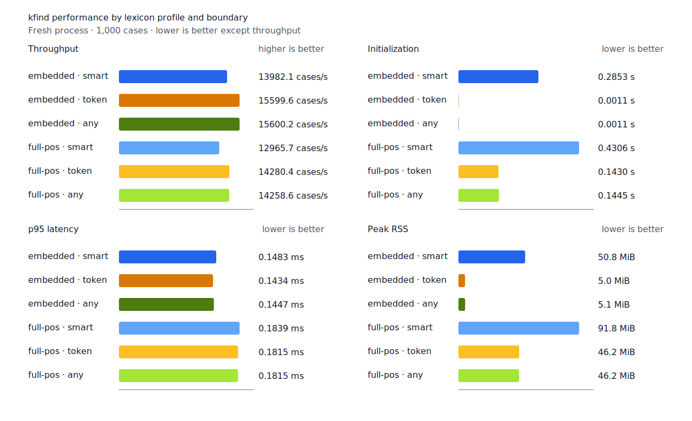
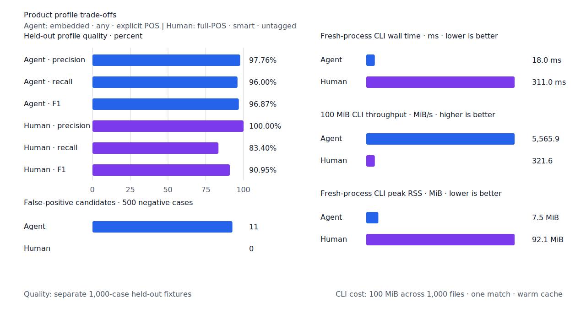

# `매일` 인접 문맥 판별 품질·성능

- 측정일: 2026-07-14
- 기준 revision: `df84a1a`
- 후보 revision: `488cd3f`
- morphology 환경: Linux/aarch64, 10 logical CPUs, Python 3.12.13, Docker 29.6.1
- Criterion 환경: macOS 26.4.1, Apple M1 Max, Rust 1.97.0
- explicit-POS fixture: `933bc12197da866d2363d7df9107d4d9be89a65ddaafd73968ad5384832b21ff`
- untagged fixture: `94ccd70a093ee7af8435371b2ffdb81534ec97e29ada705ea72c940938d0c592`
- hard-negative fixture: `cb8634491cba65916c9af510c50f909eaddfd9bb89935598875e134a01cbce99`
- 기준 report SHA-256: `6ad2a3476afc8612e4110d153e35678f36e1a8ffa6d630440328d736bf3a20c8`
- 후보 report SHA-256: `f74b218091725a3f1d4bcda3da2c4963d6ba39357c86dad16d517a3521a7dd24`

## 결론

`smart`는 같은 줄의 제한된 인접 token 구조로 `매일`의 세 용법을 구분한다. 지정사 관형형
문맥에서는 `매/NNG + 이/VCP + ㄹ/ETM`을 선택하고, 같은 표면형이 연속하면 `매일/MAG`를
선택한다. 목적격 조사 문맥의 `매일/NNG + 을/JKO`은 명사로 유지한다. 판정할 수 없거나 문맥
한도를 넘으면 기존 `smart` 결과를 유지한다.

고정 test, development와 사람용 무품사 품질은 기준선과 같았다. 추가한 동형이의어
hard-negative 7건의 FP는 4건에서 1건으로 줄었다. full-POS 사람용 `smart` 처리량은 1.87%
낮고 p95는 0.57% 높았다. 문맥을 사용하지 않는 Agent `any` 처리량은 0.02% 높고 p95는
1.19% 높았으며, 별도 User persona 처리량은 1.73%, 실제 Human CLI 처리량은 0.51%
낮았다. 국소 lattice와 실제 CLI 결과를 함께 보면 일관된 제품 성능 회귀는 아니다.

## 제품 동작

| 문장 | query | 결과 |
| --- | --- | --- |
| `독수리가 아니라 매일 것 같아` | `n:매` | `매` 일치 |
| `독수리가 아니라 매일 것 같아` | `이다` | `일` 일치 |
| `독수리가 아니라 매일 것 같아` | `매일`, `n:매일`, `adv:매일` | 불일치 |
| `매일 매일 보고 싶어` | `매일`, `adv:매일` | 두 token 일치 |
| `매일 매일 보고 싶어` | `n:매`, `n:매일` | 불일치 |
| `그는 집념으로 매일을 보내고 있었다.` | `매일`, `n:매일` | `매일을` 일치 |
| `그는 집념으로 매일을 보내고 있었다.` | `n:매`, `adv:매일` | 불일치 |

문맥 탐색은 같은 줄의 raw 256 bytes와 NFC scalar 64개 이내다. 문맥 판정은 query가 아니라
token 구조에서 한 번 결정하므로 같은 token에 대한 query 순서와 branch 구성에 의존하지 않는다.

## 품질

기준선에도 후보의 hard-negative fixture를 복사해 두 revision이 같은 22건을 평가했다. 공개
fixture와 gold는 변경하지 않았다.

| workload | 기준 TP / FP / FN | 후보 TP / FP / FN | 판정 |
| --- | ---: | ---: | --- |
| explicit-POS test, full-POS `smart` | 421 / 0 / 79 | 421 / 0 / 79 | 동일 |
| development, full-POS `smart` | 442 / 2 / 58 | 442 / 2 / 58 | 동일 |
| 사람용 무품사, full-POS `smart` | 417 / 0 / 83 | 417 / 0 / 83 | 동일 |
| 동형이의어 hard-negative 7건 | 0 / 4 / 0 | 0 / 1 / 0 | FP 3건 감소 |

후보에서 남은 동형이의어 FP는 기존 `새/NNG -> 새/MM` 1건이다. 기존
`same-surface-different-lemma` 3건을 포함한 전체 hard-negative FP는 4건이다.


## 형태소 성능

Docker에서 사전과 resource를 같은 source로 다시 생성했다. 각 행은 fresh process로 1회
warm-up 뒤 5회를 측정한 중앙값이며 대괄호는 min, max다.

| workload | 기준 cases/s | 후보 cases/s | 증감 | 기준 p95 | 후보 p95 | 증감 | 후보 RSS |
| --- | ---: | ---: | ---: | ---: | ---: | ---: | ---: |
| explicit-POS embedded `smart` | 14,209.4 [13,160.6, 14,248.9] | 13,982.1 [13,948.8, 14,022.1] | -1.60% | 0.1475 ms [0.1465, 0.1607] | 0.1483 ms [0.1470, 0.1485] | +0.54% | 50.8 MiB |
| explicit-POS full-POS `smart` | 13,022.1 [12,693.0, 13,203.5] | 12,965.7 [12,433.9, 12,997.8] | -0.43% | 0.1812 ms [0.1791, 0.1910] | 0.1839 ms [0.1812, 0.1903] | +1.49% | 91.8 MiB |
| 사람용 full-POS `smart` | 11,440.7 [10,971.5, 11,478.0] | 11,227.0 [10,336.2, 11,291.0] | -1.87% | 0.2090 ms [0.2080, 0.2193] | 0.2102 ms [0.2073, 0.2271] | +0.57% | 91.9 MiB |
| Agent embedded `any` | 15,597.7 [15,529.7, 15,624.4] | 15,600.2 [15,457.8, 15,620.6] | +0.02% | 0.1430 ms [0.1424, 0.1449] | 0.1447 ms [0.1430, 0.1468] | +1.19% | 5.1 MiB |

full-POS + component 초기화 중앙값은 0.2821초에서 0.2828초로 0.25% 늘었고 peak RSS는
87.6 MiB에서 87.5 MiB가 됐다. 문맥을 사용하지 않는 Agent `any`는 대조 workload다.



## 국소 lattice 성능

고정 compact component fixture와 기본 Criterion 100개 sample을 사용했다. 각 sample의
`times[i] / iters[i]`를 정렬한 nearest-rank p95다. 새 문맥 판별은 이 evaluator 위에서
동작하지만 기존 제품 판정과 진단 경로를 바꾸지 않는다.

| workload | 기준 p95 | 후보 p95 | 증감 |
| --- | ---: | ---: | ---: |
| `local_lattice/component_decision` | 4.412 µs | 4.614 µs | +4.58% |
| `local_lattice/component_report` | 10.331 µs | 10.358 µs | +0.26% |

제품 판정 p95 악화 10% 이상이라는 회귀 기준을 통과했다.

## 실제 CLI 사용 케이스

고정 100 MiB·1,000파일 corpus의 SHA-256은
`7692072cb7bff9261c1fa5933bde41b27e558170818eeac6d07cabdd673815ff`다.

| workflow | 기준 wall [min, max] | 후보 wall [min, max] | 기준 처리량 | 후보 처리량 | 후보 RSS |
| --- | ---: | ---: | ---: | ---: | ---: |
| Agent: embedded + `any` + explicit POS | 16.8 ms [16.2, 19.0] | 18.0 ms [16.9, 19.5] | 5,942.9 MiB/s | 5,565.9 MiB/s | 7.5 MiB |
| Human: full-POS + `smart` + untagged | 309.4 ms [308.0, 313.1] | 311.0 ms [306.1, 321.4] | 323.2 MiB/s | 321.6 MiB/s | 92.1 MiB |

Agent CLI 변화는 문맥 판별 효과로 해석하지 않는다. Human CLI 처리량은 0.51% 낮았고 wall
측정 범위는 겹쳤다.



## 재현

두 morphology image를 준비한 뒤 기준선과 후보를 global benchmark lock으로 직렬화했다.
최종 pair는 모두 대기 없이 lock을 획득했고 image build cache를 사용했다. Criterion 기준선과
후보도 같은 lock으로 직렬화했다.

```console
KFIND_MORPH_IMAGE=kfind-morph-context-baseline:df84a1a \
  scripts/benchmark-morphology.sh target/morph-context-baseline-df84a1a-repeat
KFIND_MORPH_IMAGE=kfind-morph-context-candidate:488cd3f \
  scripts/benchmark-morphology.sh target/morph-context-candidate-488cd3f-repeat
scripts/benchmark-criterion.sh local_lattice
```

외부 분석기 snapshot은 fixture, schema와 고정 버전·설정이 바뀌지 않아 갱신하지 않았다.
