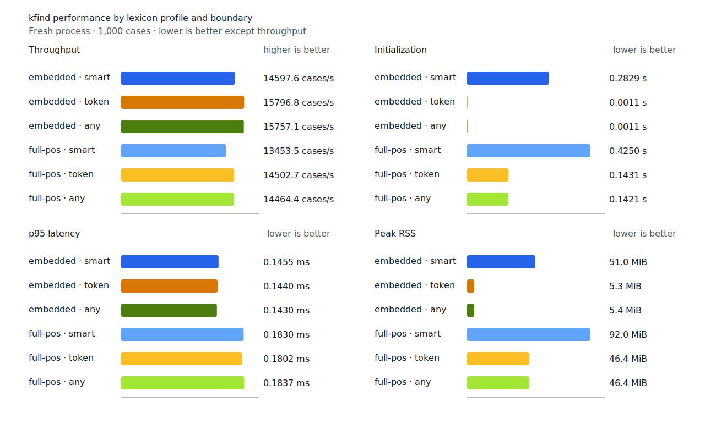
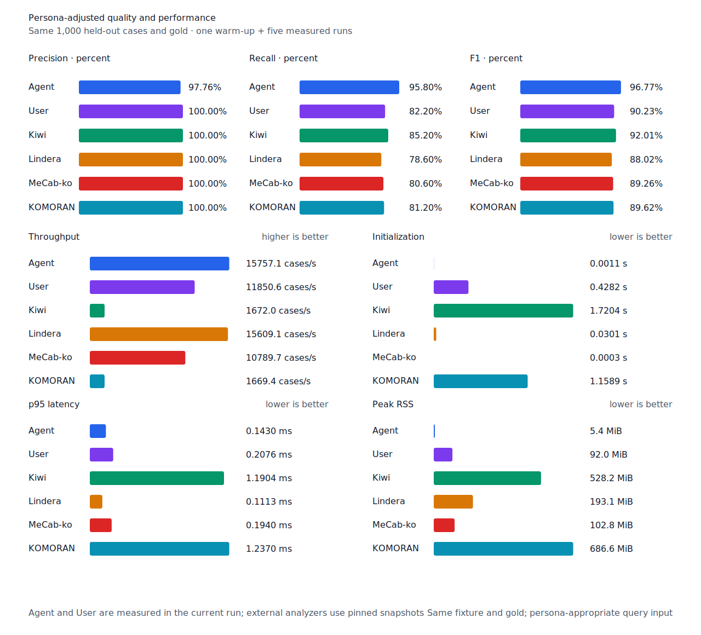
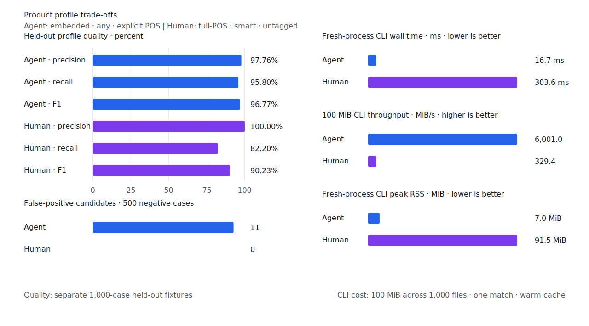

# 국소 lattice 제품 경로 최적화

- 측정일: 2026-07-14
- Criterion 기준 revision: `f8798d1`
- morphology 기준 revision: `7ee8bf4`
- 후보 revision: `60eff37`
- Criterion 환경: macOS 26.4, Apple M1 Max, Rust 1.97.0
- morphology 환경: Linux/aarch64, 10 logical CPUs, Python 3.12.13, Docker 29.6.1
- explicit-POS fixture: `933bc12197da866d2363d7df9107d4d9be89a65ddaafd73968ad5384832b21ff`
- untagged fixture: `94ccd70a093ee7af8435371b2ffdb81534ec97e29ada705ea72c940938d0c592`
- hard-negative fixture: `a08964bec7a7d421d12cc76e94387b206c98167538e8986d52fe3def303e9b3b`
- 기준 report SHA-256: `04ec85f019f9c5647e631b23963166ae73e929b8abbea6c8d656524a097de9ec`
- 후보 report SHA-256: `dd550d77336e67f1f6a269b8961b7f53349609aa6a788e2d9cc8005411a17571`

## 결론

제품 matcher는 local lattice의 N-best 경로를 만들지 않고 query 포함·제외별 최저 비용만
계산한다. compact component resource의 unknown model은 evaluator에서 한 번 파싱해 matcher
사이에 공유한다. 진단 보고서는 기존 N-best 경로와 비용 provenance를 유지한다.

세 입력을 묶은 제품 판정 Criterion p95는 10.413 µs에서 4.634 µs로 55.50% 줄었다. 진단
보고서 p95도 11.250 µs에서 10.509 µs로 6.58% 줄었다.

`-기` 조사 continuation이 포함된 최신 main을 기준으로 1,000-case morphology와 14개
hard-negative 품질은 모든 profile에서 같았다. full-POS `smart` 처리량은 9,388.0에서
13,453.5 cases/s로 43.31% 늘었고 p95는 0.2849 ms에서 0.1830 ms로 35.77% 줄었다.
component 판정과 진단 projection 207건의 불일치는 0건이었다.

## 국소 판정 microbenchmark

고정 compact component fixture에서 accept, reject, ambiguous 입력을 순환한다. resource 생성은
측정 전에 끝내며 `component_decision`은 제품 판정, `component_report`는 N-best 진단 보고서를
측정한다. 기본 Criterion 설정의 100개 sample에서 `times[i] / iters[i]`를 구하고 nearest-rank
p95를 사용했다.

| workload | 기준 p95 | 후보 p95 | 증감 |
| --- | ---: | ---: | ---: |
| `local_lattice/component_decision` | 10.413 µs | 4.634 µs | -55.50% |
| `local_lattice/component_report` | 11.250 µs | 10.509 µs | -6.58% |

## 형태소 품질·성능

Docker에서 고정 사전과 resource를 다시 생성하고 각 profile을 fresh process로 1회 warm-up 뒤
5회 측정했다. 기준선과 후보 모두 같은 실행에서 사전과 resource를 다시 만들었다.

| workload | 기준 TP / FP / FN | 후보 TP / FP / FN | 기준 cases/s | 후보 cases/s | 기준 p95 | 후보 p95 | RSS |
| --- | ---: | ---: | ---: | ---: | ---: | ---: | ---: |
| explicit-POS, full-POS `smart` | 414 / 0 / 86 | 414 / 0 / 86 | 9,388.0 | 13,453.5 | 0.2849 ms | 0.1830 ms | 92.0 MiB |
| 사람용 무품사, full-POS `smart` | 411 / 0 / 89 | 411 / 0 / 89 | 7,953.4 | 11,874.8 | 0.3701 ms | 0.2077 ms | 92.0 MiB |
| User persona, full-POS `smart` | 411 / 0 / 89 | 411 / 0 / 89 | 7,821.1 | 11,850.6 | 0.3868 ms | 0.2076 ms | 92.0 MiB |

`any`는 component lattice를 실행하지 않는다. Agent의 처리량 변화는 이 최적화의 효과로
해석하지 않는다. hard-negative 결과와 dev의 TP/FP/FN도 기준선과 같았다.





## 실제 CLI 사용 케이스

고정 100 MiB·1,000파일 corpus의 SHA-256은
`7692072cb7bff9261c1fa5933bde41b27e558170818eeac6d07cabdd673815ff`다. 사람용 `학교`
query는 component 후보가 한 줄뿐이어서 국소 판정 microbenchmark보다 개선 폭이 작다.

| workflow | 기준 wall | 후보 wall | 기준 처리량 | 후보 처리량 | 후보 RSS |
| --- | ---: | ---: | ---: | ---: | ---: |
| Agent: embedded + `any` + explicit POS | 17.6 ms | 16.7 ms | 5,693.1 MiB/s | 6,001.0 MiB/s | 7.0 MiB |
| Human: full-POS + `smart` + untagged | 309.9 ms | 303.6 ms | 322.6 MiB/s | 329.4 MiB/s | 91.5 MiB |

Agent는 component를 사용하지 않는 대조 workload다. 두 CLI 행의 작은 차이는 전체 process와
filesystem 측정 변동을 포함한다.



## 재현

```console
cargo bench -p kfind-testkit --bench query_matcher -- local_lattice
KFIND_MORPH_IMAGE=kfind-morph-benchmark:local-lattice-main-7ee8bf4 \
  scripts/benchmark-morphology.sh target/morph-benchmark-main-7ee8bf4
KFIND_MORPH_IMAGE=kfind-morph-benchmark:local-lattice-candidate-60eff37 \
  scripts/benchmark-morphology.sh target/morph-benchmark-candidate-60eff37
python3 tools/morph-compare/render_charts.py \
  target/morph-benchmark-candidate-60eff37/report.json docs/benchmarks/assets \
  --prefix 2026-07-14-local-lattice-optimization-
```

Criterion 기준선은 `7ee8bf4` 제품 코드에 benchmark 측정 코드만 추가한 revision이다.
외부 분석기 snapshot은 fixture, schema와 고정 버전·설정이 바뀌지 않아 갱신하지 않았다.
