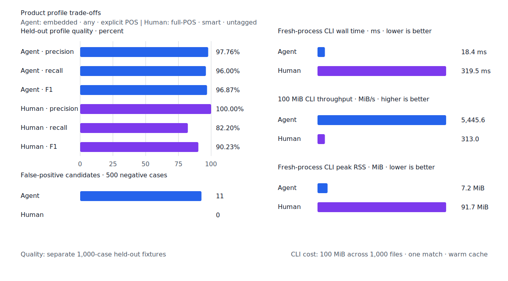
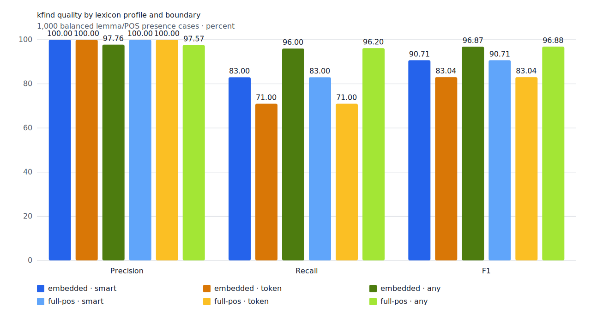
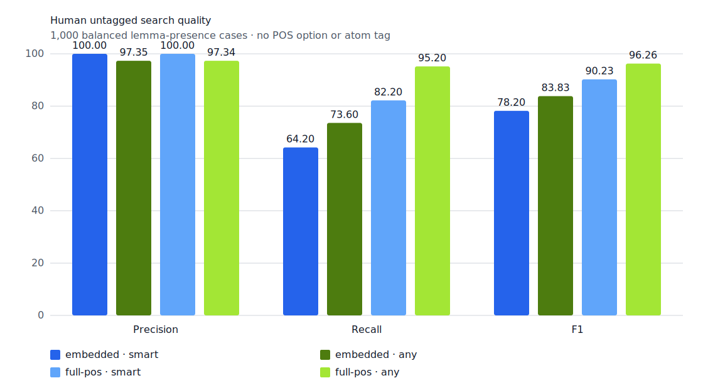
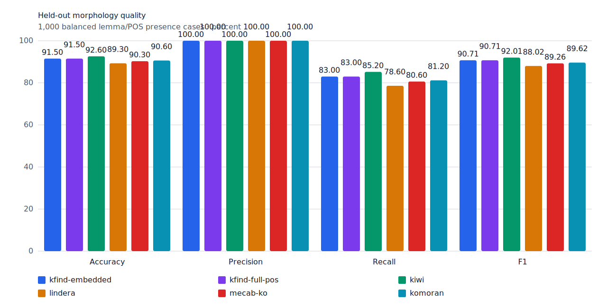
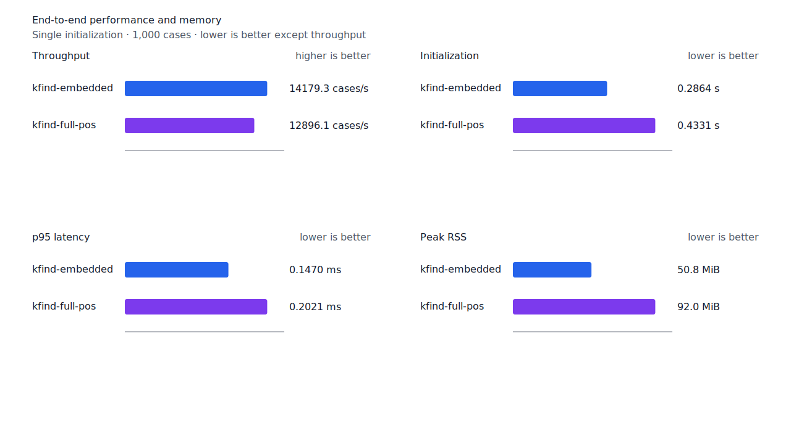
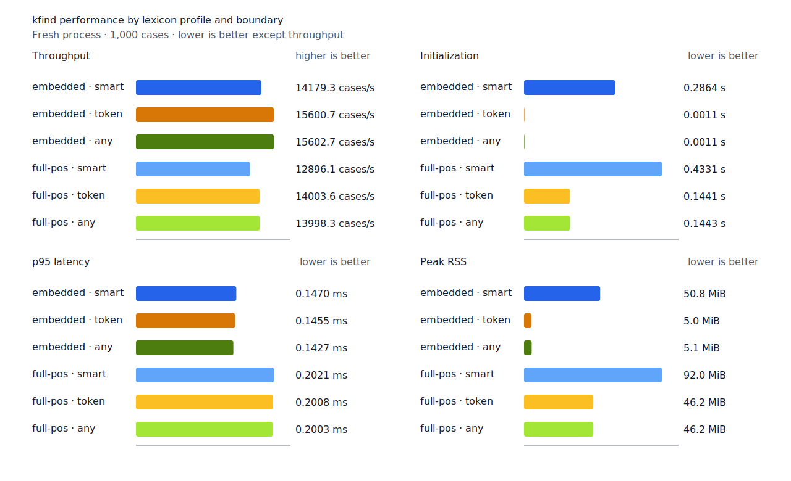
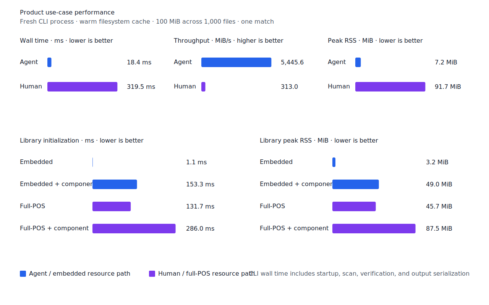
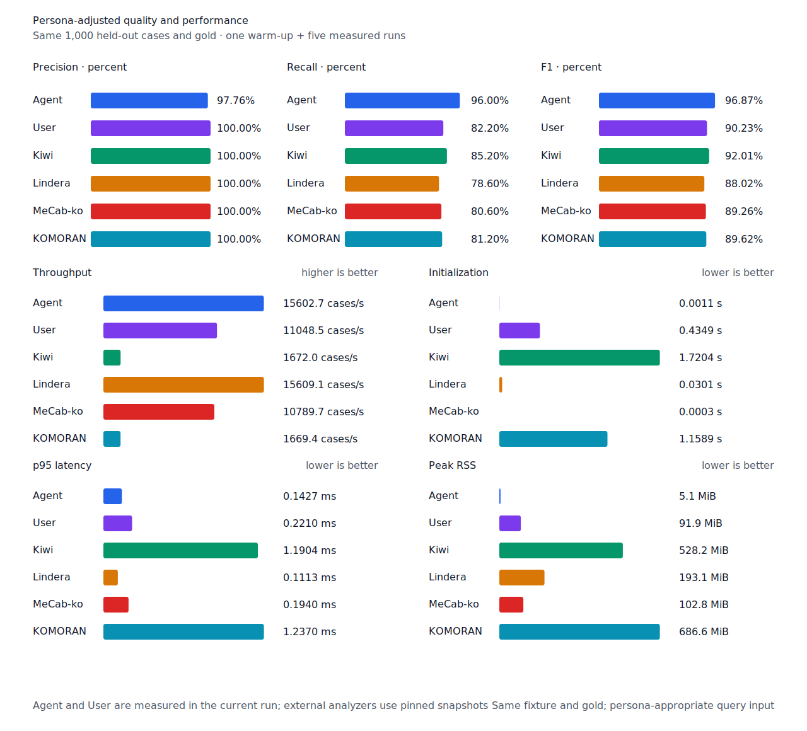

# 르·러 불규칙과 enriched 용언 lexicon

- 측정일: 2026-07-14
- 기준 revision: `9063d461cee391d4acfe90a3c2d05c9bfce9c850`
- 후보 revision: `96e04292aca4d49b1077eb37e38cf2b1929ccdb9`
- 환경: Linux/aarch64, 10 logical CPUs, 7.7 GiB memory, Python 3.12.13, Docker 29.6.1
- Rust: 1.97.0
- 반복: fresh process 1회 warm-up 뒤 5회 측정의 중앙값
- test fixture: `933bc12197da866d2363d7df9107d4d9be89a65ddaafd73968ad5384832b21ff`
- development fixture: `604c3a139854fcf59570392f48ab85028785f4a3561ea3c5e702f88b841f907c`
- hard-negative fixture: `068f0ea1f9083dfcbdcbae9aae1d265c4c978e34c0d991b0578f64ed859c6546`
- 무품사 fixture: `94ccd70a093ee7af8435371b2ffdb81534ec97e29ada705ea72c940938d0c592`
- 100 MiB corpus: `7692072cb7bff9261c1fa5933bde41b27e558170818eeac6d07cabdd673815ff`
- enriched artifact: `0d92f26a74e08502454d765c657dba66161b7fe7db3e4116aee7e4c66d45e860`
- 기준 report SHA-256: `329ce370456574d16f0ea645c86d3a7ab87c709d7ad27b3b5b43f28a50da6b76`
- 후보 report SHA-256: `c31e011d67baa9aebc68c1caacdd627ed1cffab13126ffbdcec7ccf6b85cb618`

## 결론

`다르다 → 달라`는 르 불규칙 활용이다. 어간 끝 `르`가 탈락하고 앞 음절에 `ㄹ`이 붙으며
`-아/-어`가 `-라/-러`로 실현된다. `푸르다 → 푸르러`와 도달 뜻의 `이르다 → 이르러`는
러 불규칙이고, 알리다 뜻의 `이르다 → 일러`는 르 불규칙이다. `들르다 → 들러`,
`치르다 → 치러`는 규칙적인 `ㅡ` 탈락 대조군으로 분리했다.

자주 쓰는 동형어와 기본 용언은 core lexicon에 두고, 국립국어원 한국어기초사전·표준국어대사전·
우리말샘의 고정 snapshot에서 근거가 교차 확인된 102개 분석을 enriched lexicon으로 배포한다.
동일 표제어·품사의 서로 다른 활용은 함께 보존한다. 220,738개 정규화 용언 record에서 312개
후보를 판정했으며 core 중복 13개와 규칙 활용 대조군 12개는 배포 행에서 제외했다. 검증된 ZIP은
SHA-256별 정적 cache에 한 번만 추출하고 다음 생성부터 재사용한다.

고정 test와 development의 `smart`, 사람용 full-POS 무품사 품질은 유지됐다. embedded 무품사
`smart`는 `다르다`, `이르다` 2건을 복구했고 FP는 늘지 않았다. 16개 hard-negative 결과도
같다. 명시적 full-POS `any` 진단은 TP와 FP가 각각 1건 늘었지만 제품 기본 User `smart`와
Agent embedded `any`에는 영향이 없다.

## 품질

| fixture/profile | 기준 TP / FP / FN | 후보 TP / FP / FN | 기준 recall | 후보 recall |
| --- | ---: | ---: | ---: | ---: |
| development embedded/full-POS `smart` | 442 / 2 / 58 | 442 / 2 / 58 | 88.4% | 88.4% |
| test embedded/full-POS `smart` | 415 / 0 / 85 | 415 / 0 / 85 | 83.0% | 83.0% |
| test embedded `any` | 480 / 11 / 20 | 480 / 11 / 20 | 96.0% | 96.0% |
| test full-POS `any` 진단 | 480 / 11 / 20 | 481 / 12 / 19 | 96.0% | 96.2% |
| hard-negative embedded/full-POS | 0 / 4 / 0 | 0 / 4 / 0 | - | - |
| 무품사 embedded `smart` | 319 / 0 / 181 | 321 / 0 / 179 | 63.8% | 64.2% |
| 무품사 full-POS `smart` | 411 / 0 / 89 | 411 / 0 / 89 | 82.2% | 82.2% |







## 성능

| profile | 지표 | 기준 median [min, max] | 후보 median [min, max] | 증감 |
| --- | --- | ---: | ---: | ---: |
| embedded `smart` | initialization | 0.284445 s [0.283608, 0.292694] | 0.286440 s [0.285693, 0.287657] | +0.70% |
| embedded `smart` | cases/s | 14,171.0 [13,534.8, 14,193.1] | 14,179.3 [13,917.2, 14,205.4] | +0.06% |
| embedded `smart` | p95 | 0.1492 ms [0.1476, 0.1557] | 0.1470 ms [0.1432, 0.1500] | -1.47% |
| embedded `smart` | peak RSS | 51,988 KiB [51,980, 51,992] | 51,992 KiB [51,988, 51,992] | +0.01% |
| full-POS `smart` | initialization | 0.429857 s [0.428897, 0.445710] | 0.433103 s [0.432343, 0.438260] | +0.76% |
| full-POS `smart` | cases/s | 13,143.8 [12,429.7, 13,246.3] | 12,896.1 [12,400.9, 12,915.4] | -1.88% |
| full-POS `smart` | p95 | 0.1844 ms [0.1831, 0.2030] | 0.2021 ms [0.2017, 0.2035] | +9.60% |
| full-POS `smart` | peak RSS | 94,076 KiB [94,068, 94,080] | 94,200 KiB [94,136, 94,204] | +0.13% |

full-POS `smart`의 cases/s와 p95 중앙값은 불리하지만 양쪽 측정 범위가 겹친다. component를
제외한 isolated full-POS 초기화는 0.133869초에서 0.131696초로 1.62% 낮아졌다. enriched
artifact의 추가 parsing 비용에 대한 회귀 근거는 없다.

100 MiB CLI의 User 처리량은 322.528 MiB/s에서 312.982 MiB/s로 2.96% 낮아졌고 wall time은
0.310050초에서 0.319507초로 3.05% 늘었다. 양쪽 범위는 겹친다. Agent 처리량은
5,649.212 MiB/s에서 5,445.585 MiB/s로 바뀌었으며 CLI 경로에도 회귀 근거는 없다.











## 재현

```console
git worktree add --detach /tmp/kfind-baseline-9063d46 \
  9063d461cee391d4acfe90a3c2d05c9bfce9c850

cd /tmp/kfind-baseline-9063d46
KFIND_MORPH_RUNS=5 \
  scripts/benchmark-morphology.sh \
  target/morph-irregular-baseline-9063d46

cd <candidate-worktree>
KFIND_MORPH_RUNS=5 \
  scripts/benchmark-morphology.sh \
  target/morph-irregular-candidate-96e0429

python3 tools/morph-compare/render_charts.py \
  target/morph-irregular-candidate-96e0429/report.json \
  docs/benchmarks/assets \
  --prefix 2026-07-14-reu-reo-enriched-lexicon-
```

외부 분석기 snapshot은 test fixture, adapter schema와 고정 버전·설정이 바뀌지 않아 갱신하지 않았다.
