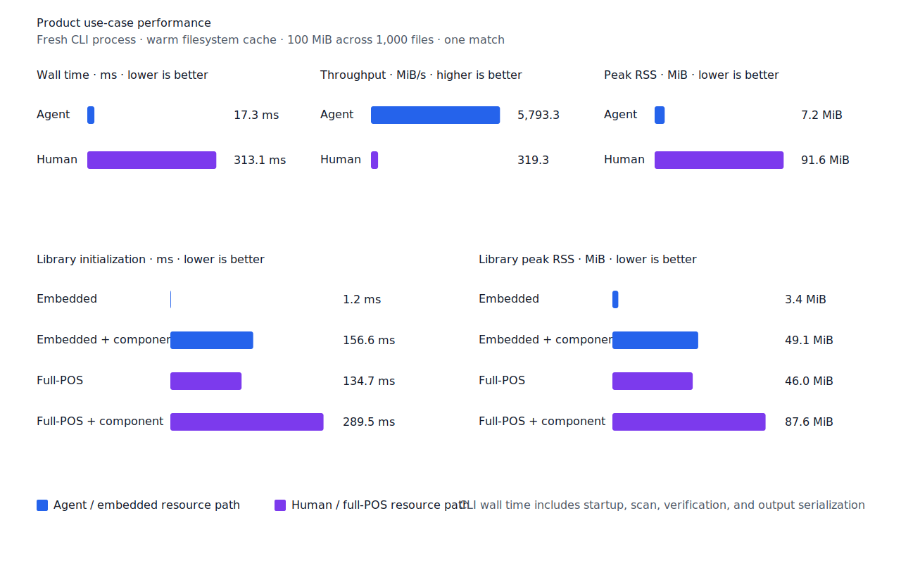
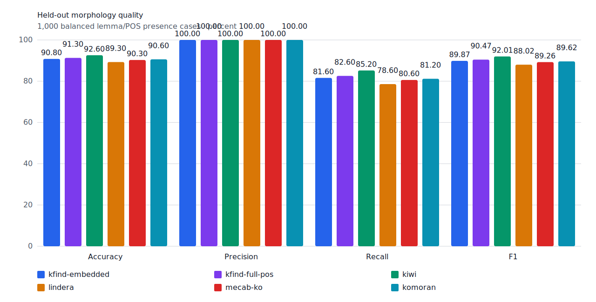
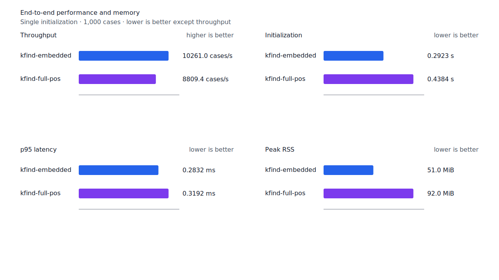
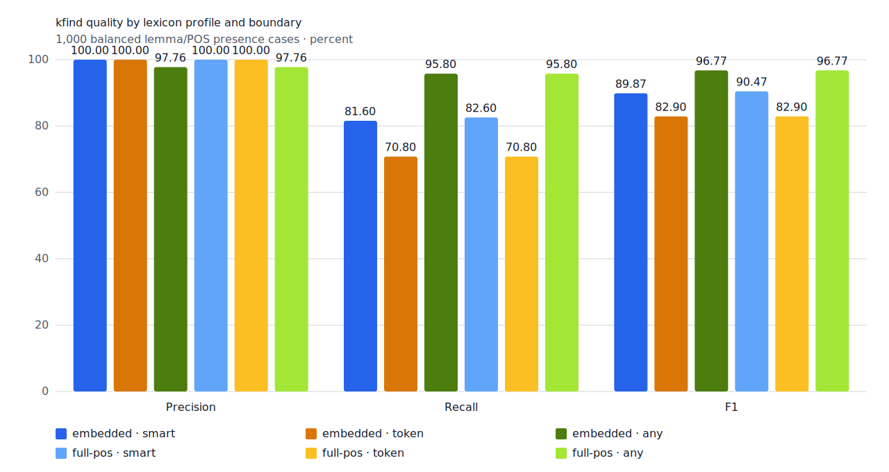
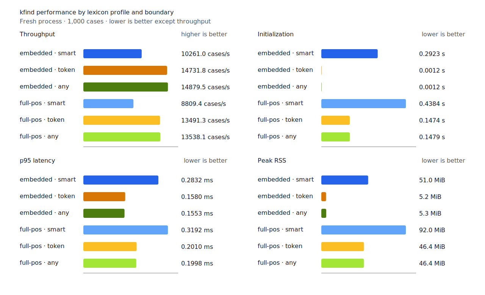
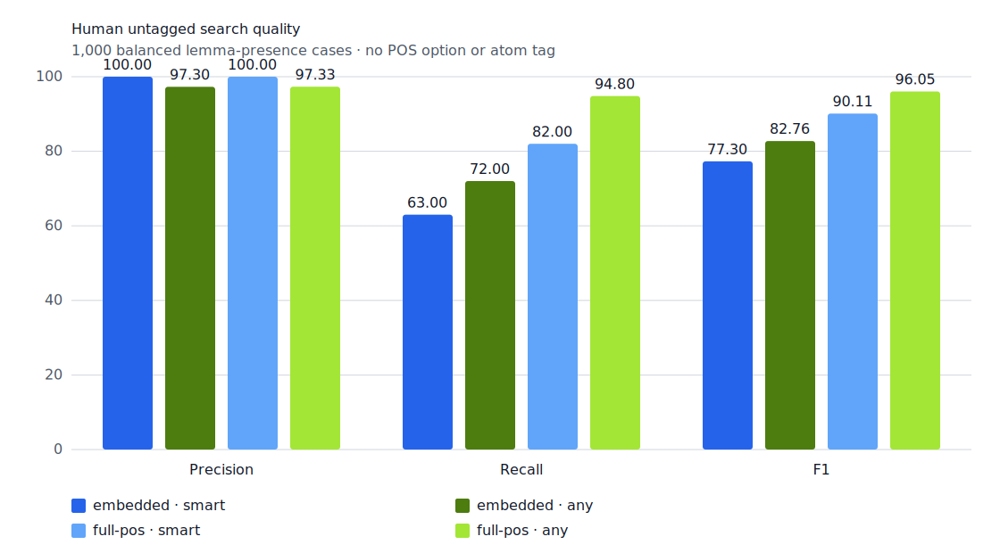

# User smart precision 품질·성능

- 측정일: 2026-07-14
- 기준 revision: `ac16d9c`
- 후보 revision: `b2d3c93`
- 환경: Linux/aarch64, 10 logical CPUs, Python 3.12.13, Docker
- 반복: fresh process 1회 warm-up 뒤 5회 측정의 중앙값
- explicit-POS fixture: `933bc12197da866d2363d7df9107d4d9be89a65ddaafd73968ad5384832b21ff`
- untagged fixture: `94ccd70a093ee7af8435371b2ffdb81534ec97e29ada705ea72c940938d0c592`
- 후보 report SHA-256: `71e2abe0787ba5a7af2275bb9571a786d13748390115996ee48b73e9dc3b9978`
- 기준 report SHA-256: `6572dc88403033d163d439687368c14d5dc85b0e5171172c20761367efa775f5`

## 결론

User persona는 TP 410과 FN 90을 유지하면서 FP를 2에서 0으로 줄였다. 같은 입력을 사용하는
fixture runner의 처리량은 0.70% 늘고 p95는 0.07% 낮아졌으며 peak RSS는 같았다. 별도 사람용
무품사 fixture도 TP 410과 FN 90을 유지하면서 FP를 1에서 0으로 줄였고, 처리량은 0.87%
늘고 p95는 6.75% 낮아졌다.

100 MiB CLI 사용 케이스의 사람용 경로는 wall time이 308.7 ms에서 313.1 ms로 1.43%
늘었고 처리량은 1.41% 낮아졌다. peak RSS는 12 KiB 늘었다. 이 사용 케이스의 `학교` query는
이번 변경의 지정사·직접 조사 branch를 실행하지 않으므로 이 차이를 새 verifier 비용으로
귀속하지 않는다. 변경 branch를 포함하는 User persona와 무품사 fixture에서는 성능 회귀가
관찰되지 않았다.

## 기준선 대비 결과

| workload | 기준 TP / FP / FN | 후보 TP / FP / FN | 기준 cases/s | 후보 cases/s | 기준 p95 | 후보 p95 | 후보 RSS |
| --- | ---: | ---: | ---: | ---: | ---: | ---: | ---: |
| User persona, full-POS `smart` | 410 / 2 / 90 | 410 / 0 / 90 | 7,147.0 | 7,197.3 | 0.4326 ms | 0.4323 ms | 92.0 MiB |
| 사람용 무품사, full-POS `smart` | 410 / 1 / 90 | 410 / 0 / 90 | 7,374.9 | 7,439.0 | 0.4121 ms | 0.3843 ms | 92.0 MiB |
| explicit-POS, full-POS `smart` | 413 / 1 / 87 | 413 / 0 / 87 | 8,654.0 | 8,809.4 | 0.3236 ms | 0.3192 ms | 92.0 MiB |

User persona의 후보 처리량 범위는 5,821.0~7,288.8 cases/s, p95 범위는
0.4026~0.4551 ms다. 기준 처리량 범위는 5,412.3~7,334.7 cases/s, p95 범위는
0.4050~0.5842 ms다. 사람용 무품사 후보 처리량 범위는 7,292.4~7,485.8 cases/s,
p95 범위는 0.3778~0.4032 ms다.


## 실제 CLI 사용 케이스

고정 100 MiB·1,000파일 corpus에서 query compile, 파일 순회, scan, verification과 출력
직렬화를 포함했다. corpus SHA-256은
`7692072cb7bff9261c1fa5933bde41b27e558170818eeac6d07cabdd673815ff`다.

| workflow | 기준 wall | 후보 wall | 기준 처리량 | 후보 처리량 | 기준 RSS | 후보 RSS |
| --- | ---: | ---: | ---: | ---: | ---: | ---: |
| Agent: embedded + `any` + explicit POS | 16.9 ms | 17.3 ms | 5,920.9 MiB/s | 5,793.3 MiB/s | 7.1 MiB | 7.2 MiB |
| Human: full-POS + `smart` + untagged | 308.7 ms | 313.1 ms | 323.9 MiB/s | 319.3 MiB/s | 91.6 MiB | 91.6 MiB |

사람용 후보 wall time 범위는 312.8~314.3 ms이고 기준 범위는 307.7~310.4 ms다.



## 제품 profile과 외부 분석기

Agent는 explicit POS의 `embedded + any`, User는 같은 fixture에서 POS를 제거한
`full-POS + smart`다. 외부 분석기는 같은 explicit-POS fixture에 고정된 snapshot을 사용한다.
따라서 이 차트는 동일 입력의 backend 순위가 아니라 제품 persona 비교다.






## 경계 정책과 무품사 검색

`token`과 `any`의 품질은 기준선과 같다. `smart`는 embedded와 full-POS 모두 test FP가
1에서 0으로 줄었다. `any`는 TP 479 / FP 11 / FN 21로 후보 범위가 바뀌지 않았다.







## 재현

```console
scripts/benchmark-morphology.sh target/morph-benchmark
python3 tools/morph-compare/render_charts.py \
  target/morph-benchmark/report.json docs/benchmarks/assets \
  --prefix 2026-07-14-user-smart-precision-
```

기준선은 `origin/main`의 별도 detached worktree에서 같은 명령과 환경으로 측정했다. 외부
분석기 snapshot은 fixture, schema와 고정 버전·설정이 바뀌지 않아 갱신하지 않았다.
