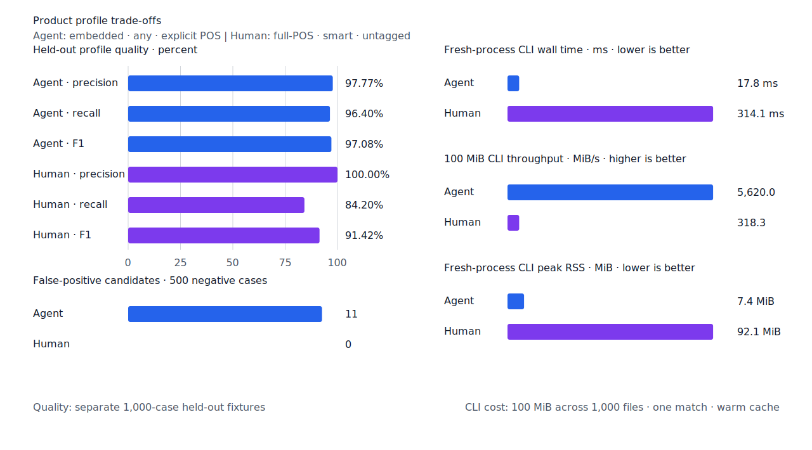
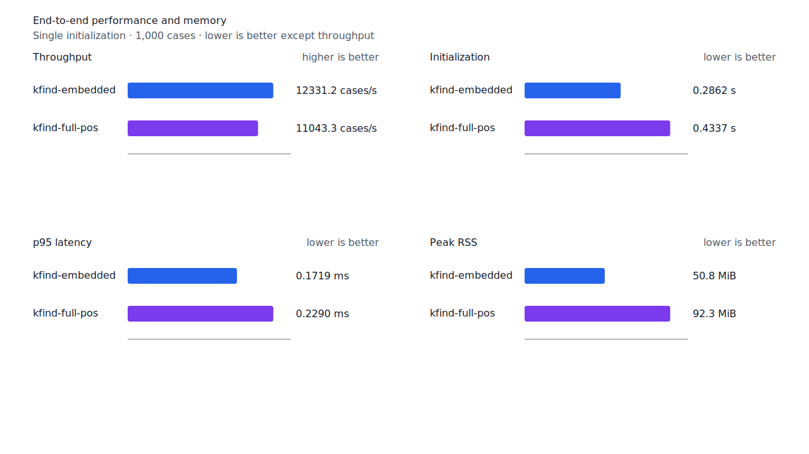
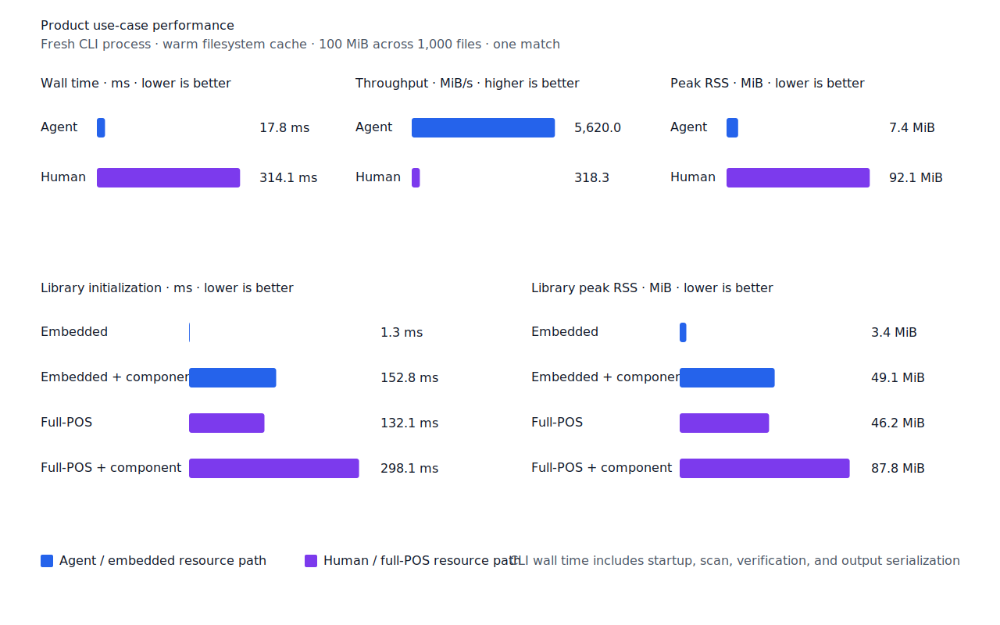

# `-(으)니까` 계열 연결 어미

- 측정일: 2026-07-15
- 기준 revision: `c2fd2edbe8a33b4e03470f33f04cdd7da15c0441`
- 후보 코드 revision: `c246549d82c44149fb4de7be840f470a8ddac5b7`
- 환경: Linux 6.12.76/aarch64, 10 logical CPUs, Python 3.12.13, Rust 1.97.0,
  Docker 29.6.1
- 반복: fresh process 1회 warm-up 뒤 5회 측정의 중앙값
- test fixture: `933bc12197da866d2363d7df9107d4d9be89a65ddaafd73968ad5384832b21ff`
- development fixture: `604c3a139854fcf59570392f48ab85028785f4a3561ea3c5e702f88b841f907c`
- hard-negative fixture: `cb8634491cba65916c9af510c50f909eaddfd9bb89935598875e134a01cbce99`
- 무품사 fixture: `94ccd70a093ee7af8435371b2ffdb81534ec97e29ada705ea72c940938d0c592`
- 100 MiB corpus: `7692072cb7bff9261c1fa5933bde41b27e558170818eeac6d07cabdd673815ff`
- 회귀 fixture: `bb36d9f6b625d534596cdbe6880403911880c1eeac16d2b806df83be850f2510`
- 기준 report SHA-256: `afb8f6b5d2eab2409d85d96872fd6a1b0f47b0c88398f18e51d44c95592dc01f`
- 후보 report SHA-256: `2bd7daa2f79bfd2ec18bbcb10752757091d0c46303fad44f30e14fa77fa1d745`

## 결론

`ending.connective-ni`가 `-니/-으니`뿐 아니라 `-니까/-으니까`, `-니까는/-으니까는`과
준말 `-니깐/-으니깐`을 완성된 predicate token으로 소비한다. 받침 없는 어간과 `ㄹ` 받침
어간은 `으`가 없는 이형태를, 그 밖의 받침 어간은 `으`가 있는 이형태를 사용한다.

[한국어기초사전 `-니까`](https://krdict.korean.go.kr/eng/dicSearch/SearchView?ParaWordNo=80139)는
받침이 없거나 `ㄹ` 받침인 용언 뒤의 연결 어미로 설명한다. 같은 사전의
[`-니까는`](https://krdict.korean.go.kr/eng/dicSearch/SearchView?ParaWordNo=80149&nation=eng)과
[`-으니까는`](https://krdict.korean.go.kr/eng/dicSearch/SearchView?ParaWordNo=80148&nation=eng)은
각각 준말 `-니깐`, `-으니깐`을 제시한다. 이 근거에 따라 축약형을 비표준 입력 보정으로
처리하지 않고 같은 canonical 어미 규칙에 포함했다.

development의 `불다/verb -> 부니까`를 복구해 embedded와 full-POS `smart` FN을 각각 1건
줄였다. `살으니까`, `먹니까`, `먹니깐`, `불으니깐`처럼 이형태가 맞지 않는 표면형과 완성된
축약형 뒤에 조사를 더 붙인 `부니깐은`은 회귀 fixture에서 거부한다.

## 품질

| fixture/profile | 기준 TP / FP / FN | 후보 TP / FP / FN | 기준 recall | 후보 recall |
| --- | ---: | ---: | ---: | ---: |
| development embedded `smart` | 446 / 2 / 54 | 447 / 2 / 53 | 89.2% | 89.4% |
| development full-POS `smart` | 447 / 2 / 53 | 448 / 2 / 52 | 89.4% | 89.6% |
| test embedded `smart` | 419 / 0 / 81 | 419 / 0 / 81 | 83.8% | 83.8% |
| test full-POS `smart` | 426 / 0 / 74 | 426 / 0 / 74 | 85.2% | 85.2% |
| Agent embedded `any` | 482 / 11 / 18 | 482 / 11 / 18 | 96.4% | 96.4% |
| Human full-POS `smart` | 421 / 0 / 79 | 421 / 0 / 79 | 84.2% | 84.2% |

development full-POS `smart` precision은 99.55%에서 99.56%로 바뀌었다. 22개
hard-negative의 기존 FP 4건은 그대로이고 신규 FP는 없다. test, Agent와 Human fixture의
품질은 변하지 않았다.




## 성능

각 값은 `median [min, max]`다. RSS 단위는 KiB다.

| workload | 지표 | 기준 | 후보 | 증감 |
| --- | --- | ---: | ---: | ---: |
| embedded `smart` | initialization | 0.285267 s [0.284650, 0.305924] | 0.286157 s [0.285651, 0.288535] | +0.31% |
| embedded `smart` | cases/s | 12,435.9 [12,100.1, 12,485.1] | 12,331.2 [11,711.2, 12,347.1] | -0.84% |
| embedded `smart` | p95 | 0.1685 ms [0.1664, 0.1763] | 0.1719 ms [0.1669, 0.1815] | +2.02% |
| embedded `smart` | peak RSS | 52,072 [52,060, 52,076] | 52,068 [52,056, 52,076] | -0.01% |
| full-POS `smart` | initialization | 0.431845 s [0.428216, 0.441104] | 0.433676 s [0.429992, 0.443790] | +0.42% |
| full-POS `smart` | cases/s | 11,251.9 [10,906.7, 11,548.2] | 11,043.3 [10,564.2, 11,280.2] | -1.85% |
| full-POS `smart` | p95 | 0.2233 ms [0.2145, 0.2310] | 0.2290 ms [0.2258, 0.2366] | +2.55% |
| full-POS `smart` | peak RSS | 94,460 [94,448, 94,520] | 94,520 [94,460, 94,524] | +0.06% |
| Agent morphology | initialization | 0.001295 s [0.001287, 0.001311] | 0.001323 s [0.001298, 0.001368] | +2.16% |
| Agent morphology | cases/s | 13,696.8 [13,665.0, 13,733.6] | 13,418.8 [13,397.6, 13,492.6] | -2.03% |
| Agent morphology | p95 | 0.1642 ms [0.1618, 0.1647] | 0.1650 ms [0.1639, 0.1667] | +0.49% |
| Agent morphology | peak RSS | 5,332 [5,320, 5,336] | 5,332 [5,312, 5,336] | 0.00% |
| User morphology | initialization | 0.432553 s [0.430461, 0.447578] | 0.437377 s [0.435261, 0.451265] | +1.12% |
| User morphology | cases/s | 9,734.2 [9,665.5, 9,957.6] | 9,464.2 [8,936.7, 9,768.5] | -2.77% |
| User morphology | p95 | 0.2497 ms [0.2473, 0.2539] | 0.2515 ms [0.2475, 0.2887] | +0.72% |
| User morphology | peak RSS | 94,544 [94,476, 94,544] | 94,480 [94,476, 94,544] | -0.07% |
| Agent 100 MiB CLI | wall | 0.016644 s [0.016266, 0.017642] | 0.017794 s [0.016416, 0.018356] | +6.91% |
| Human 100 MiB CLI | wall | 0.313188 s [0.311582, 0.318105] | 0.314120 s [0.313192, 0.325793] | +0.30% |

형태소 workload의 처리량은 0.84%~2.77% 낮고 p95는 0.49%~2.55% 높았다. Agent CLI wall은
6.91% 높고 Human CLI wall은 0.30% 높아 20.4절의 10% 경고선 안이다. initialization과 RSS
변화도 경고선 안이며 성능 불변을 주장하지 않는다.

local lattice 제품 판정의 Criterion p95는 기준 4.6913 us에서 후보 4.5110 us로 3.84%
낮아져 10% 회귀 기준을 통과했다. morphology index의 exact·prefix equivalence checksum은
각각 `5901055339043549701`, `7072030433407239049`로 유지됐다.





## 재현

```console
git switch --detach c2fd2edbe8a33b4e03470f33f04cdd7da15c0441
scripts/benchmark-morphology.sh target/morph-benchmark-connective-nikka-baseline

git switch codex/reduce-morphology-fn-next-3
scripts/benchmark-morphology.sh target/morph-benchmark-connective-nikka-candidate

scripts/benchmark-criterion.sh local_lattice
scripts/benchmark-morph-index.sh

python3 tools/morph-compare/render_charts.py \
  target/morph-benchmark-connective-nikka-candidate/report.json \
  docs/benchmarks/assets \
  --prefix 2026-07-15-connective-nikka-
```

외부 분석기 snapshot은 fixture, adapter schema와 고정 버전·설정이 바뀌지 않아 갱신하지 않았다.
