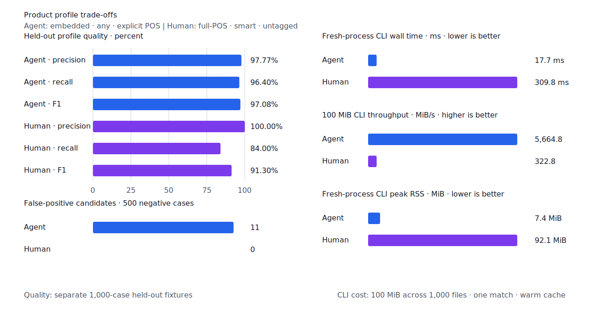
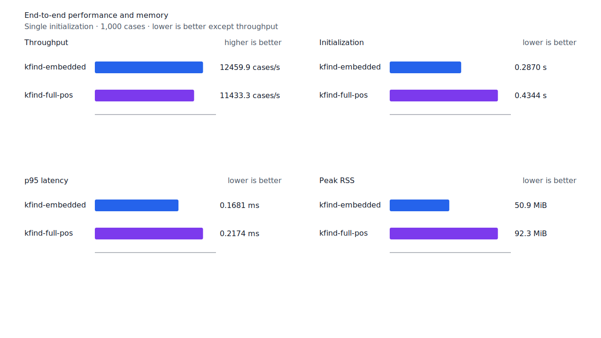
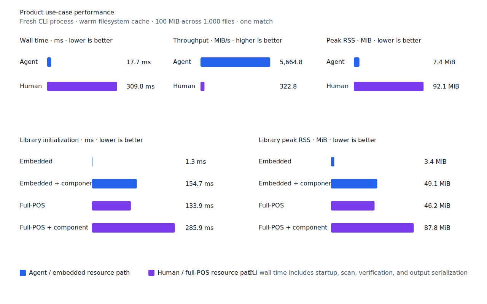

# 접속 조사 `이면/면`의 명사류 결합

- 측정일: 2026-07-15
- 기준 revision: `3a673bdc7d1138df5b4485675c4e5904c13e4395`
- 후보 코드 revision: `8b846aa17a1c3fa32e5c3f1d8621e81df9f62d9d`
- 환경: Linux 6.12.76/aarch64, 10 logical CPUs, 7.7 GiB memory, Python 3.12.13,
  Rust 1.97.0, Docker 29.6.1
- 반복: fresh process 1회 warm-up 뒤 5회 측정의 중앙값
- test fixture: `933bc12197da866d2363d7df9107d4d9be89a65ddaafd73968ad5384832b21ff`
- development fixture: `604c3a139854fcf59570392f48ab85028785f4a3561ea3c5e702f88b841f907c`
- hard-negative fixture: `cb8634491cba65916c9af510c50f909eaddfd9bb89935598875e134a01cbce99`
- 무품사 fixture: `94ccd70a093ee7af8435371b2ffdb81534ec97e29ada705ea72c940938d0c592`
- 100 MiB corpus: `7692072cb7bff9261c1fa5933bde41b27e558170818eeac6d07cabdd673815ff`
- 회귀 fixture: `b4cbdc3900000c0e6c843d1ac34350f7b9a16600c6a7314678585801c4358e56`
- 기준 report SHA-256: `ee2e1ad94a9072dee7ab7789488c2f40b4a9e8029d4f16f2afe60269dc321cad`
- 후보 report SHA-256: `cb9422193e01d2ddb702d0d7da547cea3f27838947656eae2b905e27627de0dd`

## 결론

명사류 뒤의 접속 조사 `이면/면`을 `particle.connector-myeon`으로 분리한다. 받침 있는 말은
`이면`, 받침 없는 말은 `면`을 소비하며 조사 뒤에 다른 조사가 이어지는 연쇄는 허용하지 않는다.
따라서 `백이면 백`, `공부면 공부`를 찾고 `백면`, `공부이면`, `백이면도`는 거부한다.

[한국어기초사전 `면` 조사](https://krdict.korean.go.kr/eng/dicSearch/SearchView?ParaWordNo=80264&nation=eng)는
받침 없는 명사 뒤의 접속 조사와 `공부면 공부, 운동이면 운동`을 제시하고 `이면`을 참고형으로
연결한다. 국립국어원 [온라인가나다의 `백이면 백`](https://www.korean.go.kr/front/onlineQna/onlineQnaView.do?qna_seq=321560)은
이 표현의 `이면`을 접속 조사로 판정한다. 이 근거에 따라 지정사 조건형을 넓히지 않고 명사류
조사 verifier에만 규칙을 추가했다.

development의 `백/numeral -> 백이면`을 복구해 embedded와 full-POS `smart` FN을 각각 1건
줄였다. 나머지 non-boundary 12건은 표제어·품사·span annotation 충돌, 파생 경계 또는 일반화
근거 부족으로 제품 규칙에 포함하지 않았다.

## 품질

| fixture/profile | 기준 TP / FP / FN | 후보 TP / FP / FN | 기준 recall | 후보 recall |
| --- | ---: | ---: | ---: | ---: |
| development embedded `smart` | 444 / 2 / 56 | 445 / 2 / 55 | 88.8% | 89.0% |
| development full-POS `smart` | 445 / 2 / 55 | 446 / 2 / 54 | 89.0% | 89.2% |
| test embedded `smart` | 418 / 0 / 82 | 418 / 0 / 82 | 83.6% | 83.6% |
| test full-POS `smart` | 425 / 0 / 75 | 425 / 0 / 75 | 85.0% | 85.0% |
| Agent embedded `any` | 482 / 11 / 18 | 482 / 11 / 18 | 96.4% | 96.4% |
| Human full-POS `smart` | 420 / 0 / 80 | 420 / 0 / 80 | 84.0% | 84.0% |

두 development profile의 precision은 99.55%다. 22개 hard-negative의 기존 FP 4건은
그대로이고 신규 FP는 없다. fixture, gold와 negative 선택은 바꾸지 않았다.




## 성능

각 값은 `median [min, max]`다. RSS 단위는 KiB다.

| workload | 지표 | 기준 | 후보 | 증감 |
| --- | --- | ---: | ---: | ---: |
| embedded `smart` | initialization | 0.286662 s [0.285863, 0.290269] | 0.286968 s [0.286826, 0.287915] | +0.11% |
| embedded `smart` | cases/s | 12,185.3 [8,190.6, 12,673.2] | 12,459.9 [11,776.8, 12,538.8] | +2.25% |
| embedded `smart` | p95 | 0.1704 ms [0.1649, 0.3665] | 0.1681 ms [0.1676, 0.1784] | -1.35% |
| embedded `smart` | peak RSS | 52,072 [52,064, 52,072] | 52,072 [52,064, 52,076] | 0.00% |
| full-POS `smart` | initialization | 0.434042 s [0.430482, 0.452531] | 0.434422 s [0.431752, 0.450149] | +0.09% |
| full-POS `smart` | cases/s | 11,640.2 [11,222.6, 11,684.2] | 11,433.3 [11,236.3, 11,515.4] | -1.78% |
| full-POS `smart` | p95 | 0.2150 ms [0.2142, 0.2266] | 0.2174 ms [0.2152, 0.2210] | +1.12% |
| full-POS `smart` | peak RSS | 94,456 [94,452, 94,524] | 94,556 [94,556, 94,556] | +0.11% |
| Agent morphology | initialization | 0.001283 s [0.001276, 0.001354] | 0.001307 s [0.001297, 0.001385] | +1.87% |
| Agent morphology | cases/s | 13,882.9 [13,848.3, 13,943.0] | 13,593.5 [13,221.5, 13,718.1] | -2.08% |
| Agent morphology | p95 | 0.1622 ms [0.1615, 0.1627] | 0.1665 ms [0.1622, 0.1741] | +2.65% |
| Agent morphology | peak RSS | 5,328 [5,312, 5,332] | 5,328 [5,316, 5,332] | 0.00% |
| User morphology | initialization | 0.434684 s [0.433605, 0.442155] | 0.431218 s [0.430965, 0.438250] | -0.80% |
| User morphology | cases/s | 9,933.1 [9,417.3, 10,005.9] | 9,810.7 [9,627.9, 9,890.8] | -1.23% |
| User morphology | p95 | 0.2496 ms [0.2450, 0.2592] | 0.2503 ms [0.2470, 0.2566] | +0.28% |
| User morphology | peak RSS | 94,520 [94,512, 94,524] | 94,460 [94,448, 94,524] | -0.06% |
| Agent 100 MiB CLI | wall | 0.017828 s [0.016196, 0.019514] | 0.017653 s [0.016503, 0.019258] | -0.98% |
| Human 100 MiB CLI | wall | 0.311183 s [0.310418, 0.314703] | 0.309771 s [0.306790, 0.321092] | -0.45% |

full-POS, Agent와 User morphology cases/s는 각각 1.78%, 2.08%, 1.23% 낮았다. p95는
각각 1.12%, 2.65%, 0.28% 높았다. embedded `smart` 기준의 한 측정에 cases/s 8,190.6과
p95 0.3665 ms의 지연이 포함되어 후보 중앙값이 cases/s 2.25% 증가, p95 1.35% 감소로
나타났다. initialization과 RSS 변화는 작았다. morphology benchmark에는 별도 회귀 임계가
없으므로 성능 불변을 주장하지 않는다. 두 100 MiB CLI wall 변화는 20.4절의 10% 경고선 안이다.

local lattice 제품 판정의 Criterion 추정 중앙값은 4.4079 us였고 직전 기준 대비 4.03%
느렸다. 제품 판정 p95 10% 회귀 기준을 통과했다. morphology index의 exact·prefix equivalence
checksum은 각각 `5901055339043549701`, `7072030433407239049`로 유지됐다.





## 재현

정확한 기준 revision을 별도 build context로 만든 뒤 기준과 후보 image를 같은 host에서 연속
실행했다.

```console
git archive 3a673bdc7d1138df5b4485675c4e5904c13e4395 | tar -x -C <baseline-context>
scripts/benchmark-run.sh run --name connector-myeon-main-3a673-build -- \
  docker build --file <baseline-context>/tools/morph-compare/Dockerfile \
  --tag kfind-morph-benchmark:connector-main-3a673bd <baseline-context>

mkdir -p target/morph-benchmark-connector-main-3a673bd
scripts/benchmark-run.sh run --name connector-myeon-main-3a673 -- \
  docker run --rm --network none --user "$(id -u):$(id -g)" \
  --volume "$(pwd)/target/morph-benchmark-connector-main-3a673bd:/output" \
  kfind-morph-benchmark:connector-main-3a673bd \
  --runs 5 --output /output/report.json

KFIND_MORPH_IMAGE=kfind-morph-benchmark:connector-candidate-8b846aa \
  KFIND_MORPH_RUNS=5 \
  scripts/benchmark-morphology.sh target/morph-benchmark-connector-candidate-8b846aa

scripts/benchmark-criterion.sh local_lattice
scripts/benchmark-morph-index.sh

python3 tools/morph-compare/render_charts.py \
  target/morph-benchmark-connector-candidate-8b846aa/report.json \
  docs/benchmarks/assets \
  --prefix 2026-07-15-connector-myeon-particle-
```

외부 분석기 snapshot은 fixture, adapter schema와 고정 버전·설정이 바뀌지 않아 갱신하지 않았다.
