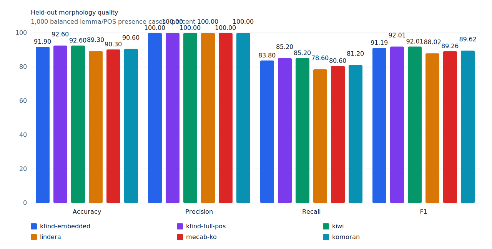
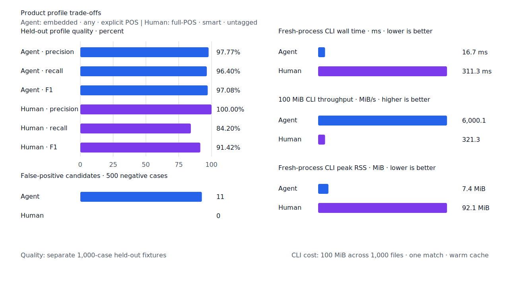
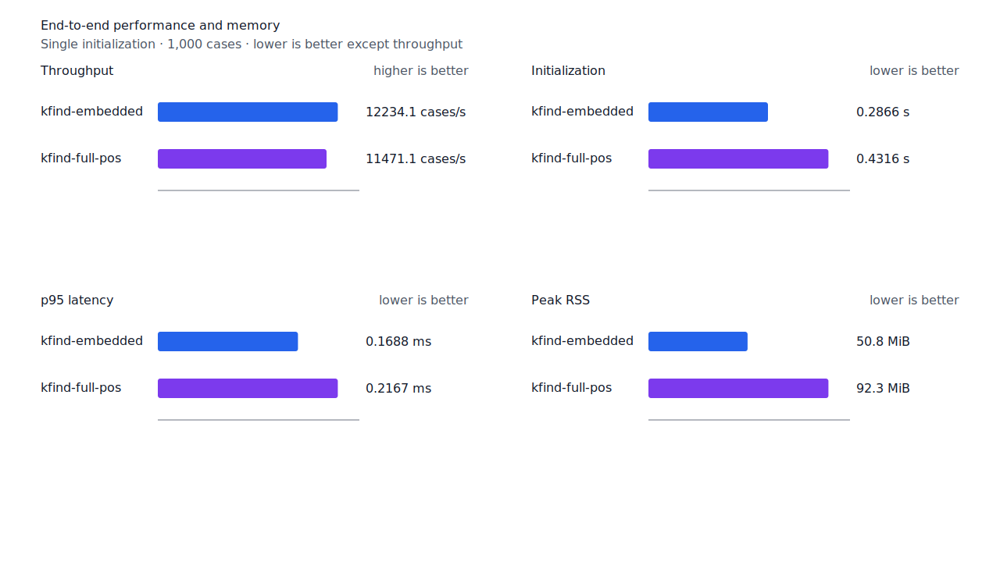
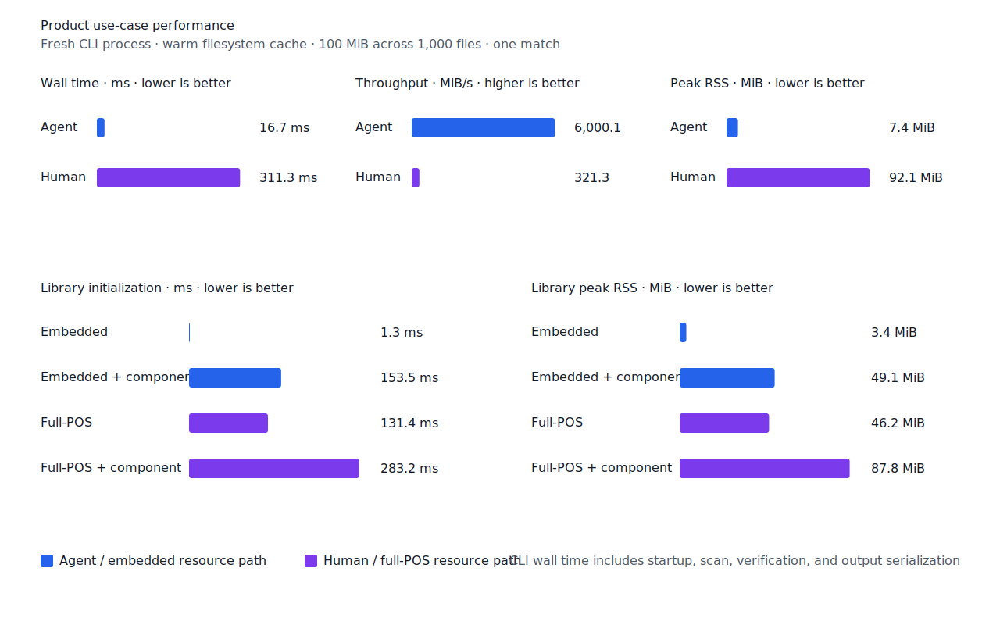

# 상태 용언 현재 평서형 후속 형태 continuation

- 측정일: 2026-07-15
- 기준 revision: `809aa428025b37be6f431f7253509d89fcc768d1`
- 후보 코드 revision: `d6cefde7274ad1ba4ba98e45acf593040ad6ff4c`
- 회귀 fixture revision: `d6cefde7274ad1ba4ba98e45acf593040ad6ff4c`
- 환경: Linux 6.12.76/aarch64, 10 logical CPUs, 7.7 GiB memory, Python 3.12.13,
  Rust 1.97.0, Docker 29.6.1
- 반복: fresh process 1회 warm-up 뒤 5회 측정의 중앙값
- test fixture: `933bc12197da866d2363d7df9107d4d9be89a65ddaafd73968ad5384832b21ff`
- development fixture: `604c3a139854fcf59570392f48ab85028785f4a3561ea3c5e702f88b841f907c`
- hard-negative fixture: `cb8634491cba65916c9af510c50f909eaddfd9bb89935598875e134a01cbce99`
- 무품사 fixture: `94ccd70a093ee7af8435371b2ffdb81534ec97e29ada705ea72c940938d0c592`
- 100 MiB corpus: `7692072cb7bff9261c1fa5933bde41b27e558170818eeac6d07cabdd673815ff`
- 회귀 fixture: `e1d35bf0ea87fc301a8ede2b73df1fdd051936f63041e7f6586abd966d1ce8cb`
- 한국어기초사전 20260619 snapshot:
  `a8ab7d044d4f6341e0f217db63f38f4d18beed3e1f153130f6cb4e9494fea1d6`
- 기준 report SHA-256: `c2ac9c89f1b3225d6cd529377014faa427f41f7a3958d2a89d56b2538f2a2363`
- 후보 report SHA-256: `e27cce140384ddea25a031c18d22d82d7e606df91348cd9bc3dbe9d8ab4eac94`

## 결론

형용사와 보조 형용사의 현재 평서형 `-다` branch를 기존 `ending.declarative` verifier
state로 전이한다. 이 state는 `고`, `는`, `던`, `면`, `니`, `며`, `면서`, `는데`, `지`를
소비한다. `나쁘다면`, `좋다는`, `어렵다면서`를 양성 회귀 fixture로 고정하고, 같은 state의
전체 후속 형태는 기존 현재 서술형 fixture와 generator 단위 테스트로 유지한다.

한국어기초사전은 [`-다고`](https://krdict.korean.go.kr/eng/dicSearch/SearchView?ParaWordNo=85793),
[`-다는`](https://krdict.korean.go.kr/eng/dicSearch/SearchView?ParaWordNo=82216&nation=eng),
[`-다던`](https://krdict.korean.go.kr/eng/dicSearch/SearchView?ParaWordNo=82040&nation=eng),
[`-다면`](https://krdict.korean.go.kr/eng/dicSearch/SearchView?ParaWordNo=68834&nation=eng),
[`-다며`](https://krdict.korean.go.kr/eng/dicSearch/SearchView?ParaWordNo=85856&nation=eng),
[`-다면서`](https://krdict.korean.go.kr/eng/dicSearch/SearchView?ParaWordNo=86187&nation=eng),
[`-다니`](https://krdict.korean.go.kr/eng/dicSearch/SearchView?ParaWordNo=86184&nation=eng)와
[`-다지`](https://krdict.korean.go.kr/eng/dicSearch/SearchView?ParaWordNo=76576&nation=eng)를
형용사 뒤에 붙는 표현으로 제시한다. 이 근거와 고정 snapshot의 실제 예문을 함께 확인해
개별 표제어가 아니라 품사 단위 전이로 구현했다.

동작 용언의 사전형 `-다`, 지정사와 부정 지정사 `아니다`는 이 전이에 포함하지 않는다.
따라서 `가다면`과 `아니다면`은 거부한다. 한국어기초사전의
[`-라면`](https://krdict.korean.go.kr/eng/dicSearch/SearchView?ParaWordNo=69044&nation=eng&nationCode=6)이
제시하는 올바른 조건형은 `아니라면`이다. 현재 `ending.connective-ra=아니라` branch는
terminal이므로 `smart`와 `token`에서 아직 복구하지 않는다. 이 연쇄는 별도 continuation
계약이 필요하며 이번 상태 용언 `-다` 전이에 섞지 않는다. `나쁘다면도`처럼 허용한 후속
형태 뒤에 조사를 더 붙이는 연쇄도 계속 거부한다.

development에서 `나쁘다 -> 나쁘다면`을 복구했다. 규칙 고정 뒤 처음 확인한 test와 Human
fixture에서는 `있다/adjective -> 있다고`도 복구됐다. 두 사례는 서로 다른 corpus split에
있으며 fixture, gold와 negative 선택은 바꾸지 않았다.

## 품질

| fixture/profile | 기준 TP / FP / FN | 후보 TP / FP / FN | 기준 recall | 후보 recall |
| --- | ---: | ---: | ---: | ---: |
| development embedded `smart` | 445 / 2 / 55 | 446 / 2 / 54 | 89.0% | 89.2% |
| development full-POS `smart` | 446 / 2 / 54 | 447 / 2 / 53 | 89.2% | 89.4% |
| test embedded `smart` | 418 / 0 / 82 | 419 / 0 / 81 | 83.6% | 83.8% |
| test full-POS `smart` | 425 / 0 / 75 | 426 / 0 / 74 | 85.0% | 85.2% |
| Agent embedded `any` | 482 / 11 / 18 | 482 / 11 / 18 | 96.4% | 96.4% |
| Human full-POS `smart` | 420 / 0 / 80 | 421 / 0 / 79 | 84.0% | 84.2% |

두 development profile의 precision은 99.55%다. Test와 Human precision은 100.00%를
유지했다. 22개 hard-negative의 기존 FP 4건은 그대로이고 신규 FP는 없다.





## 성능

각 값은 `median [min, max]`다. RSS 단위는 KiB다.

| workload | 지표 | 기준 | 후보 | 증감 |
| --- | --- | ---: | ---: | ---: |
| embedded `smart` | initialization | 0.285631 s [0.285319, 0.287284] | 0.286581 s [0.285615, 0.320772] | +0.33% |
| embedded `smart` | cases/s | 12,467.9 [12,064.8, 12,487.1] | 12,234.1 [11,861.5, 12,474.8] | -1.88% |
| embedded `smart` | p95 | 0.1671 ms [0.1649, 0.1745] | 0.1688 ms [0.1670, 0.1788] | +1.02% |
| embedded `smart` | peak RSS | 52,068 [52,056, 52,068] | 52,068 [52,064, 52,072] | 0.00% |
| full-POS `smart` | initialization | 0.431317 s [0.429605, 0.432668] | 0.431582 s [0.429590, 0.435981] | +0.06% |
| full-POS `smart` | cases/s | 11,497.1 [11,220.1, 11,533.0] | 11,471.1 [10,480.1, 11,535.0] | -0.23% |
| full-POS `smart` | p95 | 0.2161 ms [0.2145, 0.2195] | 0.2167 ms [0.2145, 0.2379] | +0.28% |
| full-POS `smart` | peak RSS | 94,512 [94,460, 94,520] | 94,524 [94,460, 94,564] | +0.01% |
| Agent morphology | initialization | 0.001286 s [0.001276, 0.001316] | 0.001313 s [0.001292, 0.001372] | +2.10% |
| Agent morphology | cases/s | 13,724.8 [13,689.2, 13,759.0] | 13,663.1 [13,533.9, 13,680.6] | -0.45% |
| Agent morphology | p95 | 0.1635 ms [0.1607, 0.1653] | 0.1649 ms [0.1633, 0.1673] | +0.86% |
| Agent morphology | peak RSS | 5,328 [5,324, 5,332] | 5,328 [5,324, 5,336] | 0.00% |
| User morphology | initialization | 0.430455 s [0.429306, 0.431001] | 0.433033 s [0.430117, 0.434012] | +0.60% |
| User morphology | cases/s | 9,828.9 [9,509.1, 9,886.9] | 9,823.9 [9,543.7, 9,884.6] | -0.05% |
| User morphology | p95 | 0.2502 ms [0.2479, 0.2582] | 0.2498 ms [0.2477, 0.2549] | -0.16% |
| User morphology | peak RSS | 94,520 [94,448, 94,524] | 94,456 [94,452, 94,520] | -0.07% |
| Agent 100 MiB CLI | wall | 0.017240 s [0.015944, 0.018066] | 0.016666 s [0.015103, 0.018056] | -3.33% |
| Human 100 MiB CLI | wall | 0.314054 s [0.313410, 0.331176] | 0.311266 s [0.310734, 0.311787] | -0.89% |

Embedded와 full-POS `smart`의 cases/s는 각각 1.88%, 0.23% 낮았고 p95는 1.02%,
0.28% 높았다. Agent morphology cases/s는 0.45% 낮았으며 양쪽 측정 범위가 근소하게
분리됐다. 나머지 morphology 성능 범위는 겹친다. 두 100 MiB CLI wall 변화는 20.4절의
10% 경고선 안이다. Morphology benchmark에는 별도 회귀 임계가 없으므로 성능 불변을
주장하지 않으며, 현재 계약을 위반한 회귀는 관찰되지 않았다.





## 재현

최신 `origin/main`을 별도 detached worktree에서 실행하고 후보를 같은 host에서 연속 측정했다.

```console
git worktree add --detach target/baseline-809aa42 origin/main

KFIND_MORPH_IMAGE=kfind-morph-benchmark:descriptive-main-809aa42 \
  KFIND_MORPH_RUNS=5 \
  target/baseline-809aa42/scripts/benchmark-morphology.sh \
  target/morph-benchmark-descriptive-main-809aa42

KFIND_MORPH_IMAGE=kfind-morph-benchmark:descriptive-candidate-d6cefde \
  KFIND_MORPH_RUNS=5 \
  scripts/benchmark-morphology.sh \
  target/morph-benchmark-descriptive-candidate-d6cefde

python3 tools/morph-compare/render_charts.py \
  target/morph-benchmark-descriptive-candidate-d6cefde/report.json \
  docs/benchmarks/assets \
  --prefix 2026-07-15-descriptive-declarative-continuation-
```

외부 분석기 snapshot은 fixture, adapter schema와 고정 버전·설정이 바뀌지 않아 갱신하지 않았다.
