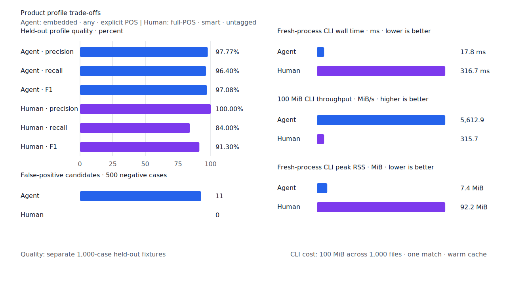
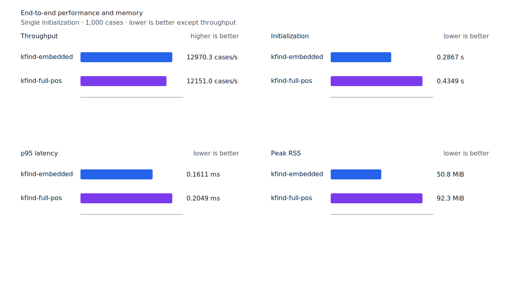
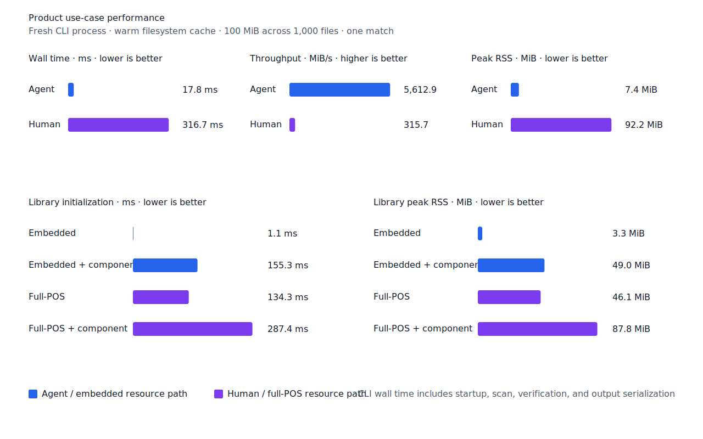

# 제한된 사전 표면형 계층

- 측정일: 2026-07-15
- 기준 revision: `8f4239617aebde5fa473a177b8ebb4d7b402e816`
- 후보 revision: `4b255828f35a17d3a5bcc9f3f3980bd9fb7cbf9e`
- 환경: Linux 6.12.76/aarch64, 10 logical CPUs, 7.7 GiB memory, Python 3.12.13,
  Rust 1.97.0, Docker
- 반복: fresh process 1회 warm-up 뒤 5회 측정의 중앙값
- test fixture: `933bc12197da866d2363d7df9107d4d9be89a65ddaafd73968ad5384832b21ff`
- development fixture: `604c3a139854fcf59570392f48ab85028785f4a3561ea3c5e702f88b841f907c`
- hard-negative fixture: `cb8634491cba65916c9af510c50f909eaddfd9bb89935598875e134a01cbce99`
- 무품사 fixture: `94ccd70a093ee7af8435371b2ffdb81534ec97e29ada705ea72c940938d0c592`
- 100 MiB corpus: `7692072cb7bff9261c1fa5933bde41b27e558170818eeac6d07cabdd673815ff`
- enriched artifact: `bf1e319157eb465868f9b71c22c97a2e4bf6fdb72c32c6d8459eea5be9c4131f`
- 기준 report SHA-256: `dd69fd0d457b75a2f1dfeb2f08d97334a42fd4435b9c5a56189f842579466041`
- 후보 report SHA-256: `0f880ceb66c3b3e4de92726d17b5d98804ff155892180382d69ce22d1ff5a069`

## 결론

완성된 사전 전체를 배포하지 않고 기존 enriched 용언 TSV에 제한된 `SurfaceOnly` 계층을
추가한다. 한국어기초사전과 표준국어대사전이 함께 지지하는 활용형 12,888개 가운데 실제
kfind 분석으로 생성되는 12,758개는 저장하지 않는다. 남은 활용형 130개와 한국어기초사전의
용언·부사 entry ID와 표면형이 양방향으로 일치하는 파생 부사 153개만 저장한다.

새 데이터는 283행, 20,791바이트 증가해 전체 TSV가 27,707바이트가 됐다. 512행과 64 KiB의
생성 상한을 모두 만족한다. 정의와 예문은 추출하지 않는다. 활용형은 기본 `inflection`에,
파생 부사는 명시적 `derivation`에만 포함한다.

개별 benchmark 단어를 예외 처리하지 않았다. 모든 `-하다` 용언과 `-스럽다`·`-답다`·`-롭다`
형용사의 기존 생산 교체 선택을 일반화했고, 그 뒤에도 생성할 수 없는 검증된 표면형만 사전
계층에 남겼다. `같다 → 같이`와 `거 → 게`처럼 두 사전 합의나 양방향 관계가 없는 항목은
추가하지 않았다.

## 데이터

| 분류 | 수량 | 배포 여부 |
| --- | ---: | --- |
| 정규화한 NIKL source record | 220,738 | report에만 기록 |
| 두 사전이 합의한 활용형 | 12,888 | 후보 집합 |
| 기존 분석·생산 규칙으로 생성 | 12,758 | 저장하지 않음 |
| 미생성 활용형 | 130 | `SurfaceOnly` 저장 |
| 양방향 용언·부사 파생 관계 | 153 | `SurfaceOnly` 저장 |

Importer는 관계의 source·target ID, 양방향 관계 종류 `파생어`, 각 entry의 실제 표제어를 모두
검증한다. Classifier는 core·enriched 분석과 실제 runtime generator를 실행해 이미 생성되는
표면형을 제거한다. `상관없다 → 상관없이`는 파생 관계로, `있다 → 있는`은 두 사전 활용 합의로
처리한다. `멋있는`의 최종 `smart` 거부는 표면형 생성이 아니라 component boundary 계약으로
분리한다.

## 품질

| fixture/profile | 기준 TP / FP / FN | 후보 TP / FP / FN | 기준 recall | 후보 recall |
| --- | ---: | ---: | ---: | ---: |
| test embedded `smart` | 416 / 0 / 84 | 418 / 0 / 82 | 83.2% | 83.6% |
| test full-POS `smart` | 423 / 0 / 77 | 425 / 0 / 75 | 84.6% | 85.0% |
| Agent embedded `any` | 481 / 11 / 19 | 482 / 11 / 18 | 96.2% | 96.4% |
| Human full-POS `smart` | 419 / 0 / 81 | 420 / 0 / 80 | 83.8% | 84.0% |
| development embedded `smart` | 442 / 2 / 58 | 442 / 2 / 58 | 88.4% | 88.4% |
| development full-POS `smart` | 443 / 2 / 57 | 443 / 2 / 57 | 88.6% | 88.6% |

일반화한 생산 교체가 test에서 `이리하다/VA → 이리하여`, `급하다/VA → 급해질`을 복구했다.
Human fixture에서는 `급하다`를 복구했다. 22개 hard-negative의 기존 FP 4건은 그대로였고 신규
FP는 없다. fixture, gold와 negative 선택은 바꾸지 않았다.




## 성능

각 값은 `median [min, max]`다. RSS 단위는 KiB다.

| workload | 지표 | 기준 | 후보 | 증감 |
| --- | --- | ---: | ---: | ---: |
| Agent morphology | cases/s | 14,718.0 [14,688.5, 14,743.1] | 14,563.8 [14,113.9, 14,589.8] | -1.05% |
| Agent morphology | p95 | 0.1533 ms [0.1522, 0.1542] | 0.1558 ms [0.1539, 0.1639] | +1.63% |
| Agent morphology | peak RSS | 5,248 [5,236, 5,252] | 5,316 [5,312, 5,320] | +1.30% |
| Human morphology | cases/s | 10,635.3 [10,351.9, 10,646.5] | 10,478.9 [10,077.5, 10,551.0] | -1.47% |
| Human morphology | p95 | 0.2279 ms [0.2260, 0.2336] | 0.2325 ms [0.2314, 0.2398] | +2.02% |
| Human morphology | peak RSS | 94,036 [94,020, 94,036] | 94,468 [94,400, 94,504] | +0.46% |
| Agent 100 MiB CLI | wall | 0.017271 s [0.016017, 0.019144] | 0.017816 s [0.015815, 0.018683] | +3.16% |
| Human 100 MiB CLI | wall | 0.312516 s [0.311708, 0.325394] | 0.316737 s [0.313738, 0.352540] | +1.35% |

Agent morphology cases/s는 측정 범위가 겹치지 않고 1.05% 낮아졌다. Human morphology와 두 CLI
wall 범위는 겹친다. Isolated full-POS 초기화는 0.134079초에서 0.134310초로 0.17% 늘어 범위가
겹쳤고, peak RSS는 46,804 KiB에서 47,252 KiB로 448 KiB 증가했다. TSV 20.3 KiB 증가를 포함한
관측 비용으로 기록한다.





## 재현

두 image를 같은 host에서 연속 측정했다.

```console
KFIND_MORPH_IMAGE=kfind-morph-benchmark:dict-fn-baseline-8f42396 \
  KFIND_MORPH_RUNS=5 \
  scripts/benchmark-morphology.sh target/morph-benchmark-dict-fn-baseline

KFIND_MORPH_IMAGE=kfind-morph-benchmark:dictionary-surface-4b25582 \
  KFIND_MORPH_RUNS=5 \
  scripts/benchmark-morphology.sh target/morph-benchmark-dictionary-surface-4b25582

python3 tools/morph-compare/render_charts.py \
  target/morph-benchmark-dictionary-surface-4b25582/report.json \
  docs/benchmarks/assets --prefix 2026-07-15-dictionary-surface-
```

외부 분석기 snapshot은 fixture, adapter schema와 고정 버전·설정이 바뀌지 않아 갱신하지 않았다.
