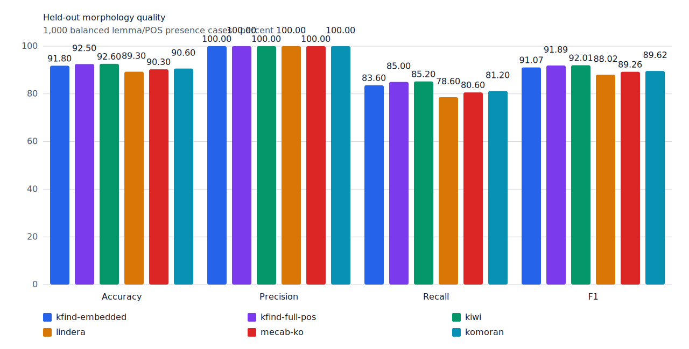
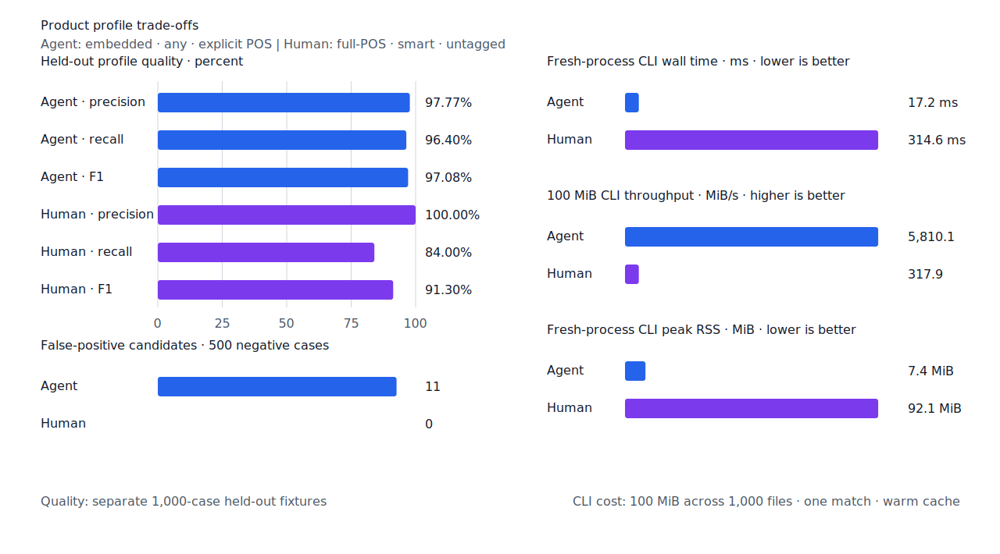
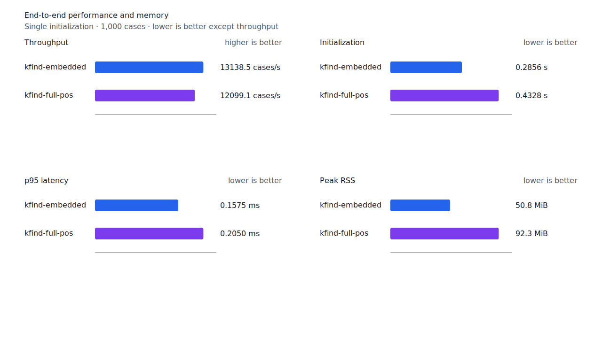
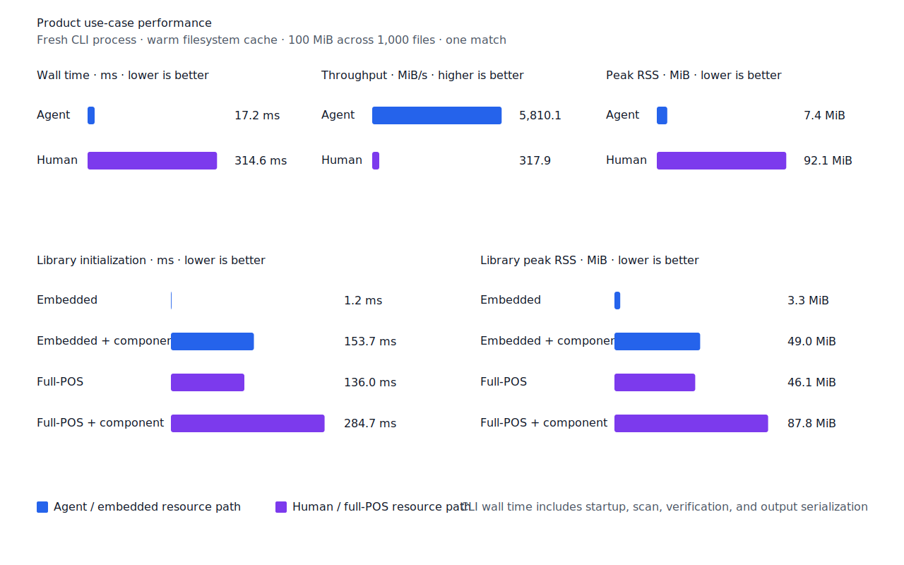

# 선어말어미 뒤 `-으되` continuation

- 측정일: 2026-07-15
- 기준 revision: `7e5847428230871a8d7876a308945de8bd616d87`
- 후보 revision: `0ceb458659dd86f9b3cfe2c5eb06938980b8fb76`
- 환경: Linux 6.12.76/aarch64, 10 logical CPUs, 7.7 GiB memory, Python 3.12.13,
  Rust 1.97.0, Docker 29.6.1
- 반복: fresh process 1회 warm-up 뒤 5회 측정의 중앙값
- test fixture: `933bc12197da866d2363d7df9107d4d9be89a65ddaafd73968ad5384832b21ff`
- development fixture: `604c3a139854fcf59570392f48ab85028785f4a3561ea3c5e702f88b841f907c`
- hard-negative fixture: `cb8634491cba65916c9af510c50f909eaddfd9bb89935598875e134a01cbce99`
- 무품사 fixture: `94ccd70a093ee7af8435371b2ffdb81534ec97e29ada705ea72c940938d0c592`
- 100 MiB corpus: `7692072cb7bff9261c1fa5933bde41b27e558170818eeac6d07cabdd673815ff`
- 회귀 fixture: `72039a686d2e520f2975f598d08b30a0cf96a6e9dcd961159513abc1749e0ebc`
- 기준 report SHA-256: `f2b419435134f4d9287fd458e1b9fa7961a7ff84dd713485a4d3ce82e16e728f`
- 후보 report SHA-256: `b2d30bd53afe8ec429dcc8df89402005505611f7499e22212327074b16d4190d`

## 결론

`ending.past`와 `ending.future` verifier state가 `으되`를 소비하도록
`ending.connective-eudoe`를 추가했다. bare stem에는 이 어미를 직접 붙이지 않는다.
[한국어기초사전 `-으되`](https://krdict.korean.go.kr/kor/dicSearch/SearchView?ParaWordNo=80291)는
`-었-`, `-겠-` 뒤에 붙는 결합을 제시하고, Korean-Kaist development의 원문 분석도
`치르+었+으되`다. 이 독립 근거에 따라 `치렀으되`와 `하겠으되`를 positive로,
`치렀으데`와 `하겠으데`를 negative로 고정했다.

development에서 `치르다 -> 치렀으되`를 복구해 embedded와 full-POS `smart`의 FN이 각각
1건 줄었다. 고정 test, Agent, Human과 hard-negative는 바뀌지 않았다.

## 품질

| fixture/profile | 기준 TP / FP / FN | 후보 TP / FP / FN | 기준 recall | 후보 recall |
| --- | ---: | ---: | ---: | ---: |
| development embedded `smart` | 442 / 2 / 58 | 443 / 2 / 57 | 88.4% | 88.6% |
| development full-POS `smart` | 443 / 2 / 57 | 444 / 2 / 56 | 88.6% | 88.8% |
| test embedded `smart` | 418 / 0 / 82 | 418 / 0 / 82 | 83.6% | 83.6% |
| test full-POS `smart` | 425 / 0 / 75 | 425 / 0 / 75 | 85.0% | 85.0% |
| Agent embedded `any` | 482 / 11 / 18 | 482 / 11 / 18 | 96.4% | 96.4% |
| Human full-POS `smart` | 420 / 0 / 80 | 420 / 0 / 80 | 84.0% | 84.0% |

두 development profile의 precision은 99.55%다. 22개 hard-negative의 기존 FP 4건은
그대로이고 신규 FP는 없다. fixture, gold와 negative 선택은 바꾸지 않았다.





## 성능

각 값은 `median [min, max]`다. RSS 단위는 KiB다.

| workload | 지표 | 기준 | 후보 | 증감 |
| --- | --- | ---: | ---: | ---: |
| embedded `smart` | cases/s | 13,197.7 [12,888.0, 13,216.8] | 13,138.5 [13,125.4, 13,191.0] | -0.45% |
| embedded `smart` | p95 | 0.1584 ms [0.1569, 0.1652] | 0.1575 ms [0.1560, 0.1590] | -0.57% |
| embedded `smart` | peak RSS | 52,052 [52,036, 52,056] | 52,052 [52,044, 52,060] | 0.00% |
| full-POS `smart` | cases/s | 12,139.4 [11,558.4, 12,217.9] | 12,099.1 [11,143.9, 12,134.3] | -0.33% |
| full-POS `smart` | p95 | 0.2029 ms [0.2014, 0.2180] | 0.2050 ms [0.2027, 0.2207] | +1.03% |
| full-POS `smart` | peak RSS | 94,384 [94,376, 94,448] | 94,468 [94,388, 94,484] | +0.09% |
| Agent morphology | cases/s | 14,540.1 [14,423.6, 14,596.8] | 14,450.3 [14,357.5, 14,488.1] | -0.62% |
| Human morphology | cases/s | 10,515.8 [10,393.6, 10,533.3] | 10,439.8 [10,125.8, 10,503.8] | -0.72% |
| Agent 100 MiB CLI | wall | 0.018257 s [0.016960, 0.019179] | 0.017212 s [0.016317, 0.018781] | -5.72% |
| Human 100 MiB CLI | wall | 0.314388 s [0.312178, 0.316396] | 0.314590 s [0.312711, 0.323286] | +0.06% |

모든 처리량, p95와 CLI wall 측정 범위가 기준선과 겹친다. 규칙 추가에 따른 성능 회귀는
관측되지 않았다. local lattice의 제품 판정은 4.3956 us, 진단 보고서는 10.462 us였고,
morphology index의 exact·prefix equivalence checksum도 유지됐다.





## 재현

두 image를 같은 host에서 연속 측정했다.

```console
KFIND_MORPH_IMAGE=kfind-morph-benchmark:fn-main-7e58474 \
  KFIND_MORPH_RUNS=5 \
  scripts/benchmark-morphology.sh target/morph-benchmark-fn-main-7e58474

KFIND_MORPH_IMAGE=kfind-morph-benchmark:eudoe-candidate-0ceb458 \
  KFIND_MORPH_RUNS=5 \
  scripts/benchmark-morphology.sh target/morph-benchmark-eudoe-candidate-0ceb458

scripts/benchmark-criterion.sh local_lattice
scripts/benchmark-morph-index.sh

python3 tools/morph-compare/render_charts.py \
  target/morph-benchmark-eudoe-candidate-0ceb458/report.json \
  docs/benchmarks/assets --prefix 2026-07-15-eudoe-continuation-
```

외부 분석기 snapshot은 fixture, adapter schema와 고정 버전·설정이 바뀌지 않아 갱신하지 않았다.
