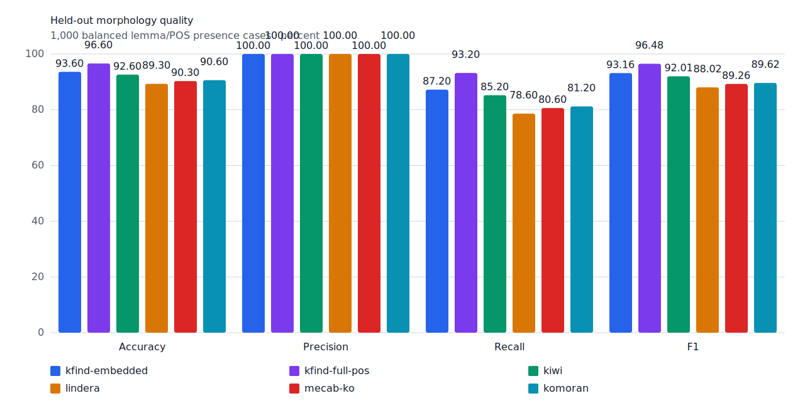
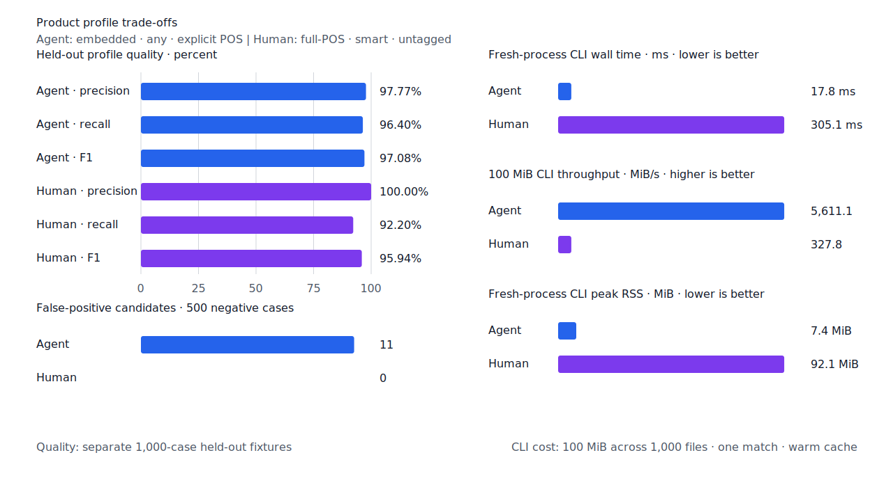
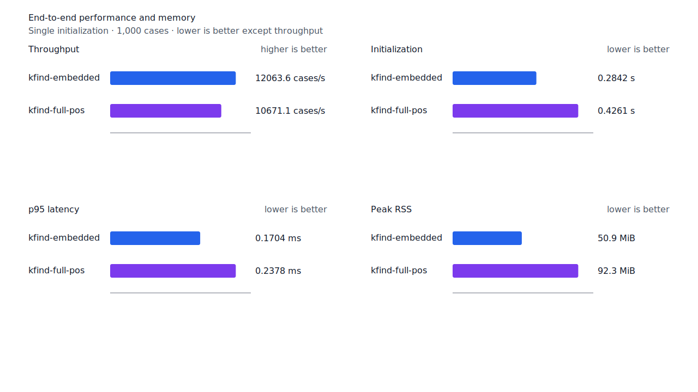
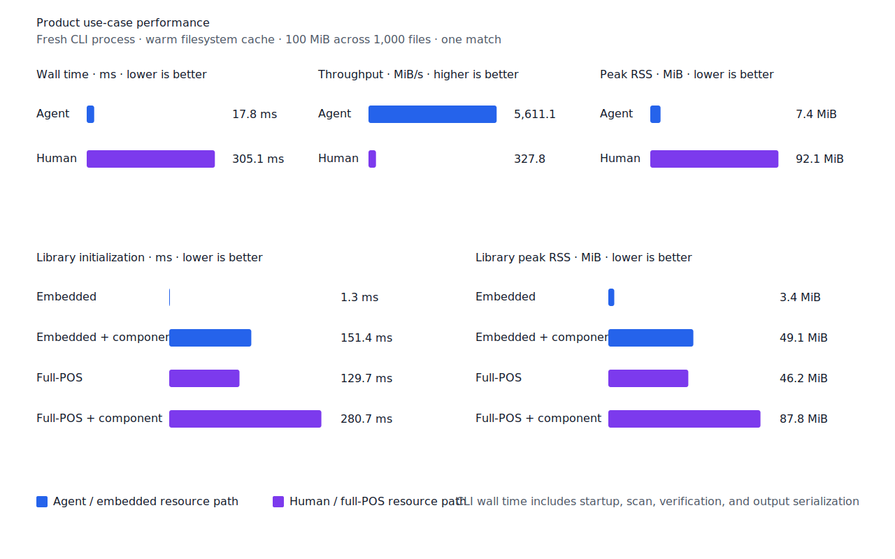

# Exact component 비용 마진

- 측정일: 2026-07-15
- 기준 revision: `7eadb69fc7e46bbf5ea0111143351a576c234504`
- 후보 revision: `699503bd45581018271f231cc88fa6b2acf4b0d6`
- 환경: Linux 6.12.76/aarch64, 10 logical CPUs, Python 3.12.13, Rust 1.97.0,
  Docker 29.6.1
- 반복: fresh process 1회 warm-up 뒤 5회 측정의 중앙값
- test fixture: `933bc12197da866d2363d7df9107d4d9be89a65ddaafd73968ad5384832b21ff`
- development fixture: `604c3a139854fcf59570392f48ab85028785f4a3561ea3c5e702f88b841f907c`
- hard-negative fixture: `cb8634491cba65916c9af510c50f909eaddfd9bb89935598875e134a01cbce99`
- 무품사 fixture: `94ccd70a093ee7af8435371b2ffdb81534ec97e29ada705ea72c940938d0c592`
- 100 MiB corpus: `7692072cb7bff9261c1fa5933bde41b27e558170818eeac6d07cabdd673815ff`
- 기준 report SHA-256: `f46dfb867331bdcad4dfbf34754160ce974aaae18b003e4768ee17202c2155d4`
- 후보 report SHA-256: `d7896654d926bbe27181b53f54bba824dcc1a5479e2ec7c193f6573873e2bd87`

## 결론

제품 `ExactComponent`는 query와 같은 fine POS의 exact node를 포함한 완전 경로가 최저 제외
경로보다 형태 분석 비용 1,500 이하로 높으면 `smart` 경계를 복구한다. 형태 분석기의 원시
`accept`·`reject`·`ambiguous` 판정과 진단 경로는 바꾸지 않는다. 제품 판정도 include/exclude
최저 비용만 계산하며 N-best 경로를 만들지 않는다.

lexical context registry에 등록된 whole-token surface는 bounded 문맥 판정을 우선한다. 문맥이
결정되지 않으면 비용 마진으로 다른 분석을 다시 열지 않고 원시 `accept`만 따른다. 이에 따라
`매일`의 부사·명사·지정사 문맥 구분은 유지한다.

마진은 development와 hard-negative에서 고정했다. development의 복구 대상 다섯 건은 비용 차이
64, 190, 269, 412, 1,267에 있었고, 가장 가까운 새 negative는 2,211이었다. 1,500은 이 둘을
분리하고 비표준 학습자 표면형인 `비싼다`의 1,756도 열지 않는다. 특정 표제어·문장·case ID는
제품 조건에 사용하지 않았다.

## 품질

| fixture/profile | 기준 TP / FP / FN | 후보 TP / FP / FN | 기준 recall | 후보 recall |
| --- | ---: | ---: | ---: | ---: |
| development embedded `smart` | 459 / 2 / 41 | 461 / 2 / 39 | 91.8% | 92.2% |
| development full-POS `smart` | 470 / 2 / 30 | 475 / 2 / 25 | 94.0% | 95.0% |
| test embedded `smart` | 429 / 0 / 71 | 436 / 0 / 64 | 85.8% | 87.2% |
| test full-POS `smart` | 456 / 0 / 44 | 466 / 0 / 34 | 91.2% | 93.2% |
| Agent embedded `any` | 482 / 11 / 18 | 482 / 11 / 18 | 96.4% | 96.4% |
| Human full-POS `smart` | 451 / 0 / 49 | 461 / 0 / 39 | 90.2% | 92.2% |

development full-POS `smart`는 `이루다 -> 이루어지지`, `비추다 -> 비춰볼`,
`빼다 -> 빼놓을`, `건전 -> 건전한`, `속 -> 산속에` 다섯 건을 복구했다. test와 Human은
`두렵다`, `어둡다`, `공동`, `재미`, `전`, `저`, `정부`, `오다`, `온난화`, `광고` 열 건을
추가로 복구했다. 세 fixture 모두 새 FP와 기존 TP 회귀는 없다. 22개 hard-negative의 기존 FP
4건도 그대로다.





## 성능

각 값은 `median [min, max]`다. RSS 단위는 KiB다.

| workload | 지표 | 기준 | 후보 | 증감 |
| --- | --- | ---: | ---: | ---: |
| embedded `smart` | initialization | 0.280539 s [0.280127, 0.282583] | 0.284203 s [0.282939, 0.285664] | +1.31% |
| embedded `smart` | cases/s | 12,133.5 [7,705.5, 12,179.3] | 12,063.6 [11,866.0, 12,102.5] | -0.58% |
| embedded `smart` | p95 | 0.1704 ms [0.1673, 0.3662] | 0.1704 ms [0.1689, 0.1807] | 0.00% |
| embedded `smart` | peak RSS | 52,080 [52,072, 52,084] | 52,088 [52,084, 52,088] | +0.02% |
| full-POS `smart` | initialization | 0.422799 s [0.421414, 0.424014] | 0.426139 s [0.424155, 0.430870] | +0.79% |
| full-POS `smart` | cases/s | 10,596.3 [10,454.0, 10,681.2] | 10,671.1 [10,504.7, 10,705.8] | +0.71% |
| full-POS `smart` | p95 | 0.2392 ms [0.2347, 0.2415] | 0.2378 ms [0.2368, 0.2409] | -0.59% |
| full-POS `smart` | peak RSS | 94,564 [94,556, 94,564] | 94,552 [94,552, 94,564] | -0.01% |
| Agent morphology | cases/s | 13,290.2 [12,997.4, 13,490.4] | 13,438.8 [12,646.7, 13,474.8] | +1.12% |
| Agent morphology | p95 | 0.1672 ms [0.1649, 0.1750] | 0.1687 ms [0.1645, 0.1830] | +0.90% |
| Human morphology | cases/s | 9,170.7 [8,697.7, 9,257.9] | 8,920.6 [5,735.2, 8,992.7] | -2.73% |
| Human morphology | p95 | 0.2901 ms [0.2873, 0.2950] | 0.2990 ms [0.2947, 0.5474] | +3.07% |
| Agent 100 MiB CLI | wall | 0.017295 s [0.016169, 0.021176] | 0.017822 s [0.017224, 0.018709] | +3.05% |
| Human 100 MiB CLI | wall | 0.302880 s [0.302071, 0.315105] | 0.305081 s [0.303787, 0.313586] | +0.73% |

Human morphology 처리량은 2.73% 낮고 p95는 3.07% 높았다. Agent CLI wall은 3.05% 높았다.
모든 중앙값 지표가 10% 경고선 안이며 성능 불변을 주장하지 않는다. full-POS component 포함
초기화는 0.276130초에서 0.280692초로 1.65% 높았고 RSS는 89,936 KiB로 같았다.

local lattice Criterion p95는 경량 판정이 4.4888 us에서 4.5596 us로 1.58%, 진단 report가
10.3211 us에서 10.7280 us로 3.94% 높아져 10% 회귀 기준을 통과했다. morphology artifact와
index 구현은 바뀌지 않아 morphology index benchmark는 다시 실행하지 않았다.





## 재현

```console
git switch --detach 7eadb69fc7e46bbf5ea0111143351a576c234504
KFIND_MORPH_IMAGE=kfind-morph-benchmark:component-margin-baseline-7eadb69 \
  scripts/benchmark-morphology.sh target/morph-benchmark-component-margin-baseline-7eadb69
scripts/benchmark-criterion.sh local_lattice

git switch --detach 699503bd45581018271f231cc88fa6b2acf4b0d6
KFIND_MORPH_IMAGE=kfind-morph-benchmark:component-margin-candidate-699503b \
  scripts/benchmark-morphology.sh target/morph-benchmark-component-margin-candidate-699503b
scripts/benchmark-criterion.sh local_lattice

python3 tools/morph-compare/render_charts.py \
  target/morph-benchmark-component-margin-candidate-699503b/report.json \
  docs/benchmarks/assets \
  --prefix 2026-07-15-exact-component-cost-margin-

python3 tools/morph-compare/export_site_snapshot.py \
  target/morph-benchmark-component-margin-candidate-699503b/report.json \
  docs/benchmarks/site-morphology.json \
  --revision 699503bd4558
```

외부 분석기 snapshot은 fixture, adapter schema와 고정 버전·설정이 바뀌지 않아 갱신하지 않았다.
