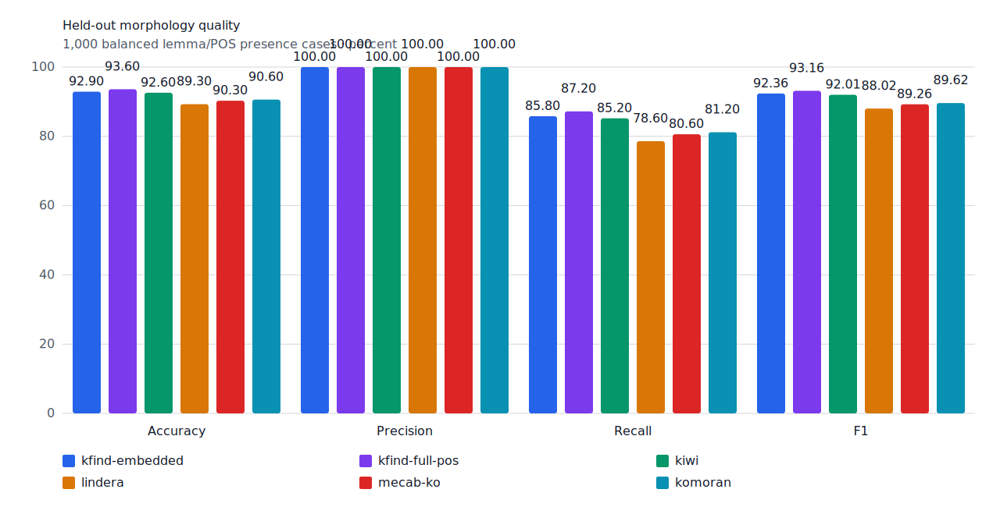
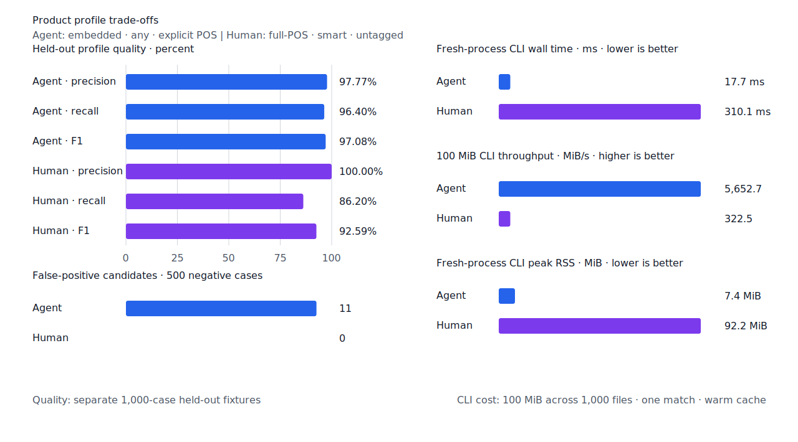
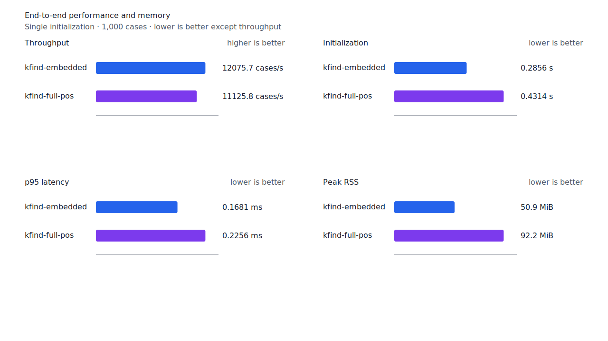
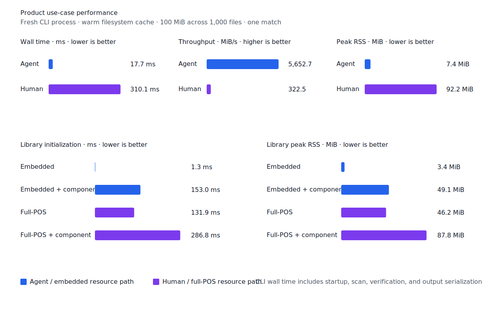

# Exact component 품사 확장

- 측정일: 2026-07-15
- 기준 revision: `dae9a3d55a7d31c0f7c19feb164c79912f93160a`
- 후보 revision: `755e5e41df7198aa49ec596e5b89d42f6fc9cb01`
- 구현 commit: `48fb05cbd79beb3ccb7437749b93a440d99e314d`
- 환경: Linux 6.12.76/aarch64, 10 logical CPUs, Python 3.12.13, Rust 1.97.0,
  Docker 29.6.1
- 반복: fresh process 1회 warm-up 뒤 5회 측정의 중앙값
- test fixture: `933bc12197da866d2363d7df9107d4d9be89a65ddaafd73968ad5384832b21ff`
- development fixture: `604c3a139854fcf59570392f48ab85028785f4a3561ea3c5e702f88b841f907c`
- hard-negative fixture: `cb8634491cba65916c9af510c50f909eaddfd9bb89935598875e134a01cbce99`
- 무품사 fixture: `94ccd70a093ee7af8435371b2ffdb81534ec97e29ada705ea72c940938d0c592`
- 100 MiB corpus: `7692072cb7bff9261c1fa5933bde41b27e558170818eeac6d07cabdd673815ff`
- 기준 report SHA-256: `c4acd637bf9d5a1807ca30b8a7722b1e5cd90e1e1ccb49357f369fe8085c6312`
- 후보 report SHA-256: `ea384c695089060f3405072fe33e72812542f51d3237e924c6320c7850fd6380`

## 결론

`smart`의 exact component 판정을 명사에서 대명사·수사·관형사까지 확장했다. 문자열 경계가
거부한 candidate라도 query branch와 같은 fine POS의 component가 query span과 정확히 일치하고
최저 비용 경로에 있을 때만 복구한다. 용언·부사·감탄사에는 적용하지 않으며, 조사 verifier가
소비하지 못한 이형태 suffix를 거부하는 계약은 `NominalParticles` branch에 유지한다.

development에서는 대명사 6건(`아무`, `자기`, `무엇`, `거기`, `그녀`, `여기`), 수사 4건
(`둘`, `하나`, `다섯`, `천`), 관형사 2건(`이`, `두`)을 복구했다. 완전한 component 근거가
없거나 다른 품사의 더 큰 component에 포함된 `전자기견해 -> 자기`, `아들둘레 -> 둘`,
`모두사람 -> 두` 대조군은 제품 gold fixture에서 거부한다.

## 품질

| fixture/profile | 기준 TP / FP / FN | 후보 TP / FP / FN | 기준 recall | 후보 recall |
| --- | ---: | ---: | ---: | ---: |
| development embedded `smart` | 447 / 2 / 53 | 459 / 2 / 41 | 89.4% | 91.8% |
| development full-POS `smart` | 448 / 2 / 52 | 460 / 2 / 40 | 89.6% | 92.0% |
| test embedded `smart` | 419 / 0 / 81 | 429 / 0 / 71 | 83.8% | 85.8% |
| test full-POS `smart` | 426 / 0 / 74 | 436 / 0 / 64 | 85.2% | 87.2% |
| Agent embedded `any` | 482 / 11 / 18 | 482 / 11 / 18 | 96.4% | 96.4% |
| Human full-POS `smart` | 421 / 0 / 79 | 431 / 0 / 69 | 84.2% | 86.2% |

development full-POS `smart` precision은 99.56%에서 99.57%로 바뀌었다. 22개 hard-negative의
기존 FP 4건은 그대로이고 신규 FP는 없다. Agent 경로는 `any`라 품질이 변하지 않았으며,
test와 Human fixture에서도 FP 증가 없이 FN이 각각 10건 줄었다.





## 성능

각 값은 `median [min, max]`다. RSS 단위는 KiB다.

| workload | 지표 | 기준 | 후보 | 증감 |
| --- | --- | ---: | ---: | ---: |
| embedded `smart` | initialization | 0.286671 s [0.286108, 0.292477] | 0.285625 s [0.284619, 0.287025] | -0.36% |
| embedded `smart` | cases/s | 12,317.6 [12,077.6, 12,341.7] | 12,075.7 [11,966.9, 12,149.5] | -1.96% |
| embedded `smart` | p95 | 0.1711 ms [0.1654, 0.1753] | 0.1681 ms [0.1647, 0.1728] | -1.75% |
| embedded `smart` | peak RSS | 52,072 [52,052, 52,076] | 52,080 [52,068, 52,084] | +0.02% |
| full-POS `smart` | initialization | 0.433893 s [0.431731, 0.449479] | 0.431426 s [0.430385, 0.432533] | -0.57% |
| full-POS `smart` | cases/s | 11,313.4 [10,839.7, 11,353.7] | 11,125.8 [8,820.0, 11,143.3] | -1.66% |
| full-POS `smart` | p95 | 0.2269 ms [0.2245, 0.2349] | 0.2256 ms [0.2247, 0.3065] | -0.57% |
| full-POS `smart` | peak RSS | 94,508 [94,460, 94,524] | 94,460 [94,452, 94,524] | -0.05% |
| Agent morphology | initialization | 0.001404 s [0.001399, 0.001404] | 0.001302 s [0.001295, 0.001316] | -7.26% |
| Agent morphology | cases/s | 12,883.1 [12,795.8, 13,483.9] | 13,477.1 [13,382.0, 13,497.9] | +4.61% |
| Agent morphology | p95 | 0.1740 ms [0.1644, 0.1766] | 0.1667 ms [0.1663, 0.1680] | -4.20% |
| Agent morphology | peak RSS | 5,332 [5,316, 5,332] | 5,328 [5,324, 5,336] | -0.08% |
| Human morphology | initialization | 0.438350 s [0.434119, 0.447535] | 0.433654 s [0.430349, 0.433983] | -1.07% |
| Human morphology | cases/s | 9,524.8 [9,027.4, 9,770.4] | 9,669.4 [9,387.7, 9,695.3] | +1.52% |
| Human morphology | p95 | 0.2523 ms [0.2481, 0.2661] | 0.2486 ms [0.2475, 0.2565] | -1.47% |
| Human morphology | peak RSS | 94,540 [94,468, 94,544] | 94,540 [94,480, 94,544] | 0.00% |
| Agent 100 MiB CLI | wall | 0.016747 s [0.016587, 0.017250] | 0.017691 s [0.015589, 0.018560] | +5.64% |
| Human 100 MiB CLI | wall | 0.309423 s [0.308407, 0.310705] | 0.310103 s [0.308658, 0.319596] | +0.22% |

embedded와 full-POS `smart`의 처리량은 각각 1.96%, 1.66% 낮았고 p95는 각각 1.75%, 0.57%
낮았다. full-POS 후보 1회에서 처리량과 p95 outlier가 있었으나 중앙값과 다른 4회는 기준 범위와
겹친다. Agent CLI wall은 5.64%, Human CLI wall은 0.22% 높아 20.4절의 10% 경고선 안이다.
initialization과 RSS 변화도 경고선 안이며 성능 불변을 주장하지 않는다.

local lattice Criterion p95는 제품 판정이 기준 4.5145 us에서 후보 4.6366 us로 2.70%, 진단
report가 10.2920 us에서 10.5650 us로 2.65% 높아져 10% 회귀 기준을 통과했다. morphology
artifact와 index 구현은 바뀌지 않아 morphology index benchmark는 다시 실행하지 않았다.





## 재현

```console
git switch --detach dae9a3d55a7d31c0f7c19feb164c79912f93160a
scripts/benchmark-morphology.sh target/morph-baseline-main-dae9a3d
scripts/benchmark-criterion.sh local_lattice

git switch --detach 755e5e41df7198aa49ec596e5b89d42f6fc9cb01
scripts/benchmark-morphology.sh target/morph-candidate-755e5e4
scripts/benchmark-criterion.sh local_lattice

python3 tools/morph-compare/render_charts.py \
  target/morph-candidate-755e5e4/report.json \
  docs/benchmarks/assets \
  --prefix 2026-07-15-exact-component-pos-

python3 tools/morph-compare/export_site_snapshot.py \
  target/morph-candidate-755e5e4/report.json \
  docs/benchmarks/site-morphology.json \
  --revision 755e5e41df71
```

외부 분석기 snapshot은 fixture, adapter schema와 고정 버전·설정이 바뀌지 않아 갱신하지 않았다.
