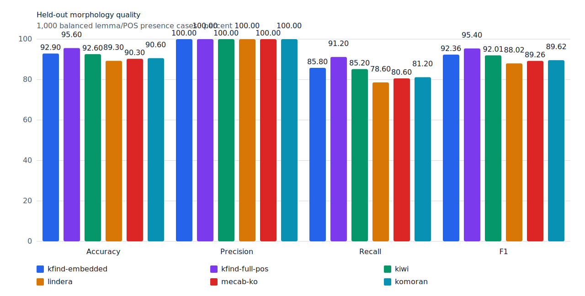
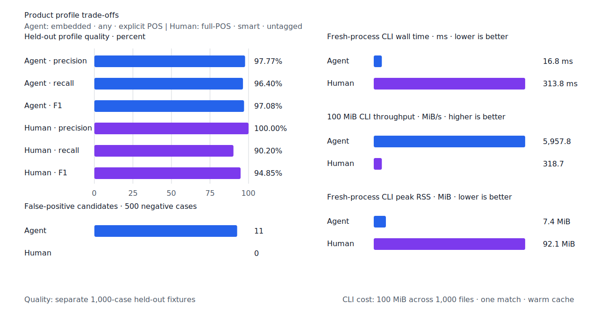
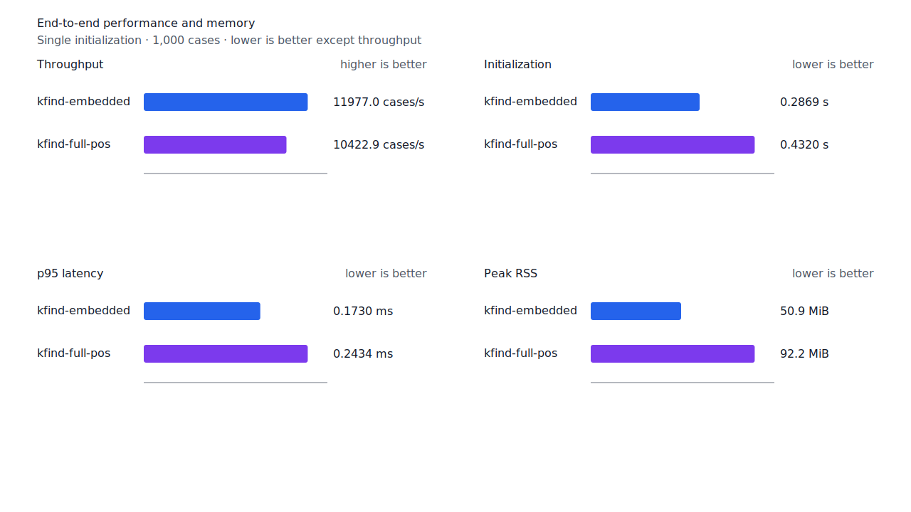
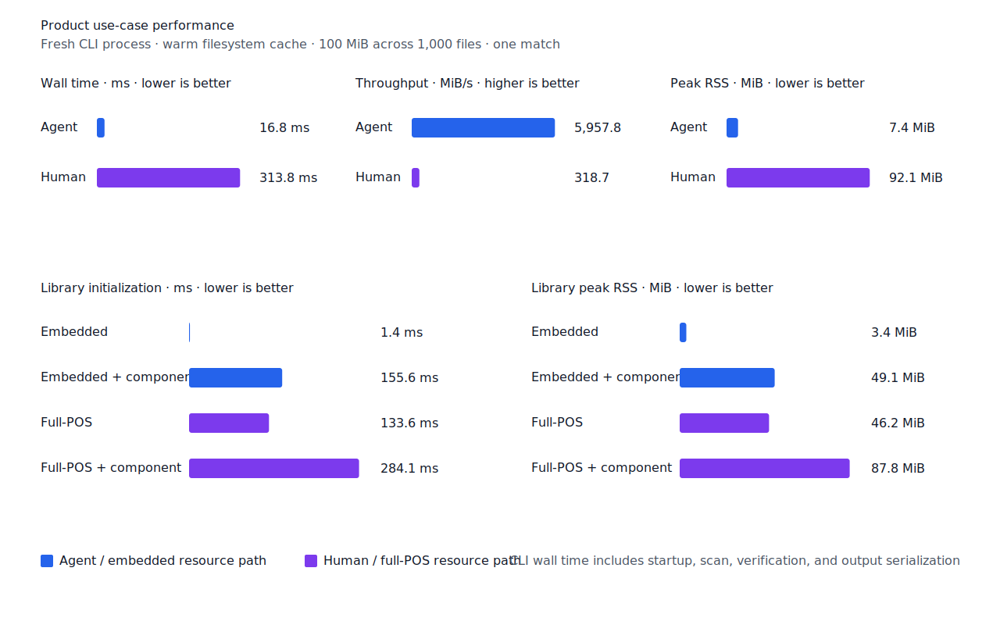

# Full-POS 용언 exact component 확장

- 측정일: 2026-07-15
- 기준 revision: `eadbad1b50ce0184895dd961b20b39df25dfd6f4`
- 후보 revision: `51b797a7a142190a3b0c4b9fabb052b4dfc5df5c`
- 환경: Linux 6.12.76/aarch64, 10 logical CPUs, Python 3.12.13, Rust 1.97.0,
  Docker 29.6.1
- 반복: fresh process 1회 warm-up 뒤 5회 측정의 중앙값
- test fixture: `933bc12197da866d2363d7df9107d4d9be89a65ddaafd73968ad5384832b21ff`
- development fixture: `604c3a139854fcf59570392f48ab85028785f4a3561ea3c5e702f88b841f907c`
- hard-negative fixture: `cb8634491cba65916c9af510c50f909eaddfd9bb89935598875e134a01cbce99`
- 무품사 fixture: `94ccd70a093ee7af8435371b2ffdb81534ec97e29ada705ea72c940938d0c592`
- 100 MiB corpus: `7692072cb7bff9261c1fa5933bde41b27e558170818eeac6d07cabdd673815ff`
- 기준 report SHA-256: `6bb6bda7e971fe6e346bf2befb358a2f00d760520d4da857f6bbcabdc78b2740`
- 후보 report SHA-256: `2aaabcaab9524ef0ea3af2d74b544d6716ec8ffd68f443618af5b2c07b460989`

## 결론

full-POS가 로드된 `smart` 동사·형용사 branch에 exact component 판정을 적용했다. predicate
verifier가 활용과 continuation을 소비한 뒤 query와 같은 fine POS의 어간 core가 최저 비용
component 경로에 있을 때만 문자열 왼쪽 경계를 복구한다. 지정사는 기존 `PredicateLexical`
계약을 유지한다.

embedded `smart` 용언은 resource 요구와 결과를 바꾸지 않는다. 따라서 resource 없는 Rust/WASM
기본 engine과 Agent `embedded + any` 경로는 기존 계약을 유지한다. 명사형 `-기/-ㅁ/음` 뒤에는
predicate token 다음에 남은 조사 이형태를 다시 검사해 `걷기이`, `걷기을`, `걷기가를`을
거부한다.

## 품질

| fixture/profile | 기준 TP / FP / FN | 후보 TP / FP / FN | 기준 recall | 후보 recall |
| --- | ---: | ---: | ---: | ---: |
| development embedded `smart` | 459 / 2 / 41 | 459 / 2 / 41 | 91.8% | 91.8% |
| development full-POS `smart` | 460 / 2 / 40 | 470 / 2 / 30 | 92.0% | 94.0% |
| test embedded `smart` | 429 / 0 / 71 | 429 / 0 / 71 | 85.8% | 85.8% |
| test full-POS `smart` | 436 / 0 / 64 | 456 / 0 / 44 | 87.2% | 91.2% |
| Agent embedded `any` | 482 / 11 / 18 | 482 / 11 / 18 | 96.4% | 96.4% |
| Human full-POS `smart` | 431 / 0 / 69 | 451 / 0 / 49 | 86.2% | 90.2% |

development full-POS `smart`는 `소리치지요`, `좋았을텐데요`, `커지자`, `엮어내`,
`가르칠수있는`, `없지는`, `버스타고`, `낚지못한다`, `생겨버렸다`, `뒤어돌아갈` 10건을
복구했다. 새 development failure는 없다. test와 Human은 FP 증가 없이 FN이 각각 20건 줄었다.
22개 hard-negative의 기존 FP 4건은 그대로이고 `nominalizer-particle` 4건은 모두 TN이다.





## 성능

각 값은 `median [min, max]`다. RSS 단위는 KiB다.

| workload | 지표 | 기준 | 후보 | 증감 |
| --- | --- | ---: | ---: | ---: |
| embedded `smart` | initialization | 0.287375 s [0.286184, 0.288650] | 0.286896 s [0.285630, 0.299110] | -0.17% |
| embedded `smart` | cases/s | 12,091.6 [11,791.4, 12,125.8] | 11,977.0 [11,518.6, 12,058.4] | -0.95% |
| embedded `smart` | p95 | 0.1687 ms [0.1658, 0.1747] | 0.1730 ms [0.1705, 0.1767] | +2.55% |
| embedded `smart` | peak RSS | 52,080 [52,076, 52,080] | 52,080 [52,064, 52,084] | 0.00% |
| full-POS `smart` | initialization | 0.433390 s [0.431158, 0.434590] | 0.431990 s [0.429556, 0.443808] | -0.32% |
| full-POS `smart` | cases/s | 11,104.7 [10,528.2, 11,133.6] | 10,422.9 [10,351.8, 10,633.1] | -6.14% |
| full-POS `smart` | p95 | 0.2270 ms [0.2240, 0.2377] | 0.2434 ms [0.2368, 0.2446] | +7.22% |
| full-POS `smart` | peak RSS | 94,456 [94,440, 94,540] | 94,460 [94,456, 94,556] | +0.00% |
| Agent morphology | cases/s | 13,474.7 [13,444.3, 13,480.9] | 13,442.9 [13,425.7, 13,493.3] | -0.24% |
| Agent morphology | p95 | 0.1663 ms [0.1625, 0.1670] | 0.1665 ms [0.1621, 0.1670] | +0.12% |
| Human morphology | cases/s | 9,669.4 [9,664.5, 9,680.3] | 9,211.7 [8,452.4, 9,222.7] | -4.73% |
| Human morphology | p95 | 0.2479 ms [0.2462, 0.2481] | 0.2884 ms [0.2861, 0.3038] | +16.34% |
| Agent 100 MiB CLI | wall | 0.017491 s [0.016907, 0.018175] | 0.016785 s [0.016249, 0.017861] | -4.04% |
| Human 100 MiB CLI | wall | 0.319335 s [0.311802, 0.344649] | 0.313760 s [0.311791, 0.317638] | -1.75% |

full-POS explicit-POS와 Human morphology는 실제로 늘어난 component 판정 비용을 보였다. Human
p95는 16.34% 높았으며 성능 불변을 주장하지 않는다. 실제 100 MiB Human CLI wall은 1.75%
낮았고 initialization과 RSS는 안정적이었다.

local lattice Criterion p95는 제품 판정이 4.4063 us에서 4.4918 us로 1.94%, 진단 report가
10.3683 us에서 10.3775 us로 0.09% 높아져 10% 회귀 기준을 통과했다. morphology artifact와
index 구현은 바뀌지 않아 morphology index benchmark는 다시 실행하지 않았다.





## 재현

```console
git switch --detach eadbad1b50ce0184895dd961b20b39df25dfd6f4
scripts/benchmark-morphology.sh target/morph-benchmark-baseline
scripts/benchmark-criterion.sh local_lattice

git switch --detach 51b797a7a142190a3b0c4b9fabb052b4dfc5df5c
scripts/benchmark-morphology.sh target/morph-benchmark-predicate-component-profiled
scripts/benchmark-criterion.sh local_lattice

python3 tools/morph-compare/render_charts.py \
  target/morph-benchmark-predicate-component-profiled/report.json \
  docs/benchmarks/assets \
  --prefix 2026-07-15-predicate-exact-component-

python3 tools/morph-compare/export_site_snapshot.py \
  target/morph-benchmark-predicate-component-profiled/report.json \
  docs/benchmarks/site-morphology.json \
  --revision 51b797a7a142
```

외부 분석기 snapshot은 fixture, adapter schema와 고정 버전·설정이 바뀌지 않아 갱신하지 않았다.
