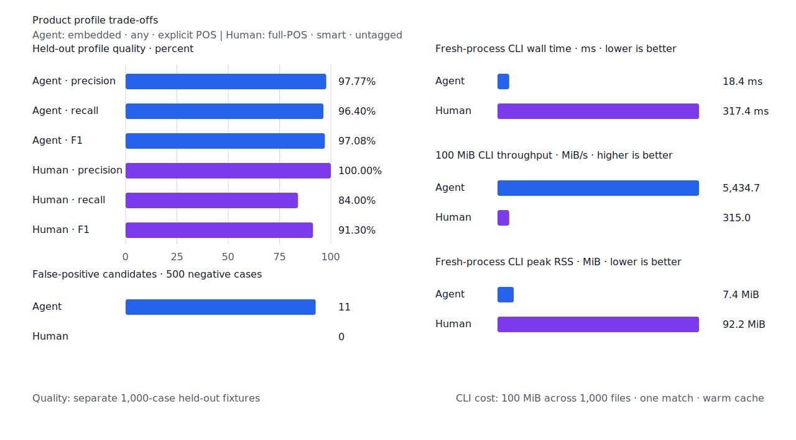
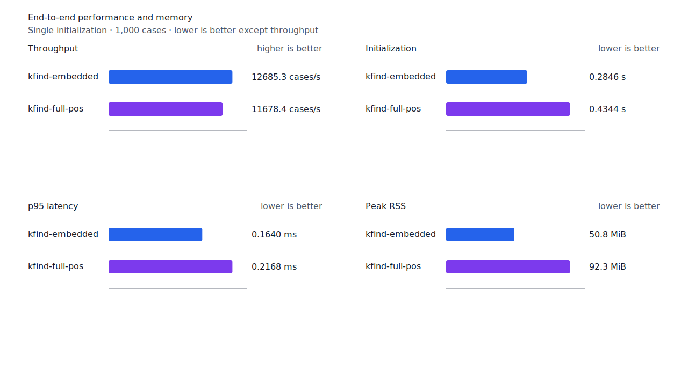
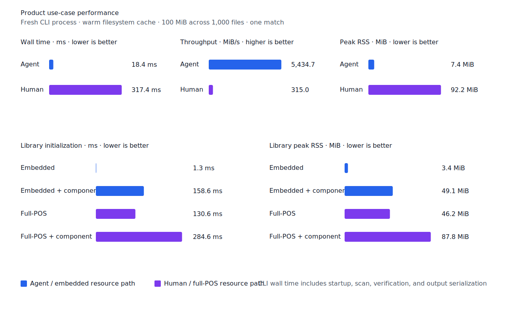

# 현재 서술형 후속 형태 continuation

- 측정일: 2026-07-15
- 기준 revision: `8fb22eb4e1f624870ffa3ec6db5c2172f50d3ee7`
- 후보 코드 revision: `ccc952575cf4c18a5924e5d00e92722acbe0c6fd`
- 회귀 fixture revision: `e2dcada9f6c3d1b7cb1d15a38d75c1f742fb9235`
- 환경: Linux 6.12.76/aarch64, 10 logical CPUs, 7.7 GiB memory, Python 3.12.13,
  Rust 1.97.0, Docker 29.6.1
- 반복: fresh process 1회 warm-up 뒤 5회 측정의 중앙값
- test fixture: `933bc12197da866d2363d7df9107d4d9be89a65ddaafd73968ad5384832b21ff`
- development fixture: `604c3a139854fcf59570392f48ab85028785f4a3561ea3c5e702f88b841f907c`
- hard-negative fixture: `cb8634491cba65916c9af510c50f909eaddfd9bb89935598875e134a01cbce99`
- 무품사 fixture: `94ccd70a093ee7af8435371b2ffdb81534ec97e29ada705ea72c940938d0c592`
- 100 MiB corpus: `7692072cb7bff9261c1fa5933bde41b27e558170818eeac6d07cabdd673815ff`
- 회귀 fixture: `a512df289f4c1ae0e7b12bd8c145dd03d35798b16a8bbf8c2a9bab06c7e959e0`
- 기준 report SHA-256: `74e64ecc908256f1a442606d368ffb63a3050e82b159f48b4c0faaa973bf199c`
- 후보 report SHA-256: `2334c51c7310187b70a13a9ec0d9847b1d39176fb192a3f048c68c484c0619b0`

## 결론

현재 서술형 `-ㄴ다/-는다` branch를 terminal로 닫지 않고 별도 verifier state로 전이한다. 이
state는 `고`, `는`, `던`, `면`, `니`, `며`, `면서`, `는데`, `지`를 최장 형태 우선으로
소비한다. `쓴다고`, `받는다는`, `받든다는`, `영원히 함께한다던 말도`, `간다면`, `한다니`,
`간다며`, `한다면서`, `온다는데`, `한다지`를 회귀 fixture로 고정했다.

[한국어기초사전 `-ㄴ다고`](https://krdict.korean.go.kr/eng/dicSearch/SearchView?ParaWordNo=86060&nation=eng)와
[`-는다고`](https://krdict.korean.go.kr/eng/dicSearch/SearchView?ParaWordNo=86058&nation=eng)는
인용 결합을,
[`-ㄴ다는`](https://krdict.korean.go.kr/eng/dicSearch/SearchView?ParaWordNo=82213&nation=eng)는
뒤 명사를 꾸미는 인용 표현을 제시한다. 사전의
[`받다`](https://krdict.korean.go.kr/eng/dicSearch/SearchView?ParaWordNo=66636&nation=eng) 예문에도
`받는다는 의견`이 확인된다.
[`-ㄴ다던`](https://krdict.korean.go.kr/eng/dicSearch/SearchView?ParaWordNo=82037&nation=eng)과
[`-는다던`](https://krdict.korean.go.kr/eng/dicSearch/SearchView?ParaWordNo=82038&nation=eng)은
`-ㄴ다고/는다고 하던`의 준말로 뒤 내용을 꾸미며, 후자는 `서로 돕는다던 말도`를 예로 든다.

`거나`, `든가`, `든지`는 종결 어미 뒤에 붙는 조사 전이이고, `니요`, `던데`처럼 이번
후속 형태 뒤에 다시 붙는 연쇄도 별도 상태가 필요하다. 이번 verifier에는 포함하지 않는다.
지원하지 않는 `쓴다도`, `먹는다도`는 `smart`에서 계속 거부한다.

development에서 `쓰다 -> 쓴다고`를 복구해 embedded와 full-POS `smart`의 FN이 각각 1건
줄었다. 고정 test, Agent, Human과 hard-negative 품질은 바뀌지 않았다.

## 품질

| fixture/profile | 기준 TP / FP / FN | 후보 TP / FP / FN | 기준 recall | 후보 recall |
| --- | ---: | ---: | ---: | ---: |
| development embedded `smart` | 443 / 2 / 57 | 444 / 2 / 56 | 88.6% | 88.8% |
| development full-POS `smart` | 444 / 2 / 56 | 445 / 2 / 55 | 88.8% | 89.0% |
| test embedded `smart` | 418 / 0 / 82 | 418 / 0 / 82 | 83.6% | 83.6% |
| test full-POS `smart` | 425 / 0 / 75 | 425 / 0 / 75 | 85.0% | 85.0% |
| Agent embedded `any` | 482 / 11 / 18 | 482 / 11 / 18 | 96.4% | 96.4% |
| Human full-POS `smart` | 420 / 0 / 80 | 420 / 0 / 80 | 84.0% | 84.0% |

두 development profile의 precision은 99.55%다. 22개 hard-negative의 기존 FP 4건은
그대로이고 신규 FP는 없다. fixture, gold와 negative 선택은 바꾸지 않았다.




## 성능

각 값은 `median [min, max]`다. RSS 단위는 KiB다.

| workload | 지표 | 기준 | 후보 | 증감 |
| --- | --- | ---: | ---: | ---: |
| embedded `smart` | initialization | 0.287769 s [0.287667, 0.290422] | 0.284610 s [0.283734, 0.284880] | -1.10% |
| embedded `smart` | cases/s | 13,074.9 [12,551.6, 13,130.8] | 12,685.3 [12,463.8, 12,714.5] | -2.98% |
| embedded `smart` | p95 | 0.1589 ms [0.1577, 0.1698] | 0.1640 ms [0.1621, 0.1666] | +3.21% |
| embedded `smart` | peak RSS | 52,060 [52,056, 52,064] | 52,068 [52,060, 52,072] | +0.02% |
| full-POS `smart` | initialization | 0.434955 s [0.433407, 0.448969] | 0.434435 s [0.430359, 0.438357] | -0.12% |
| full-POS `smart` | cases/s | 12,024.7 [12,011.4, 12,164.1] | 11,678.4 [11,028.6, 11,715.3] | -2.88% |
| full-POS `smart` | p95 | 0.2052 ms [0.2036, 0.2093] | 0.2168 ms [0.2122, 0.2280] | +5.65% |
| full-POS `smart` | peak RSS | 94,396 [94,384, 94,428] | 94,524 [94,460, 94,524] | +0.14% |
| Agent morphology | cases/s | 14,504.2 [14,486.8, 14,523.0] | 13,935.1 [13,898.6, 13,943.3] | -3.92% |
| Human morphology | cases/s | 10,429.2 [10,150.0, 10,480.8] | 10,007.4 [9,320.5, 10,030.6] | -4.04% |
| Agent 100 MiB CLI | wall | 0.018585 s [0.016119, 0.020146] | 0.018400 s [0.017405, 0.019471] | -1.00% |
| Human 100 MiB CLI | wall | 0.314201 s [0.310385, 0.315166] | 0.317419 s [0.316112, 0.321037] | +1.02% |

현재 서술형 branch가 후속 형태를 확인하는 비용으로 morphology 처리량은 2.88~4.04% 낮고
p95는 3.21~5.65% 높게 측정됐다. initialization과 RSS는 유지됐다. morphology benchmark에는
별도 회귀 임계가 없으므로 성능 불변을 주장하지 않는다. 100 MiB scan 변화는 20.4절의 10%
경고선 안이고 Agent CLI의 양쪽 범위는 겹친다.

local lattice의 제품 판정은 4.2740~4.3002 us로 1.97% 개선됐다. 진단 보고서는
10.541~10.931 us로 4.43% 느려졌지만 제품 판정 p95 10% 회귀 기준에는 포함되지 않는다.
morphology index의 exact·prefix equivalence checksum은 각각 `5901055339043549701`,
`7072030433407239049`로 유지됐다.





## 재현

기준과 후보 image를 같은 host에서 측정하고, 후보를 재측정한 뒤 보존한 기준 image를 다시
실행해 측정 순서에 따른 흔들림을 확인했다. 표는 마지막 기준·후보 쌍이다.

```console
KFIND_MORPH_IMAGE=kfind-morph-benchmark:quotative-main-8fb22eb \
  KFIND_MORPH_RUNS=5 \
  scripts/benchmark-morphology.sh target/morph-benchmark-quotative-main-8fb22eb

KFIND_MORPH_IMAGE=kfind-morph-benchmark:declarative-candidate-ccc9525 \
  KFIND_MORPH_RUNS=5 \
  scripts/benchmark-morphology.sh target/morph-benchmark-declarative-candidate-ccc9525

scripts/benchmark-criterion.sh local_lattice
scripts/benchmark-morph-index.sh

python3 tools/morph-compare/render_charts.py \
  target/morph-benchmark-declarative-candidate-ccc9525/report.json \
  docs/benchmarks/assets \
  --prefix 2026-07-15-present-declarative-continuation-
```

외부 분석기 snapshot은 fixture, adapter schema와 고정 버전·설정이 바뀌지 않아 갱신하지 않았다.
