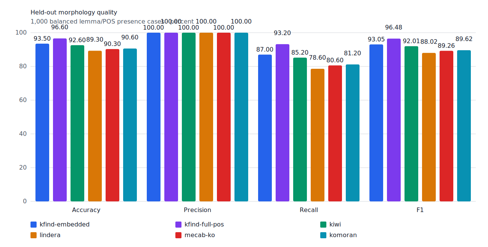
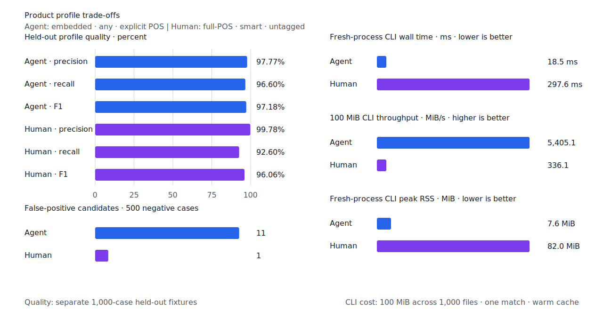

# 계약 보정 지표와 구조 판정 품질

- 측정일: 2026-07-16
- 기준 엔진 revision: `34c18471a910fd94f34bb3758ded0a44dedc1b36`
  (`origin/main` `6b8f95c559fd7842bd2ac9ae4ec34fcedaf92458` + evaluator 변경만 포함)
- 후보 revision: `30680c69633bbc6969808ac78b02e27f89920d26`
- 환경: Linux 6.12.76/aarch64, 10 logical CPUs, Python 3.12.13, Rust 1.97.0,
  Docker 29.6.1
- 반복: fresh process 1회 warm-up 뒤 5회 측정의 중앙값
- test fixture: `933bc12197da866d2363d7df9107d4d9be89a65ddaafd73968ad5384832b21ff`
- development fixture: `604c3a139854fcf59570392f48ab85028785f4a3561ea3c5e702f88b841f907c`
- 기준 hard-negative fixture: `8d9ccf3008157c1bbe45ce785f085315f53f47695a0653b7fc6534fc05db6b6f`
  (24건)
- 후보 hard-negative fixture: `1d8d34645a8517df473b749eea33177f81acc9782a9ba1a13f7742fa0277724a`
  (공통 24건 + 신규 guard 2건)
- 무품사 fixture: `94ccd70a093ee7af8435371b2ffdb81534ec97e29ada705ea72c940938d0c592`
- 100 MiB corpus: `7692072cb7bff9261c1fa5933bde41b27e558170818eeac6d07cabdd673815ff`
- 기준 report SHA-256: `f84dd7c584dd690039d61c1f822c73c520921ace62fb7c2d8b6b3c7c9c635b6b`
- 후보 report SHA-256: `3254f82ecfba0d74d5ced465fc7608f2294d3823e7586dcaa9b55b0ec805814d`

## 기술 요약

장기 제품 품질 관점에서 승인할 수 있는 개선이다. 고정 test, development, Agent, Human의
strict TP·FP·FN은 기준과 같다. 반면 공통 hard-negative 24건에서 strict FP는 8건에서 6건,
제품 계약상 실제 FP인 FPᶜ는 3건에서 1건으로 줄었다. 새 구조를 열기 전에 추가한 반례 2건도
모두 TN이다.

의미상 동음이의어는 계속 구분하지 않는다. `걸었어`가 `v:걷다`와 `v:걸다` 양쪽에
매칭되는 결과는 strict FP로 남기되, 사전에 검토한 `same-pos-homograph`를 적용한 계약 보정
지표에서는 TPᶜ로 센다. 반대로 `새 기능 → n:새`, `역사과목 → n:사과`처럼 품사 배치나
component 경계로 구분 가능한 결과는 실제 FP로 남겨 이번 변경에서 제거했다.

어미 coverage는 예문마다 ending을 추가하는 목록으로 되돌리지 않았다. 국립국어원 사전 3종에서
고정한 현대 한국어 어미 764개와 compact resource의 `EP/EC/EF/ETM/ETN` complete path가 새
표면형을 검증한다. `걸었어`도 이 열린 어미 경로로 처리하며 query별 surface 예외는 없다.

성능 회귀 기준 10%를 넘은 지표는 없다. full-POS `smart` 처리량은 1.58% 낮고 초기화는
0.85% 높지만 p95는 0.70% 낮다. 100 MiB CLI는 Agent 처리량이 5.27% 높고 Human 처리량은
0.29% 높다.

## strict와 contract-adjusted는 다른 질문에 답한다

strict 지표는 corpus gold를 바꾸지 않은 TP·FP·TN·FN이다. `contract_adjusted`는 제품 실행
전에 version-controlled fixture에 고정한 `contract_expected`만 적용한다. strict negative를
contract positive로 바꾸는 경우만 허용하며 현재 사유는 다음 두 개다.

- `same-pos-homograph`: 같은 품사의 동형 활용을 문맥 의미로 구분하지 않는다.
- `aligned-source-component`: source가 정렬한 내부 component를 검색 계약상 허용한다.

계약 보정 confusion matrix는 TPᶜ·FPᶜ·TNᶜ·FNᶜ로 표시한다. strict 수치는 계속 병렬로
보고하므로 annotation이 품질 회귀를 숨길 수 없다. hard-negative에서는 contract precision과
함께 `TNᶜ / (TNᶜ + FPᶜ)`인 contract hard-negative precision도 본다.

## 기준 품질을 유지하면서 실제 hard FP를 두 건 줄였다

| fixture/profile | 기준 TP / FP / FN | 후보 TP / FP / FN | 기준 F1 | 후보 F1 |
| --- | ---: | ---: | ---: | ---: |
| test embedded `smart` | 435 / 0 / 65 | 435 / 0 / 65 | 93.05% | 93.05% |
| test full-POS `smart` | 466 / 0 / 34 | 466 / 0 / 34 | 96.48% | 96.48% |
| development embedded `smart` | 446 / 4 / 54 | 446 / 4 / 54 | 93.89% | 93.89% |
| development full-POS `smart` | 452 / 4 / 48 | 452 / 4 / 48 | 94.56% | 94.56% |
| Human full-POS `smart` | 463 / 1 / 37 | 463 / 1 / 37 | 96.06% | 96.06% |
| Agent embedded `any` | 483 / 11 / 17 | 483 / 11 / 17 | 97.18% | 97.18% |

test는 case 단위 이동도 없다. development는 `비실체적인 → 실체` 1건이 TP에서 FN으로,
`산속에 → 속` 1건이 FN에서 TP로 이동해 aggregate가 같다. `실체`는 complete structural
path가 없어 계속 관측할 항목이며, 임시 substring 예외로 복구하지 않았다.

공통 hard-negative 24건의 변화는 다음과 같다.

| metric | 기준 | 후보 | 변화 |
| --- | ---: | ---: | ---: |
| strict FP / TN | 8 / 16 | 6 / 18 | 실제·의도된 FP 합계 2건 감소 |
| TPᶜ / FPᶜ / TNᶜ / FNᶜ | 5 / 3 / 16 / 0 | 5 / 1 / 18 / 0 | 실제 FPᶜ 2건 감소 |
| contract precision | 62.50% | 83.33% | +20.83%p |
| contract hard-negative precision | 84.21% | 94.74% | +10.53%p |
| contract F1 | 76.92% | 90.91% | +13.99%p |

후보 fixture에 추가한 `사실체계 → n:실체`, `날씨는 → n:씨` 두 건은 모두 TN이다. 이를
포함한 26건에서는 strict FP / TN이 6 / 20, TPᶜ / FPᶜ / TNᶜ / FNᶜ가
5 / 1 / 20 / 0이며 contract hard-negative precision은 95.24%다.

case 이동은 구조 근거와 일치한다.

| case | strict | contract | 판정 |
| --- | --- | --- | --- |
| `새 기능 → n:새` | FP → TN | FPᶜ → TNᶜ | 다음 체언이 증명하는 관형사 구조 선택 |
| `역사과목 → n:사과` | FP → TN | FPᶜ → TNᶜ | 최소 component path의 두 경계를 가로질러 거부 |
| `대학교 → n:학교` | FP 유지 | TPᶜ 유지 | 정렬 source component |
| `전화를 걸었어 → v:걷다` | FP 유지 | TPᶜ 유지 | 같은 품사의 동형 활용 |
| `나는 오래 걸었어 → v:걸다` | FP 유지 | TPᶜ 유지 | 같은 품사의 동형 활용 |
| `주지 스님 → v:주다` | FP 유지 | FPᶜ 유지 | 구조만으로 안전하게 제거하지 못한 실제 FP |

## 외부 분석기보다 recall과 F1이 높다

같은 1,000-case explicit-POS fixture에서 외부 분석기는 고정 snapshot을 사용했다. 다음 표는
동일 gold의 backend 비교이며, User persona용 무품사 수치와 섞지 않는다.

| backend | precision | recall | F1 | init | cases/s | p95 | peak RSS |
| --- | ---: | ---: | ---: | ---: | ---: | ---: | ---: |
| kfind full-POS `smart` | 100.00% | 93.20% | 96.48% | 0.3848 s | 5,439.7 | 0.6226 ms | 82.1 MiB |
| Kiwi 0.23.2 | 100.00% | 85.20% | 92.01% | 1.7204 s | 1,672.0 | 1.1904 ms | 528.2 MiB |
| Lindera 4.0.0 | 100.00% | 78.60% | 88.02% | 0.0301 s | 15,609.1 | 0.1113 ms | 193.1 MiB |
| MeCab-ko 1.0.2 | 100.00% | 80.60% | 89.26% | 0.0003 s | 10,789.7 | 0.1940 ms | 102.8 MiB |
| KOMORAN 3.3.9 | 100.00% | 81.20% | 89.62% | 1.1589 s | 1,669.4 | 1.2370 ms | 686.6 MiB |

kfind의 F1은 가장 가까운 Kiwi보다 4.47%p 높다. 처리량은 Kiwi와 KOMORAN의 약 3.3배지만
Lindera와 MeCab-ko보다는 낮다. RSS는 비교 대상 중 가장 낮다. 따라서 현재 우위는 순수
tokenizer 속도가 아니라 lemma/POS 검색 recall과 제품 메모리 효율에 있다.



## 성능 변화는 경고선 안이다

각 값은 5회 중앙값이다. 증감은 기준 대비 후보이며 처리량은 높을수록, 나머지는 낮을수록 좋다.

| workload | metric | 기준 | 후보 | 증감 |
| --- | --- | ---: | ---: | ---: |
| embedded `smart` | initialization | 0.238017 s | 0.237240 s | -0.33% |
| embedded `smart` | cases/s | 9,561.9 | 9,448.4 | -1.19% |
| embedded `smart` | p95 | 0.2470 ms | 0.2463 ms | -0.28% |
| embedded `smart` | peak RSS | 41,668 KiB | 41,708 KiB | +0.10% |
| full-POS `smart` | initialization | 0.381549 s | 0.384809 s | +0.85% |
| full-POS `smart` | cases/s | 5,526.8 | 5,439.7 | -1.58% |
| full-POS `smart` | p95 | 0.6270 ms | 0.6226 ms | -0.70% |
| full-POS `smart` | peak RSS | 83,944 KiB | 84,060 KiB | +0.14% |
| Agent 100 MiB CLI | wall | 0.019475 s | 0.018501 s | -5.00% |
| Agent 100 MiB CLI | throughput | 5,134.68 MiB/s | 5,405.11 MiB/s | +5.27% |
| Agent 100 MiB CLI | peak RSS | 7,684 KiB | 7,772 KiB | +1.15% |
| Human 100 MiB CLI | wall | 0.298424 s | 0.297568 s | -0.29% |
| Human 100 MiB CLI | throughput | 335.09 MiB/s | 336.06 MiB/s | +0.29% |
| Human 100 MiB CLI | peak RSS | 83,960 KiB | 83,992 KiB | +0.04% |

microbenchmark의 최대 불리한 변화는 full-POS 처리량 -1.58%, 실제 CLI의 최대 불리한 변화는
Agent RSS +1.15%다. 모두 10% 경고선 안이며 p95와 실제 CLI wall time은 개선됐다.



## 추가 코드의 대부분은 제품 분기보다 검증 장치다

`origin/main...후보` diff는 1,029줄 추가, 83줄 삭제다. 이 중 약 471줄은 Rust/Python 테스트,
약 233줄은 contract-adjusted evaluator·report·validation, 약 69줄은 spec과 문서다. 제품
판정 경로의 증가는 약 289줄이다. 따라서 `-`가 적은 주된 이유는 기존 검색기를 복제한 것이
아니라 이미 main에 들어간 typed structural pipeline에 경계 proof와 병렬 평가 축을 추가했기
때문이다.

기존 strict 지표와 공개 동작을 삭제하지 않은 것도 의도적이다. 새 지표가 안정화되기 전에
strict 수치를 없애면 품질 하락을 annotation으로 숨길 수 있고, 기존 API를 한 번에 제거하면
stacked 변경의 회귀 지점을 찾기 어렵다. 후속 삭제는 중복 evaluator나 사용되지 않는 compatibility
경로가 실제로 생겼을 때 별도 PR로 수행하는 편이 안전하다.

## 한계와 다음 검증

- contract annotation은 현재 5건이라 의미 non-goal 전체를 대표하지 않는다. 같은 품사 동형
  활용과 source component의 새로운 표면형을 추가할 때는 결과를 보기 전에 fixture를 고정한다.
- `주지 스님 → v:주다`는 남은 FPᶜ 1건이다. `V+EC N`은 정상 문장도 많아 현재 근거만으로
  제거하면 recall을 해치므로 유지한다.
- development의 `비실체적인 → n:실체`는 aggregate gate를 깨지 않지만 case-level FN이다.
  NIKL 또는 source component에 재현 가능한 정렬 근거가 생길 때만 복구한다.
- 외부 분석기 수치는 동일 fixture의 version-pinned snapshot이다. kfind 변경과 무관한 도구를
  매 실행마다 다시 설치하지 않으며, fixture·adapter schema·버전이 바뀔 때만 갱신한다.

다음 작업은 FPᶜ 1건을 표면형 예외 없이 제거할 수 있는 구조 evidence가 있는지 조사하고,
동시에 development FN 48건을 `lexicon-missing`, `surface-missing`, `boundary-rejected`,
`span-mismatch`로 나눠 가장 큰 일반 규칙 하나를 선택하는 것이다.

## 재현

```console
git switch --detach 34c18471a910fd94f34bb3758ded0a44dedc1b36
KFIND_MORPH_IMAGE=kfind-morph-benchmark:policy-baseline \
scripts/benchmark-morphology.sh target/morph-benchmark-policy-baseline

git switch --detach 30680c69633bbc6969808ac78b02e27f89920d26
KFIND_MORPH_IMAGE=kfind-morph-benchmark:policy-candidate \
scripts/benchmark-morphology.sh target/morph-benchmark-policy-candidate-final5

python3 tools/morph-compare/render_charts.py \
  target/morph-benchmark-policy-candidate-final5/report.json \
  docs/benchmarks/assets \
  --prefix 2026-07-16-contract-adjusted-structural-quality-

python3 tools/morph-compare/export_site_snapshot.py \
  target/morph-benchmark-policy-candidate-final5/report.json \
  docs/benchmarks/site-morphology.json \
  --revision 30680c69633b
```

hard-negative 기준 비교는 공통 24건을 사용한다. 후보에서 추가한 2건은 별도 신규 guard로
보고한다. 외부 분석기 snapshot은 test fixture, adapter schema와 고정 버전·설정이 바뀌지 않아
갱신하지 않았다.
