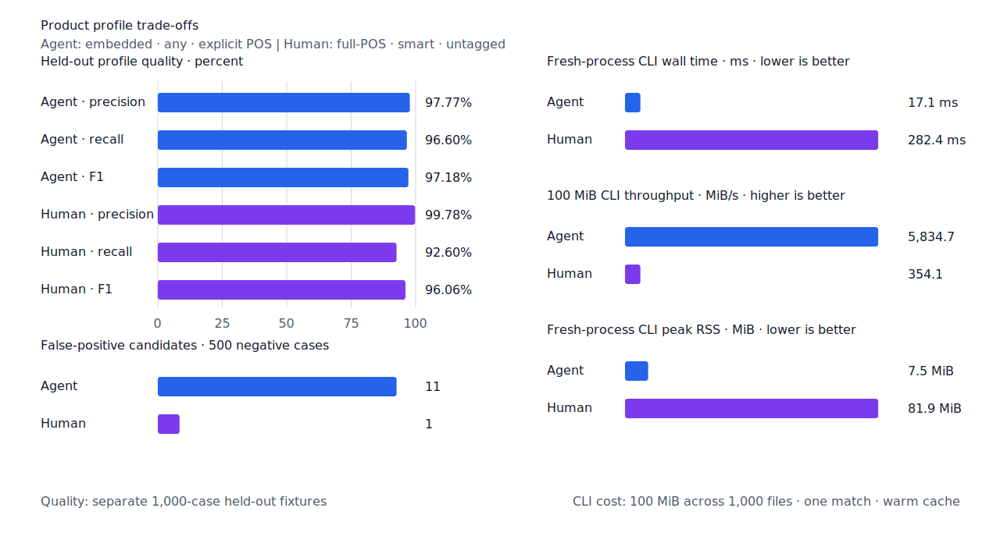

# 구조 기반 어미 목록 전환

- 측정일: 2026-07-16
- 기준 revision: `46794770eac440439d2d46ebbf7dbe6eaae620b7`
- 후보 revision: `68ef9b5ee01b4d5fc032feebf1f0744e5f78647b`
- 환경: Linux 6.12.76/aarch64, 10 logical CPUs, Python 3.12.13, Rust 1.97.0,
  Docker 29.6.1
- 반복: fresh process 1회 warm-up 뒤 5회 측정의 중앙값
- test fixture: `933bc12197da866d2363d7df9107d4d9be89a65ddaafd73968ad5384832b21ff`
- development fixture: `604c3a139854fcf59570392f48ab85028785f4a3561ea3c5e702f88b841f907c`
- hard-negative fixture: `cb8634491cba65916c9af510c50f909eaddfd9bb89935598875e134a01cbce99`
- 무품사 fixture: `94ccd70a093ee7af8435371b2ffdb81534ec97e29ada705ea72c940938d0c592`
- 100 MiB corpus: `7692072cb7bff9261c1fa5933bde41b27e558170818eeac6d07cabdd673815ff`
- 기준 report SHA-256: `e218f3325b0041d52aa433bdf48caf7d259635101864bc3bcc3d3b08fa53da18`
- 후보 report SHA-256: `4c9098a07fc1bf0b3e297b3578188e4571b26531c7bb082a91c932bd29a288e4`

## 결론

표면형 예외를 계속 추가하는 방식 대신 국립국어원 사전 3종에서 현대 한국어 어미 764개를
재생성 가능한 목록으로 고정하고, 용언 stem class와 compact component resource가 어미 경로를
검증하도록 전환했다. 의미상 동음이의어는 구분하지 않는다. 따라서 `걸었다`, `걸었고` 같은
동형 활용은 `v:걷다`와 `v:걸다`에 모두 남는다. 반면 품사·component·인접 성분 배치가 구조를
증명하는 `매일 보고 싶어`와 `독수리가 아니라 매일 수도 있어`는 서로 다른 분석을 선택한다.

full-POS 명시 품사 품질은 기준과 같은 TP 466 / FP 0이다. 사람용 무품사 `smart`는 TP가 2건
늘고 FP가 1건 늘어 F1이 95.94%에서 96.06%로 높아졌다. 신규 FP인 `v:하다 → 구경했어요`는
source component가 증명하는 `구경+하다` 경로라 제품의 component 검색 계약에서는 positive다.
fixture negative 생성기가 파생 component를 gold로 인정하지 않아 benchmark상 FP로 남긴다.

1,000-case `smart` 평가 처리량은 구조 증거 판정 때문에 낮아졌다. 이 비용은 구조 판정을 요청한
경로에 한정된다. 실제 100 MiB CLI에서는 agent `any` 처리량이 17.00%, human `smart` 처리량이
11.46% 높고, human RSS는 11.10% 낮다. 구조 해소 품질, 실제 파일 검색, 배포 resource 크기를
함께 보면 제품 전환은 승인한다. `smart` case microbenchmark의 처리량과 p95는 후속 최적화
대상으로 남긴다.

## 국립국어원 어미 목록

| source | snapshot | SHA-256 |
| --- | --- | --- |
| 한국어기초사전 XML | 2026-06-19 | `a8ab7d044d4f6341e0f217db63f38f4d18beed3e1f153130f6cb4e9494fea1d6` |
| 표준국어대사전 XML | 2026-07-05 | `880b31447146df5879c076012b21d4cc3c0c24e70fd91be7fc73f7ff7da34d52` |
| 우리말샘 XML | 2026-07-02 | `9e8807e5fade8c7b59431d1ab527fe93aafd15395001bcdde88511e8c9293b42` |

생성한 `data/rules/nikl-modern-endings.tsv`는 764 surface이며 SHA-256은
`fc0767b227f9df78dc6d9b920ee13c5fb371ef5cac6b6ff07fae9c1136cb134d`다. 같은 archive로
`scripts/audit-nikl-endings.sh`를 다시 실행한 결과와 byte-for-byte 일치한다. 파생 동사 tail과
조사 표면은 목록에서 제외하고, 어미 category와 각 사전 entry ID를 provenance로 보존한다.

## 제품 회귀 fixture

- morphology gold 574건과 auto-POS 검증을 통과한다.
- constructed 걷다/걸다 문단은 `v:걷다` 97 span, `v:걸다` 21 span이다.
- `걸려`, `걷히자`, `걸터앉았다`, `걸머지고`, `걷잡을` 같은 별도 표제어는 제외한다.
- `n:매`와 `adv:매일`은 문장 성분 배치가 증명하는 경우 서로 배타적으로 선택한다.
- `n:다 → 입니다`, `v:치다 → 미친다`는 제외하지만 `v:주다 → 보여준다`와
  `n:지 → 공부한지`의 정렬된 구조는 유지한다.

## 품질

| fixture/profile | 기준 TP / FP / FN | 후보 TP / FP / FN | 기준 F1 | 후보 F1 |
| --- | ---: | ---: | ---: | ---: |
| test embedded `smart` | 436 / 0 / 64 | 435 / 0 / 65 | 93.16% | 93.05% |
| test full-POS `smart` | 466 / 0 / 34 | 466 / 0 / 34 | 96.48% | 96.48% |
| Human full-POS `smart` | 461 / 0 / 39 | 463 / 1 / 37 | 95.94% | 96.06% |
| Agent embedded `any` | 483 / 11 / 17 | 483 / 11 / 17 | 97.18% | 97.18% |

development full-POS `smart`는 TP 452 / FP 4 / FN 48, precision 99.12%로 고정 gate를
통과한다. hard-negative의 신규 FP는 없고, one-syllable-boundary slice는 FP 1건에서 0건으로
줄었다.

full-POS test의 총계는 같지만 15건씩 이동했다. 다음 표는 report JSON의 case ID 기준이다.

| 이동 | case ID | query | 이유 |
| --- | --- | --- | --- |
| TP → FN | `MH2_0010-s61:4:1` | `천/numeral` | 붙여 쓴 수량·단위 경로를 구조 근거 부족으로 거부 |
| TP → FN | `MH2_0010-s141:12:0` | `들리다/verb` | `들려가는`의 fused continuation span을 보수적으로 거부 |
| TP → FN | `MH2_0010-s310:5:0` | `포터소만/noun` | 사전 adapter와 compact component span 불일치 |
| TP → FN | `MH2_0110-s216:12:0` | `것/noun` | copular token 내부 runtime nominal을 거부 |
| TP → FN | `MH2_0010-s91:10:0` | `빌리다/verb` | `빌려온`의 fused continuation span을 보수적으로 거부 |
| TP → FN | `ARG-JPN_07_2_08:10:0` | `오다/verb` | 띄어 쓴 보조용언 배열의 내부 predicate를 거부 |
| TP → FN | `MH2_0010-s83:3:1` | `일/noun` | 붙여 쓴 날짜 단위의 runtime component를 거부 |
| TP → FN | `MH2_0010-s402:4:0` | `캔맥주/noun` | 사전 adapter와 compact component span 불일치 |
| TP → FN | `MH2_0190-s205:5:1` | `억/numeral` | 붙여 쓴 수량·단위 경로를 구조 근거 부족으로 거부 |
| TP → FN | `MH2_0010-s68:4:1` | `백/numeral` | 붙여 쓴 수량·단위 경로를 구조 근거 부족으로 거부 |
| TP → FN | `MH2_0010-s166:13:2` | `있다/verb` | `들어있는` 내부 predicate 경로를 보수적으로 거부 |
| TP → FN | `MH2_0110-s107:3:0` | `대영제국/noun` | whole nominal 선택이 내부 runtime 경로를 억제 |
| TP → FN | `MH2_0190-s471:9:0` | `바꾸다/verb` | `바꾸었음` nominalization span을 보수적으로 거부 |
| TP → FN | `KH-C100011-2-5942:16:0` | `놀다/verb` | 비표준 활용 `놀을`을 canonical 경로로 인정하지 않음 |
| TP → FN | `KH-C100015-13-6284:8:0` | `뭐/pronoun` | 반복 token 내부 runtime pronoun을 거부 |
| FN → TP | `MH2_0010-s452:11:0` | `둥그스름/noun` | 정렬 component 경로 복구 |
| FN → TP | `KH-C100004-2-5345:4:0` | `하다/verb` | `할`의 core span 정렬 복구 |
| FN → TP | `KH-B200025-19-4272:4:0` | `죽다/verb` | `죽도록` open ending 경로 복구 |
| FN → TP | `KH-B200028-5-4400:7:1` | `바구니/noun` | `장바구니` source component 복구 |
| FN → TP | `KH-A200039-7-2-1-1-1:3:0` | `칠/numeral` | `칠월`의 exact component 복구 |
| FN → TP | `KH-B200071-1-2-3:4:1` | `흡연/noun` | `흡연자` source component 복구 |
| FN → TP | `MH2_0190-s40:15:2` | `주다/verb` | `보여준다`의 보조용언 component 복구 |
| FN → TP | `KH-B100018-7-2499:7:1` | `있다/adjective` | `맛있다`의 정렬 predicate component 복구 |
| FN → TP | `MH2_0010-s116:8:0` | `돌다/verb` | `돌아가는`의 predicate component 복구 |
| FN → TP | `KH-C100010-11-5812:2:0` | `빠르다/adjective` | open final ending `-네` 복구 |
| FN → TP | `MH2_0010-s407:1:0` | `그/pronoun` | `그때` exact component 복구 |
| FN → TP | `MH2_0190-s114:7:0` | `불다/verb` | `불어났다`의 predicate component 복구 |
| FN → TP | `MH2_0110-s525:2:0` | `진정/noun` | `진정한`의 component 경로 복구 |
| FN → TP | `KH-B200035-2-4669:9:3` | `지/noun` | `공부한지`의 관형형+의존명사 경로 복구 |
| FN → TP | `KH-B100011-1-1978:5:1` | `아지다/verb` | `많아진다`의 보조용언 component 복구 |

## 성능

각 값은 `median [min, max]`다. RSS 단위는 KiB다.

| workload | 지표 | 기준 | 후보 | 증감 |
| --- | --- | ---: | ---: | ---: |
| embedded `smart` | initialization | 0.280794 s [0.280693, 0.290774] | 0.233507 s [0.232217, 0.237747] | -16.84% |
| embedded `smart` | cases/s | 12,120.6 [11,427.1, 12,157.2] | 9,613.4 [9,393.8, 9,680.8] | -20.69% |
| embedded `smart` | p95 | 0.1711 ms [0.1664, 0.1817] | 0.2489 ms [0.2455, 0.2589] | +45.47% |
| embedded `smart` | peak RSS | 51,976 [51,968, 51,984] | 41,668 [41,660, 41,672] | -19.83% |
| full-POS `smart` | initialization | 0.423661 s [0.421812, 0.434752] | 0.375137 s [0.373740, 0.391408] | -11.45% |
| full-POS `smart` | cases/s | 10,622.1 [10,334.2, 10,686.4] | 5,547.4 [5,474.4, 5,576.1] | -47.77% |
| full-POS `smart` | p95 | 0.2411 ms [0.2387, 0.2432] | 0.6228 ms [0.6205, 0.6266] | +158.32% |
| full-POS `smart` | peak RSS | 94,424 [94,416, 94,424] | 83,936 [83,928, 83,936] | -11.11% |
| Human `smart` | initialization | 0.529767 s [0.455180, 0.714428] | 0.379271 s [0.376582, 0.387141] | -28.41% |
| Human `smart` | cases/s | 7,749.1 [5,722.2, 8,837.4] | 4,343.7 [4,236.3, 4,355.3] | -43.95% |
| Human `smart` | p95 | 0.3432 ms [0.2991, 0.4783] | 0.7058 ms [0.7019, 0.7362] | +105.65% |
| Human `smart` | peak RSS | 94,452 | 83,960 [83,952, 83,984] | -11.11% |
| Agent 100 MiB CLI | wall | 0.020053 s [0.019178, 0.020836] | 0.017139 s [0.016374, 0.017868] | -14.53% |
| Agent 100 MiB CLI | throughput | 4,986.73 MiB/s | 5,834.69 MiB/s | +17.00% |
| Human 100 MiB CLI | wall | 0.314788 s [0.313812, 0.319495] | 0.282427 s [0.281785, 0.287297] | -10.28% |
| Human 100 MiB CLI | throughput | 317.67 MiB/s | 354.07 MiB/s | +11.46% |
| Human 100 MiB CLI | peak RSS | 94,368 | 83,896 | -11.10% |

compact component resource는 47,859,711 bytes에서 37,103,781 bytes로 22.47% 작아졌다.
full-POS+component 초기화는 0.275531초에서 0.259853초로 5.69%, peak RSS는 89,864 KiB에서
79,388 KiB로 11.66% 줄었다.




## 재현

```console
git switch --detach 46794770eac440439d2d46ebbf7dbe6eaae620b7
KFIND_MORPH_IMAGE=kfind-morph-benchmark:baseline-main \
KFIND_MORPH_RUNS=5 \
scripts/benchmark-morphology.sh target/morph-benchmark-main

git switch --detach 68ef9b5ee01b4d5fc032feebf1f0744e5f78647b
KFIND_MORPH_IMAGE=kfind-morph-benchmark:structural-endings-final4 \
KFIND_MORPH_RUNS=5 \
scripts/benchmark-morphology.sh target/morph-benchmark-structural-endings-final4

scripts/audit-nikl-endings.sh

python3 tools/morph-compare/render_charts.py \
  target/morph-benchmark-structural-endings-final4/report.json \
  docs/benchmarks/assets \
  --prefix 2026-07-16-structural-ending-catalog-

python3 tools/morph-compare/export_site_snapshot.py \
  target/morph-benchmark-structural-endings-final4/report.json \
  docs/benchmarks/site-morphology.json \
  --revision 68ef9b5ee01b
```

외부 분석기 snapshot은 fixture, adapter schema와 고정 버전·설정이 바뀌지 않아 갱신하지 않았다.
