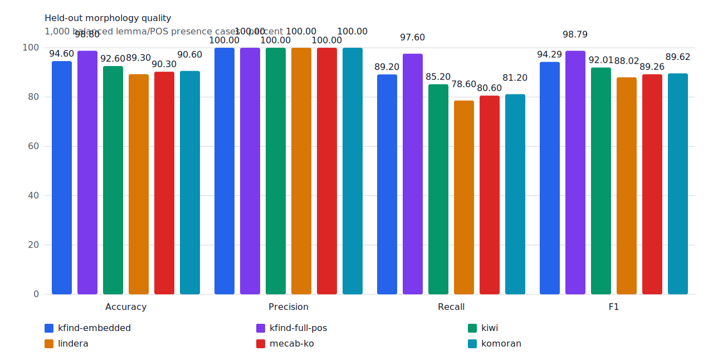
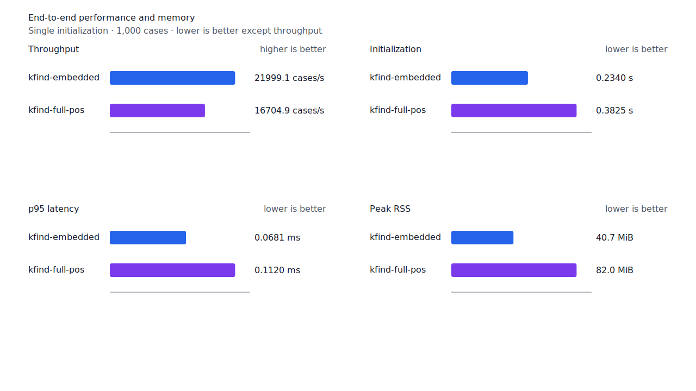
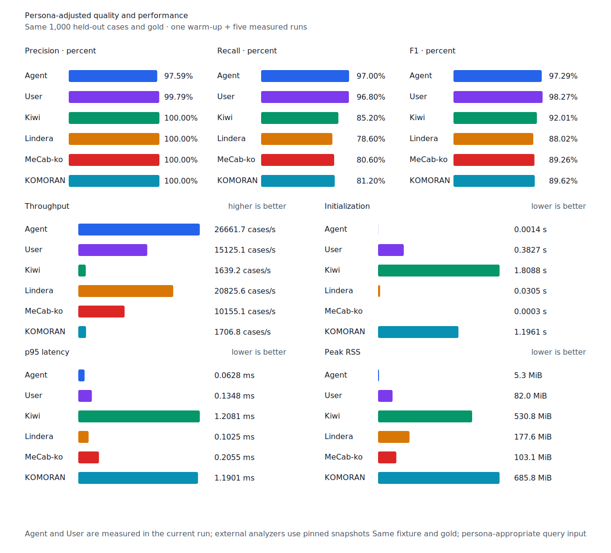

# 관형형 뒤 의존명사·조사 recall

- 측정일: 2026-07-17
- 최신 `origin/main` 및 기준 revision:
  `28de69fa13ac6b62f86a37bdbabee556dc02207b`
- 후보 revision: `eaa29f79cd898be99a1b6f66c0fdaba557c48d5e`
- 환경: Linux 6.12.76/linuxkit aarch64, 10 logical CPUs, Python 3.12.13,
  Rust 1.97.0, Docker 29.6.1
- 반복: fresh process warm-up 1회 뒤 5회 측정의 중앙값
- canonical test fixture:
  `933bc12197da866d2363d7df9107d4d9be89a65ddaafd73968ad5384832b21ff`
- canonical development fixture:
  `604c3a139854fcf59570392f48ab85028785f4a3561ea3c5e702f88b841f907c`
- explicit-POS matrix:
  `fbcce40b533655085ff8a4e9031559f99b54f86abe188b6ddc1d690dd44326c6`
- untagged matrix:
  `b9dd7601301fa19b35acba735a977eba7c56a0c9d67c65dee32db5c8028c71bb`
- development matrix:
  `bc67497c3dc966fb7453b238df52c6d781b1b4485d40e8a5d6a38104dcc7abed`
- hard-negative fixture:
  `f4d8829977ebfd061003724ee4aeb23b36dd901f6e46171c924a1f52a63f0ee5`
- 100 MiB corpus:
  `7692072cb7bff9261c1fa5933bde41b27e558170818eeac6d07cabdd673815ff`
- 기준 report SHA-256:
  `2643b1221e9b5d96582e634797470080745503b73cf55e8a3329f523530d09f9`
- 후보 report SHA-256:
  `d76968fb0dff50483a017ebf10cf01798fdfb77998115b368d472093a54a51d2`

## 원인과 규칙

`온지를`의 generator candidate는 `ending.past-adnominal`로 `온`까지 소비했지만, 뒤의
의존명사 `지`와 목적격 조사 `를`을 남겼다. Source lattice의 query 포함 경로는
`온/VV+ETM + 지/NNB + 를/JKO`였고, 기존 제품 규칙은 관형형 뒤 `때`·`게`만 별도로
허용했다.

관형형 candidate 뒤가 `지`로 시작할 때 같은 품사의 source graph를 두 구간으로 검증한다.
Candidate가 소비한 경계까지는 마지막 어미가 실제 `ETM`인 `predicate + E* + ETM`, 그 뒤
token 끝까지는 `NNB/NNBC + J+`여야 한다. Fused `VV+ETM` edge도 허용하지만 의존명사나
조사 중 하나가 없거나 순서가 바뀌면 거부한다. Matrix contract 정의, annotation과 gate는
변경하지 않았다.

## Canonical 품질과 contract 지표

`PNᶜ`는 contract-positive 분모 `TPᶜ + FNᶜ`다. Canonical fixture의 `PNᶜ`는 500이며
reclassified case는 0건이다.

| fixture/profile | 기준 TPᶜ / FPᶜ / FNᶜ | 후보 TPᶜ / FPᶜ / FNᶜ | PNᶜ | recallᶜ |
| --- | ---: | ---: | ---: | ---: |
| development embedded `smart` | 455 / 4 / 45 | 455 / 4 / 45 | 500 | 91.0% → 91.0% |
| development full-POS `smart` | 468 / 4 / 32 | 468 / 4 / 32 | 500 | 93.6% → 93.6% |
| test embedded `smart` | 446 / 0 / 54 | 446 / 0 / 54 | 500 | 89.2% → 89.2% |
| test full-POS `smart` | 487 / 0 / 13 | 488 / 0 / 12 | 500 | 97.4% → 97.6% |
| Human full-POS `smart` | 483 / 1 / 17 | 484 / 1 / 16 | 500 | 96.6% → 96.8% |
| Agent embedded `any` | 485 / 12 / 15 | 485 / 12 / 15 | 500 | 97.0% → 97.0% |

Test full-POS와 Human은 `온지를`의 `오다` 1건을 회수했다. 새 FP·FPᶜ와 회귀는 없다.
Embedded에는 full-POS source 근거가 없어 결과가 유지됐고 Agent `any`는 기존에도 `온`을
후보로 반환했다. Hard-negative도 기준과 후보가 모두 strict `FP 6 / TN 32`,
contract-adjusted `TPᶜ 5 / FPᶜ 1 / TNᶜ 32 / FNᶜ 0`이다. 기존
`nominalizer-particle` 4건은 모두 TN을 유지했다.



## Query matrix strict·contract-adjusted 품질

현재 matrix의 reclassified case는 0건이므로 strict와 contract-adjusted confusion matrix가
같다. Test matrix의 `PNᶜ=1,401`, development matrix의 `PNᶜ=1,391`이다.

| fixture/profile | 기준 TPᶜ / FPᶜ / FNᶜ | 후보 TPᶜ / FPᶜ / FNᶜ | PNᶜ | recallᶜ | 모든 contract 질의 회수 |
| --- | ---: | ---: | ---: | ---: | ---: |
| development embedded `smart` | 1,233 / 7 / 158 | 1,233 / 7 / 158 | 1,391 | 88.64% → 88.64% | 326 → 326 / 466 |
| development full-POS `smart` | 1,290 / 8 / 101 | 1,290 / 8 / 101 | 1,391 | 92.74% → 92.74% | 372 → 372 / 466 |
| test embedded `smart` | 1,261 / 5 / 140 | 1,261 / 5 / 140 | 1,401 | 90.01% → 90.01% | 341 → 341 / 468 |
| test full-POS `smart` | 1,344 / 5 / 57 | 1,346 / 5 / 55 | 1,401 | 95.93% → 96.07% | 414 → 416 / 468 |
| Human full-POS `smart` | 1,342 / 4 / 59 | 1,344 / 4 / 57 | 1,401 | 95.79% → 95.93% | 411 → 413 / 468 |
| Agent embedded `any` | 1,366 / 22 / 35 | 1,366 / 22 / 35 | 1,401 | 97.50% → 97.50% | 433 → 433 / 468 |

Test matrix의 full-POS와 Human은 `온지를`의 `오다`, `좋아할지도`의 `좋아하다` 2건을
회수했다. 두 문장은 각각 완전 회수 상태로 이동했다. 모든 profile에서 새 FP·FPᶜ와 회귀는
없다.

## 성능

모든 morphology 행은 같은 환경에서 fresh process warm-up 1회 뒤 5회 측정한
`median [min, max]`다. 모든 변화는 10% 회귀 경고선 안이다.

| workload | revision | initialization (s) | cases/s | p95 (ms) | RSS (KiB) |
| --- | --- | ---: | ---: | ---: | ---: |
| canonical embedded `smart` | 기준 | 0.230159 [0.229896, 0.234874] | 22,246.5 [21,011.4, 22,452.6] | 0.0667 [0.0657, 0.0708] | 41,596 [41,592, 41,604] |
| canonical embedded `smart` | 후보 | 0.233979 [0.232885, 0.249209] | 21,999.1 [21,532.3, 22,257.2] | 0.0681 [0.0667, 0.0696] | 41,656 [41,652, 41,672] |
| canonical full-POS `smart` | 기준 | 0.378314 [0.375387, 0.391331] | 16,841.7 [16,431.5, 16,950.2] | 0.1119 [0.1112, 0.1152] | 83,932 [83,872, 83,956] |
| canonical full-POS `smart` | 후보 | 0.382482 [0.376755, 0.393517] | 16,704.9 [15,717.2, 17,003.5] | 0.1120 [0.1098, 0.1211] | 83,932 [83,852, 83,956] |
| canonical Agent `any` | 기준 | 0.001431 [0.001412, 0.001520] | 26,853.9 [26,493.0, 27,017.0] | 0.0616 [0.0615, 0.0638] | 5,324 [5,316, 5,332] |
| canonical Agent `any` | 후보 | 0.001414 [0.001401, 0.001438] | 26,661.7 [23,668.1, 26,805.0] | 0.0628 [0.0618, 0.0675] | 5,388 [5,380, 5,400] |
| canonical Human `smart` | 기준 | 0.380188 [0.379293, 0.442375] | 15,189.3 [14,671.0, 15,307.9] | 0.1352 [0.1315, 0.1398] | 83,944 [83,888, 83,972] |
| canonical Human `smart` | 후보 | 0.383818 [0.380384, 0.395140] | 15,221.6 [14,191.7, 15,316.6] | 0.1337 [0.1331, 0.1432] | 83,888 [83,884, 83,952] |
| matrix Agent `any` | 기준 | 0.001440 [0.001423, 0.001457] | 27,550.4 [26,669.7, 27,601.5] | 0.0604 [0.0600, 0.0648] | 8,432 [8,424, 8,436] |
| matrix Agent `any` | 후보 | 0.001453 [0.001438, 0.001508] | 27,403.5 [27,217.1, 27,563.3] | 0.0607 [0.0603, 0.0613] | 8,500 [8,492, 8,504] |
| matrix Human `smart` | 기준 | 0.379181 [0.378535, 0.384544] | 15,864.1 [14,569.4, 15,963.8] | 0.1362 [0.1350, 0.1482] | 84,708 [84,704, 84,712] |
| matrix Human `smart` | 후보 | 0.382150 [0.380487, 0.385770] | 15,856.2 [15,682.9, 15,921.4] | 0.1375 [0.1372, 0.1392] | 84,692 [84,684, 84,756] |

중앙값 기준 canonical embedded/full-POS/Agent/Human cases/s 변화는 각각 -1.11%, -0.81%,
-0.72%, +0.21%다. Matrix Agent와 Human은 각각 -0.53%, -0.05%다. 100 MiB CLI 처리량은
Agent 5,291.94→5,336.70 MiB/s(+0.85%), Human 345.12→345.66 MiB/s(+0.16%)다.

동일 canonical fixture의 후보 Agent는 26,661.7 cases/s로 Lindera 4.0.0 고정 snapshot의
20,825.6 cases/s보다 28.02% 빠르다. recallᶜ는 97.0% 대 78.6%, peak RSS는
5.3 MiB 대 177.6 MiB다.





## 남은 FN

Canonical test full-POS의 `PNᶜ`는 500, `FNᶜ`는 12다. Matrix full-POS의 `PNᶜ`는
1,401, `FNᶜ`는 55다. 가장 큰 동일 질의 묶음인 부사 `안` 3건과 형용사 `이다` 3건은
비표준 붙여쓰기·무표면 축약·표기다.

남은 표준형 중 `어떻다→어떤가`는 lexical 관형형 candidate 뒤 의문 종결형이 남는 별도
구조다. 다음 작업은 source `VA + EF` 완성 경로와 경쟁 `MM + JKS` 경로를 case-level로
대조해 용언 경로만 안전하게 회수할 수 있는지 검증한다.

## 재현

```console
git switch --detach 28de69fa13ac6b62f86a37bdbabee556dc02207b
KFIND_MORPH_IMAGE=kfind-morph-benchmark:adnominal-dependent-noun-base-28de69f \
KFIND_MORPH_RUNS=5 \
scripts/benchmark-morphology.sh target/morph-adnominal-dependent-noun-base-28de69f

git switch --detach eaa29f79cd898be99a1b6f66c0fdaba557c48d5e
KFIND_MORPH_IMAGE=kfind-morph-benchmark:adnominal-dependent-noun-candidate-eaa29f7 \
KFIND_MORPH_RUNS=5 \
scripts/benchmark-morphology.sh target/morph-adnominal-dependent-noun-candidate-eaa29f7

python3 tools/morph-compare/render_charts.py \
  target/morph-adnominal-dependent-noun-candidate-eaa29f7/report.json \
  docs/benchmarks/assets \
  --prefix 2026-07-17-adnominal-dependent-noun-recall-

python3 tools/morph-compare/export_site_snapshot.py \
  target/morph-adnominal-dependent-noun-candidate-eaa29f7/report.json \
  docs/benchmarks/site-morphology.json \
  --revision eaa29f79cd898be99a1b6f66c0fdaba557c48d5e
```

외부 분석기 snapshot은 fixture, adapter schema와 고정 버전·설정이 바뀌지 않아 갱신하지
않았다.
