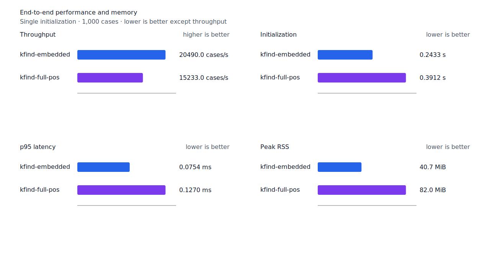
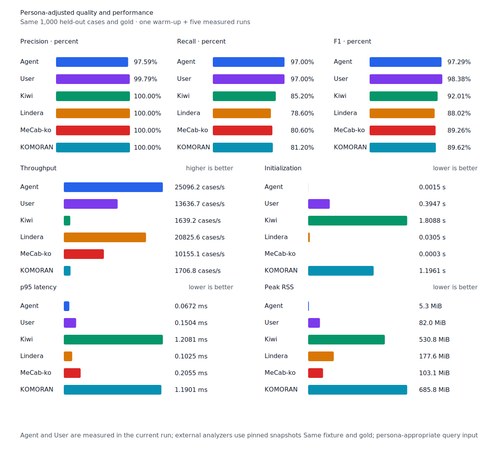

# 관형형 의문 종결 recall

- 측정일: 2026-07-17
- 최신 `origin/main` 및 기준 revision:
  `faf6a8c4d3ce6ae8c1ce97004a70611352279dc2`
- 후보 revision: `146812591e4200fc112789d90a007db8e57ca917`
- 환경: Linux 6.12.76/linuxkit aarch64, 10 logical CPUs, Python 3.12.13,
  Rust 1.97.0, Docker 29.6.1
- 반복: fresh process warm-up 1회 뒤 5회 측정의 중앙값
- canonical test fixture:
  `933bc12197da866d2363d7df9107d4d9be89a65ddaafd73968ad5384832b21ff`
- canonical development fixture:
  `604c3a139854fcf59570392f48ab85028785f4a3561ea3c5e702f88b841f907c`
- explicit-POS matrix:
  `fbcce40b533655085ff8a4e9031559f99b54f86abe188b6ddc1d690dd44326c6`
- untagged matrix:
  `b9dd7601301fa19b35acba735a977eba7c56a0c9d67c65dee32db5c8028c71bb`
- development matrix:
  `bc67497c3dc966fb7453b238df52c6d781b1b4485d40e8a5d6a38104dcc7abed`
- hard-negative fixture:
  `f4d8829977ebfd061003724ee4aeb23b36dd901f6e46171c924a1f52a63f0ee5`
- 100 MiB corpus:
  `7692072cb7bff9261c1fa5933bde41b27e558170818eeac6d07cabdd673815ff`
- 기준 report SHA-256:
  `20dfc6b9b7cf5710b12151820f2bd1f26d8d5131d878b03455250a37fe70efea`
- 후보 report SHA-256:
  `1d0489b0bc111b1bab5e87c066320bf2e67b9a9babcc2f8e2ef8033529ef310e`

## 원인과 규칙

`어떤가`의 generator candidate는 `lexical.drop-h -> ending.past-adnominal`로 `어떤`까지
소비하고 `가`를 남겼다. Smart boundary는 이 suffix를 거부했다. 고정 source resource에는
같은 token에 `어떤/VA + 가/EC` 경로와 경쟁 `어떤가/MM+EC` 경로가 함께 있었다.

관형형 candidate가 정확히 `가`만 남길 때 같은 품사의 source graph가 query core부터 token
끝까지 `predicate + E+`인 경우에만 전체 token 경계를 검증한다. Whole modifier 경로는 단독
근거가 아니지만 typed predicate 경로와 공존하면 recall-first 정책에 따라 용언 후보를
유지한다. Component resource가 없거나 predicate 경로가 없거나 `가` 뒤에 조사가 더 남으면
거부한다. Matrix contract 정의, annotation과 gate는 변경하지 않았다.

## Canonical 품질과 contract 지표

`PNᶜ`는 contract-positive 분모 `TPᶜ + FNᶜ`다. Canonical fixture의 `PNᶜ`는 500이며
reclassified case는 0건이다.

| fixture/profile | 기준 TPᶜ / FPᶜ / FNᶜ | 후보 TPᶜ / FPᶜ / FNᶜ | PNᶜ | recallᶜ |
| --- | ---: | ---: | ---: | ---: |
| development embedded `smart` | 455 / 4 / 45 | 455 / 4 / 45 | 500 | 91.0% → 91.0% |
| development full-POS `smart` | 468 / 4 / 32 | 468 / 4 / 32 | 500 | 93.6% → 93.6% |
| test embedded `smart` | 446 / 0 / 54 | 447 / 0 / 53 | 500 | 89.2% → 89.4% |
| test full-POS `smart` | 488 / 0 / 12 | 489 / 0 / 11 | 500 | 97.6% → 97.8% |
| Human full-POS `smart` | 484 / 1 / 16 | 485 / 1 / 15 | 500 | 96.8% → 97.0% |
| Agent embedded `any` | 485 / 12 / 15 | 485 / 12 / 15 | 500 | 97.0% → 97.0% |

Embedded smart, full-POS와 Human은 모두 `반면 미국은 어떤가.`의 `어떻다` 1건을 회수했다.
새 FP·FPᶜ와 회귀는 없다. Agent `any`는 기존에도 생성 surface를 반환했다. Hard-negative의
기준과 후보 결과는 같다. Embedded는 strict `FP 4 / TN 34`, contract-adjusted
`TPᶜ 3 / FPᶜ 1 / TNᶜ 32 / FNᶜ 2`이고 full-POS는 strict `FP 6 / TN 32`,
contract-adjusted `TPᶜ 5 / FPᶜ 1 / TNᶜ 32 / FNᶜ 0`이다.


## Query matrix strict·contract-adjusted 품질

현재 matrix의 reclassified case는 0건이므로 strict와 contract-adjusted confusion matrix가
같다. Test matrix의 `PNᶜ=1,401`, development matrix의 `PNᶜ=1,391`이다.

| fixture/profile | 기준 TPᶜ / FPᶜ / FNᶜ | 후보 TPᶜ / FPᶜ / FNᶜ | PNᶜ | recallᶜ | 모든 contract 질의 회수 |
| --- | ---: | ---: | ---: | ---: | ---: |
| development embedded `smart` | 1,233 / 7 / 158 | 1,234 / 7 / 157 | 1,391 | 88.64% → 88.71% | 326 → 327 / 466 |
| development full-POS `smart` | 1,290 / 8 / 101 | 1,291 / 8 / 100 | 1,391 | 92.74% → 92.81% | 372 → 373 / 466 |
| test embedded `smart` | 1,261 / 5 / 140 | 1,262 / 5 / 139 | 1,401 | 90.01% → 90.08% | 341 → 342 / 468 |
| test full-POS `smart` | 1,346 / 5 / 55 | 1,347 / 5 / 54 | 1,401 | 96.07% → 96.15% | 416 → 417 / 468 |
| Human full-POS `smart` | 1,344 / 4 / 57 | 1,345 / 4 / 56 | 1,401 | 95.93% → 96.00% | 413 → 414 / 468 |
| Agent embedded `any` | 1,366 / 22 / 35 | 1,366 / 22 / 35 | 1,401 | 97.50% → 97.50% | 433 → 433 / 468 |

Test와 development matrix에서도 세 smart profile이 같은 `어떻다→어떤가` 1건만
회수했다. 해당 문장은 모든 contract 질의 회수 상태로 이동했다. 모든 profile에서 새
FP·FPᶜ와 회귀는 없다.

## 성능

모든 morphology 행은 빌드 없이 캐시된 후보와 기준 이미지를 연속 재실행하고, fresh process
warm-up 1회 뒤 5회 측정한 `median [min, max]`다. 모든 변화는 10% 회귀 경고선 안이다.

| workload | revision | initialization (s) | cases/s | p95 (ms) | RSS (KiB) |
| --- | --- | ---: | ---: | ---: | ---: |
| canonical embedded `smart` | 기준 | 0.247464 [0.244170, 0.248666] | 20,094.1 [19,491.0, 20,481.5] | 0.0765 [0.0752, 0.0843] | 41,660 [41,652, 41,668] |
| canonical embedded `smart` | 후보 | 0.243327 [0.240180, 0.273022] | 20,490.0 [20,309.6, 20,505.7] | 0.0754 [0.0733, 0.0790] | 41,664 [41,660, 41,672] |
| canonical full-POS `smart` | 기준 | 0.394891 [0.392298, 0.395729] | 14,894.4 [12,616.4, 15,237.8] | 0.1318 [0.1274, 0.1466] | 83,964 [83,960, 83,964] |
| canonical full-POS `smart` | 후보 | 0.391227 [0.388215, 0.392335] | 15,233.0 [15,143.1, 15,490.1] | 0.1270 [0.1235, 0.1288] | 83,964 [83,960, 83,964] |
| canonical Agent `any` | 기준 | 0.001509 [0.001486, 0.001615] | 24,661.5 [23,587.3, 25,383.3] | 0.0696 [0.0672, 0.0715] | 5,388 [5,380, 5,396] |
| canonical Agent `any` | 후보 | 0.001497 [0.001496, 0.001547] | 25,096.2 [23,965.2, 25,479.8] | 0.0672 [0.0663, 0.0714] | 5,384 [5,376, 5,400] |
| canonical Human `smart` | 기준 | 0.397094 [0.396618, 0.410128] | 13,730.3 [12,415.0, 14,110.2] | 0.1514 [0.1445, 0.1767] | 83,984 [83,976, 84,012] |
| canonical Human `smart` | 후보 | 0.392288 [0.391472, 0.402601] | 13,617.2 [13,173.8, 13,725.1] | 0.1519 [0.1498, 0.1577] | 83,980 [83,972, 83,984] |
| matrix Agent `any` | 기준 | 0.001520 [0.001484, 0.001984] | 25,273.9 [24,205.9, 25,821.0] | 0.0678 [0.0660, 0.0694] | 8,500 [8,488, 8,500] |
| matrix Agent `any` | 후보 | 0.001508 [0.001496, 0.001626] | 25,936.2 [25,826.3, 26,158.2] | 0.0655 [0.0652, 0.0661] | 8,500 [8,488, 8,500] |
| matrix Human `smart` | 기준 | 0.396915 [0.396177, 0.401125] | 14,195.3 [13,755.3, 14,313.8] | 0.1516 [0.1507, 0.1575] | 84,708 [84,708, 84,716] |
| matrix Human `smart` | 후보 | 0.403962 [0.399343, 0.614346] | 13,960.4 [13,207.0, 14,184.1] | 0.1546 [0.1539, 0.1621] | 84,748 [84,692, 84,756] |

중앙값 기준 canonical embedded/full-POS/Agent/Human cases/s 변화는 각각 +1.97%, +2.27%,
+1.76%, -0.82%다. Matrix Agent와 Human은 각각 +2.62%, -1.65%다. 100 MiB CLI 처리량은
Agent 5,079.30→4,990.00 MiB/s(-1.76%), Human 327.02→327.41 MiB/s(+0.12%)다.

동일 canonical fixture의 후보 Agent는 25,096.2 cases/s로 Lindera 4.0.0 고정 snapshot의
20,825.6 cases/s보다 20.51% 빠르다. recallᶜ는 97.0% 대 78.6%, peak RSS는
5.3 MiB 대 177.6 MiB다.





## 남은 FN

Canonical test full-POS의 `PNᶜ`는 500, `FNᶜ`는 11이다. Matrix full-POS의 `PNᶜ`는
1,401, `FNᶜ`는 54다. Matrix의 가장 큰 동일 질의 묶음인 부사 `안`, 형용사 `이다`와
`되다`는 각 3건이지만 붙여쓰기, 무표면 축약, 비표준 표기와 오류가 섞여 있다.

다음 제품 recall 작업은 표준형 내부 체언 성분인 `1년간→간`, `어느날→날`,
`첫번째로→번째`, `자본주의→주의`를 `compound-substring` hard-negative와 함께 분류한다.
Source component 정렬만으로 공통 typed 구조를 안전하게 열 수 있는지 확인하고, 독립 구조가
아니면 canonical 규칙에 합치지 않는다.

## 재현

```console
git switch --detach 146812591e4200fc112789d90a007db8e57ca917
KFIND_MORPH_IMAGE=kfind-morph-benchmark:interrogative-ending-candidate-1468125 \
KFIND_MORPH_RUNS=5 \
scripts/benchmark-morphology.sh target/morph-interrogative-ending-candidate-1468125-rerun

git switch --detach faf6a8c4d3ce6ae8c1ce97004a70611352279dc2
KFIND_MORPH_IMAGE=kfind-morph-benchmark:interrogative-ending-base-faf6a8c \
KFIND_MORPH_RUNS=5 \
scripts/benchmark-morphology.sh target/morph-interrogative-ending-base-faf6a8c-rerun

python3 tools/morph-compare/render_charts.py \
  target/morph-interrogative-ending-candidate-1468125-rerun/report.json \
  docs/benchmarks/assets \
  --prefix 2026-07-17-adnominal-interrogative-recall-

python3 tools/morph-compare/export_site_snapshot.py \
  target/morph-interrogative-ending-candidate-1468125-rerun/report.json \
  docs/benchmarks/site-morphology.json \
  --revision 146812591e4200fc112789d90a007db8e57ca917
```

외부 분석기 snapshot은 fixture, adapter schema와 고정 버전·설정이 바뀌지 않아 갱신하지
않았다.
