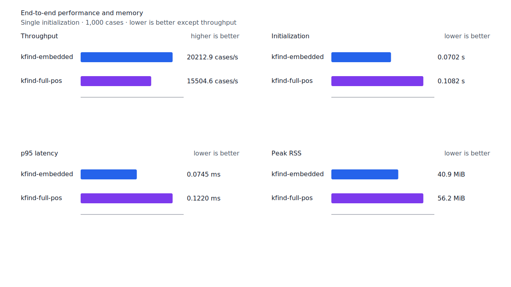
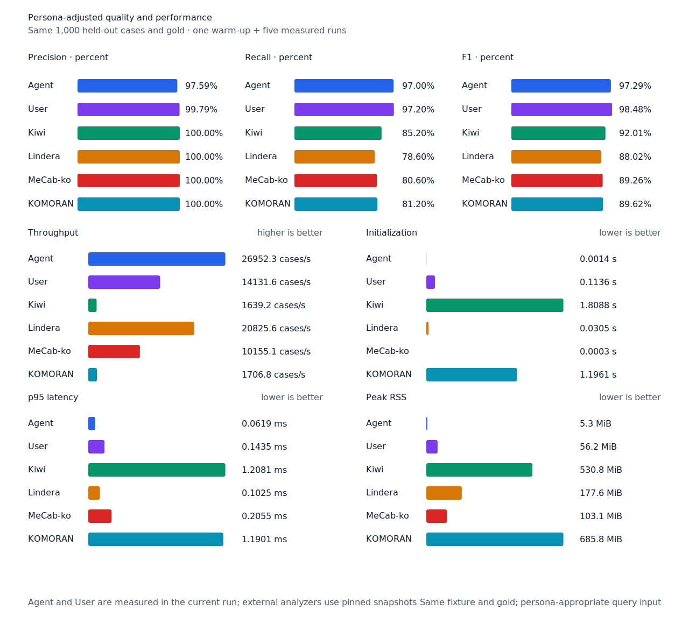

# 선두 부사와 predicate 경쟁 경로 recall

- 측정일: 2026-07-17
- 최신 `origin/main` 및 기준 revision:
  `a7a522370cd61b810fc2a0a137821b380340d540`
- 후보 revision: `3cfed8ab74c138df8f134d29741f8987f0a046d6`
- 환경: Linux 6.12.76/linuxkit aarch64, 10 logical CPUs, Python 3.12.13,
  Rust 1.97.0, Docker 29.6.1
- 반복: fresh process warm-up 1회 뒤 5회 측정의 중앙값
- canonical test fixture:
  `933bc12197da866d2363d7df9107d4d9be89a65ddaafd73968ad5384832b21ff`
- canonical development fixture:
  `604c3a139854fcf59570392f48ab85028785f4a3561ea3c5e702f88b841f907c`
- explicit-POS matrix:
  `fbcce40b533655085ff8a4e9031559f99b54f86abe188b6ddc1d690dd44326c6`
- untagged matrix:
  `b9dd7601301fa19b35acba735a977eba7c56a0c9d67c65dee32db5c8028c71bb`
- development matrix:
  `bc67497c3dc966fb7453b238df52c6d781b1b4485d40e8a5d6a38104dcc7abed`
- hard-negative fixture:
  `f4d8829977ebfd061003724ee4aeb23b36dd901f6e46171c924a1f52a63f0ee5`
- 100 MiB corpus:
  `7692072cb7bff9261c1fa5933bde41b27e558170818eeac6d07cabdd673815ff`
- 기준 report SHA-256:
  `071e93dd72d89162c30d131d910d7ad83d89aa756175170f16d93b9baa65166f`
- 후보 report SHA-256:
  `742c03c5be46b13313fcb0eb301f79d24455c6b8c2cdc049079d53f40268a605`

## 원인과 규칙

선두 `MAG`와 남은 predicate suffix의 완전 graph path가 있어도 체언+조사 host가 함께
선택되면 nominal selection이 runtime component를 거부했다. 이 경쟁이 있더라도 `MAG`가 token
시작에 정렬되고, suffix 하나가 그 직후부터 token 끝까지 predicate edge로 완성되며,
whole-token 분석이 없을 때는 부사를 유지한다. Predicate suffix가 없는 체언+조사 경로만으로는
열지 않는다.

현재 component resource의 `안나와요`에는 이 근거가 있어 `안/MAG`를 회수한다. 구조 단위
회귀 테스트는 같은 근거가 주어진 `못해요`도 허용함을 검증하지만, 실제 fixture의 `못해요`에는
완전 predicate suffix edge가 없어 계속 거부한다. Matrix contract 정의, annotation과 gate는
변경하지 않았다.

## 품질과 contract 지표

`PNᶜ = TPᶜ + FNᶜ`다. Matrix의 reclassified case는 0건이라 strict와 contract-adjusted
confusion matrix가 같다. 모든 FP와 FPᶜ case ID는 기준과 후보가 같다.

| matrix/profile | 기준 TPᶜ / FPᶜ / FNᶜ | 후보 TPᶜ / FPᶜ / FNᶜ | PNᶜ | recallᶜ | 모든 contract 질의 회수 |
| --- | ---: | ---: | ---: | ---: | ---: |
| test embedded `smart` | 1,270 / 5 / 131 | 1,271 / 5 / 130 | 1,401 | 90.65% → 90.72% | 348 → 349 / 468 |
| test full-POS `smart` | 1,355 / 5 / 46 | 1,356 / 5 / 45 | 1,401 | 96.72% → 96.79% | 424 → 425 / 468 |
| Human full-POS `smart` | 1,352 / 4 / 49 | 1,353 / 4 / 48 | 1,401 | 96.50% → 96.57% | 420 → 421 / 468 |
| Agent embedded `any` | 1,366 / 22 / 35 | 1,366 / 22 / 35 | 1,401 | 97.50% → 97.50% | 433 → 433 / 468 |
| development embedded `smart` | 1,237 / 7 / 154 | 1,237 / 7 / 154 | 1,391 | 88.93% → 88.93% | 329 → 329 / 466 |
| development full-POS `smart` | 1,294 / 8 / 97 | 1,294 / 8 / 97 | 1,391 | 93.03% → 93.03% | 376 → 376 / 466 |

Test explicit-POS embedded와 full-POS, Human은 같은
`matrix:pos:ud-korean-ksl:ARG-ENG_06_2_10_1:3`의 `안나와요→안`을 회수했다. 다른 TP/FN
이동이나 신규 FP는 없다. Canonical, development와 Agent 결과도 같다.

Canonical embedded/full-POS의 `TPᶜ / FPᶜ / FNᶜ`는 각각 `449 / 0 / 51`,
`491 / 0 / 9`다. Canonical Human은 `486 / 1 / 14`, Agent는 `485 / 12 / 15`다.
Hard-negative 전체 결과도 같다. Embedded는 contract-adjusted
`TPᶜ 3 / FPᶜ 1 / TNᶜ 32 / FNᶜ 2`, full-POS는
`TPᶜ 5 / FPᶜ 1 / TNᶜ 32 / FNᶜ 0`이다.


## 성능

모든 morphology 행은 같은 환경에서 fresh process warm-up 1회 뒤 5회 측정한
`median [min, max]`다.

| workload | revision | initialization (s) | cases/s | p95 (ms) | RSS (KiB) |
| --- | --- | ---: | ---: | ---: | ---: |
| canonical embedded `smart` | 기준 | 0.063664 [0.062205, 0.073518] | 21,505.1 [18,665.8, 21,595.6] | 0.0692 [0.0681, 0.0804] | 41,860 [41,844, 41,864] |
| canonical embedded `smart` | 후보 | 0.070205 [0.068351, 0.077724] | 20,212.9 [19,862.9, 21,531.0] | 0.0745 [0.0685, 0.0776] | 41,852 [41,848, 41,868] |
| canonical full-POS `smart` | 기준 | 0.103657 [0.102511, 0.112896] | 15,987.1 [15,339.8, 16,510.3] | 0.1173 [0.1133, 0.1276] | 57,520 [57,496, 57,564] |
| canonical full-POS `smart` | 후보 | 0.108234 [0.102794, 0.125761] | 15,504.6 [14,224.1, 16,394.7] | 0.1220 [0.1139, 0.1390] | 57,536 [57,528, 57,560] |
| canonical Agent `any` | 기준 | 0.001470 [0.001409, 0.001546] | 26,780.4 [25,674.6, 27,036.7] | 0.0633 [0.0618, 0.0668] | 5,396 [5,380, 5,404] |
| canonical Agent `any` | 후보 | 0.001430 [0.001406, 0.001452] | 26,952.3 [26,729.2, 27,042.4] | 0.0619 [0.0613, 0.0634] | 5,396 [5,376, 5,396] |
| canonical Human `smart` | 기준 | 0.103807 [0.102307, 0.108344] | 14,817.0 [14,787.6, 14,878.6] | 0.1361 [0.1358, 0.1377] | 57,580 [57,520, 57,584] |
| canonical Human `smart` | 후보 | 0.103196 [0.102318, 0.112111] | 14,955.8 [14,921.9, 14,970.0] | 0.1348 [0.1336, 0.1358] | 57,520 [57,504, 57,572] |
| matrix Agent `any` | 기준 | 0.001444 [0.001434, 0.001522] | 27,614.7 [27,418.0, 27,792.7] | 0.0602 [0.0598, 0.0613] | 8,500 [8,488, 8,508] |
| matrix Agent `any` | 후보 | 0.001482 [0.001435, 0.001522] | 27,626.8 [27,521.3, 27,682.3] | 0.0604 [0.0597, 0.0609] | 8,496 [8,488, 8,508] |
| matrix Human `smart` | 기준 | 0.101869 [0.101528, 0.102389] | 15,342.6 [15,279.3, 15,574.4] | 0.1402 [0.1385, 0.1410] | 58,252 [58,252, 58,320] |
| matrix Human `smart` | 후보 | 0.103608 [0.102396, 0.110618] | 15,458.0 [14,087.5, 15,516.4] | 0.1401 [0.1384, 0.1540] | 58,304 [58,304, 58,304] |

중앙값 기준 canonical embedded/full-POS/Agent/Human cases/s 변화는 각각 -6.01%, -3.02%,
+0.64%, +0.94%다. Matrix Agent와 Human은 +0.04%, +0.75%다. 모든 회귀는 10% 경고선
안이고 기준과 후보 측정 범위가 겹친다.

100 MiB CLI 처리량은 Agent 5,507.53→5,884.96 MiB/s(+6.85%), Human
936.88→936.21 MiB/s(-0.07%)다. 동일 canonical fixture의 후보 Agent는
26,952.3 cases/s로 Lindera 4.0.0 고정 snapshot의 20,825.6 cases/s보다 29.42% 빠르다.
Recallᶜ는 97.0% 대 78.6%, peak RSS는 5.3 MiB 대 177.6 MiB다.





## 남은 FN

Test matrix full-POS의 `PNᶜ`는 1,401, `FNᶜ`는 45이고 Human `FNᶜ`는 48이다.
Development full-POS의 `PNᶜ`는 1,391, `FNᶜ`는 97이다. Test full-POS FNᶜ는
`boundary-rejected` 21건, `gold-or-adapter` 15건, `surface-missing` 6건,
`continuation-rejected` 2건, `span-mismatch` 1건이다.

남은 부사 경계 거부는 `못해요→못` 1건이다. 실제 resource에는 predicate suffix를 완성하는
edge가 없으므로 이 규칙을 약화하지 않는다. 다음 제품 recall 작업은 남은 표준형
predicate/continuation 경계 거부를 동일 구조별로 묶어 가장 큰 slice를 고른다.

## 재현

```console
git switch --detach 3cfed8ab74c138df8f134d29741f8987f0a046d6
KFIND_MORPH_IMAGE=kfind-morph-benchmark:adverb-predicate-candidate-3cfed8a \
KFIND_MORPH_RUNS=5 \
scripts/benchmark-morphology.sh target/morph-adverb-predicate-candidate-3cfed8a

git switch --detach a7a522370cd61b810fc2a0a137821b380340d540
KFIND_MORPH_IMAGE=kfind-morph-benchmark:adverb-predicate-base-a7a5223 \
KFIND_MORPH_RUNS=5 \
scripts/benchmark-morphology.sh target/morph-adverb-predicate-base-a7a5223

python3 tools/morph-compare/render_charts.py \
  target/morph-adverb-predicate-candidate-3cfed8a/report.json \
  docs/benchmarks/assets \
  --prefix 2026-07-17-adverb-predicate-competitor-recall-

python3 tools/morph-compare/export_site_snapshot.py \
  target/morph-adverb-predicate-candidate-3cfed8a/report.json \
  docs/benchmarks/site-morphology.json \
  --revision 3cfed8ab74c138df8f134d29741f8987f0a046d6
```

외부 분석기 snapshot은 fixture, adapter schema와 고정 버전·설정이 바뀌지 않아 갱신하지
않았다.
