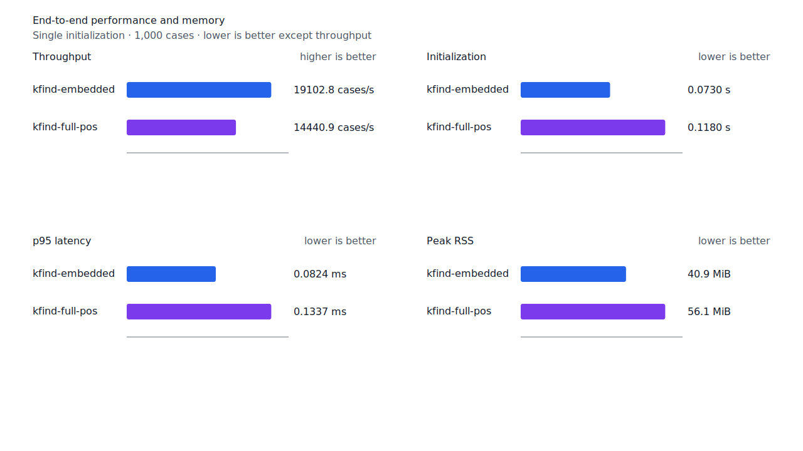
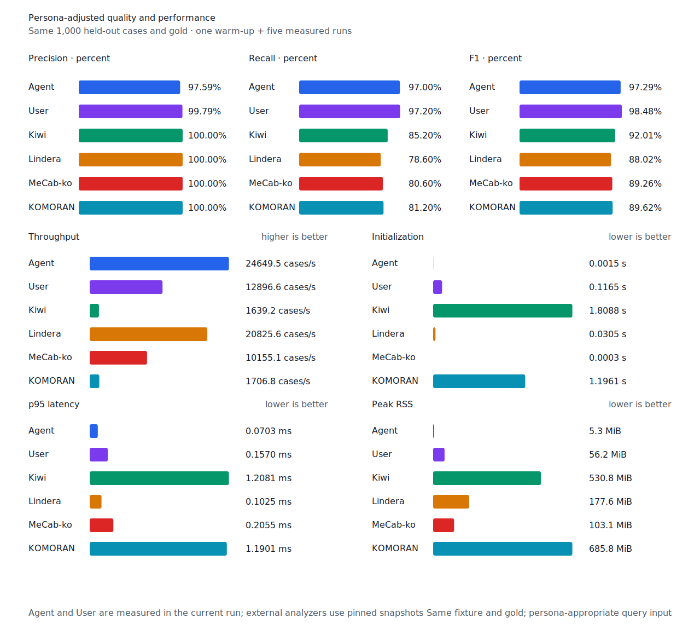

# 부사형 뒤 보조사 recall

- 측정일: 2026-07-17
- 기준 revision: `c83f31f5a3f52e8e22599cd4941ff76f6d13f492`
- 후보 revision: `139a05359e8ea4e867758c85f917655f623f9244`
- 환경: Linux 6.12.76/linuxkit aarch64, 10 logical CPUs, Python 3.12.13,
  Rust 1.97.0, Docker 29.6.1
- 반복: fresh process warm-up 1회 뒤 5회 측정의 중앙값
- canonical test fixture:
  `933bc12197da866d2363d7df9107d4d9be89a65ddaafd73968ad5384832b21ff`
- canonical development fixture:
  `604c3a139854fcf59570392f48ab85028785f4a3561ea3c5e702f88b841f907c`
- explicit-POS matrix:
  `fbcce40b533655085ff8a4e9031559f99b54f86abe188b6ddc1d690dd44326c6`
- untagged matrix:
  `b9dd7601301fa19b35acba735a977eba7c56a0c9d67c65dee32db5c8028c71bb`
- development matrix:
  `bc67497c3dc966fb7453b238df52c6d781b1b4485d40e8a5d6a38104dcc7abed`
- hard-negative fixture:
  `f4d8829977ebfd061003724ee4aeb23b36dd901f6e46171c924a1f52a63f0ee5`
- 100 MiB corpus:
  `7692072cb7bff9261c1fa5933bde41b27e558170818eeac6d07cabdd673815ff`
- 기준 report SHA-256:
  `7e64949e416c62151e1132bb15aaaea278bcd8b1acec3a0ef2cb45d34e29ada5`
- 후보 report SHA-256:
  `7e86a811a8579200bd04d154ba8dfee1f9468c69811deb5ef367ffdfdee52378`

## 원인과 규칙

`이렇다`의 `ending.adverbial-ge` program은 `이렇게`까지 생성했지만, 정확히 뒤따르는
보조사 `도`를 terminal 뒤 조사로 거부했다. Source graph에는 `VA + EC + JX`의 완성된
경로가 있었으므로 `-게` 뒤 정확한 `도`와 같은 품사의 완성 경로가 모두 있을 때만 구조
검증 범위를 전체 token으로 확장했다. `이렇게를`과 `이렇게도가`는 계속 거부한다.

비표준어·오탈자·띄어쓰기 오류는 탐색과 구현 후보에서 제외했다. Matrix contract 정의,
annotation과 gate는 변경하지 않았다.

## 품질과 contract 지표

`PNᶜ = TPᶜ + FNᶜ`다. Matrix의 reclassified case는 0건이라 strict와
contract-adjusted confusion matrix가 같다. 모든 FP와 FPᶜ case ID는 기준과 후보가 같다.

| matrix/profile | 기준 TPᶜ / FPᶜ / FNᶜ | 후보 TPᶜ / FPᶜ / FNᶜ | PNᶜ | recallᶜ | 모든 contract 질의 회수 |
| --- | ---: | ---: | ---: | ---: | ---: |
| test embedded `smart` | 1,272 / 5 / 129 | 1,272 / 5 / 129 | 1,401 | 90.79% → 90.79% | 350 → 350 / 468 |
| test full-POS `smart` | 1,358 / 5 / 43 | 1,359 / 5 / 42 | 1,401 | 96.93% → 97.00% | 426 → 427 / 468 |
| Human full-POS `smart` | 1,355 / 4 / 46 | 1,356 / 4 / 45 | 1,401 | 96.72% → 96.79% | 422 → 423 / 468 |
| Agent embedded `any` | 1,367 / 22 / 34 | 1,367 / 22 / 34 | 1,401 | 97.57% → 97.57% | 434 → 434 / 468 |
| development embedded `smart` | 1,237 / 7 / 154 | 1,237 / 7 / 154 | 1,391 | 88.93% → 88.93% | 329 → 329 / 466 |
| development full-POS `smart` | 1,294 / 8 / 97 | 1,294 / 8 / 97 | 1,391 | 93.03% → 93.03% | 376 → 376 / 466 |

Full-POS와 Human은 각각
`matrix:pos:ud-korean-kaist:MH2_0180-s44:3`과 그 untagged 대응 case의
`이렇게도→이렇다`만 회수했다. 다른 TP/FN 이동이나 신규 FP는 없다. Canonical,
development와 hard-negative 결과도 같다.


## 성능

모든 morphology 행은 같은 환경에서 fresh process warm-up 1회 뒤 5회 측정한
`median [min, max]`다. 후보 확인 run을 최종값으로 사용했다.

| workload | revision | initialization (s) | cases/s | p95 (ms) | RSS (KiB) |
| --- | --- | ---: | ---: | ---: | ---: |
| canonical embedded `smart` | 기준 | 0.072857 [0.071889, 0.079831] | 18,925.4 [18,316.9, 19,283.2] | 0.0839 [0.0803, 0.0873] | 41,884 [41,872, 41,888] |
| canonical embedded `smart` | 후보 | 0.073009 [0.071473, 0.074760] | 19,102.8 [18,940.1, 19,653.2] | 0.0824 [0.0795, 0.0863] | 41,880 [41,876, 41,888] |
| canonical full-POS `smart` | 기준 | 0.112684 [0.105444, 0.115442] | 14,715.5 [11,731.1, 15,316.9] | 0.1356 [0.1219, 0.1605] | 57,456 [57,440, 57,524] |
| canonical full-POS `smart` | 후보 | 0.118045 [0.115822, 0.121598] | 14,440.9 [14,209.7, 14,751.1] | 0.1337 [0.1322, 0.1392] | 57,460 [57,452, 57,524] |
| canonical Agent `any` | 기준 | 0.001513 [0.001502, 0.001559] | 24,936.9 [24,414.6, 25,171.9] | 0.0688 [0.0678, 0.0708] | 5,412 [5,408, 5,416] |
| canonical Agent `any` | 후보 | 0.001536 [0.001516, 0.001726] | 24,649.5 [24,006.1, 25,391.1] | 0.0703 [0.0677, 0.0723] | 5,404 [5,404, 5,420] |
| canonical Human `smart` | 기준 | 0.117004 [0.114671, 0.120375] | 12,534.4 [12,148.6, 12,669.9] | 0.1655 [0.1587, 0.1722] | 57,540 [57,476, 57,544] |
| canonical Human `smart` | 후보 | 0.117725 [0.113725, 0.124629] | 13,278.4 [12,923.6, 13,492.0] | 0.1545 [0.1512, 0.1595] | 57,544 [57,480, 57,544] |
| matrix Agent `any` | 기준 | 0.001595 [0.001509, 0.001692] | 25,230.3 [23,980.6, 25,673.2] | 0.0687 [0.0659, 0.0731] | 8,520 [8,516, 8,524] |
| matrix Agent `any` | 후보 | 0.001539 [0.001527, 0.001597] | 25,038.9 [24,016.3, 25,426.1] | 0.0700 [0.0675, 0.0714] | 8,524 [8,512, 8,524] |
| matrix Human `smart` | 기준 | 0.116931 [0.114793, 0.123325] | 13,402.4 [11,730.2, 13,758.7] | 0.1596 [0.1554, 0.1769] | 58,272 [58,212, 58,280] |
| matrix Human `smart` | 후보 | 0.118614 [0.109802, 0.120902] | 12,754.0 [12,279.3, 13,883.2] | 0.1695 [0.1574, 0.1736] | 58,276 [58,212, 58,280] |

중앙값 기준 canonical embedded/full-POS/Agent/Human cases/s 변화는 각각 +0.94%, -1.87%,
-1.15%, +5.94%다. Matrix Agent와 Human은 -0.76%, -4.84%다. 모든 변화는 10% 경고선
안이다.

100 MiB CLI 처리량은 Agent 4,890.99→5,252.77 MiB/s(+7.40%), Human
826.68→861.20 MiB/s(+4.18%)다. 동일 canonical fixture의 후보 Agent는
24,649.5 cases/s로 Lindera 4.0.0 고정 snapshot의 20,825.6 cases/s보다 18.36% 빠르다.
Recallᶜ는 97.0% 대 78.6%, peak RSS는 5.3 MiB 대 177.6 MiB다.





## 남은 FN

Raw test matrix full-POS의 `PNᶜ`는 1,401, `FNᶜ`는 42이고 Human `FNᶜ`는 45다.
Development full-POS의 `PNᶜ`는 1,391, `FNᶜ`는 97이다. Raw test full-POS FNᶜ는
`boundary-rejected` 19건, `gold-or-adapter` 15건, `surface-missing` 6건,
`continuation-rejected` 1건, `span-mismatch` 1건이다.

남은 `continuation-rejected`의 `보로`, 오탈자, 비표준 활용과 띄어쓰기 오류는 제품 recall
후보에서 제외한다. `일하지→일`, `말하는→말`은 기본 `inflection`에서 생산 파생을 열지 않는
계약과 충돌하므로 구현 후보에서 제외한다. 다음 탐색도 표준어와 현재 확장 계약이 모두 분명한
case만 대상으로 한다.

## 재현

```console
git switch --detach 139a05359e8ea4e867758c85f917655f623f9244
KFIND_MORPH_RUNS=5 \
scripts/benchmark-morphology.sh target/morph-adverbial-particle-candidate-rebased

git switch --detach c83f31f5a3f52e8e22599cd4941ff76f6d13f492
KFIND_MORPH_RUNS=5 \
scripts/benchmark-morphology.sh target/morph-prospective-final-candidate-confirm

python3 tools/morph-compare/render_charts.py \
  target/morph-adverbial-particle-candidate-rebased/report.json \
  docs/benchmarks/assets \
  --prefix 2026-07-17-adverbial-particle-recall-

python3 tools/morph-compare/export_site_snapshot.py \
  target/morph-adverbial-particle-candidate-rebased/report.json \
  docs/benchmarks/site-morphology.json \
  --revision 139a05359e8ea4e867758c85f917655f623f9244
```

외부 분석기 snapshot은 fixture, adapter schema와 고정 버전·설정이 바뀌지 않아 갱신하지
않았다.
