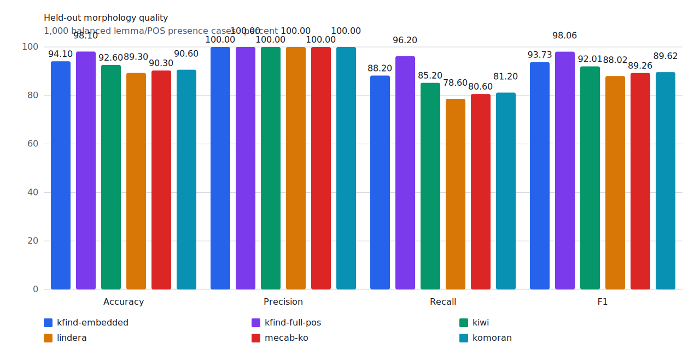
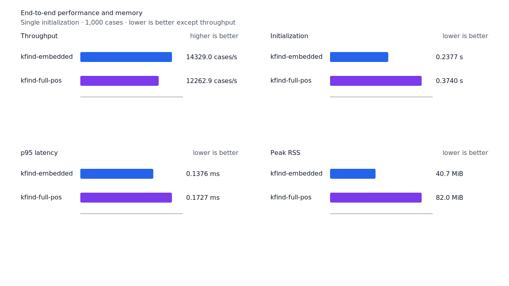
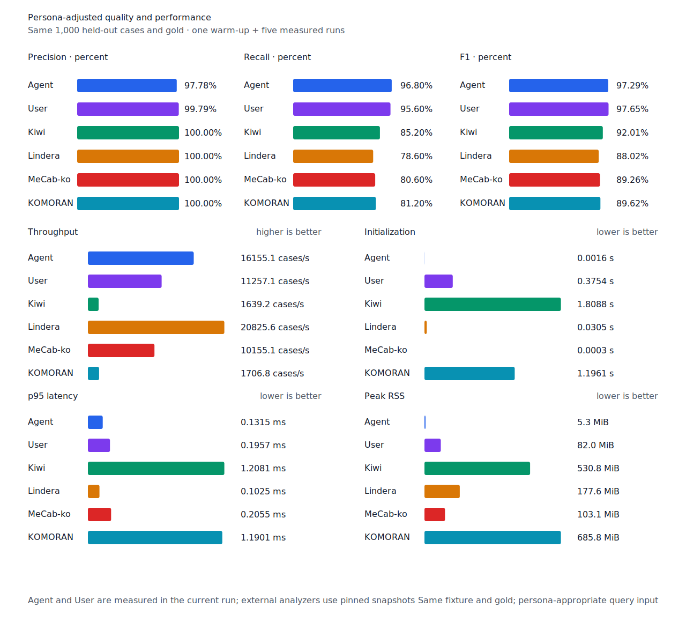

# 결합형 보조용언 recall

- 측정일: 2026-07-17
- 기준 revision: `fde1e2606418aad8e336eac6bfd3b8535a339e8c`
- 후보 revision: `0cfd2af21fb0efe297c02e4c6c233befaa5049f5`
- 환경: Linux 6.12.76/linuxkit aarch64, 10 logical CPUs, Python 3.12.13,
  Rust 1.97.0, Docker 29.6.1
- 반복: fresh process warm-up 1회 뒤 5회 측정의 중앙값
- canonical test fixture:
  `933bc12197da866d2363d7df9107d4d9be89a65ddaafd73968ad5384832b21ff`
- canonical development fixture:
  `604c3a139854fcf59570392f48ab85028785f4a3561ea3c5e702f88b841f907c`
- explicit-POS matrix:
  `fbcce40b533655085ff8a4e9031559f99b54f86abe188b6ddc1d690dd44326c6`
- untagged matrix:
  `b9dd7601301fa19b35acba735a977eba7c56a0c9d67c65dee32db5c8028c71bb`
- development matrix:
  `bc67497c3dc966fb7453b238df52c6d781b1b4485d40e8a5d6a38104dcc7abed`
- 기준 hard-negative fixture:
  `bceb92a0790686a283441b613d505b98b9d770863c428e2a5f4c2b2a92fc6e84`
- 후보 hard-negative fixture:
  `f4d8829977ebfd061003724ee4aeb23b36dd901f6e46171c924a1f52a63f0ee5`
- 100 MiB corpus:
  `7692072cb7bff9261c1fa5933bde41b27e558170818eeac6d07cabdd673815ff`
- 기준 report SHA-256:
  `6a3a507b4a29b217e8ce1f4c2d81e543cd4582d2c0a2684b1f3708d27bee1124`
- 후보 report SHA-256:
  `e23b900c63d07b2179b7f924bf0f241619f1999241d537f490107fd932b18bde`

## 규칙

Full-POS `smart`의 보조용언 질의만 결합형 source 경로를 사용한다. Compact component
graph에서 token 왼쪽 경계의 일반 용언 `VV/VA`가 연결어미 `EC`를 거쳐 query core의
`VX`에 닿고, 뒤의 `E*` 연쇄가 token 끝까지 완성될 때 query core를 허용한다.

따라서 `메꾸어졌다`, `떨어진`, `길어진`, `달라졌다`의 `지다`와 같은 결합형 보조용언을
회수한다. 선행 일반 용언과 연결어미가 없는 `사진` 안의 `지다`는 열지 않는다. VX 질의가
아닌 plan은 이 구조를 수집하지 않는다. Matrix contract 정의, annotation과 gate는 변경하지
않았다.

## Canonical 품질과 contract 지표

`PNᶜ`는 contract-positive 분모 `TPᶜ + FNᶜ`다. Canonical fixture에는 strict gold와 다른
contract-positive가 없으므로 각 1,000-case 평가의 `PNᶜ`는 500이다.

| fixture/profile | 기준 TPᶜ / FPᶜ / FNᶜ | 후보 TPᶜ / FPᶜ / FNᶜ | PNᶜ | recallᶜ |
| --- | ---: | ---: | ---: | ---: |
| development embedded `smart` | 452 / 4 / 48 | 452 / 4 / 48 | 500 | 90.4% → 90.4% |
| development full-POS `smart` | 462 / 4 / 38 | 464 / 4 / 36 | 500 | 92.4% → 92.8% |
| test embedded `smart` | 441 / 0 / 59 | 441 / 0 / 59 | 500 | 88.2% → 88.2% |
| test full-POS `smart` | 478 / 0 / 22 | 481 / 0 / 19 | 500 | 95.6% → 96.2% |
| Human full-POS `smart` | 475 / 1 / 25 | 478 / 1 / 22 | 500 | 95.0% → 95.6% |
| Agent embedded `any` | 484 / 11 / 16 | 484 / 11 / 16 | 500 | 96.8% → 96.8% |

Test full-POS와 Human은 `달라졌다`의 `지다`, `늘어나게`의 `나다`, `들어있는`의 `있다`
3건을 회수했다. Development full-POS는 `심어주지`의 `주다`와 `엮어내`의 `내다`를
회수했다. Embedded와 Agent는 이 full-POS 전용 경로를 사용하지 않아 품질이 변하지 않았다.
후보 hard-negative 38건 중 신규 `사진을 벽에 걸었다.`도 embedded와 full-POS에서 모두
거부했고, 기존 37건의 예측도 변하지 않았다.



## Query matrix strict·contract-adjusted 품질

현재 matrix의 reclassified case는 0건이므로 strict와 contract-adjusted confusion matrix가
같다. 두 지표 family는 report의 별도 필드로 검증했다. Test matrix의 `PNᶜ=1,401`,
development matrix의 `PNᶜ=1,391`이다.

| fixture/profile | 기준 TPᶜ / FPᶜ / FNᶜ | 후보 TPᶜ / FPᶜ / FNᶜ | PNᶜ | recallᶜ | 모든 contract 질의 회수 |
| --- | ---: | ---: | ---: | ---: | ---: |
| development embedded `smart` | 1,219 / 7 / 172 | 1,219 / 7 / 172 | 1,391 | 87.63% → 87.63% | — |
| development full-POS `smart` | 1,265 / 8 / 126 | 1,272 / 8 / 119 | 1,391 | 90.94% → 91.45% | — |
| test embedded `smart` | 1,248 / 5 / 153 | 1,248 / 5 / 153 | 1,401 | 89.08% → 89.08% | 329 → 329 / 468 |
| test full-POS `smart` | 1,319 / 5 / 82 | 1,325 / 5 / 76 | 1,401 | 94.15% → 94.58% | 390 → 396 / 468 |
| Human full-POS `smart` | 1,321 / 4 / 80 | 1,327 / 4 / 74 | 1,401 | 94.29% → 94.72% | 390 → 396 / 468 |
| Agent embedded `any` | 1,363 / 21 / 38 | 1,363 / 21 / 38 | 1,401 | 97.29% → 97.29% | 430 → 430 / 468 |

Test full-POS와 Human은 다음 6건을 회수했다.

- `메꾸어졌다`, `떨어진`, `길어진`, `달라졌다`의 `지다`
- `늘어나게`의 `나다`
- `들어있는`의 `있다`

각 case가 속한 문장의 다른 질의는 이미 회수되고 있어 완전 회수 문장도 6개 늘었다.
Development matrix full-POS는 `심어주지`의 `주다`, `엮어내`의 `내다`와 결합형 `지다`
5건을 합쳐 7건을 추가 회수했다. 새 strict FP·FPᶜ와 회귀는 없다.

## 성능

모든 morphology 행은 같은 환경에서 fresh process warm-up 1회 뒤 5회 측정한
`median [min, max]`다. 모든 변화는 10% 경고선 안이다.

| workload | revision | initialization (s) | cases/s | p95 (ms) | RSS (KiB) |
| --- | --- | ---: | ---: | ---: | ---: |
| canonical embedded `smart` | 기준 | 0.233377 [0.232678, 0.235985] | 14,866.4 [14,292.2, 14,943.0] | 0.1285 [0.1265, 0.1331] | 41,720 [41,716, 41,724] |
| canonical embedded `smart` | 후보 | 0.237710 [0.233636, 0.242507] | 14,329.0 [13,710.6, 14,752.5] | 0.1376 [0.1322, 0.1464] | 41,720 [41,716, 41,724] |
| canonical full-POS `smart` | 기준 | 0.376568 [0.375279, 0.390670] | 12,224.5 [12,035.5, 12,322.8] | 0.1760 [0.1730, 0.1776] | 83,976 [83,968, 83,984] |
| canonical full-POS `smart` | 후보 | 0.374028 [0.373782, 0.388264] | 12,262.9 [11,991.4, 12,382.5] | 0.1727 [0.1721, 0.1797] | 83,976 [83,972, 83,976] |
| canonical Human `smart` | 기준 | 0.377740 [0.376846, 0.381453] | 11,010.3 [10,587.6, 11,320.3] | 0.2005 [0.1932, 0.2064] | 84,000 [83,992, 84,004] |
| canonical Human `smart` | 후보 | 0.376151 [0.374390, 0.389257] | 11,109.3 [10,508.0, 11,280.0] | 0.2000 [0.1955, 0.2079] | 84,004 [83,996, 84,004] |
| matrix Agent `any` | 기준 | 0.001499 [0.001425, 0.001534] | 17,380.6 [17,049.4, 17,413.7] | 0.1224 [0.1220, 0.1252] | 8,492 [8,472, 8,492] |
| matrix Agent `any` | 후보 | 0.001443 [0.001410, 0.001508] | 17,392.6 [17,185.6, 17,470.5] | 0.1224 [0.1216, 0.1236] | 8,556 [8,552, 8,556] |
| matrix Human `smart` | 기준 | 0.386241 [0.382493, 0.386659] | 11,677.4 [11,203.4, 11,725.4] | 0.1970 [0.1956, 0.2034] | 84,708 [84,704, 84,772] |
| matrix Human `smart` | 후보 | 0.374344 [0.373422, 0.388316] | 11,762.9 [11,214.0, 11,788.1] | 0.1955 [0.1948, 0.2025] | 84,724 [84,712, 84,732] |

중앙값 기준 canonical embedded/full-POS/Human cases/s 변화는 각각 -3.61%, +0.31%,
+0.90%다. Canonical Agent는 16,868.4→16,155.1 cases/s(-4.23%), matrix Agent는 +0.07%,
matrix Human은 +0.73%다. 100 MiB CLI 처리량은 Agent
5,420.87→5,696.29 MiB/s(+5.08%), Human 350.90→352.13 MiB/s(+0.35%)다. VX가 없는
plan은 결합형 구조를 수집하지 않고 측정 run 범위도 겹치므로 변경 경로 밖의 Agent·embedded
변화는 회귀로 판정하지 않았다.

동일 canonical fixture의 후보 Agent는 16,155.1 cases/s로 Lindera 4.0.0 snapshot
20,825.6 cases/s보다 22.43% 느리다. Recall은 96.8% 대 78.6%, peak RSS는 5.3 MiB 대
177.6 MiB다. 이 recall slice에서는 Lindera 처리량 격차를 줄이지 않았다. 후속 성능 작업은
현재 profile에서 큰 비중을 차지하는 평가 경로만 대상으로 한다.





## 남은 FN

Canonical test full-POS의 `PNᶜ`는 500, `FNᶜ`는 19다. Matrix full-POS의 `PNᶜ`는
1,401, `FNᶜ`는 76이다. 가장 큰 동일 질의 묶음은 각 3건인 명사 `것`, 부사 `안`, 동사
`오다`, 형용사 `이다`다. `것`은 boundary-rejected 2건과 surface-missing 1건, `안`은
boundary-rejected 3건, `오다`는 boundary-rejected 2건과 gold-or-adapter 1건, `이다`는
surface-missing 3건으로 원인이 갈린다.

다음 recall 작업은 네 동률 묶음을 case-level로 비교해 하나의 공통 구조로 가장 많은
contract-positive를 안전하게 회수할 수 있는 묶음을 고른다. Matrix contract는 소비만 하고
정의·annotation·gate는 별도 작업에 맡긴다.

## 재현

```console
git switch --detach fde1e2606418aad8e336eac6bfd3b8535a339e8c
KFIND_MORPH_IMAGE=kfind-morph-benchmark:auxiliary-jida-base-fde1e26 \
KFIND_MORPH_RUNS=5 \
scripts/benchmark-morphology.sh target/morph-auxiliary-jida-base-fde1e26

git switch --detach 0cfd2af21fb0efe297c02e4c6c233befaa5049f5
KFIND_MORPH_IMAGE=kfind-morph-benchmark:auxiliary-jida-candidate-0cfd2af \
KFIND_MORPH_RUNS=5 \
scripts/benchmark-morphology.sh target/morph-auxiliary-jida-candidate-0cfd2af

python3 tools/morph-compare/render_charts.py \
  target/morph-auxiliary-jida-candidate-0cfd2af/report.json docs/benchmarks/assets \
  --prefix 2026-07-17-attached-auxiliary-recall-

python3 tools/morph-compare/export_site_snapshot.py \
  target/morph-auxiliary-jida-candidate-0cfd2af/report.json \
  docs/benchmarks/site-morphology.json \
  --revision 0cfd2af21fb0efe297c02e4c6c233befaa5049f5
```

외부 분석기 snapshot은 고정 버전·설정과 같은 canonical fixture를 사용했다.
