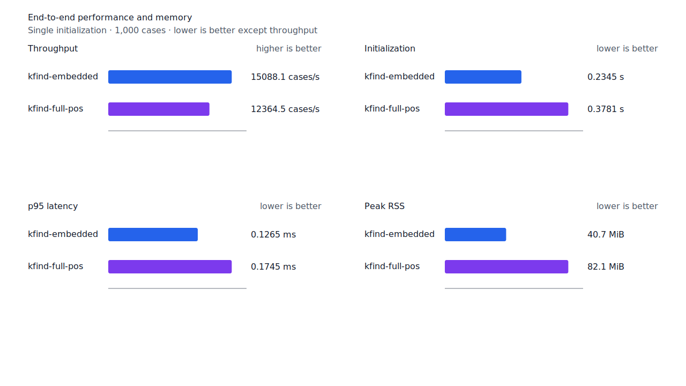
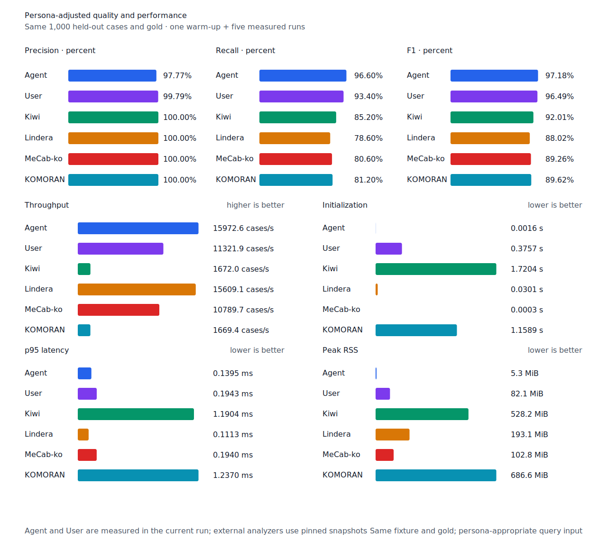
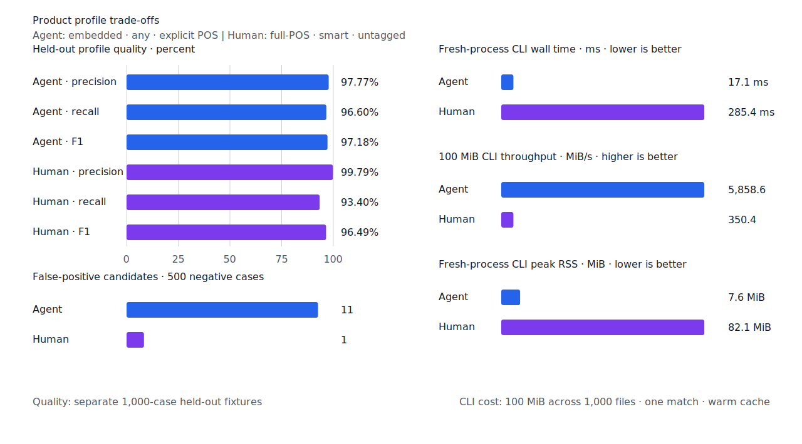

# 질의 컴파일 병목 제거

- 측정일: 2026-07-17
- 최신 `origin/main`: `45baef885dbe6f07259448a842b34b8f0eb29f94`
- 기준 측정 revision: `9e72a5881adb2eca44c08045d17d013008925a58`
- 후보 revision: `23ae47d1508510f472cad916354bceece43d2484`
- morphology 환경: Linux 6.12.76/aarch64, 10 logical CPUs, Python 3.12.13,
  Rust 1.97.0, Docker 29.6.1
- Criterion 환경: macOS 26.4.1, Apple M1 Max, Rust 1.97.0
- morphology 반복: fresh process 1회 warm-up 뒤 5회 측정의 중앙값
- Criterion 반복: 기본 warm-up 3초, 100 sample, sample별 `times[i] / iters[i]`의
  nearest-rank p95
- test fixture: `933bc12197da866d2363d7df9107d4d9be89a65ddaafd73968ad5384832b21ff`
- development fixture: `604c3a139854fcf59570392f48ab85028785f4a3561ea3c5e702f88b841f907c`
- hard-negative fixture: `1d8d34645a8517df473b749eea33177f81acc9782a9ba1a13f7742fa0277724a`
- 무품사 fixture: `94ccd70a093ee7af8435371b2ffdb81534ec97e29ada705ea72c940938d0c592`
- 100 MiB corpus: `7692072cb7bff9261c1fa5933bde41b27e558170818eeac6d07cabdd673815ff`
- 기준 report SHA-256: `5a9643b21afbff40c6a9c02451a9a9af2ee3cee36506c0a2ee232336595d361a`
- 후보 report SHA-256: `20a1cad1970c3df6215aba0d0313c0d307ec5384a3bc94726d72fba28cc8d641`

`origin/main`은 기준 측정 revision의 구현과 문서 commit을 merge한 tree다. merge 이후 제품
코드는 바뀌지 않았으므로 기존 승인 report를 기준선으로 재사용했다.

## 병목과 변경

full-POS test fixture를 같은 순서로 100번 반복한 100,000-case 입력을 10초간 1 ms 간격으로
sampling했다. 반복 입력 SHA-256은
`44a6ec1abc7b87cde76bbcc63a4eee248208e6c3bcd69f130b0b118745ed06f0`이다.
`run_kfind` 아래 5,295 sample 중 4,227개(79.8%)가 `compile_query`였고, 그중 최소
3,889개(92.0%)가 `normalize_and_merge`와 `ProgramKey` hash 아래에 있었다.

기존 compiler는 anchor, core 투영, consumption, boundary와 decision 전체를 `HashMap` key로
사용했다. 공유 `Arc<[RuleId]>`의 rule vocabulary도 key를 넣거나 table을 확장할 때마다 내용
전체를 다시 hash했다. 후보는 정규화된 anchor만 hash하고 같은 anchor의 짧은 연결 목록에서
나머지 branch key를 비교한다. 최초 생성 순서와 origin 합집합·정렬은 유지한다.

구조 판정에서는 NFC window의 원문 offset을 identity mapping으로 사용하고, 인접 NFC token과
resource의 POS·component를 빌려 반복 할당을 없앴다. source POS에 `+`가 있어도 parse 가능한
품사가 하나뿐인 경우의 기존 `Whole` 증거 분류를 보존한다.

## 품질

모든 strict 품질과 1,000개 test의 전체 span이 기준과 같다.

| fixture/profile | 기준 TP / FP / FN | 후보 TP / FP / FN |
| --- | ---: | ---: |
| development embedded `smart` | 447 / 4 / 53 | 447 / 4 / 53 |
| development full-POS `smart` | 456 / 4 / 44 | 456 / 4 / 44 |
| test embedded `smart` | 435 / 0 / 65 | 435 / 0 / 65 |
| test full-POS `smart` | 470 / 0 / 30 | 470 / 0 / 30 |
| Human full-POS `smart` | 467 / 1 / 33 | 467 / 1 / 33 |
| Agent embedded `any` | 483 / 11 / 17 | 483 / 11 / 17 |

## query compile

| workload | 기준 p95 | 후보 p95 | 증감 |
| --- | ---: | ---: | ---: |
| single atom | 211.267 µs | 63.559 µs | -69.92% |
| 8 atom phrase | 449.132 µs | 119.068 µs | -73.49% |

두 workload 모두 15 ms와 50 ms compile 한도보다 충분히 낮다.

구조 판정을 반복하는 장문 workload는 warm-up 2초, 측정 20초, 20 sample로 별도 측정했다.

| workload | metric | 기준 | 후보 | 증감 |
| --- | --- | ---: | ---: | ---: |
| `context_repeated_long_line` | sample p50 | 34.972 ms | 25.196 ms | -27.95% |
| `context_repeated_long_line` | sample p95 | 38.168 ms | 25.486 ms | -33.23% |

## end-to-end morphology

각 값은 5회 중앙값이다. 증감은 기준 대비 후보이며 처리량은 높을수록, 나머지는 낮을수록
좋다.

| workload | metric | 기준 | 후보 | 증감 |
| --- | --- | ---: | ---: | ---: |
| embedded `smart` | initialization | 0.235944 s | 0.234537 s | -0.60% |
| embedded `smart` | cases/s | 9,421.8 | 15,088.1 | +60.14% |
| embedded `smart` | p95 | 0.2479 ms | 0.1265 ms | -48.97% |
| embedded `smart` | peak RSS | 41,716 KiB | 41,720 KiB | +0.01% |
| full-POS `smart` | initialization | 0.385801 s | 0.378074 s | -2.00% |
| full-POS `smart` | cases/s | 5,389.7 | 12,364.5 | +129.41% |
| full-POS `smart` | p95 | 0.6322 ms | 0.1745 ms | -72.40% |
| full-POS `smart` | peak RSS | 84,020 KiB | 84,044 KiB | +0.03% |
| Agent `any` | cases/s | 10,129.4 | 15,972.6 | +57.69% |
| Human `smart` | cases/s | 4,273.6 | 11,417.3 | +167.16% |
| Agent 100 MiB CLI | throughput | 5,145.94 MiB/s | 5,858.62 MiB/s | +13.85% |
| Human 100 MiB CLI | throughput | 343.32 MiB/s | 350.40 MiB/s | +2.06% |

동일 explicit-POS fixture에서 Agent는 Lindera 4.0.0의 고정 snapshot 15,609.1 cases/s보다
2.33% 빠르다. recall은 96.6% 대 78.6%, peak RSS는 5.3 MiB 대 193.1 MiB다. 품사를 생략한
User workflow도 4,225.6에서 11,321.9 cases/s로 2.68배가 됐고 recall 93.4%, precision
99.79%를 유지했다.







## 재현

```console
git switch --detach 45baef885dbe6f07259448a842b34b8f0eb29f94
scripts/benchmark-criterion.sh query_compile
scripts/benchmark-criterion.sh context_repeated_long_line \
  --warm-up-time 2 --measurement-time 20 --sample-size 20

git switch --detach 23ae47d1508510f472cad916354bceece43d2484
scripts/benchmark-criterion.sh query_compile
scripts/benchmark-criterion.sh context_repeated_long_line \
  --warm-up-time 2 --measurement-time 20 --sample-size 20
KFIND_MORPH_IMAGE=kfind-morph-benchmark:compile-hotpath \
KFIND_MORPH_RUNS=5 \
scripts/benchmark-morphology.sh target/morph-compile-hotpath

python3 tools/morph-compare/render_charts.py \
  target/morph-compile-hotpath/report.json docs/benchmarks/assets \
  --prefix 2026-07-17-compile-hotpath-performance-

python3 tools/morph-compare/export_site_snapshot.py \
  target/morph-compile-hotpath/report.json docs/benchmarks/site-morphology.json \
  --revision 23ae47d15085
```

외부 분석기 snapshot은 fixture, adapter schema와 고정 버전·설정이 바뀌지 않아 갱신하지
않았다.
