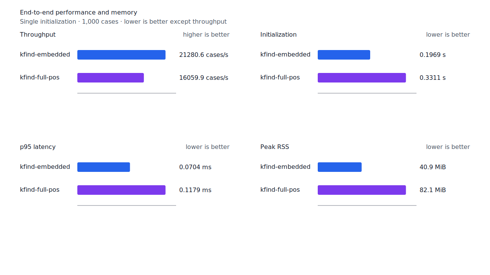
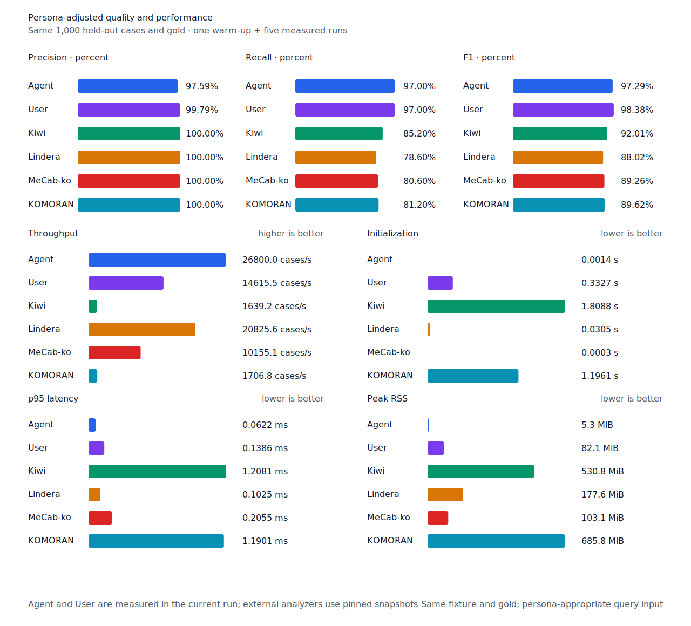

# component section digest 병렬 검증

- 측정일: 2026-07-17
- 최신 `origin/main` 및 기준 revision:
  `c931259e3910d843fffe52d042564b3b44ad48d5`
- 후보 revision: `fb019cbad9c33ebbd047cbc937c81e75c18e3b7a`
- 환경: Linux 6.12.76/linuxkit aarch64, 10 logical CPUs, Python 3.12.13,
  Rust 1.97.0, Docker 29.6.1
- 별도 병목 profile: macOS Darwin 25.4 arm64, xctrace 16.0 (17F42)
- 반복: fresh process warm-up 1회 뒤 5회 측정의 중앙값
- canonical test fixture:
  `933bc12197da866d2363d7df9107d4d9be89a65ddaafd73968ad5384832b21ff`
- full POS lexicon artifact:
  `012a2ecfc9ee049cb48f655eb240fa2ed6fc739dfde01526078a976549246e88`
- component artifact:
  `55d4f7a83c7fac278208f21c4cad2225e33768c992f0ceefa22402823fbfc4b3`
- 100 MiB corpus:
  `7692072cb7bff9261c1fa5933bde41b27e558170818eeac6d07cabdd673815ff`
- 기준 report SHA-256:
  `74847121b6b455e1107b1c4acf238c0f816597d64ac54fecd88ee357647f4a1d`
- 후보 report SHA-256:
  `56f4a16952ee09580894cd71d6ff87245d6791213b60203843982ce584ae6cdc`

## 병목과 변경

기준 component-only 초기화를 macOS Time Profiler로 분리 측정했을 때 150.75ms 중 약
106ms가 SHA-256 `compress256` 표본이었다. 37,103,781-byte artifact의 index
14,360,576 bytes, payload 22,724,876 bytes와 strings 18,149 bytes를 순서대로 hash하는
경로가 payload 구조 검증보다 큰 병목이었다.

후보는 native에서 index와 payload가 각각 1MiB 이상이면 scoped worker에서 index digest를
검증하는 동안 호출 thread가 payload와 strings digest를 검증한다. Thread 생성에 실패하면
기존 순차 경로로 돌아가고, WASM과 작은 resource도 순차 검증한다. 세 digest가 모두 일치한
뒤에만 payload 구조를 검증하고 resource를 공개한다. 각 section을 따로 손상시킨 test와
병렬·순차 digest 일치 test를 추가했다.

Binary schema, artifact와 검증 범위는 바뀌지 않았다. Digest 검증을 생략하거나 지연하지
않는다.

## 품질과 contract 지표

기준과 후보의 canonical, test/development matrix, Human, Agent와 hard-negative failure
record를 case ID, 판정과 span으로 대조했다. 이동한 record는 0건이다. Matrix contract 정의,
annotation과 gate는 변경하지 않았다.

`PNᶜ = TPᶜ + FNᶜ`다. Test matrix의 reclassified case는 0건이므로 strict와
contract-adjusted confusion matrix가 같다.

| fixture/profile | 기준·후보 TPᶜ / FPᶜ / FNᶜ | PNᶜ | recallᶜ |
| --- | ---: | ---: | ---: |
| canonical embedded `smart` | 447 / 0 / 53 | 500 | 89.40% |
| canonical full-POS `smart` | 489 / 0 / 11 | 500 | 97.80% |
| canonical Human full-POS `smart` | 485 / 1 / 15 | 500 | 97.00% |
| canonical Agent embedded `any` | 485 / 12 / 15 | 500 | 97.00% |
| test matrix embedded `smart` | 1,266 / 5 / 135 | 1,401 | 90.36% |
| test matrix full-POS `smart` | 1,351 / 5 / 50 | 1,401 | 96.43% |
| test matrix Human full-POS `smart` | 1,349 / 4 / 52 | 1,401 | 96.29% |
| test matrix Agent embedded `any` | 1,366 / 22 / 35 | 1,401 | 97.50% |
| development embedded `smart` | 1,236 / 7 / 155 | 1,391 | 88.86% |
| development full-POS `smart` | 1,293 / 8 / 98 | 1,391 | 92.95% |

Hard-negative도 같다. Embedded는 contract-adjusted
`TPᶜ 3 / FPᶜ 1 / TNᶜ 32 / FNᶜ 2`, full-POS는
`TPᶜ 5 / FPᶜ 1 / TNᶜ 32 / FNᶜ 0`이다.


## 시작 성능

아래는 component startup probe의 `median [min, max]`다. Embedded의 component 구간은
29.51%, full-POS와 함께 읽는 component 구간은 28.73% 줄었다. 두 workload 모두 기준의
최저값보다 후보의 최고값이 낮다. Full-POS+component 전체 초기화는 15.61% 줄었다.

| workload / 구간 | 기준 (ms) | 후보 (ms) | 변화 |
| --- | ---: | ---: | ---: |
| embedded+component / component | 129.20 [128.45, 130.54] | 91.07 [90.66, 91.70] | -29.51% |
| embedded+component / 전체 | 130.73 [129.97, 132.01] | 92.53 [92.13, 93.17] | -29.22% |
| full-POS+component / base | 121.63 [121.03, 126.08] | 119.24 [118.89, 123.46] | -1.97% |
| full-POS+component / component | 131.12 [130.82, 131.65] | 93.45 [92.25, 94.44] | -28.73% |
| full-POS+component / 전체 | 252.63 [252.15, 257.41] | 213.20 [212.12, 216.75] | -15.61% |

Component probe peak RSS는 embedded 39,800→39,996KiB, full-POS 조합
79,416→79,612KiB로 각각 196KiB 늘었다.

## End-to-end 성능

Component resource를 읽는 canonical embedded/full-POS `smart` 초기화는 각각 16.22%,
10.71% 줄었다. Human과 무품사 User 초기화도 각각 9.64%, 9.69% 줄었다. 100MiB CLI Human
wall time은 14.39% 줄고 처리량은 16.81% 늘었다.

평가 구간에는 digest thread가 존재하지 않는다. Cases/s와 p95 중앙값 변화는 모두 10%
경고선 안이고 각 min/max 범위가 겹쳐 회귀로 판정하지 않는다. 가장 불리한 full-POS
`smart` 변화는 cases/s -3.98%, p95 +5.17%다.

| workload | metric | 기준 | 후보 | 변화 |
| --- | --- | ---: | ---: | ---: |
| canonical embedded `smart` | initialization (s) | 0.235058 [0.234307, 0.236728] | 0.196927 [0.195910, 0.200803] | -16.22% |
| canonical full-POS `smart` | initialization (s) | 0.370776 [0.369252, 0.395942] | 0.331068 [0.330271, 0.364179] | -10.71% |
| canonical full-POS `smart` | cases/s | 16,726.2 [16,655.7, 16,919.9] | 16,059.9 [12,274.6, 16,271.3] | -3.98% |
| canonical full-POS `smart` | p95 (ms) | 0.1121 [0.1108, 0.1136] | 0.1179 [0.1153, 0.1754] | +5.17% |
| canonical Human `smart` | initialization (s) | 0.367303 [0.366609, 0.369245] | 0.331883 [0.330477, 0.334348] | -9.64% |
| canonical User `smart` | initialization (s) | 0.368452 [0.366275, 0.372928] | 0.332741 [0.331397, 0.333932] | -9.69% |
| 100 MiB CLI Human | wall (s) | 0.277961 [0.274311, 0.288398] | 0.237963 [0.236054, 0.239478] | -14.39% |
| 100 MiB CLI Human | throughput (MiB/s) | 359.76 [346.74, 364.55] | 420.23 [417.57, 423.63] | +16.81% |

후보 Agent는 26,800.0 cases/s로 Lindera 4.0.0 고정 snapshot의 20,825.6 cases/s보다
28.69% 빠르다. Recall은 97.0% 대 78.6%, peak RSS는 5.3MiB 대 177.6MiB다.





## 다음 병목

Component 구간을 91ms대로 낮춘 뒤 full-POS decoder의 base 초기화 119ms가 optional
resource 조합의 가장 큰 단일 구간이다. 다음 성능 작업은 full-POS decode의 남은 allocation,
index 구축과 검증 구간을 다시 profile한다. Component의 다음 후보인 payload 구조 검증은 별도
profile에서 약 16ms였으므로 full-POS보다 우선하지 않는다.

## 재현

```console
git switch --detach c931259e3910d843fffe52d042564b3b44ad48d5
KFIND_MORPH_IMAGE=kfind-morph-benchmark:component-digest-base-c931259 \
KFIND_MORPH_RUNS=5 \
scripts/benchmark-morphology.sh target/morph-component-digest-base-c931259

git switch --detach fb019cbad9c33ebbd047cbc937c81e75c18e3b7a
KFIND_MORPH_IMAGE=kfind-morph-benchmark:component-digest-candidate-fb019cb \
KFIND_MORPH_RUNS=5 \
scripts/benchmark-morphology.sh target/morph-component-digest-candidate-fb019cb

python3 tools/morph-compare/render_charts.py \
  target/morph-component-digest-candidate-fb019cb/report.json \
  docs/benchmarks/assets \
  --prefix 2026-07-17-component-digest-startup-

python3 tools/morph-compare/export_site_snapshot.py \
  target/morph-component-digest-candidate-fb019cb/report.json \
  docs/benchmarks/site-morphology.json \
  --revision fb019cbad9c33ebbd047cbc937c81e75c18e3b7a
```

외부 분석기 snapshot은 fixture, adapter schema와 고정 버전·설정이 바뀌지 않아 갱신하지
않았다.
