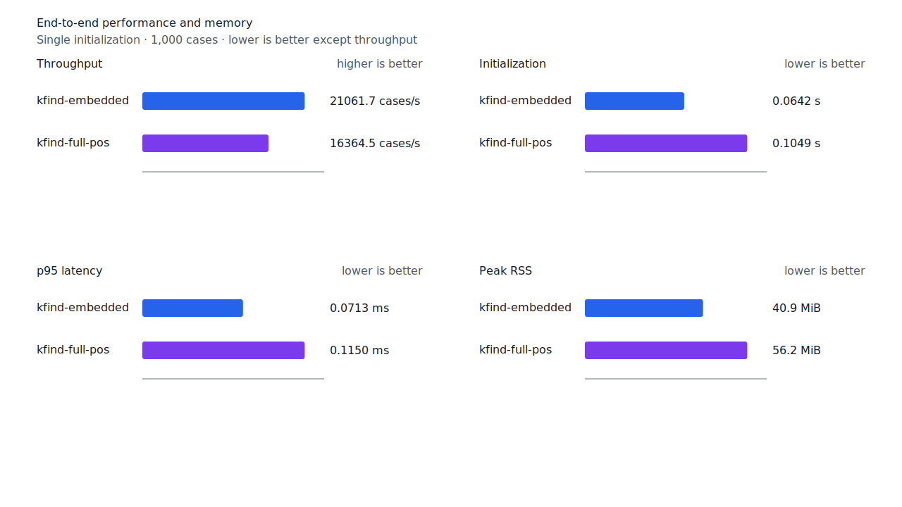
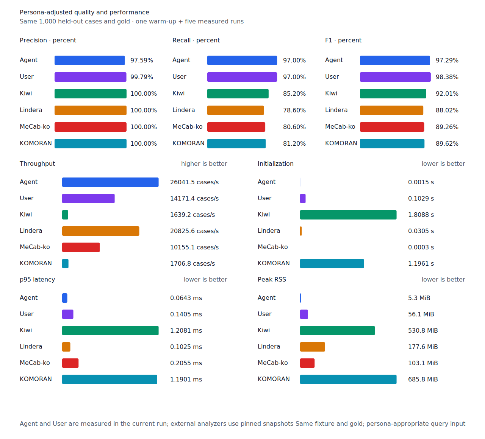

# component SHA-256 hardware backend

- 측정일: 2026-07-17
- 최신 `origin/main` 및 기준 revision:
  `0ff9b1f2ef53f35fbf173bbe6a08ec18b666d6e1`
- 후보 revision: `2170908eed51cb488cd20db197fbbff9c7be5e53`
- 환경: Linux 6.12.76/linuxkit aarch64, 10 logical CPUs, Python 3.12.13,
  Rust 1.97.0, Docker 29.6.1
- 별도 병목 profile: macOS Darwin 25.4 arm64, xctrace 16.0 (17F42)
- 반복: fresh process warm-up 1회 뒤 5회 측정의 중앙값
- canonical test fixture:
  `933bc12197da866d2363d7df9107d4d9be89a65ddaafd73968ad5384832b21ff`
- full POS lexicon artifact:
  `012a2ecfc9ee049cb48f655eb240fa2ed6fc739dfde01526078a976549246e88`
- component artifact:
  `55d4f7a83c7fac278208f21c4cad2225e33768c992f0ceefa22402823fbfc4b3`
- 100 MiB corpus:
  `7692072cb7bff9261c1fa5933bde41b27e558170818eeac6d07cabdd673815ff`
- 기준 report SHA-256:
  `a0f1bc4162abde9684e9933481a694649677316f901b1821cf1daf2c3c195766`
- 후보 report SHA-256:
  `f2f58f162ff02f0f730462efcbef3cb4e172261a0a67bfb4507ecf9296172c47`

## 병목과 변경

최신 코드의 37,103,781-byte component artifact를 제품과 같은 startup 경로에서 다시
profile했다. 두 digest thread를 합친 164개 CPU sample 중 SHA-256 `compress256`이
exclusive 135개였다. 호출 thread의 digest 임계 경로는 80개 sample이고 payload 구조 검증은
14개, file read는 1개였다. 병렬화 뒤에도 portable SHA-256 backend가 전체 초기화의 가장 큰
병목이었다.

후보는 `sha2` 0.10.9의 `asm` feature를 제품과 두 standalone benchmark tool에 사용한다.
AArch64와 x86 계열은 runtime CPU feature detection 뒤 hardware backend를 사용한다. 사용할 수
없으면 각 target의 compatible backend로 돌아가며 WASM은 portable 경로를 유지한다. 세 section의
SHA-256 값, 검증 범위와 순서, artifact schema, payload 구조 검증과 fail-fast 설치 계약은 바뀌지
않았다.

후보 profile은 전체 60개 CPU sample, SHA-256 exclusive 28개로 줄었다. Digest 임계 경로는
17개였고 payload parse는 21개였다. 따라서 남은 병목은 digest 미세 조정이 아니라 payload
record 검증과 file read를 다시 분리할 구간이다.

## 품질과 contract 지표

기준과 후보의 canonical, test/development matrix, Human, Agent와 hard-negative 품질·failure
record를 case ID, 판정과 span으로 대조했다. 이동한 record는 0건이다. Matrix contract 정의,
annotation과 gate는 변경하지 않았다. 비교 객체의 정렬 JSON SHA-256은 양쪽 모두
`43e8043744f65e5be515acd0268e94cd304611b7524b9f2ac22fd406f864d984`다.

`PNᶜ = TPᶜ + FNᶜ`다. Test matrix의 reclassified case는 0건이므로 strict와
contract-adjusted confusion matrix가 같다.

| fixture/profile | 기준·후보 TPᶜ / FPᶜ / FNᶜ | PNᶜ | recallᶜ |
| --- | ---: | ---: | ---: |
| canonical embedded `smart` | 447 / 0 / 53 | 500 | 89.40% |
| canonical full-POS `smart` | 489 / 0 / 11 | 500 | 97.80% |
| canonical Human full-POS `smart` | 485 / 1 / 15 | 500 | 97.00% |
| canonical Agent embedded `any` | 485 / 12 / 15 | 500 | 97.00% |
| test matrix embedded `smart` | 1,266 / 5 / 135 | 1,401 | 90.36% |
| test matrix full-POS `smart` | 1,351 / 5 / 50 | 1,401 | 96.43% |
| test matrix Human full-POS `smart` | 1,349 / 4 / 52 | 1,401 | 96.29% |
| test matrix Agent embedded `any` | 1,366 / 22 / 35 | 1,401 | 97.50% |
| development embedded `smart` | 1,236 / 7 / 155 | 1,391 | 88.86% |
| development full-POS `smart` | 1,293 / 8 / 98 | 1,391 | 92.95% |

Hard-negative도 같다. Embedded는 contract-adjusted
`TPᶜ 3 / FPᶜ 1 / TNᶜ 32 / FNᶜ 2`, full-POS는
`TPᶜ 5 / FPᶜ 1 / TNᶜ 32 / FNᶜ 0`이다.


## component 초기화

아래는 optional startup probe의 `median [min, max]`다. Embedded의 component load는
46.70%, full-POS와 함께 읽는 component load는 49.91% 줄었다. Full-POS+component 전체는
35.25% 줄었다. 세 workload 모두 후보의 최고값이 기준의 최저값보다 낮다. Peak RSS는
embedded 39,996KiB, full-POS 조합 52,948KiB로 중앙값이 같다.

| workload / 구간 | 기준 | 후보 | 변화 |
| --- | ---: | ---: | ---: |
| embedded+component / component | 92.85ms [92.42, 99.55] | 49.49ms [47.70, 49.54] | -46.70% |
| embedded+component / 전체 | 94.39ms [93.99, 101.04] | 51.06ms [49.22, 51.12] | -45.90% |
| full-POS+component / base | 39.31ms [38.68, 40.74] | 39.20ms [38.23, 39.79] | -0.29% |
| full-POS+component / component | 94.38ms [93.43, 94.59] | 47.28ms [46.68, 49.58] | -49.91% |
| full-POS+component / 전체 | 133.70ms [132.11, 135.12] | 86.57ms [85.88, 87.81] | -35.25% |

## End-to-end 성능

Canonical embedded/full-POS `smart` 초기화는 각각 68.13%, 58.78% 줄었다. Human 초기화는
58.94% 줄고, 100MiB CLI Human wall은 30.95% 줄며 처리량은 44.83% 늘었다. CLI peak RSS는
0.08% 차이다.

평가 구간에는 startup digest가 존재하지 않는다. Human cases/s와 p95는 각각 +5.08%,
-4.08%이고, full-POS `smart`도 cases/s +7.45%, p95 -6.73%로 회귀하지 않았다.

| workload | metric | 기준 | 후보 | 변화 |
| --- | --- | ---: | ---: | ---: |
| canonical embedded `smart` | initialization (s) | 0.201311 [0.200746, 0.205019] | 0.064157 [0.062048, 0.071852] | -68.13% |
| canonical full-POS `smart` | initialization (s) | 0.254456 [0.252688, 0.284789] | 0.104892 [0.103360, 0.105781] | -58.78% |
| canonical full-POS `smart` | cases/s | 15,229.5 [12,921.1, 15,759.0] | 16,364.5 [16,154.3, 16,467.6] | +7.45% |
| canonical full-POS `smart` | p95 (ms) | 0.1233 [0.1187, 0.1409] | 0.1150 [0.1130, 0.1167] | -6.73% |
| canonical Human `smart` | initialization (s) | 0.254546 [0.250209, 0.263225] | 0.104507 [0.102691, 0.109174] | -58.94% |
| canonical Human `smart` | cases/s | 14,129.8 [13,146.1, 14,655.6] | 14,847.6 [14,609.0, 14,896.7] | +5.08% |
| canonical Human `smart` | p95 (ms) | 0.1422 [0.1371, 0.1574] | 0.1364 [0.1347, 0.1391] | -4.08% |
| 100 MiB CLI Human | wall (s) | 0.152466 [0.151824, 0.152942] | 0.105273 [0.101513, 0.109523] | -30.95% |
| 100 MiB CLI Human | throughput (MiB/s) | 655.89 [653.84, 658.66] | 949.91 [913.05, 985.10] | +44.83% |

후보 Agent는 26,041.5 cases/s로 Lindera 4.0.0 고정 snapshot의 20,825.6 cases/s보다
25.05% 빠르다. Recall은 97.0% 대 78.6%, peak RSS는 5.3MiB 대 177.6MiB다.





## 다음 병목

Full-POS+component 전체 86.57ms 중 full-POS base는 39.20ms, component는 47.28ms다.
Component profile에서 digest 임계 경로가 17개 sample로 줄고 payload parse가 21개가 됐다.
다음 성능 작업은 payload record 검증과 file read를 분리 측정하고, 두 자릿수 millisecond를
줄일 수 있을 때만 진행한다. SHA-256 loop의 추가 미세 조정은 우선하지 않는다.

## 재현

```console
git switch --detach 0ff9b1f2ef53f35fbf173bbe6a08ec18b666d6e1
KFIND_MORPH_IMAGE=kfind-morph-benchmark:component-asm-base-0ff9b1f \
KFIND_MORPH_RUNS=5 \
scripts/benchmark-morphology.sh target/morph-component-asm-base-0ff9b1f

git switch --detach 2170908eed51cb488cd20db197fbbff9c7be5e53
KFIND_MORPH_IMAGE=kfind-morph-benchmark:component-asm-candidate-2170908 \
KFIND_MORPH_RUNS=5 \
scripts/benchmark-morphology.sh target/morph-component-asm-candidate-2170908

python3 tools/morph-compare/render_charts.py \
  target/morph-component-asm-candidate-2170908/report.json \
  docs/benchmarks/assets \
  --prefix 2026-07-17-component-hardware-digest-startup-

python3 tools/morph-compare/export_site_snapshot.py \
  target/morph-component-asm-candidate-2170908/report.json \
  docs/benchmarks/site-morphology.json \
  --revision 2170908eed51cb488cd20db197fbbff9c7be5e53
```

외부 분석기 snapshot은 fixture, adapter schema와 고정 버전·설정이 바뀌지 않아 갱신하지
않았다.
