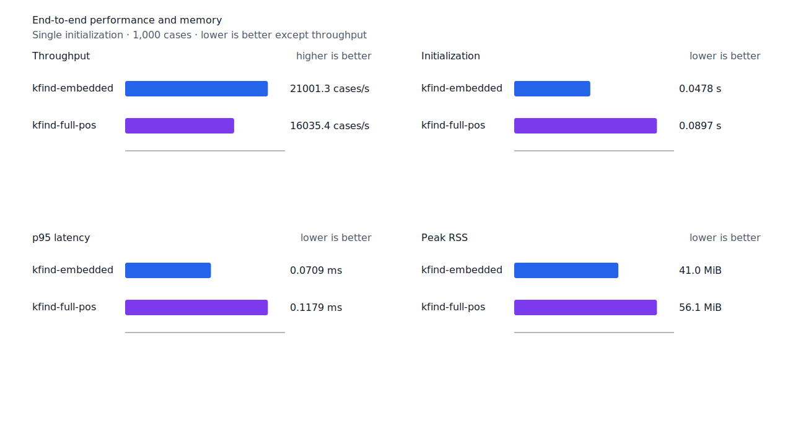
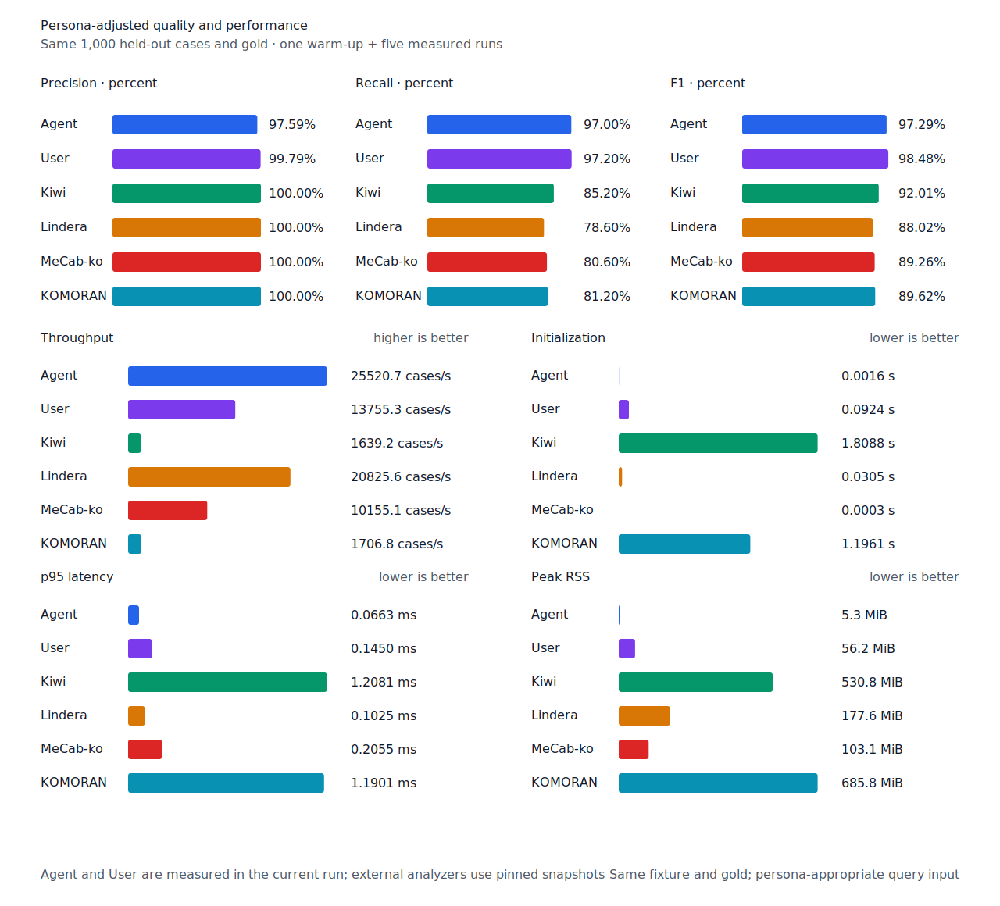

# component payload 검증 병렬화

- 측정일: 2026-07-17
- 최신 `origin/main` 및 기준 revision:
  `15eb3dbb3f46627948095effdc089aabe166d190`
- 후보 revision: `ada6f555e2f7d90baef5f502a371ac207ff3ad7c`
- 환경: Linux 6.12.76/linuxkit aarch64, 10 logical CPUs, Python 3.12.13,
  Rust 1.97.0, Docker 29.6.1
- 별도 병목 profile: macOS Darwin 25.4 arm64, xctrace 16.0 (17F42)
- 반복: fresh process warm-up 1회 뒤 5회 측정의 중앙값
- canonical test fixture:
  `933bc12197da866d2363d7df9107d4d9be89a65ddaafd73968ad5384832b21ff`
- full POS lexicon artifact:
  `012a2ecfc9ee049cb48f655eb240fa2ed6fc739dfde01526078a976549246e88`
- component artifact:
  `55d4f7a83c7fac278208f21c4cad2225e33768c992f0ceefa22402823fbfc4b3`
- 100 MiB corpus:
  `7692072cb7bff9261c1fa5933bde41b27e558170818eeac6d07cabdd673815ff`
- 기준 report SHA-256:
  `ec54fc917c97ca6e2ed5f7254a35094a3b01938d81a032cb585e2e66959f3709`
- 후보 report SHA-256:
  `5e634b6709c1fe746437c0dbeb8016f8610cbdfa51f56ecd71a644a1f86dc7ac`

## 병목과 변경

최신 main의 component startup을 macOS Time Profiler로 다시 분리했다. Hardware SHA-256을
적용한 뒤 payload record 구조 검증은 약 15ms이고, 호출 thread의 section digest 임계 경로
약 12ms와 직렬로 이어졌다. 이 두 구간을 겹치면 수십 microsecond가 아니라 component
초기화의 두 자릿수 millisecond를 줄일 수 있다.

후보는 native의 index와 payload가 각각 1MiB 이상일 때 payload 구조 검증 worker를 시작하고
호출 thread에서 기존 section digest 검증을 수행한다. Thread 생성에 실패하면 digest 뒤 구조를
순차 검증하고 WASM과 작은 resource도 기존 순서를 유지한다. 양쪽이 모두 끝난 뒤에만 resource를
공개하며, 두 검증이 함께 실패하면 section digest 오류를 먼저 반환한다.

검증 범위, artifact schema와 bytes는 바뀌지 않았다. Digest 또는 구조 검증을 생략하거나
resource 설치 뒤로 미루지 않는다.

## 품질과 contract 지표

기준과 후보의 canonical, test/development matrix, Human, Agent와 hard-negative 품질·failure
record를 case ID, 판정과 span으로 대조했다. 이동한 record는 0건이고 정렬한 비교 객체의
SHA-256은 양쪽 모두
`ba8333001a42c7aee53a4a9e078b80d48b30c60c77c9ebffd5914210f2578db6`다. Matrix contract 정의,
annotation과 gate는 변경하지 않았다.

`PNᶜ = TPᶜ + FNᶜ`다. 현재 test matrix의 reclassified case는 0건이므로 strict와
contract-adjusted confusion matrix가 같다.

| fixture/profile | 기준·후보 TPᶜ / FPᶜ / FNᶜ | PNᶜ | recallᶜ |
| --- | ---: | ---: | ---: |
| canonical embedded `smart` | 449 / 0 / 51 | 500 | 89.80% |
| canonical full-POS `smart` | 491 / 0 / 9 | 500 | 98.20% |
| canonical Human full-POS `smart` | 486 / 1 / 14 | 500 | 97.20% |
| canonical Agent embedded `any` | 485 / 12 / 15 | 500 | 97.00% |
| test matrix embedded `smart` | 1,272 / 5 / 129 | 1,401 | 90.79% |
| test matrix full-POS `smart` | 1,359 / 5 / 42 | 1,401 | 97.00% |
| test matrix Human full-POS `smart` | 1,356 / 4 / 45 | 1,401 | 96.79% |
| test matrix Agent embedded `any` | 1,367 / 22 / 34 | 1,401 | 97.57% |

Hard-negative도 같다. Embedded는 contract-adjusted
`TPᶜ 3 / FPᶜ 1 / TNᶜ 32 / FNᶜ 2`, full-POS는
`TPᶜ 5 / FPᶜ 1 / TNᶜ 32 / FNᶜ 0`이다.


## component 초기화

아래는 optional startup probe의 `median [min, max]`다. Embedded component 구간은
44.85%, full-POS와 함께 읽는 component 구간은 30.14% 줄었다. Full-POS+component 전체는
12.69% 줄었고, component 구간은 두 workload 모두 후보 최고값이 기준 최저값보다 낮다.

| workload / 구간 | 기준 | 후보 | 변화 |
| --- | ---: | ---: | ---: |
| embedded+component / component | 56.38ms [51.60, 57.49] | 31.09ms [28.77, 32.15] | -44.85% |
| embedded+component / 전체 | 58.21ms [53.12, 59.08] | 32.58ms [30.27, 33.75] | -44.03% |
| full-POS+component / base | 38.30ms [37.93, 40.54] | 41.50ms [40.47, 42.67] | +8.35% |
| full-POS+component / component | 48.18ms [46.00, 52.31] | 33.66ms [29.52, 34.71] | -30.14% |
| full-POS+component / 전체 | 86.48ms [83.93, 91.63] | 75.51ms [70.10, 76.23] | -12.69% |

Component probe peak RSS는 embedded 40,028→40,136KiB, full-POS 조합
52,976→53,120KiB로 각각 108KiB, 144KiB 늘었다.

## End-to-end 성능

Canonical embedded/full-POS `smart` 초기화는 각각 22.96%, 13.08% 줄었다. Human 초기화는
11.07% 줄고, 100MiB CLI Human wall은 16.95% 줄며 처리량은 20.41% 늘었다.

평가 구간에는 startup worker가 남아 있지 않다. 첫 후보 측정의 full-POS p95가 10% 경고선을
0.34% 넘어서 같은 후보를 확인 측정했고, 확인 결과는 p95 +1.55%, cases/s -1.03%였다.
확인 측정의 가장 불리한 Human 변화는 cases/s -9.65%, p95 +8.47%다. 10% 경고선 안이지만
각 범위가 겹치지 않아 불리한 변동을 그대로 기록한다.

| workload | metric | 기준 | 후보 | 변화 |
| --- | --- | ---: | ---: | ---: |
| canonical embedded `smart` | initialization (s) | 0.062045 [0.061208, 0.067065] | 0.047801 [0.046880, 0.050037] | -22.96% |
| canonical full-POS `smart` | initialization (s) | 0.103194 [0.101451, 0.104308] | 0.089694 [0.087655, 0.095195] | -13.08% |
| canonical full-POS `smart` | cases/s | 16,202.5 [15,681.8, 16,425.4] | 16,035.4 [15,293.2, 16,352.8] | -1.03% |
| canonical full-POS `smart` | p95 (ms) | 0.1161 [0.1149, 0.1198] | 0.1179 [0.1148, 0.1291] | +1.55% |
| canonical Human `smart` | initialization (s) | 0.104566 [0.101279, 0.114771] | 0.092986 [0.090439, 0.096914] | -11.07% |
| canonical Human `smart` | cases/s | 14,658.7 [14,344.1, 14,882.2] | 13,243.5 [13,014.1, 13,799.7] | -9.65% |
| canonical Human `smart` | p95 (ms) | 0.1382 [0.1368, 0.1409] | 0.1499 [0.1460, 0.1594] | +8.47% |
| 100 MiB CLI Human | wall (s) | 0.106964 [0.105357, 0.110243] | 0.088834 [0.088109, 0.092688] | -16.95% |
| 100 MiB CLI Human | throughput (MiB/s) | 934.89 [907.08, 949.16] | 1,125.70 [1,078.88, 1,134.96] | +20.41% |

후보 Agent는 25,520.7 cases/s로 Lindera 4.0.0 고정 snapshot의 20,825.6 cases/s보다
22.54% 빠르다. Recall은 97.0% 대 78.6%, peak RSS는 5.3MiB 대 177.6MiB다.





## 표준어 FN 범위와 다음 병목

남은 test matrix full-POS raw FNᶜ 42건에서 오탈자, 비표준 활용, 붙여쓰기 오류와 기본
`inflection` 범위를 벗어난 생산 파생을 제외했다. 표준어로 좁힌 후보 중 `반`은 같은 표면의
`MM`과 명사 품사가 경쟁해 현재 adjacent determiner precision 계약을 깨지 않고 열 근거가
없었다. 나머지 후보도 고정 resource가 완성 typed path를 증명하지 못해 제품 규칙을 넓히지
않았다. `보로`를 비롯한 noisy-text 입력은 후속 robustness 범위로 유지한다.

후보 적용 뒤 optional resource 조합의 가장 큰 단일 구간은 full-POS base 약 40ms다. 다음
성능 작업은 이 구간을 다시 profile해 두 자릿수 millisecond 병목만 고른다. Component의 남은
file read나 thread 미세 조정은 우선하지 않는다.

## 재현

```console
git switch --detach 15eb3dbb3f46627948095effdc089aabe166d190
KFIND_MORPH_IMAGE=kfind-morph-benchmark:component-payload-base-15eb3db \
KFIND_MORPH_RUNS=5 \
scripts/benchmark-morphology.sh target/morph-component-payload-base-15eb3db

git switch --detach ada6f555e2f7d90baef5f502a371ac207ff3ad7c
KFIND_MORPH_IMAGE=kfind-morph-benchmark:component-payload-candidate-confirm-ada6f55 \
KFIND_MORPH_RUNS=5 \
scripts/benchmark-morphology.sh target/morph-component-payload-candidate-confirm-ada6f55

python3 tools/morph-compare/render_charts.py \
  target/morph-component-payload-candidate-confirm-ada6f55/report.json \
  docs/benchmarks/assets \
  --prefix 2026-07-17-component-payload-validation-

python3 tools/morph-compare/export_site_snapshot.py \
  target/morph-component-payload-candidate-confirm-ada6f55/report.json \
  docs/benchmarks/site-morphology.json \
  --revision ada6f555e2f7d90baef5f502a371ac207ff3ad7c
```

외부 분석기 snapshot은 fixture, adapter schema와 고정 버전·설정이 바뀌지 않아 갱신하지
않았다.
