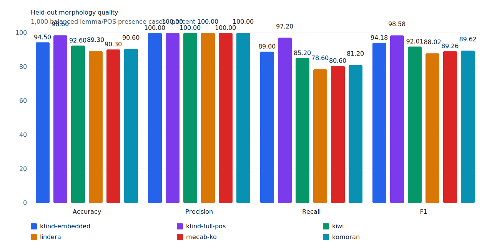
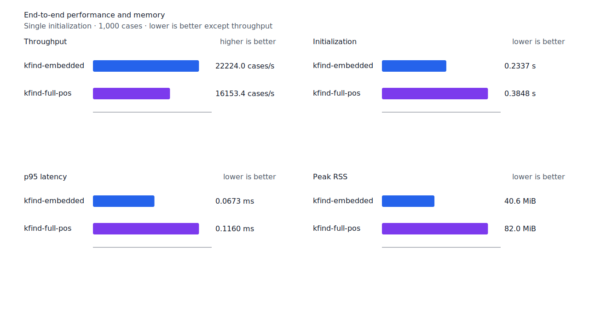
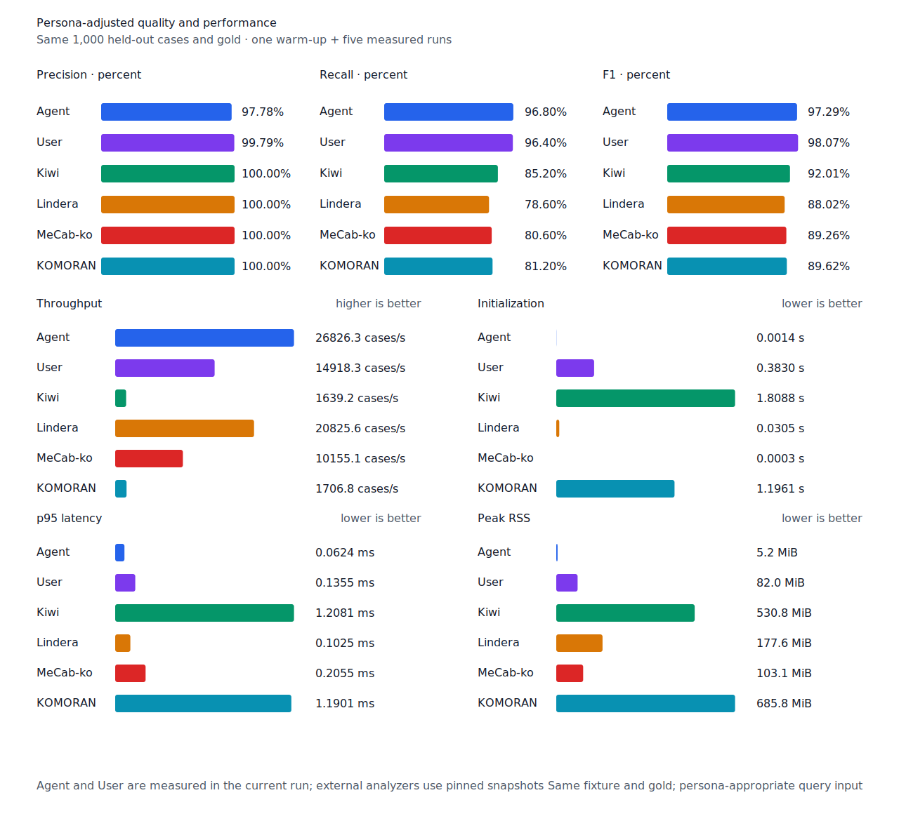

# 연결 어미 뒤 topic recall

- 측정일: 2026-07-17
- 최신 `origin/main` 및 기준 revision:
  `9e71d48d6ff2641df6aecdd75436977182819f8c`
- 후보 revision: `5112d4a94c37fc268e80ab5bd8bf1842829d1961`
- 환경: Linux 6.12.76/linuxkit aarch64, 10 logical CPUs, Python 3.12.13,
  Rust 1.97.0, Docker 29.6.1
- 반복: fresh process warm-up 1회 뒤 5회 측정의 중앙값
- canonical test fixture:
  `933bc12197da866d2363d7df9107d4d9be89a65ddaafd73968ad5384832b21ff`
- canonical development fixture:
  `604c3a139854fcf59570392f48ab85028785f4a3561ea3c5e702f88b841f907c`
- explicit-POS matrix:
  `fbcce40b533655085ff8a4e9031559f99b54f86abe188b6ddc1d690dd44326c6`
- untagged matrix:
  `b9dd7601301fa19b35acba735a977eba7c56a0c9d67c65dee32db5c8028c71bb`
- development matrix:
  `bc67497c3dc966fb7453b238df52c6d781b1b4485d40e8a5d6a38104dcc7abed`
- hard-negative fixture:
  `f4d8829977ebfd061003724ee4aeb23b36dd901f6e46171c924a1f52a63f0ee5`
- 100 MiB corpus:
  `7692072cb7bff9261c1fa5933bde41b27e558170818eeac6d07cabdd673815ff`
- 기준 report SHA-256:
  `e42ba39e9a05636b9bd551a31ccb9044b03bdb7f959affdd6853497a6adaf38d`
- 후보 report SHA-256:
  `cac46a16f3bb6afea556c4785b1d25df896214cab5b755d3035ed1c08dc51866`

## 원인과 규칙

`위해서는`, `대해서는`, `없지는`은 generator가 `위해서`, `대해서`, `없지`까지 올바른
연결 어미 rule path로 소비했지만 topic `는`을 남겼다. 기존 source 경로는 조사 allomorph로
시작하는 잔여 suffix를 선거부했다.

`ending.aoeo-seo` 또는 `ending.connective-ji`를 소비하고 정확히 `는`만 남긴 candidate에
한해 source path를 두 구간으로 검증한다. Candidate가 소비한 경계까지는 같은 품사의
`predicate + E+`, 그 경계 뒤 token 끝까지는 `J+`여야 한다. 따라서 `서/JKB`처럼 candidate
내부에서 조사가 시작하는 경쟁 path와 `위해서를`·`없지를` 같은 다른 조사는 열지 않는다.
Matrix contract 정의, annotation과 gate는 변경하지 않았다.

## Canonical 품질과 contract 지표

`PNᶜ`는 contract-positive 분모 `TPᶜ + FNᶜ`다. Canonical fixture의 `PNᶜ`는 500이며
reclassified case는 0건이다.

| fixture/profile | 기준 TPᶜ / FPᶜ / FNᶜ | 후보 TPᶜ / FPᶜ / FNᶜ | PNᶜ | recallᶜ |
| --- | ---: | ---: | ---: | ---: |
| development embedded `smart` | 455 / 4 / 45 | 455 / 4 / 45 | 500 | 91.0% → 91.0% |
| development full-POS `smart` | 467 / 4 / 33 | 468 / 4 / 32 | 500 | 93.4% → 93.6% |
| test embedded `smart` | 445 / 0 / 55 | 445 / 0 / 55 | 500 | 89.0% → 89.0% |
| test full-POS `smart` | 485 / 0 / 15 | 486 / 0 / 14 | 500 | 97.0% → 97.2% |
| Human full-POS `smart` | 481 / 1 / 19 | 482 / 1 / 18 | 500 | 96.2% → 96.4% |
| Agent embedded `any` | 484 / 11 / 16 | 484 / 11 / 16 | 500 | 96.8% → 96.8% |

Test full-POS와 Human은 `취집하기 위해서는`의 `위하다`를 회수했다. Development full-POS는
`없지는` 1건을 회수했다. FP와 FPᶜ는 변하지 않았다. Hard-negative도 기준과 후보가 모두
strict `FP 6 / TN 32`, contract-adjusted `TPᶜ 5 / FPᶜ 1 / TNᶜ 32 / FNᶜ 0`이다.



## Query matrix strict·contract-adjusted 품질

현재 matrix의 reclassified case는 0건이므로 strict와 contract-adjusted confusion matrix가
같다. Test matrix의 `PNᶜ=1,401`, development matrix의 `PNᶜ=1,391`이다.

| fixture/profile | 기준 TPᶜ / FPᶜ / FNᶜ | 후보 TPᶜ / FPᶜ / FNᶜ | PNᶜ | recallᶜ | 모든 contract 질의 회수 |
| --- | ---: | ---: | ---: | ---: | ---: |
| development embedded `smart` | 1,230 / 7 / 161 | 1,230 / 7 / 161 | 1,391 | 88.43% → 88.43% | 324 → 324 / 466 |
| development full-POS `smart` | 1,284 / 8 / 107 | 1,287 / 8 / 104 | 1,391 | 92.31% → 92.52% | 367 → 370 / 466 |
| test embedded `smart` | 1,258 / 5 / 143 | 1,258 / 5 / 143 | 1,401 | 89.79% → 89.79% | 338 → 338 / 468 |
| test full-POS `smart` | 1,339 / 5 / 62 | 1,341 / 5 / 60 | 1,401 | 95.57% → 95.72% | 409 → 411 / 468 |
| Human full-POS `smart` | 1,337 / 4 / 64 | 1,339 / 4 / 62 | 1,401 | 95.43% → 95.57% | 406 → 408 / 468 |
| Agent embedded `any` | 1,363 / 21 / 38 | 1,363 / 21 / 38 | 1,401 | 97.29% → 97.29% | 430 → 430 / 468 |

Test full-POS와 Human은 `대해서는`의 `대하다`, `위해서는`의 `위하다` 2건을 회수했다.
Development full-POS는 `하지는`, `해서는`, `없지는` 3건을 회수했다. 모든 profile에서 새
FP·FPᶜ와 회귀는 없다.

## 성능

모든 morphology 행은 같은 환경에서 fresh process warm-up 1회 뒤 5회 측정한
`median [min, max]`다. 모든 변화는 10% 회귀 경고선 안이다.

| workload | revision | initialization (s) | cases/s | p95 (ms) | RSS (KiB) |
| --- | --- | ---: | ---: | ---: | ---: |
| canonical embedded `smart` | 기준 | 0.233682 [0.232622, 0.237040] | 22,105.9 [21,503.7, 22,209.2] | 0.0688 [0.0668, 0.0696] | 41,600 [41,592, 41,608] |
| canonical embedded `smart` | 후보 | 0.233741 [0.232602, 0.246402] | 22,224.0 [20,574.4, 22,406.2] | 0.0673 [0.0665, 0.0745] | 41,592 [41,584, 41,604] |
| canonical full-POS `smart` | 기준 | 0.376157 [0.375098, 0.379097] | 16,744.8 [16,525.4, 16,895.9] | 0.1118 [0.1105, 0.1156] | 83,964 [83,960, 83,968] |
| canonical full-POS `smart` | 후보 | 0.384752 [0.375958, 0.407815] | 16,153.4 [15,811.6, 16,868.5] | 0.1160 [0.1110, 0.1186] | 83,960 [83,952, 83,964] |
| canonical Agent `any` | 기준 | 0.001528 [0.001470, 0.001610] | 25,531.0 [24,703.0, 25,757.4] | 0.0666 [0.0656, 0.0693] | 5,324 [5,316, 5,336] |
| canonical Agent `any` | 후보 | 0.001431 [0.001407, 0.001464] | 26,826.3 [26,629.1, 26,886.7] | 0.0624 [0.0623, 0.0630] | 5,320 [5,316, 5,328] |
| canonical Human `smart` | 기준 | 0.381775 [0.377885, 0.394107] | 14,430.2 [14,046.2, 15,400.9] | 0.1405 [0.1321, 0.1466] | 83,976 [83,888, 83,980] |
| canonical Human `smart` | 후보 | 0.380510 [0.377640, 0.390711] | 15,195.6 [14,309.8, 15,428.3] | 0.1331 [0.1325, 0.1415] | 83,976 [83,892, 83,984] |
| matrix Agent `any` | 기준 | 0.001464 [0.001436, 0.001518] | 27,489.7 [27,461.5, 27,669.3] | 0.0607 [0.0604, 0.0623] | 8,428 [8,424, 8,432] |
| matrix Agent `any` | 후보 | 0.001453 [0.001426, 0.001506] | 27,532.0 [26,649.2, 27,603.7] | 0.0604 [0.0602, 0.0635] | 8,428 [8,424, 8,432] |
| matrix Human `smart` | 기준 | 0.377089 [0.375959, 0.377952] | 15,994.8 [15,651.0, 16,081.1] | 0.1346 [0.1340, 0.1367] | 84,704 [84,700, 84,716] |
| matrix Human `smart` | 후보 | 0.378157 [0.377307, 0.379882] | 15,942.5 [15,260.1, 15,967.6] | 0.1357 [0.1354, 0.1393] | 84,708 [84,700, 84,712] |

중앙값 기준 canonical embedded/full-POS/Agent/Human cases/s 변화는 각각 +0.53%, -3.53%,
+5.07%, +5.30%다. Matrix Agent와 Human은 각각 +0.15%, -0.33%다. 100 MiB CLI 처리량은
Agent 5,431.33→5,392.87 MiB/s(-0.71%), Human 350.93→345.48 MiB/s(-1.55%)다.

동일 canonical fixture의 후보 Agent는 26,826.3 cases/s로 Lindera 4.0.0 고정 snapshot의
20,825.6 cases/s보다 28.81% 빠르다. recallᶜ는 96.8% 대 78.6%, peak RSS는
5.2 MiB 대 177.6 MiB다.





## 남은 FN

Canonical test full-POS의 `PNᶜ`는 500, `FNᶜ`는 14다. Matrix full-POS의 `PNᶜ`는
1,401, `FNᶜ`는 60이다. 가장 큰 동일 질의 묶음인 부사 `안` 3건과 형용사 `이다` 3건은
비표준 붙여쓰기·축약·표기다.

남은 표준형 중 대명사 `저→제` 2건과 `누구→누가` 1건은 같은 nominal surface override
계열이며, `오다→온지를`는 별도 nominalizer-particle 구조다. 다음 작업은 기존 `나→내가`,
`너→네가`, `저→제가` 계약과 대조해 대명사 3건을 먼저 검증한다.

## 재현

```console
git switch --detach 9e71d48d6ff2641df6aecdd75436977182819f8c
KFIND_MORPH_IMAGE=kfind-morph-benchmark:connective-topic-base-9e71d48 \
KFIND_MORPH_RUNS=5 \
scripts/benchmark-morphology.sh target/morph-connective-topic-base-9e71d48

git switch --detach 5112d4a94c37fc268e80ab5bd8bf1842829d1961
KFIND_MORPH_IMAGE=kfind-morph-benchmark:connective-topic-candidate-5112d4a \
KFIND_MORPH_RUNS=5 \
scripts/benchmark-morphology.sh target/morph-connective-topic-candidate-5112d4a

python3 tools/morph-compare/render_charts.py \
  target/morph-connective-topic-candidate-5112d4a/report.json \
  docs/benchmarks/assets \
  --prefix 2026-07-17-connective-topic-recall-

python3 tools/morph-compare/export_site_snapshot.py \
  target/morph-connective-topic-candidate-5112d4a/report.json \
  docs/benchmarks/site-morphology.json \
  --revision 5112d4a94c37fc268e80ab5bd8bf1842829d1961
```

외부 분석기 snapshot은 fixture, adapter schema와 고정 버전·설정이 바뀌지 않아 갱신하지
않았다.
