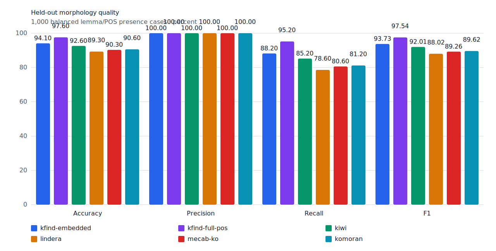
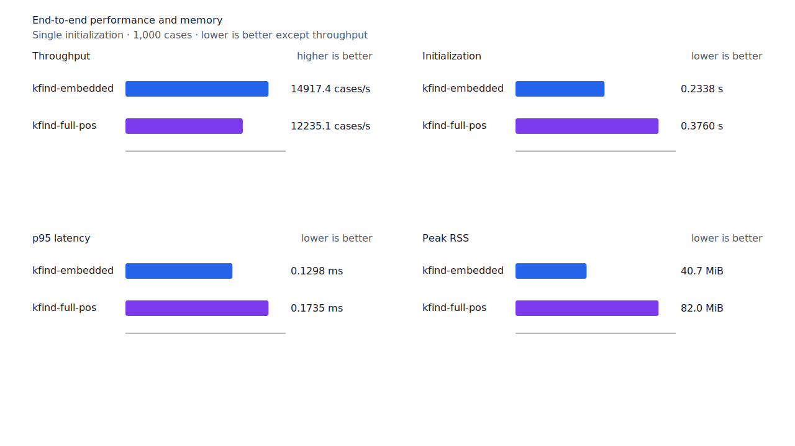
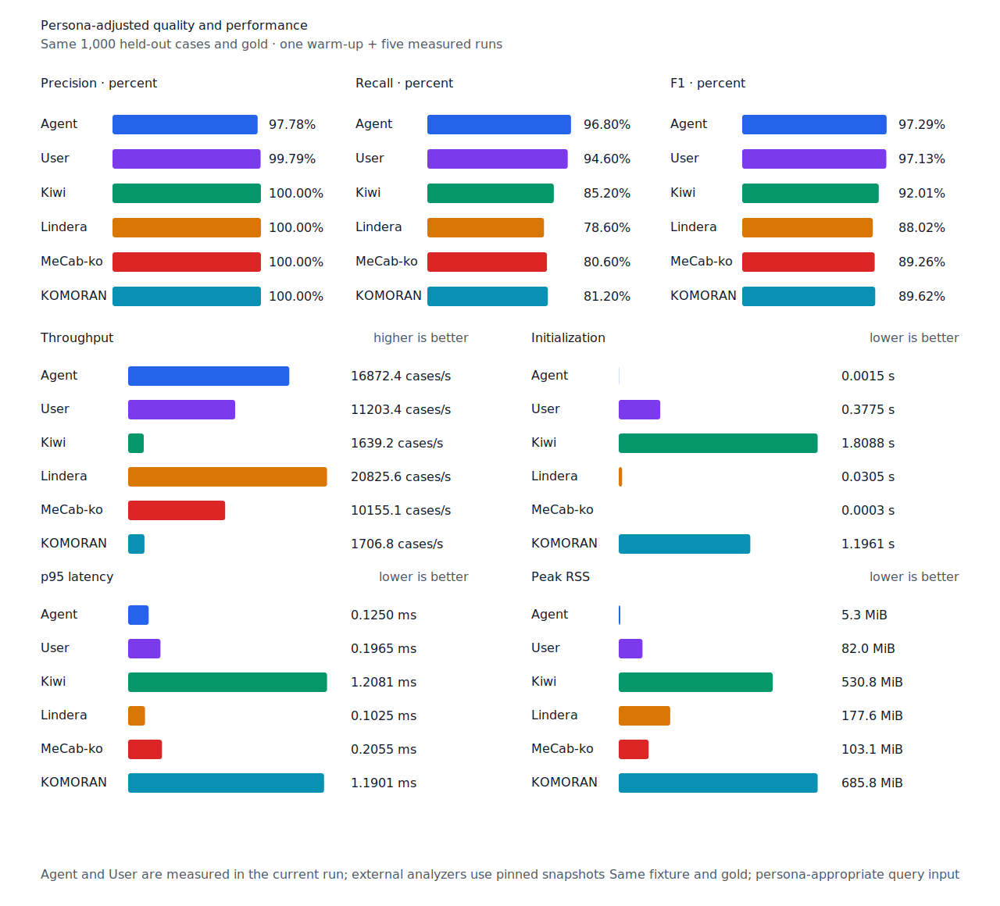

# 체언 뒤 지정사 구조 recall

- 측정일: 2026-07-17
- 기준 revision: `27eb775d4860090c6a2f9b3b03492733960c653f`
- 후보 revision: `bf9acb6ec33d32e9d35d8fc83a7a9db48291757d`
- 환경: Linux 6.12.76/linuxkit aarch64, 10 logical CPUs, Python 3.12.13,
  Rust 1.97.0, Docker 29.6.1
- 반복: fresh process warm-up 1회 뒤 5회 측정의 중앙값
- canonical test fixture:
  `933bc12197da866d2363d7df9107d4d9be89a65ddaafd73968ad5384832b21ff`
- canonical development fixture:
  `604c3a139854fcf59570392f48ab85028785f4a3561ea3c5e702f88b841f907c`
- explicit-POS matrix:
  `fbcce40b533655085ff8a4e9031559f99b54f86abe188b6ddc1d690dd44326c6`
- untagged matrix:
  `b9dd7601301fa19b35acba735a977eba7c56a0c9d67c65dee32db5c8028c71bb`
- development matrix:
  `bc67497c3dc966fb7453b238df52c6d781b1b4485d40e8a5d6a38104dcc7abed`
- 기준 hard-negative fixture:
  `9b473c62b49df443f2504d1e1209d8c396592ac2d6610d534e3945cc60371eea`
- 후보 hard-negative fixture:
  `ae504aff331d4dbb8837198d607d19b31e85424535e960b1f5c608d270ed8a2e`
- 100 MiB corpus:
  `7692072cb7bff9261c1fa5933bde41b27e558170818eeac6d07cabdd673815ff`
- 기준 report SHA-256:
  `91d81a9d98657b612fec706acb5b5d9fc4ede1da066c5fded3c0d1838ba5f024`
- 후보 report SHA-256:
  `4018106b099e47a264da93c26080ce769b7062b34c892ff3e7d6ddfb5740df99`

## 규칙

지정사 core 앞에 token 왼쪽 경계부터 완성된 체언 host가 있고 source component의 VCP와
완결 어미가 token 끝까지 이어질 때 host에 붙은 지정사를 유지한다. `동안이었습니다`, `곳인`,
`공학입니다`는 compact runtime component로 증명한다. 생성 branch가 suffix를 남기는
`끝인가`는 같은 VCP source node가 token 끝까지 완성한 경로가 있을 때만 trailing을 소비한다.

token 전체가 부사인 `매일`과 VCP core 왼쪽에 체언 host가 없는 `큰 일이`의 `일`은 거부한다.
Matrix contract 정의와 annotation은 변경하지 않았다.

## Canonical 품질과 contract 지표

`PNᶜ`는 contract-positive 분모 `TPᶜ + FNᶜ`다. Canonical fixture에는 strict gold와 다른
contract-positive가 없으므로 각 1,000-case 평가의 `PNᶜ`는 500이다.

| fixture/profile | 기준 TPᶜ / FPᶜ / FNᶜ | 후보 TPᶜ / FPᶜ / FNᶜ | PNᶜ | recallᶜ |
| --- | ---: | ---: | ---: | ---: |
| development embedded `smart` | 452 / 4 / 48 | 452 / 4 / 48 | 500 | 90.4% → 90.4% |
| development full-POS `smart` | 461 / 4 / 39 | 461 / 4 / 39 | 500 | 92.2% → 92.2% |
| test embedded `smart` | 441 / 0 / 59 | 441 / 0 / 59 | 500 | 88.2% → 88.2% |
| test full-POS `smart` | 476 / 0 / 24 | 476 / 0 / 24 | 500 | 95.2% → 95.2% |
| Human full-POS `smart` | 473 / 1 / 27 | 473 / 1 / 27 | 500 | 94.6% → 94.6% |
| Agent embedded `any` | 484 / 11 / 16 | 484 / 11 / 16 | 500 | 96.8% → 96.8% |

Canonical 1,000-case 품질은 변하지 않았다. 후보 hard-negative 36건 중 신규
`매일 보고 있다.`와 `큰 일이 생겼다.`는 embedded와 full-POS에서 모두 거부했다.
`homonymous-other-pos` 10건의 strict FP와 FPᶜ는 0이다.



## Query matrix strict·contract-adjusted 품질

현재 matrix의 reclassified case는 0건이므로 strict와 contract-adjusted confusion matrix가
같다. 두 지표 family는 report의 별도 필드로 검증했다. Test matrix의 `PNᶜ=1,401`,
development matrix의 `PNᶜ=1,391`이다.

| fixture/profile | 기준 TPᶜ / FPᶜ / FNᶜ | 후보 TPᶜ / FPᶜ / FNᶜ | PNᶜ | recallᶜ | 모든 contract 질의 회수 |
| --- | ---: | ---: | ---: | ---: | ---: |
| development embedded `smart` | 1,213 / 7 / 178 | 1,218 / 7 / 173 | 1,391 | 87.20% → 87.56% | — |
| development full-POS `smart` | 1,258 / 8 / 133 | 1,263 / 8 / 128 | 1,391 | 90.44% → 90.80% | — |
| test embedded `smart` | 1,244 / 5 / 157 | 1,248 / 5 / 153 | 1,401 | 88.79% → 89.08% | 326 → 329 / 468 |
| test full-POS `smart` | 1,308 / 5 / 93 | 1,312 / 5 / 89 | 1,401 | 93.36% → 93.65% | 381 → 384 / 468 |
| Human full-POS `smart` | 1,310 / 4 / 91 | 1,314 / 4 / 87 | 1,401 | 93.50% → 93.79% | 381 → 384 / 468 |
| Agent embedded `any` | 1,363 / 21 / 38 | 1,363 / 21 / 38 | 1,401 | 97.29% → 97.29% | 430 → 430 / 468 |

Test의 embedded, full-POS와 Human은 다음 4건을 모두 복구했다.

- `사흘 동안이었습니다.`
- `오늘 오후의 영하 24.0가 끝인가?`
- `사고가 움직이게 되는 곳인 사상 규정`
- `제 전공은 기계 공학입니다.`

Agent의 `any`는 기준에서도 네 건을 회수했다. Development matrix에서는 동일한 구조의
`제일입니다`, `나영입니다`, `글이다`, `기억이다`, `노동이다` 5건을 추가 회수했다.
새 strict FP·FPᶜ와 회귀는 없다.

## 성능

모든 morphology 행은 같은 환경에서 fresh process warm-up 1회 뒤 5회 측정한
`median [min, max]`다. 모든 변화는 10% 경고선 안이다.

| workload | revision | initialization (s) | cases/s | p95 (ms) | RSS (KiB) |
| --- | --- | ---: | ---: | ---: | ---: |
| canonical embedded `smart` | 기준 | 0.234004 [0.232172, 0.241391] | 14,875.6 [14,729.3, 14,928.2] | 0.1294 [0.1262, 0.1336] | 41,716 [41,708, 41,724] |
| canonical embedded `smart` | 후보 | 0.233819 [0.232360, 0.234057] | 14,917.4 [13,921.2, 15,036.0] | 0.1298 [0.1270, 0.1369] | 41,724 [41,720, 41,724] |
| canonical full-POS `smart` | 기준 | 0.380869 [0.375200, 0.398762] | 12,007.6 [10,680.4, 12,334.3] | 0.1774 [0.1715, 0.2068] | 83,980 [83,972, 83,984] |
| canonical full-POS `smart` | 후보 | 0.375969 [0.374534, 0.383296] | 12,235.1 [11,224.0, 12,345.0] | 0.1735 [0.1713, 0.1903] | 83,976 [83,964, 83,980] |
| canonical Human `smart` | 기준 | 0.375917 [0.375038, 0.388310] | 11,222.7 [10,408.6, 11,278.7] | 0.1963 [0.1930, 0.2062] | 84,004 [84,000, 84,004] |
| canonical Human `smart` | 후보 | 0.376961 [0.375231, 0.378634] | 11,239.7 [10,766.1, 11,354.0] | 0.1933 [0.1918, 0.2034] | 84,004 [83,984, 84,004] |
| matrix Agent `any` | 기준 | 0.001500 [0.001484, 0.001577] | 17,345.1 [17,160.1, 17,418.4] | 0.1231 [0.1223, 0.1243] | 8,552 [8,548, 8,556] |
| matrix Agent `any` | 후보 | 0.001435 [0.001412, 0.001461] | 17,444.0 [17,365.4, 17,456.1] | 0.1219 [0.1217, 0.1232] | 8,552 [8,540, 8,556] |
| matrix Human `smart` | 기준 | 0.377807 [0.375425, 0.396153] | 11,601.6 [11,229.2, 11,790.6] | 0.1967 [0.1935, 0.2013] | 84,732 [84,728, 84,732] |
| matrix Human `smart` | 후보 | 0.373433 [0.372925, 0.377075] | 11,574.4 [9,088.3, 11,835.4] | 0.1962 [0.1931, 0.2370] | 84,732 [84,716, 84,732] |

중앙값 기준 canonical embedded/full-POS/Human cases/s 변화는 각각 +0.28%, +1.89%,
+0.15%다. Canonical Agent는 16,022.2→16,872.4 cases/s(+5.31%), matrix Agent는
+0.57%, matrix Human은 -0.23%다. 100 MiB CLI 처리량은 Agent
5,394.63→5,661.54 MiB/s(+4.95%), Human 348.45→348.05 MiB/s(-0.11%)다.

동일 canonical fixture의 후보 Agent는 16,872.4 cases/s로 Lindera 4.0.0 snapshot
20,825.6 cases/s보다 18.98% 느리다. Recall은 96.8% 대 78.6%, peak RSS는 5.3 MiB 대
177.6 MiB다. 이 recall slice에서는 Lindera 처리량을 따라잡지 못했으므로 다음 성능 작업은
작은 상수 비용이 아니라 profile에서 확인한 평가 병목을 대상으로 한다.





## 남은 FN

Canonical test full-POS의 `PNᶜ`는 500, `FNᶜ`는 24다. Matrix full-POS의 `이다` FN은
무표면 축약 `겁니다` 2건과 비표준 표기 `이예요` 1건만 남았다. 이 셋은 canonical 활용에
합치지 않는다.

Matrix full-POS의 다음 큰 standard-form FN 묶음은 `오다` 5건, `지다` 4건, `있다` 동사
3건이다. 다음 제품 recall slice는 surface를 개별 추가하기 전에 이들의 공통 원인을 다시
분류한다.

## 재현

```console
git switch --detach 27eb775d4860090c6a2f9b3b03492733960c653f
KFIND_MORPH_IMAGE=kfind-morph-benchmark:copula-host-base-27eb775 \
KFIND_MORPH_RUNS=5 \
scripts/benchmark-morphology.sh target/morph-copula-host-base-27eb775

git switch --detach bf9acb6ec33d32e9d35d8fc83a7a9db48291757d
KFIND_MORPH_IMAGE=kfind-morph-benchmark:copula-host-candidate-bf9acb6 \
KFIND_MORPH_RUNS=5 \
scripts/benchmark-morphology.sh target/morph-copula-host-candidate-bf9acb6

python3 tools/morph-compare/render_charts.py \
  target/morph-copula-host-candidate-bf9acb6/report.json docs/benchmarks/assets \
  --prefix 2026-07-17-copula-nominal-host-recall-

python3 tools/morph-compare/export_site_snapshot.py \
  target/morph-copula-host-candidate-bf9acb6/report.json \
  docs/benchmarks/site-morphology.json --revision bf9acb6
```

외부 분석기 snapshot은 고정 버전·설정과 같은 canonical fixture를 사용했다.
