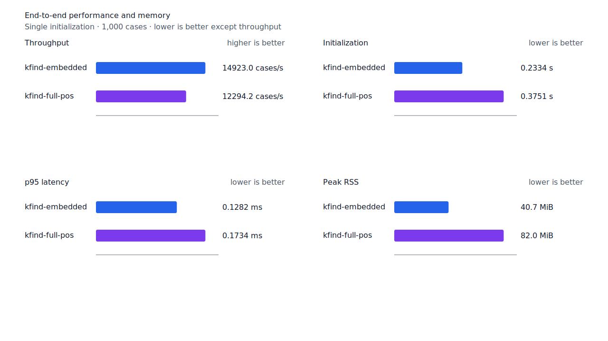
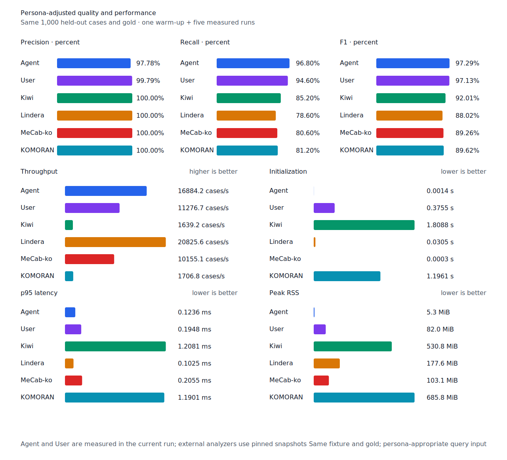

# 지정사 완성형 recall

- 측정일: 2026-07-17
- 기준 revision: `1bb353aefcfeff5cd16dcbb8dca7d8fd82fc310e`
- 후보 revision: `40713efcec5e007c9c5b92c5b2cf3f212692ca48`
- 환경: Linux 6.12.76/linuxkit aarch64, 10 logical CPUs, Python 3.12.13,
  Rust 1.97.0, Docker 29.6.1
- 반복: fresh process warm-up 1회 뒤 5회 측정의 중앙값
- canonical test fixture:
  `933bc12197da866d2363d7df9107d4d9be89a65ddaafd73968ad5384832b21ff`
- canonical development fixture:
  `604c3a139854fcf59570392f48ab85028785f4a3561ea3c5e702f88b841f907c`
- explicit-POS matrix:
  `fbcce40b533655085ff8a4e9031559f99b54f86abe188b6ddc1d690dd44326c6`
- untagged matrix:
  `b9dd7601301fa19b35acba735a977eba7c56a0c9d67c65dee32db5c8028c71bb`
- development matrix:
  `bc67497c3dc966fb7453b238df52c6d781b1b4485d40e8a5d6a38104dcc7abed`
- 기준 hard-negative fixture:
  `a1e87b1430b034cc03a93368e4abf035c1d083960c0eff38a32f729234f466bc`
- 후보 hard-negative fixture:
  `9b473c62b49df443f2504d1e1209d8c396592ac2d6610d534e3945cc60371eea`
- 100 MiB corpus:
  `7692072cb7bff9261c1fa5933bde41b27e558170818eeac6d07cabdd673815ff`
- 기준 report SHA-256:
  `aa774860c0f29c11b698022921bfc68a8768c65eba8d3fdf36df573551640117`
- 후보 report SHA-256:
  `436747f2f904f9923d1d08a570fc3ffb45292488c4a1b5e518b1ada3586d27dd`

## 규칙

지정사 `이다`가 source의 `VCP=이`와 완성된 어미로 분석될 때 `이라고`, `이라는`, `이지`,
`이며`를 제한된 continuation vocabulary에 추가한다. 각 표면형은 terminal branch로만 생성하고
어미 뒤 생산적인 suffix를 더 열지 않는다.

이번 범위는 source에 표면 `이`가 없는 축약 `겁니다`와 비표준 표기 `이예요`를 포함하지
않는다. 고유명사 `이지`도 별도 hard negative로 두어 query `이다`의 구조 근거가 되지 않음을
검증한다. Matrix contract 정의와 annotation은 변경하지 않았다.

## Canonical 품질과 contract 지표

`PNᶜ`는 contract-positive 분모 `TPᶜ + FNᶜ`다. Canonical fixture에는 strict gold와 다른
contract-positive가 없으므로 각 1,000-case 평가의 `PNᶜ`는 500이다.

| fixture/profile | 기준 TPᶜ / FPᶜ / FNᶜ | 후보 TPᶜ / FPᶜ / FNᶜ | PNᶜ | recallᶜ |
| --- | ---: | ---: | ---: | ---: |
| development embedded `smart` | 452 / 4 / 48 | 452 / 4 / 48 | 500 | 90.4% → 90.4% |
| development full-POS `smart` | 461 / 4 / 39 | 461 / 4 / 39 | 500 | 92.2% → 92.2% |
| test embedded `smart` | 440 / 0 / 60 | 441 / 0 / 59 | 500 | 88.0% → 88.2% |
| test full-POS `smart` | 475 / 0 / 25 | 476 / 0 / 24 | 500 | 95.0% → 95.2% |
| Human full-POS `smart` | 472 / 1 / 28 | 473 / 1 / 27 | 500 | 94.4% → 94.6% |
| Agent embedded `any` | 483 / 11 / 17 | 484 / 11 / 16 | 500 | 96.6% → 96.8% |

Canonical test에서는 `클럽이라는` 한 건을 복구했다. 회귀하거나 새 strict FP·FPᶜ가 된 case는
없다. 신규 hard negative `이지가 먼저 도착했다.`는 embedded와 full-POS에서 모두 거부했고,
`homonymous-other-pos` 8건의 strict FP와 FPᶜ는 0이다.


## Query matrix strict·contract-adjusted 품질

현재 matrix의 reclassified case는 0건이므로 strict와 contract-adjusted confusion matrix가
같다. 두 지표 family는 report의 별도 필드로 검증했다. Test matrix의 `PNᶜ=1,401`,
development matrix의 `PNᶜ=1,391`이다.

| fixture/profile | 기준 TPᶜ / FPᶜ / FNᶜ | 후보 TPᶜ / FPᶜ / FNᶜ | PNᶜ | recallᶜ | 모든 contract 질의 회수 |
| --- | ---: | ---: | ---: | ---: | ---: |
| development embedded `smart` | 1,213 / 7 / 178 | 1,213 / 7 / 178 | 1,391 | 87.20% → 87.20% | 309 → 309 / 466 |
| development full-POS `smart` | 1,258 / 8 / 133 | 1,258 / 8 / 133 | 1,391 | 90.44% → 90.44% | 344 → 344 / 466 |
| test embedded `smart` | 1,239 / 5 / 162 | 1,244 / 5 / 157 | 1,401 | 88.44% → 88.79% | 321 → 326 / 468 |
| test full-POS `smart` | 1,303 / 5 / 98 | 1,308 / 5 / 93 | 1,401 | 93.00% → 93.36% | 376 → 381 / 468 |
| Human full-POS `smart` | 1,307 / 4 / 94 | 1,310 / 4 / 91 | 1,401 | 93.29% → 93.50% | 378 → 381 / 468 |
| Agent embedded `any` | 1,358 / 21 / 43 | 1,363 / 21 / 38 | 1,401 | 96.93% → 97.29% | 425 → 430 / 468 |

Explicit-POS의 embedded, full-POS와 Agent는 다음 5건을 모두 복구했다.

- `마련이라고`
- `우스남이지`
- `친근성이라는`
- `싱가폴이며`
- `클럽이라는`

Human은 `마련이라고`, `친근성이라는`, `클럽이라는` 3건을 새로 복구했다. `이지`와 `이며`
case는 기준의 untagged multi-POS plan에서도 이미 회수됐다. 모든 explicit-POS 회복 문장은 다른
질의도 이미 회수된 상태라 완전 회수 문장도 profile별 회복 수만큼 늘었다. 새 strict FP·FPᶜ와
회귀는 없다.

## 성능

모든 morphology 행은 같은 환경에서 fresh process warm-up 1회 뒤 5회 측정한
`median [min, max]`다. 모든 변화는 10% 경고선 안이다.

| workload | revision | initialization (s) | cases/s | p95 (ms) | RSS (KiB) |
| --- | --- | ---: | ---: | ---: | ---: |
| canonical embedded `smart` | 기준 | 0.233456 [0.232229, 0.237300] | 15,023.1 [12,965.4, 15,063.3] | 0.1267 [0.1245, 0.1475] | 41,724 [41,720, 41,728] |
| canonical embedded `smart` | 후보 | 0.233351 [0.232184, 0.241882] | 14,923.0 [13,973.1, 15,002.4] | 0.1282 [0.1270, 0.1393] | 41,716 [41,712, 41,724] |
| canonical full-POS `smart` | 기준 | 0.376456 [0.374109, 0.388523] | 11,930.9 [11,723.1, 12,461.8] | 0.1795 [0.1710, 0.1825] | 83,976 [83,976, 83,980] |
| canonical full-POS `smart` | 후보 | 0.375104 [0.374470, 0.377146] | 12,294.2 [11,558.7, 12,361.1] | 0.1734 [0.1710, 0.1836] | 83,980 [83,968, 83,980] |
| canonical Human `smart` | 기준 | 0.376263 [0.374267, 0.383031] | 11,382.1 [10,261.4, 11,406.4] | 0.1924 [0.1918, 0.2177] | 84,004 [83,996, 84,004] |
| canonical Human `smart` | 후보 | 0.376012 [0.373349, 0.377182] | 11,323.7 [11,175.9, 11,414.3] | 0.1930 [0.1912, 0.1959] | 84,004 [84,000, 84,004] |
| matrix Agent `any` | 기준 | 0.001448 [0.001446, 0.001868] | 17,512.0 [13,048.3, 17,557.4] | 0.1222 [0.1218, 0.2407] | 8,548 [8,544, 8,552] |
| matrix Agent `any` | 후보 | 0.001476 [0.001421, 0.001542] | 17,386.5 [17,249.4, 17,445.2] | 0.1219 [0.1214, 0.1235] | 8,556 [8,544, 8,556] |
| matrix Human `smart` | 기준 | 0.375800 [0.373295, 0.384335] | 11,822.8 [11,014.3, 11,857.8] | 0.1923 [0.1919, 0.2072] | 84,732 [84,728, 84,732] |
| matrix Human `smart` | 후보 | 0.375218 [0.373254, 0.377404] | 11,509.7 [9,324.0, 11,783.3] | 0.1970 [0.1945, 0.2938] | 84,728 [84,724, 84,732] |

중앙값 기준 canonical embedded/full-POS/Human cases/s 변화는 각각 -0.67%, +3.05%,
-0.51%다. Matrix Agent는 -0.72%, Human은 -2.65%다. 100 MiB CLI 처리량은 Agent
5,735.53→5,941.14 MiB/s(+3.58%), Human 350.79→351.84 MiB/s(+0.30%)다.

후보 matrix Agent는 17,386.5 cases/s로 같은 fixture의 Lindera 4.0.0 snapshot 19,829.6
cases/s보다 12.32% 느리다. Recall은 97.29% 대 80.51%, peak RSS는 8.4 MiB 대 199.5 MiB다.
성능 변화는 terminal surface branch 4개를 추가한 비용과 측정 잡음을 함께 포함한다.





## 남은 FN

Canonical test full-POS의 `PNᶜ`는 500, `FNᶜ`는 24다. Matrix full-POS의 `이다` FN 7건은
다음처럼 분리된다.

- boundary-rejected 4건: `동안이었습니다`, `끝인가`, `곳인`, `공학입니다`
- 무표면 축약 2건: `겁니다`
- 비표준 표기 1건: `이예요`

다음 제품 recall slice는 source component가 이미 있는 boundary-rejected 4건의 nominal-host
배치를 공통 구조로 증명한다. 무표면 축약과 비표준 표기는 canonical 활용에 합치지 않는다.

## 재현

```console
git switch --detach 1bb353aefcfeff5cd16dcbb8dca7d8fd82fc310e
KFIND_MORPH_IMAGE=kfind-morph-benchmark:copula-base-1bb353a \
KFIND_MORPH_RUNS=5 \
scripts/benchmark-morphology.sh target/morph-copula-base-1bb353a

git switch --detach 40713efcec5e007c9c5b92c5b2cf3f212692ca48
KFIND_MORPH_IMAGE=kfind-morph-benchmark:copula-candidate-40713ef \
KFIND_MORPH_RUNS=5 \
scripts/benchmark-morphology.sh target/morph-copula-candidate-40713ef

python3 tools/morph-compare/render_charts.py \
  target/morph-copula-candidate-40713ef/report.json docs/benchmarks/assets \
  --prefix 2026-07-17-copula-surface-recall-

python3 tools/morph-compare/export_site_snapshot.py \
  target/morph-copula-candidate-40713ef/report.json \
  docs/benchmarks/site-morphology.json --revision 40713ef
```

외부 분석기 snapshot은 latest main의 같은 query-matrix fixture와 고정 버전·설정을 사용했다.
