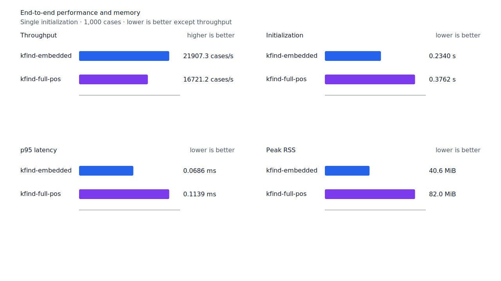
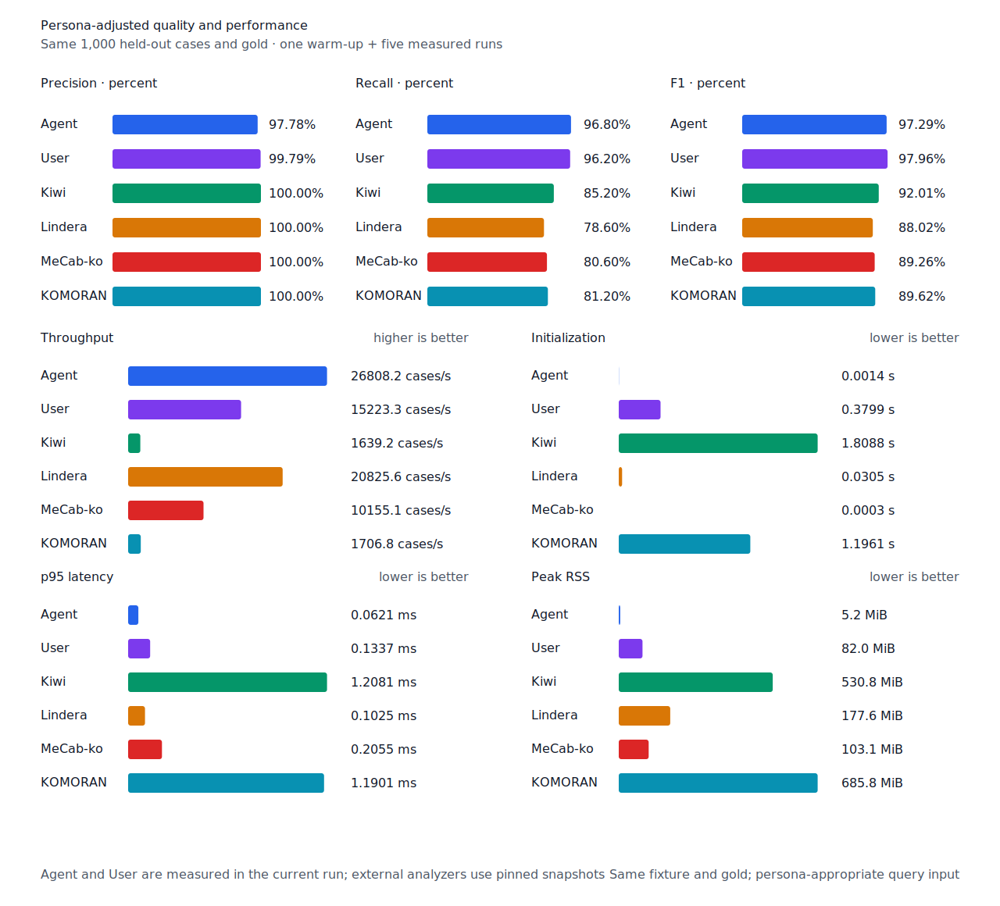

# `-다는` source 어미 recall

- 측정일: 2026-07-17
- 최신 `origin/main` 및 기준 revision:
  `3a41b923f232f1008187e933a3a0c58f3efc42c0`
- 후보 revision: `d9fc870861462bfc9f3bcd69d027ca56edae9702`
- 환경: Linux 6.12.76/linuxkit aarch64, 10 logical CPUs, Python 3.12.13,
  Rust 1.97.0, Docker 29.6.1
- 반복: fresh process warm-up 1회 뒤 5회 측정의 중앙값
- canonical test fixture:
  `933bc12197da866d2363d7df9107d4d9be89a65ddaafd73968ad5384832b21ff`
- canonical development fixture:
  `604c3a139854fcf59570392f48ab85028785f4a3561ea3c5e702f88b841f907c`
- explicit-POS matrix:
  `fbcce40b533655085ff8a4e9031559f99b54f86abe188b6ddc1d690dd44326c6`
- untagged matrix:
  `b9dd7601301fa19b35acba735a977eba7c56a0c9d67c65dee32db5c8028c71bb`
- development matrix:
  `bc67497c3dc966fb7453b238df52c6d781b1b4485d40e8a5d6a38104dcc7abed`
- hard-negative fixture:
  `f4d8829977ebfd061003724ee4aeb23b36dd901f6e46171c924a1f52a63f0ee5`
- 100 MiB corpus:
  `7692072cb7bff9261c1fa5933bde41b27e558170818eeac6d07cabdd673815ff`
- 기준 report SHA-256:
  `ca95dae1dba50d9141d93c7024574feb3eb72a86e5980c8e7f55447efa2e912e`
- 후보 report SHA-256:
  `9c3c10b81f252ced18faf2e44170d4cce4b871971508e39160e91535d2b1818f`

## 원인과 규칙

`왔다는`, `있다는`, `않다는`은 generator가 `다`까지 소비한 뒤 `는`을 남겼다. `는`은
조사 allomorph와 표면이 같아 기존 source 어미 경로의 선거부 조건에 걸렸다. 그러나 compact
source graph는 query core부터 token 끝까지 `용언 + E*` 완성 경로를 증명한다.

Candidate가 `다`까지 실제로 소비하고 정확히 `는`만 남긴 경우에 한해 조사형 선거부를
건너뛴다. 같은 품사의 source graph가 `-다는` 전체를 완성해야 하며, `왔다를`처럼 다른
조사형 suffix가 남거나 source 어미 경로가 없으면 계속 거부한다. Matrix contract 정의,
annotation과 gate는 변경하지 않았다.

## Canonical 품질과 contract 지표

`PNᶜ`는 contract-positive 분모 `TPᶜ + FNᶜ`다. Canonical fixture의 `PNᶜ`는 500이며
reclassified case는 0건이다. 이번 matrix 확장형은 고정 canonical에 없어 모든 canonical
품질 지표가 유지됐다.

| fixture/profile | 기준 TPᶜ / FPᶜ / FNᶜ | 후보 TPᶜ / FPᶜ / FNᶜ | PNᶜ | recallᶜ |
| --- | ---: | ---: | ---: | ---: |
| development embedded `smart` | 455 / 4 / 45 | 455 / 4 / 45 | 500 | 91.0% → 91.0% |
| development full-POS `smart` | 467 / 4 / 33 | 467 / 4 / 33 | 500 | 93.4% → 93.4% |
| test embedded `smart` | 445 / 0 / 55 | 445 / 0 / 55 | 500 | 89.0% → 89.0% |
| test full-POS `smart` | 485 / 0 / 15 | 485 / 0 / 15 | 500 | 97.0% → 97.0% |
| Human full-POS `smart` | 481 / 1 / 19 | 481 / 1 / 19 | 500 | 96.2% → 96.2% |
| Agent embedded `any` | 484 / 11 / 16 | 484 / 11 / 16 | 500 | 96.8% → 96.8% |

Hard-negative도 기준과 후보가 모두 strict `FP 6 / TN 32`, contract-adjusted
`TPᶜ 5 / FPᶜ 1 / TNᶜ 32 / FNᶜ 0`이다. 새 대조군 `왔다를`도 거부된다.


## Query matrix strict·contract-adjusted 품질

현재 matrix의 reclassified case는 0건이므로 strict와 contract-adjusted confusion matrix가
같다. Test matrix의 `PNᶜ=1,401`, development matrix의 `PNᶜ=1,391`이다.

| fixture/profile | 기준 TPᶜ / FPᶜ / FNᶜ | 후보 TPᶜ / FPᶜ / FNᶜ | PNᶜ | recallᶜ | 모든 contract 질의 회수 |
| --- | ---: | ---: | ---: | ---: | ---: |
| development embedded `smart` | 1,230 / 7 / 161 | 1,230 / 7 / 161 | 1,391 | 88.43% → 88.43% | 324 → 324 / 466 |
| development full-POS `smart` | 1,283 / 8 / 108 | 1,284 / 8 / 107 | 1,391 | 92.24% → 92.31% | 366 → 367 / 466 |
| test embedded `smart` | 1,258 / 5 / 143 | 1,258 / 5 / 143 | 1,401 | 89.79% → 89.79% | 338 → 338 / 468 |
| test full-POS `smart` | 1,335 / 5 / 66 | 1,339 / 5 / 62 | 1,401 | 95.29% → 95.57% | 406 → 409 / 468 |
| Human full-POS `smart` | 1,336 / 4 / 65 | 1,337 / 4 / 64 | 1,401 | 95.36% → 95.43% | 405 → 406 / 468 |
| Agent embedded `any` | 1,363 / 21 / 38 | 1,363 / 21 / 38 | 1,401 | 97.29% → 97.29% | 430 → 430 / 468 |

Test full-POS는 `비용적으로 힘든 점이 있다는 것이다`, `정신이 약화되고 있다는 지적`,
`포기할 순간 왔다는 것을`, `이용도 쉽지 않다는 생각`의 네 contract-positive를 회수했다.
Human은 `왔다는` 1건, development full-POS는 `은행빚을 지고 있다는 점` 1건을 회수했다.
FP와 FPᶜ는 모든 profile에서 그대로다.

## 성능

모든 morphology 행은 같은 환경에서 fresh process warm-up 1회 뒤 5회 측정한
`median [min, max]`다. 모든 변화는 10% 회귀 경고선 안이다.

| workload | revision | initialization (s) | cases/s | p95 (ms) | RSS (KiB) |
| --- | --- | ---: | ---: | ---: | ---: |
| canonical embedded `smart` | 기준 | 0.234622 [0.232004, 0.291177] | 22,223.9 [21,581.4, 22,495.8] | 0.0667 [0.0657, 0.0699] | 41,612 [41,604, 41,616] |
| canonical embedded `smart` | 후보 | 0.234041 [0.232456, 0.242299] | 21,907.3 [20,894.3, 22,392.8] | 0.0686 [0.0666, 0.0741] | 41,616 [41,612, 41,620] |
| canonical full-POS `smart` | 기준 | 0.375019 [0.374893, 0.379118] | 16,751.8 [16,637.5, 16,963.9] | 0.1133 [0.1099, 0.1148] | 83,984 [83,976, 83,984] |
| canonical full-POS `smart` | 후보 | 0.376166 [0.374295, 0.389081] | 16,721.2 [16,466.5, 16,826.4] | 0.1139 [0.1117, 0.1164] | 83,980 [83,964, 83,984] |
| canonical Agent `any` | 기준 | 0.001440 [0.001410, 0.001587] | 26,696.7 [25,976.8, 26,913.8] | 0.0629 [0.0611, 0.0652] | 5,340 [5,332, 5,348] |
| canonical Agent `any` | 후보 | 0.001424 [0.001419, 0.001429] | 26,808.2 [26,730.5, 26,862.0] | 0.0621 [0.0616, 0.0633] | 5,336 [5,324, 5,348] |
| canonical Human `smart` | 기준 | 0.376379 [0.375377, 0.382379] | 14,752.9 [14,460.3, 15,353.0] | 0.1367 [0.1317, 0.1391] | 84,004 [84,000, 84,004] |
| canonical Human `smart` | 후보 | 0.379509 [0.377900, 0.381187] | 15,299.3 [14,115.3, 15,370.8] | 0.1332 [0.1315, 0.1413] | 83,908 [83,900, 83,992] |
| matrix Agent `any` | 기준 | 0.001440 [0.001427, 0.001532] | 27,530.4 [27,112.9, 27,636.7] | 0.0606 [0.0599, 0.0615] | 8,448 [8,444, 8,452] |
| matrix Agent `any` | 후보 | 0.001449 [0.001429, 0.001498] | 27,316.3 [26,594.3, 27,636.8] | 0.0621 [0.0600, 0.0627] | 8,448 [8,444, 8,448] |
| matrix Human `smart` | 기준 | 0.376916 [0.375659, 0.378335] | 15,992.5 [15,924.9, 16,081.5] | 0.1353 [0.1346, 0.1374] | 84,732 [84,708, 84,732] |
| matrix Human `smart` | 후보 | 0.380127 [0.378896, 0.384002] | 16,007.2 [15,638.9, 16,037.7] | 0.1355 [0.1350, 0.1375] | 84,760 [84,704, 84,772] |

중앙값 기준 canonical embedded/full-POS/Agent/Human cases/s 변화는 각각 -1.42%, -0.18%,
+0.42%, +3.70%다. Matrix Agent와 Human은 각각 -0.78%, +0.09%다. 100 MiB CLI
처리량은 Agent 5,564.75→5,398.83 MiB/s(-2.98%), Human
347.88→348.36 MiB/s(+0.14%)다.

동일 canonical fixture의 후보 Agent는 26,808.2 cases/s로 Lindera 4.0.0 고정 snapshot의
20,825.6 cases/s보다 28.73% 빠르다. recallᶜ는 96.8% 대 78.6%, peak RSS는
5.2 MiB 대 177.6 MiB다.





## 남은 FN

Canonical test full-POS의 `PNᶜ`는 500, `FNᶜ`는 15다. Matrix full-POS의 `PNᶜ`는
1,401, `FNᶜ`는 62다. 가장 큰 동일 질의 묶음인 부사 `안` 3건과 형용사 `이다` 3건은
비표준 붙여쓰기·축약·표기다.

남은 standard-form boundary FN 중 `위해서는`과 `대해서는`은 완성된 connective path 뒤에
topic `는`이 붙는 같은 구조다. Development의 `없지는`도 같은 particle-shaped trailing
경계를 가진다. 다음 작업은 이 세 case가 하나의 source `용언 + E* + J*` typed path로
증명되는지 확인하고, `온지를`의 nominalizer-particle 구조와 분리한다.

## 재현

```console
git switch --detach 3a41b923f232f1008187e933a3a0c58f3efc42c0
KFIND_MORPH_IMAGE=kfind-morph-benchmark:declarative-base-3a41b92 \
KFIND_MORPH_RUNS=5 \
scripts/benchmark-morphology.sh target/morph-declarative-adnominal-base-3a41b92

git switch --detach d9fc870861462bfc9f3bcd69d027ca56edae9702
KFIND_MORPH_IMAGE=kfind-morph-benchmark:declarative-candidate-d9fc870 \
KFIND_MORPH_RUNS=5 \
scripts/benchmark-morphology.sh target/morph-declarative-adnominal-candidate-d9fc870

python3 tools/morph-compare/render_charts.py \
  target/morph-declarative-adnominal-candidate-d9fc870/report.json \
  docs/benchmarks/assets \
  --prefix 2026-07-17-declarative-adnominal-recall-

python3 tools/morph-compare/export_site_snapshot.py \
  target/morph-declarative-adnominal-candidate-d9fc870/report.json \
  docs/benchmarks/site-morphology.json \
  --revision d9fc870861462bfc9f3bcd69d027ca56edae9702
```

외부 분석기 snapshot은 fixture, adapter schema와 고정 버전·설정이 바뀌지 않아 갱신하지
않았다.
