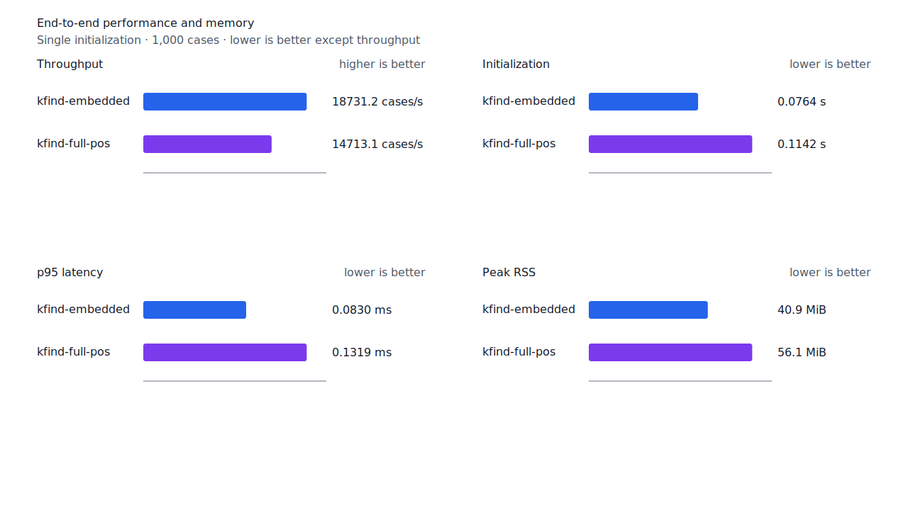
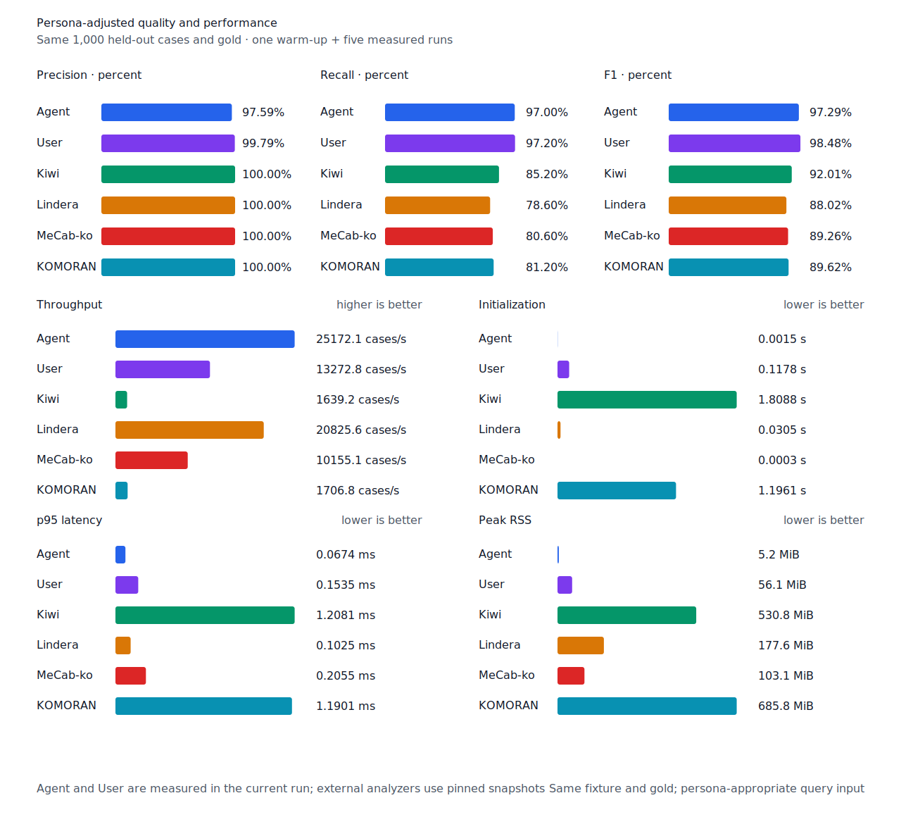

# exact `지` predicate 어미 경로 recall

- 측정일: 2026-07-17
- 최신 `origin/main` 및 기준 revision:
  `754f8143794b88b29bb4ac02e12e6cfb436aae7f`
- 후보 revision: `b5810b0ad32ffa71c9c1c75a7f8bb963cd0840ea`
- 환경: Linux 6.12.76/linuxkit aarch64, 10 logical CPUs, Python 3.12.13,
  Rust 1.97.0, Docker 29.6.1
- 반복: fresh process warm-up 1회 뒤 5회 측정의 중앙값
- canonical test fixture:
  `933bc12197da866d2363d7df9107d4d9be89a65ddaafd73968ad5384832b21ff`
- canonical development fixture:
  `604c3a139854fcf59570392f48ab85028785f4a3561ea3c5e702f88b841f907c`
- explicit-POS matrix:
  `fbcce40b533655085ff8a4e9031559f99b54f86abe188b6ddc1d690dd44326c6`
- untagged matrix:
  `b9dd7601301fa19b35acba735a977eba7c56a0c9d67c65dee32db5c8028c71bb`
- development matrix:
  `bc67497c3dc966fb7453b238df52c6d781b1b4485d40e8a5d6a38104dcc7abed`
- hard-negative fixture:
  `f4d8829977ebfd061003724ee4aeb23b36dd901f6e46171c924a1f52a63f0ee5`
- 100 MiB corpus:
  `7692072cb7bff9261c1fa5933bde41b27e558170818eeac6d07cabdd673815ff`
- 기준 report SHA-256:
  `7a9d18a68ac97d47ed276d5469fc866c68e172d48fb97a37f54fa1357c2b4c4d`
- 후보 report SHA-256:
  `742746b6bfb567e57bc383bf1e5bc8ac3cb5774a63fda8fd6ee06a1fcd98409f`

## 원인과 규칙

관형형 candidate 뒤에 조사 없는 `지`가 남으면 기존 구조 검증은 이를 의존명사로만 보고
`NNB + J+`를 요구했다. 이 때문에 source에 token 전체의 `VV+EC` 분석이 있는 `들릴지`도
거부했다.

같은 predicate 품사의 token 전체 exact 분석이 `predicate + E+`만 선언할 때는 `지`를
의존명사가 아닌 어미 경로로 소비한다. 분리된 `ETM`과 `지/NNB`만 있는 `온지`는 계속
거부한다. Matrix contract 정의, annotation과 gate는 변경하지 않았다.

## 품질과 contract 지표

`PNᶜ = TPᶜ + FNᶜ`다. Matrix의 reclassified case는 0건이라 strict와
contract-adjusted confusion matrix가 같다. 모든 FP와 FPᶜ case ID는 기준과 후보가 같다.

| matrix/profile | 기준 TPᶜ / FPᶜ / FNᶜ | 후보 TPᶜ / FPᶜ / FNᶜ | PNᶜ | recallᶜ | 모든 contract 질의 회수 |
| --- | ---: | ---: | ---: | ---: | ---: |
| test embedded `smart` | 1,271 / 5 / 130 | 1,271 / 5 / 130 | 1,401 | 90.72% → 90.72% | 349 → 349 / 468 |
| test full-POS `smart` | 1,356 / 5 / 45 | 1,357 / 5 / 44 | 1,401 | 96.79% → 96.86% | 425 → 425 / 468 |
| Human full-POS `smart` | 1,353 / 4 / 48 | 1,354 / 4 / 47 | 1,401 | 96.57% → 96.65% | 421 → 421 / 468 |
| Agent embedded `any` | 1,366 / 22 / 35 | 1,366 / 22 / 35 | 1,401 | 97.50% → 97.50% | 433 → 433 / 468 |
| development embedded `smart` | 1,237 / 7 / 154 | 1,237 / 7 / 154 | 1,391 | 88.93% → 88.93% | 329 → 329 / 466 |
| development full-POS `smart` | 1,294 / 8 / 97 | 1,294 / 8 / 97 | 1,391 | 93.03% → 93.03% | 376 → 376 / 466 |

Test explicit-POS full-POS와 Human은
`matrix:pos:ud-korean-kaist:MH2_0190-s16:2`의 `들릴지→들리다`를 회수했다. 같은
문장에 별도 FN이 남아 모든 질의 회수 문장 수는 변하지 않았다. 다른 TP/FN 이동이나 신규
FP는 없다. Embedded, canonical, development와 Agent 결과도 같다.

Canonical embedded/full-POS의 `TPᶜ / FPᶜ / FNᶜ`는 각각 `449 / 0 / 51`,
`491 / 0 / 9`다. Canonical Human은 `486 / 1 / 14`, Agent는 `485 / 12 / 15`다.
Hard-negative 전체 결과도 같다. Embedded는 contract-adjusted
`TPᶜ 3 / FPᶜ 1 / TNᶜ 32 / FNᶜ 2`, full-POS는
`TPᶜ 5 / FPᶜ 1 / TNᶜ 32 / FNᶜ 0`이다.


## 성능

모든 morphology 행은 같은 환경에서 fresh process warm-up 1회 뒤 5회 측정한
`median [min, max]`다.

| workload | revision | initialization (s) | cases/s | p95 (ms) | RSS (KiB) |
| --- | --- | ---: | ---: | ---: | ---: |
| canonical embedded `smart` | 기준 | 0.076126 [0.075496, 0.077256] | 18,917.1 [17,723.5, 19,778.1] | 0.0828 [0.0772, 0.0907] | 41,884 [41,872, 41,888] |
| canonical embedded `smart` | 후보 | 0.076381 [0.075039, 0.077475] | 18,731.2 [15,608.4, 19,919.5] | 0.0830 [0.0768, 0.1000] | 41,884 [41,868, 41,884] |
| canonical full-POS `smart` | 기준 | 0.119338 [0.116534, 0.556598] | 14,295.1 [9,143.1, 14,328.4] | 0.1368 [0.1354, 0.2580] | 57,460 [57,452, 57,512] |
| canonical full-POS `smart` | 후보 | 0.114160 [0.110771, 0.115652] | 14,713.1 [14,169.9, 14,914.1] | 0.1319 [0.1298, 0.1336] | 57,492 [57,444, 57,496] |
| canonical Agent `any` | 기준 | 0.001548 [0.001502, 0.001715] | 24,827.4 [22,456.6, 25,123.2] | 0.0687 [0.0665, 0.0788] | 5,420 [5,400, 5,424] |
| canonical Agent `any` | 후보 | 0.001453 [0.001432, 0.001580] | 25,172.1 [25,145.3, 25,366.7] | 0.0674 [0.0668, 0.0697] | 5,344 [5,344, 5,356] |
| canonical Human `smart` | 기준 | 0.118197 [0.116547, 0.118705] | 13,107.6 [13,017.2, 13,371.0] | 0.1570 [0.1506, 0.1600] | 57,540 [57,536, 57,544] |
| canonical Human `smart` | 후보 | 0.114566 [0.112638, 0.123551] | 13,374.8 [12,695.4, 13,522.8] | 0.1523 [0.1494, 0.1627] | 57,496 [57,480, 57,496] |
| matrix Agent `any` | 기준 | 0.001639 [0.001560, 0.001685] | 23,807.0 [21,711.1, 24,684.2] | 0.0710 [0.0690, 0.0807] | 8,516 [8,512, 8,524] |
| matrix Agent `any` | 후보 | 0.001547 [0.001506, 0.001963] | 24,713.2 [24,507.9, 24,934.8] | 0.0698 [0.0694, 0.0705] | 8,452 [8,440, 8,460] |
| matrix Human `smart` | 기준 | 0.123008 [0.117201, 0.128126] | 13,216.0 [11,049.0, 13,581.5] | 0.1611 [0.1566, 0.1925] | 58,280 [58,268, 58,280] |
| matrix Human `smart` | 후보 | 0.116655 [0.113538, 0.174691] | 13,616.1 [12,691.2, 13,914.6] | 0.1564 [0.1535, 0.1618] | 58,264 [58,248, 58,264] |

중앙값 기준 canonical embedded/full-POS/Agent/Human cases/s 변화는 각각 -0.98%, +2.92%,
+1.39%, +2.04%다. Matrix Agent와 Human은 +3.81%, +3.03%다. 모든 변화는 10% 경고선
안이다.

100 MiB CLI 처리량은 Agent 4,505.56→4,525.80 MiB/s(+0.45%), Human
806.53→802.53 MiB/s(-0.50%)다. 동일 canonical fixture의 후보 Agent는
25,172.1 cases/s로 Lindera 4.0.0 고정 snapshot의 20,825.6 cases/s보다 20.87% 빠르다.
Recallᶜ는 97.0% 대 78.6%, peak RSS는 5.2 MiB 대 177.6 MiB다.





## 남은 FN

Test matrix full-POS의 `PNᶜ`는 1,401, `FNᶜ`는 44이고 Human `FNᶜ`는 47이다.
Development full-POS의 `PNᶜ`는 1,391, `FNᶜ`는 97이다. Test full-POS FNᶜ는
`boundary-rejected` 20건, `gold-or-adapter` 15건, `surface-missing` 6건,
`continuation-rejected` 2건, `span-mismatch` 1건이다.

이번 exact whole-token 조건을 일반 suffix 조합으로 넓히지 않는다. 다음 제품 recall 작업은
남은 표준형 `continuation-rejected` 또는 동일 구조의 predicate `boundary-rejected`를 실제
component graph 근거로 묶는다.

## 재현

```console
git switch --detach b5810b0ad32ffa71c9c1c75a7f8bb963cd0840ea
KFIND_MORPH_RUNS=5 \
scripts/benchmark-morphology.sh target/morph-exact-predicate-ji-candidate-rerun

git switch --detach 754f8143794b88b29bb4ac02e12e6cfb436aae7f
KFIND_MORPH_RUNS=5 \
scripts/benchmark-morphology.sh target/morph-exact-predicate-ji-baseline-current

python3 tools/morph-compare/render_charts.py \
  target/morph-exact-predicate-ji-candidate-rerun/report.json \
  docs/benchmarks/assets \
  --prefix 2026-07-17-exact-predicate-ji-recall-

python3 tools/morph-compare/export_site_snapshot.py \
  target/morph-exact-predicate-ji-candidate-rerun/report.json \
  docs/benchmarks/site-morphology.json \
  --revision b5810b0ad32ffa71c9c1c75a7f8bb963cd0840ea
```

외부 분석기 snapshot은 fixture, adapter schema와 고정 버전·설정이 바뀌지 않아 갱신하지
않았다.
