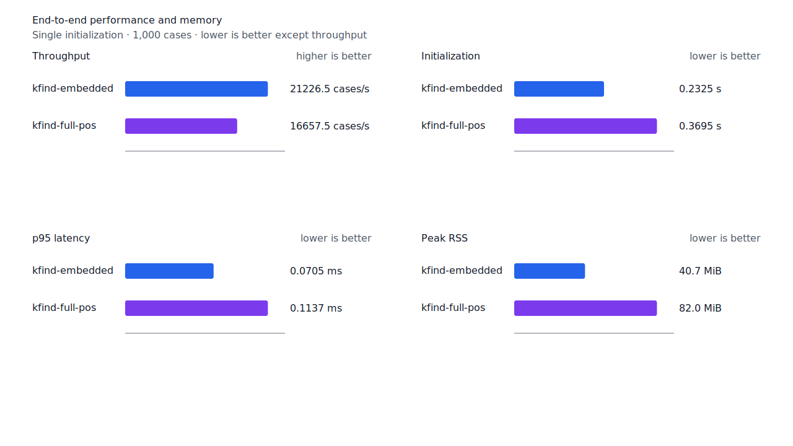
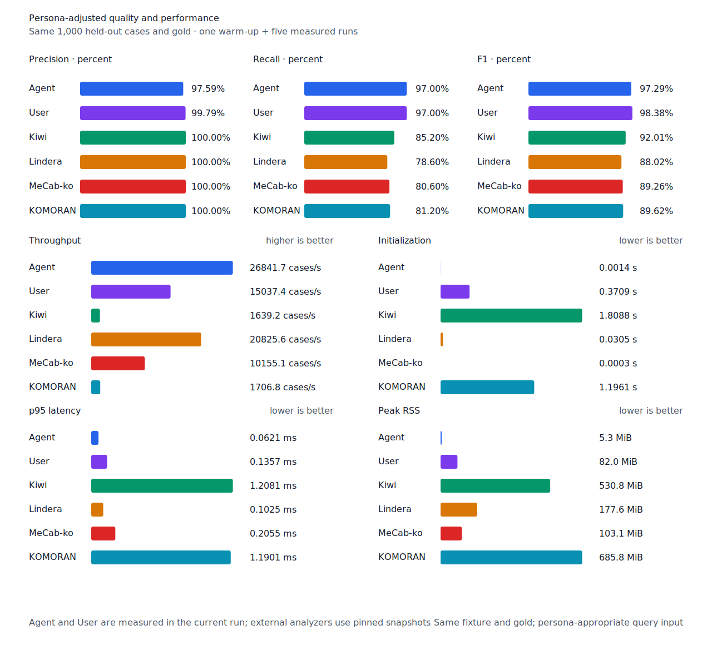

# full POS decoder 중복 소유 제거

- 측정일: 2026-07-17
- 최신 `origin/main` 및 기준 revision:
  `f4af19db56b0922f2ec722726a1dd17291faaa47`
- 후보 revision: `8e8d711125bba439b65486e18c6e1c12e9d50f02`
- 환경: Linux 6.12.76/linuxkit aarch64, 10 logical CPUs, Python 3.12.13,
  Rust 1.97.0, Docker 29.6.1
- 반복: fresh process warm-up 1회 뒤 5회 측정의 중앙값
- canonical test fixture:
  `933bc12197da866d2363d7df9107d4d9be89a65ddaafd73968ad5384832b21ff`
- full POS lexicon artifact:
  `012a2ecfc9ee049cb48f655eb240fa2ed6fc739dfde01526078a976549246e88`
- component artifact:
  `55d4f7a83c7fac278208f21c4cad2225e33768c992f0ceefa22402823fbfc4b3`
- 100 MiB corpus:
  `7692072cb7bff9261c1fa5933bde41b27e558170818eeac6d07cabdd673815ff`
- 기준 report SHA-256:
  `bdef8a8e0923f6c01c34de9a0a9ed6a7c4c424e72352bd5c685e7653661e3783`
- 후보 report SHA-256:
  `753e103ae6764db46a307c5c658a58a89b16cc813d3351cab70370340eb7587e`

## 병목과 변경

Component startup benchmark에서 full POS resource의 base 초기화는 131.80ms, component
resource 초기화는 132.90ms였다. 둘은 Human 전체 초기화 386.02ms에서 각각 약 3분의 1을
차지한다.

Full POS 표제어는 front compression으로 저장한다. 기존 decoder는 결과 vector에 넣을
표제어 `String`을 만든 뒤 다음 entry의 prefix 복원용 `previous: String`에도 같은 값을
clone했다. 632,667 entry 전체에서 결과와 별도의 문자열 소유·할당이 반복됐다.

후보는 이미 vector에 저장한 직전 entry를 빌려 다음 prefix를 복원한다. 결과 entry 외의
scratch 문자열을 소유하지 않는다. UTF-8·NFC·엄격한 정렬 순서, entry 수와 누적 byte 상한
검증은 그대로다. Binary schema와 artifact도 바뀌지 않았다.

## 품질과 contract 지표

기준과 후보의 canonical, test/development matrix, Human, Agent와 hard-negative failure
record를 case ID, 판정과 span으로 대조했다. 이동한 record는 0건이다. Matrix contract 정의,
annotation과 gate는 변경하지 않았다.

`PNᶜ = TPᶜ + FNᶜ`다. Test matrix의 reclassified case는 0건이므로 strict와
contract-adjusted confusion matrix가 같다.

| fixture/profile | 기준·후보 TPᶜ / FPᶜ / FNᶜ | PNᶜ | recallᶜ |
| --- | ---: | ---: | ---: |
| canonical embedded `smart` | 447 / 0 / 53 | 500 | 89.40% |
| canonical full-POS `smart` | 489 / 0 / 11 | 500 | 97.80% |
| canonical Human full-POS `smart` | 485 / 1 / 15 | 500 | 97.00% |
| canonical Agent embedded `any` | 485 / 12 / 15 | 500 | 97.00% |
| test matrix embedded `smart` | 1,266 / 5 / 135 | 1,401 | 90.36% |
| test matrix full-POS `smart` | 1,351 / 5 / 50 | 1,401 | 96.43% |
| test matrix Human full-POS `smart` | 1,349 / 4 / 52 | 1,401 | 96.29% |
| test matrix Agent embedded `any` | 1,366 / 22 / 35 | 1,401 | 97.50% |
| development embedded `smart` | 1,236 / 7 / 155 | 1,391 | 88.86% |
| development full-POS `smart` | 1,293 / 8 / 98 | 1,391 | 92.95% |

Hard-negative도 같다. Embedded는 contract-adjusted
`TPᶜ 3 / FPᶜ 1 / TNᶜ 32 / FNᶜ 2`, full-POS는
`TPᶜ 5 / FPᶜ 1 / TNᶜ 32 / FNᶜ 0`이다.


## 시작 성능

아래는 component startup probe의 `median [min, max]`다. Full POS 단독 base 초기화는
131.80ms에서 120.44ms로 8.62% 줄었다. 기준의 최저값 131.50ms보다 후보의 최고값
125.68ms가 낮다. Full POS와 component를 함께 읽는 workload의 base 구간은 6.46%, 전체는
1.85% 줄었다. 변하지 않은 component 구간이 전체 변화폭을 제한한다.

| workload / 구간 | 기준 (ms) | 후보 (ms) | 변화 |
| --- | ---: | ---: | ---: |
| full-POS / base | 131.80 [131.50, 133.66] | 120.44 [117.97, 125.68] | -8.62% |
| full-POS+component / base | 132.80 [131.33, 138.47] | 124.22 [120.19, 126.78] | -6.46% |
| full-POS+component / component | 132.90 [131.67, 137.10] | 133.43 [130.32, 136.94] | +0.40% |
| full-POS+component / 전체 | 265.10 [263.01, 275.57] | 260.21 [250.51, 262.02] | -1.85% |

Peak RSS는 full-POS 단독 47,204KiB, full-POS+component 79,416KiB로 같다.

## End-to-end 성능

Full-POS 초기화는 3.62%, Human 초기화는 4.60%, 무품사 User 초기화는 3.55% 줄었다.
100MiB CLI Human wall time은 4.98% 줄어 처리량이 5.24% 늘었다. Scan cases/s와 p95 변화는
측정 범위가 겹치며 회귀로 판정하지 않는다.

| workload | metric | 기준 | 후보 | 변화 |
| --- | --- | ---: | ---: | ---: |
| canonical full-POS `smart` | initialization (s) | 0.383332 [0.381360, 0.397234] | 0.369453 [0.365254, 0.380964] | -3.62% |
| canonical full-POS `smart` | cases/s | 16,672.7 [15,255.1, 16,820.2] | 16,657.5 [15,415.8, 16,958.1] | -0.09% |
| canonical full-POS `smart` | p95 (ms) | 0.1141 [0.1114, 0.1233] | 0.1137 [0.1103, 0.1231] | -0.35% |
| canonical Human `smart` | initialization (s) | 0.386018 [0.383875, 0.399994] | 0.368274 [0.367872, 0.370506] | -4.60% |
| canonical Human `smart` | cases/s | 14,419.2 [13,754.4, 15,146.1] | 15,061.5 [14,816.9, 15,352.5] | +4.45% |
| canonical User `smart` | initialization (s) | 0.384546 [0.382239, 0.396087] | 0.370901 [0.367772, 0.381001] | -3.55% |
| 100 MiB CLI Human | wall (s) | 0.293515 [0.289876, 0.295976] | 0.278889 [0.278008, 0.281209] | -4.98% |
| 100 MiB CLI Human | throughput (MiB/s) | 340.70 [337.87, 344.97] | 358.57 [355.61, 359.70] | +5.24% |

후보 Agent는 26,841.7 cases/s로 Lindera 4.0.0 고정 snapshot의 20,825.6 cases/s보다
28.89% 빠르다. Recall은 97.0% 대 78.6%, peak RSS는 5.3MiB 대 177.6MiB다.





## 다음 병목

Full POS decoder의 문자열 중복 소유를 제거한 뒤에도 component resource decoder는 약
130ms를 쓴다. 다음 작업은 component payload의 section digest, index decode와 component
vector 검증을 각각 분리 측정해 가장 큰 구간을 고른다. 측정 전에는 decoder 검증을 줄이거나
schema를 바꾸지 않는다.

## 재현

```console
git switch --detach f4af19db56b0922f2ec722726a1dd17291faaa47
KFIND_MORPH_IMAGE=kfind-morph-benchmark:full-pos-decode-base-f4af19d \
KFIND_MORPH_RUNS=5 \
scripts/benchmark-morphology.sh target/morph-full-pos-decode-base-f4af19d

git switch --detach 8e8d711125bba439b65486e18c6e1c12e9d50f02
KFIND_MORPH_IMAGE=kfind-morph-benchmark:full-pos-decode-candidate-8e8d711 \
KFIND_MORPH_RUNS=5 \
scripts/benchmark-morphology.sh target/morph-full-pos-decode-candidate-8e8d711

python3 tools/morph-compare/render_charts.py \
  target/morph-full-pos-decode-candidate-8e8d711/report.json \
  docs/benchmarks/assets \
  --prefix 2026-07-17-full-pos-decoder-startup-

python3 tools/morph-compare/export_site_snapshot.py \
  target/morph-full-pos-decode-candidate-8e8d711/report.json \
  docs/benchmarks/site-morphology.json \
  --revision 8e8d711125bba439b65486e18c6e1c12e9d50f02
```

외부 분석기 snapshot은 fixture, adapter schema와 고정 버전·설정이 바뀌지 않아 갱신하지
않았다.
