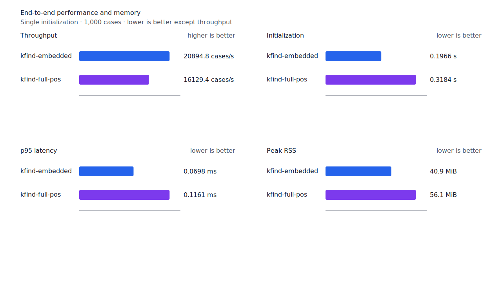
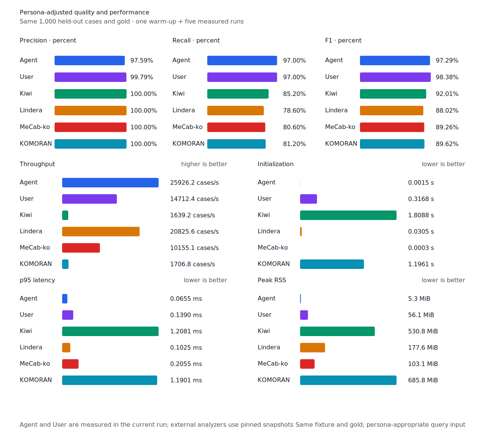

# full POS packed lookup index

- 측정일: 2026-07-17
- 최신 `origin/main` 및 기준 revision:
  `8f2a723e318d0b29131592f11c9da332e8d169ea`
- 후보 revision: `7712d45a99730411429490117bc1e70c9c9d71ad`
- 환경: Linux 6.12.76/linuxkit aarch64, 10 logical CPUs, Python 3.12.13,
  Rust 1.97.0, Docker 29.6.1
- 별도 병목 profile: macOS Darwin 25.4 arm64, xctrace 16.0 (17F42)
- 반복: fresh process warm-up 1회 뒤 5회 측정의 중앙값
- canonical test fixture:
  `933bc12197da866d2363d7df9107d4d9be89a65ddaafd73968ad5384832b21ff`
- full POS lexicon artifact:
  `012a2ecfc9ee049cb48f655eb240fa2ed6fc739dfde01526078a976549246e88`
- component artifact:
  `55d4f7a83c7fac278208f21c4cad2225e33768c992f0ceefa22402823fbfc4b3`
- 100 MiB corpus:
  `7692072cb7bff9261c1fa5933bde41b27e558170818eeac6d07cabdd673815ff`
- 기준 report SHA-256:
  `ea99aca127b976519b4a15a4c5ac50cd18f026d7f847e53194366faaad44da06`
- 후보 report SHA-256:
  `7f2e0ea0cc23cf46cae16281eeddfffd2f648f9f37c50163d3664062310c2d97`

## 병목과 변경

기준 full POS decoder는 front-compressed 632,667개 entry를 복원하면서 각 entry의 lemma를
별도 소유 문자열로 만들었다. 고유 lemma는 614,794개이고 동일 lemma의 품사 충돌도
16,650개라, 작은 문자열 allocation과 객체별 allocator metadata가 초기화 시간과 RSS를 함께
차지했다. macOS Time Profiler에서도 decoder의 소유 문자열 allocation, UTF-8와 NFC 검증
경로가 주된 표본이었다.

후보는 front-compressed lemma를 하나의 재사용 scratch에서 복원한다. 검증된 고유 lemma는 한
문자열 blob에 한 번만 이어 붙이고 각 entry는 `u32` 시작 위치, 길이와 세부 품사만 보존한다.
같은 lemma의 여러 품사는 같은 byte range를 공유한다. 제품 query lookup은 packed range를
직접 이진 탐색하고 일치하는 품사만 `Analysis`로 만든다. 기존 진단용 `entries()`와 `lookup()`
API가 전체 소유 entry view를 요청할 때만 `OnceLock`에 지연 materialize한다.

Artifact schema와 bytes는 바뀌지 않았다. Decoder의 UTF-8, NFC, 엄격한 정렬 순서, entry 수와
누적 decoded byte 상한 검증도 유지한다.

## 품질과 contract 지표

기준과 후보의 canonical, test/development matrix, Human, Agent와 hard-negative failure
record를 case ID, 판정과 span으로 대조했다. 이동한 record는 0건이다. Matrix contract 정의,
annotation과 gate는 변경하지 않았다. 전체 대조 객체의 정렬 JSON SHA-256도 양쪽 모두
`9ff671b86d726d6b454eb0e1305599f7aff6c50a63a221e2e932538bf6f21ffb`다.

`PNᶜ = TPᶜ + FNᶜ`다. Test matrix의 reclassified case는 0건이므로 strict와
contract-adjusted confusion matrix가 같다.

| fixture/profile | 기준·후보 TPᶜ / FPᶜ / FNᶜ | PNᶜ | recallᶜ |
| --- | ---: | ---: | ---: |
| canonical embedded `smart` | 447 / 0 / 53 | 500 | 89.40% |
| canonical full-POS `smart` | 489 / 0 / 11 | 500 | 97.80% |
| canonical Human full-POS `smart` | 485 / 1 / 15 | 500 | 97.00% |
| canonical Agent embedded `any` | 485 / 12 / 15 | 500 | 97.00% |
| test matrix embedded `smart` | 1,266 / 5 / 135 | 1,401 | 90.36% |
| test matrix full-POS `smart` | 1,351 / 5 / 50 | 1,401 | 96.43% |
| test matrix Human full-POS `smart` | 1,349 / 4 / 52 | 1,401 | 96.29% |
| test matrix Agent embedded `any` | 1,366 / 22 / 35 | 1,401 | 97.50% |
| development embedded `smart` | 1,236 / 7 / 155 | 1,391 | 88.86% |
| development full-POS `smart` | 1,293 / 8 / 98 | 1,391 | 92.95% |

Hard-negative도 같다. Embedded는 contract-adjusted
`TPᶜ 3 / FPᶜ 1 / TNᶜ 32 / FNᶜ 2`, full-POS는
`TPᶜ 5 / FPᶜ 1 / TNᶜ 32 / FNᶜ 0`이다.


## full POS 초기화와 메모리

아래는 optional startup probe의 `median [min, max]`다. Full POS 단독 RSS는 54.46%,
component 조합 RSS는 33.49% 줄었다. Full POS 단독 초기화는 15.40% 줄었으며 후보의
최고값이 기준의 최저값보다 낮다.

| workload / metric | 기준 | 후보 | 변화 |
| --- | ---: | ---: | ---: |
| full-POS / base initialization | 128.91ms [120.38, 138.87] | 109.06ms [108.68, 110.09] | -15.40% |
| full-POS / peak RSS | 47,208KiB [47,196, 47,212] | 21,500KiB [20,560, 22,592] | -54.46% |
| full-POS+component / base initialization | 125.13ms [120.36, 132.62] | 110.71ms [109.23, 111.81] | -11.52% |
| full-POS+component / total initialization | 219.57ms [212.86, 234.47] | 204.70ms [201.68, 205.84] | -6.77% |
| full-POS+component / peak RSS | 79,612KiB [79,596, 79,612] | 52,948KiB [52,936, 52,952] | -33.49% |

`base initialization`은 full POS decoder만이 아니라 file read, embedded lexicon·rule 생성과
enriched predicate merge까지 포함한다. 따라서 남은 109ms 전체를 decoder 비용으로 해석하지
않는다.

## End-to-end 성능

Canonical full-POS와 Human의 전체 초기화는 각각 4.78%, 5.08% 줄었다. 두 workload와
100MiB CLI Human 모두 후보 최고 초기화·wall 값이 기준 최저값보다 낮다. 검색 구간도
canonical full-POS cases/s +0.92%와 p95 -1.28%, Human cases/s +5.15%와 p95 -4.09%로
회귀하지 않았다.

| workload | metric | 기준 | 후보 | 변화 |
| --- | --- | ---: | ---: | ---: |
| canonical full-POS `smart` | initialization (s) | 0.334346 [0.331380, 0.339964] | 0.318379 [0.315727, 0.323361] | -4.78% |
| canonical full-POS `smart` | cases/s | 15,982.5 [15,310.0, 16,227.8] | 16,129.4 [15,279.5, 16,314.2] | +0.92% |
| canonical full-POS `smart` | p95 (ms) | 0.1176 [0.1155, 0.1240] | 0.1161 [0.1148, 0.1227] | -1.28% |
| canonical full-POS `smart` | peak RSS | 84,108KiB | 57,496KiB | -31.64% |
| canonical Human `smart` | initialization (s) | 0.337084 [0.334471, 0.344344] | 0.319958 [0.317658, 0.329798] | -5.08% |
| canonical Human `smart` | cases/s | 13,767.2 [12,389.1, 14,734.5] | 14,476.1 [13,553.6, 14,863.1] | +5.15% |
| canonical Human `smart` | p95 (ms) | 0.1468 [0.1381, 0.1649] | 0.1408 [0.1365, 0.1460] | -4.09% |
| canonical Human `smart` | peak RSS | 84,140KiB | 57,576KiB | -31.57% |
| 100 MiB CLI Human | wall (s) | 0.239034 [0.235354, 0.296925] | 0.221604 [0.216939, 0.222768] | -7.29% |
| 100 MiB CLI Human | throughput (MiB/s) | 418.35 [336.79, 424.89] | 451.26 [448.90, 460.96] | +7.87% |
| 100 MiB CLI Human | peak RSS | 84,060KiB | 57,336KiB | -31.79% |

후보 Agent는 25,926.2 cases/s로 Lindera 4.0.0 고정 snapshot의 20,825.6 cases/s보다
24.49% 빠르다. Recall은 97.0% 대 78.6%, peak RSS는 5.3MiB 대 177.6MiB다.





## 다음 병목

Full-POS+component probe의 남은 중앙값은 base 110.71ms, component 93.98ms다. Base에는
decoder 이외 초기화가 섞여 있으므로 다음 성능 작업은 file read, full POS decode, embedded
lexicon·rule 생성, enriched predicate merge와 engine 생성 시간을 따로 계측한다. 두 자릿수
millisecond를 차지하는 구간이 확인될 때만 구현을 바꾼다. Component payload 구조 검증 약
16ms와 per-entry 미세 최적화는 우선하지 않는다.

## 재현

```console
git switch --detach 8f2a723e318d0b29131592f11c9da332e8d169ea
KFIND_MORPH_IMAGE=kfind-morph-benchmark:full-pos-packed-base-8f2a723 \
KFIND_MORPH_RUNS=5 \
scripts/benchmark-morphology.sh target/morph-full-pos-packed-base-8f2a723

git switch --detach 7712d45a99730411429490117bc1e70c9c9d71ad
KFIND_MORPH_IMAGE=kfind-morph-benchmark:full-pos-packed-candidate-7712d45 \
KFIND_MORPH_RUNS=5 \
scripts/benchmark-morphology.sh target/morph-full-pos-packed-candidate-7712d45

python3 tools/morph-compare/render_charts.py \
  target/morph-full-pos-packed-candidate-7712d45/report.json \
  docs/benchmarks/assets \
  --prefix 2026-07-17-full-pos-packed-startup-

python3 tools/morph-compare/export_site_snapshot.py \
  target/morph-full-pos-packed-candidate-7712d45/report.json \
  docs/benchmarks/site-morphology.json \
  --revision 7712d45a99730411429490117bc1e70c9c9d71ad
```

외부 분석기 snapshot은 fixture, adapter schema와 고정 버전·설정이 바뀌지 않아 갱신하지
않았다.
