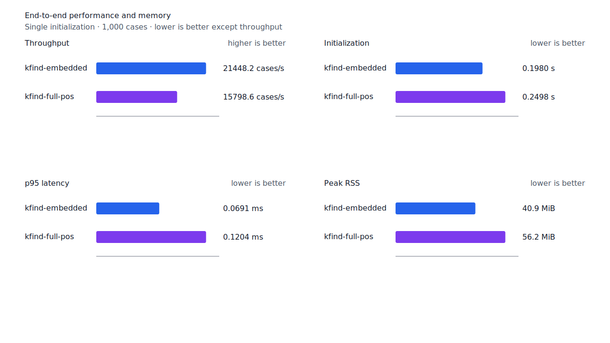
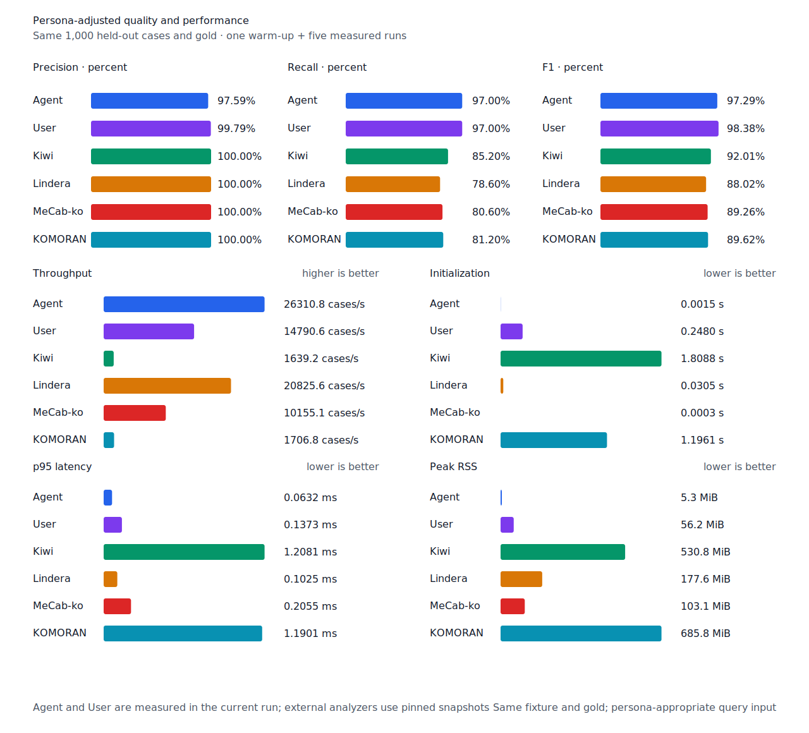

# full POS validation prefix 재검사 제거

- 측정일: 2026-07-17
- 최신 `origin/main` 및 기준 revision:
  `7961c3dad1f3bb41087382ee3887a2547d5f47d4`
- 후보 revision: `90a14682eb3674b1d729f5ee91e93a00c2216379`
- 환경: Linux 6.12.76/linuxkit aarch64, 10 logical CPUs, Python 3.12.13,
  Rust 1.97.0, Docker 29.6.1
- 별도 병목 profile: macOS Darwin 25.4 arm64, xctrace 16.0 (17F42)
- 반복: fresh process warm-up 1회 뒤 5회 측정의 중앙값
- canonical test fixture:
  `933bc12197da866d2363d7df9107d4d9be89a65ddaafd73968ad5384832b21ff`
- full POS lexicon artifact:
  `012a2ecfc9ee049cb48f655eb240fa2ed6fc739dfde01526078a976549246e88`
- component artifact:
  `55d4f7a83c7fac278208f21c4cad2225e33768c992f0ceefa22402823fbfc4b3`
- 100 MiB corpus:
  `7692072cb7bff9261c1fa5933bde41b27e558170818eeac6d07cabdd673815ff`
- 기준 report SHA-256:
  `661511334fdb28d38ed2d1a328321c5cd8f9ce492e19b5150a80192741302ade`
- 후보 report SHA-256:
  `5edd25b2988ab5f3e409e9d6b5ec65c0c9035db120c00237f53e2c66fb479208`

## 병목과 변경

Packed full POS 적용 뒤 제품과 같은 startup 경로를 macOS Time Profiler로 측정했다. 49개 CPU
sample 중 42개가 `decode_pos_lexicon`에 있었고, exclusive UTF-8 검증 14개와 NFC 검증
15개가 가장 컸다. File read와 embedded rule 초기화는 각각 1개 sample, enriched merge는
0개였다. Decoder는 front-compressed entry마다 이미 검증된 prefix까지 포함한 lemma 전체를
UTF-8과 NFC로 다시 검사하고, 마지막 packed blob도 UTF-8로 한 번 더 검사하고 있었다.

후보는 검증된 `String` scratch를 유지한다. 새 suffix만 UTF-8로 검증한 뒤 문자 경계인 기존
prefix에 안전한 문자열 연산으로 붙여 전체 lemma의 UTF-8을 보장한다. Packed blob도 검증된
lemma를 `String`에 이어 붙여 마지막 전체 재검사를 없앴다.

ASCII와 완성형 한글 음절만으로 이뤄진 lemma는 각 code point와 결합 경계가 NFC임을 구성으로
증명한다. 그 밖의 Hanja, Jamo, Latin과 combining mark를 포함한 문자열은 기존 일반 NFC
검사를 수행한다. 잘못된 UTF-8 suffix와 분해형 Jamo를 각각 거부하는 test를 유지·추가했다.
Artifact schema, bytes, 엄격한 정렬 순서, entry 수와 누적 decoded byte 상한 검증도 바뀌지
않았다.

후보 profile은 30개 CPU sample 중 decoder가 19개로 줄었다. UTF-8은 6개, 일반 NFC는 2개,
구성상 NFC 확인은 2개였다.

## 품질과 contract 지표

기준과 후보의 canonical, test/development matrix, Human, Agent와 hard-negative failure
record를 case ID, 판정과 span으로 대조했다. 이동한 record는 0건이다. Matrix contract 정의,
annotation과 gate는 변경하지 않았다. 품질 대조 객체의 정렬 JSON SHA-256은 양쪽 모두
`9ff671b86d726d6b454eb0e1305599f7aff6c50a63a221e2e932538bf6f21ffb`다.

`PNᶜ = TPᶜ + FNᶜ`다. Test matrix의 reclassified case는 0건이므로 strict와
contract-adjusted confusion matrix가 같다.

| fixture/profile | 기준·후보 TPᶜ / FPᶜ / FNᶜ | PNᶜ | recallᶜ |
| --- | ---: | ---: | ---: |
| canonical embedded `smart` | 447 / 0 / 53 | 500 | 89.40% |
| canonical full-POS `smart` | 489 / 0 / 11 | 500 | 97.80% |
| canonical Human full-POS `smart` | 485 / 1 / 15 | 500 | 97.00% |
| canonical Agent embedded `any` | 485 / 12 / 15 | 500 | 97.00% |
| test matrix embedded `smart` | 1,266 / 5 / 135 | 1,401 | 90.36% |
| test matrix full-POS `smart` | 1,351 / 5 / 50 | 1,401 | 96.43% |
| test matrix Human full-POS `smart` | 1,349 / 4 / 52 | 1,401 | 96.29% |
| test matrix Agent embedded `any` | 1,366 / 22 / 35 | 1,401 | 97.50% |
| development embedded `smart` | 1,236 / 7 / 155 | 1,391 | 88.86% |
| development full-POS `smart` | 1,293 / 8 / 98 | 1,391 | 92.95% |

Hard-negative도 같다. Embedded는 contract-adjusted
`TPᶜ 3 / FPᶜ 1 / TNᶜ 32 / FNᶜ 2`, full-POS는
`TPᶜ 5 / FPᶜ 1 / TNᶜ 32 / FNᶜ 0`이다.


## full POS 초기화

아래는 optional startup probe의 `median [min, max]`다. Full POS 단독 초기화는 65.55%,
component 조합의 전체 초기화는 34.33% 줄었다. 두 workload 모두 후보의 최고값이 기준의
최저값보다 낮다. Full POS 단독 RSS도 7.20% 줄었다.

| workload / metric | 기준 | 후보 | 변화 |
| --- | ---: | ---: | ---: |
| full-POS / base initialization | 109.10ms [108.89, 110.63] | 37.58ms [37.46, 37.82] | -65.55% |
| full-POS / peak RSS | 22,220KiB [20,636, 22,448] | 20,620KiB [20,556, 21,920] | -7.20% |
| full-POS+component / base initialization | 109.16ms [108.78, 110.21] | 38.54ms [38.28, 40.23] | -64.69% |
| full-POS+component / component initialization | 92.51ms [92.29, 93.65] | 94.46ms [93.16, 99.17] | +2.11% |
| full-POS+component / total initialization | 202.13ms [201.07, 203.86] | 132.75ms [131.70, 139.39] | -34.33% |

Component 구간에는 후보 변경 경로가 없고 2.11% 차이는 10% 경고선 안이다.

## End-to-end 성능

Canonical full-POS, Human과 무품사 User의 전체 초기화는 각각 21.75%, 22.21%, 22.45%
줄었다. 100MiB CLI Human wall은 31.52% 줄고 처리량은 46.03% 늘었다. 초기화와 CLI wall은
모두 후보의 최고값이 기준의 최저값보다 낮다.

평가 구간은 변경 경로가 아니다. Canonical full-POS의 cases/s -3.14%, p95 +5.34%는 각
min/max 범위가 겹치고 10% 경고선 안이다. Human cases/s와 p95는 각각 +0.07%, -0.59%다.

| workload | metric | 기준 | 후보 | 변화 |
| --- | --- | ---: | ---: | ---: |
| canonical full-POS `smart` | initialization (s) | 0.319270 [0.318280, 0.323813] | 0.249843 [0.247764, 0.256375] | -21.75% |
| canonical full-POS `smart` | cases/s | 16,311.4 [16,098.6, 16,419.3] | 15,798.6 [14,631.6, 16,388.1] | -3.14% |
| canonical full-POS `smart` | p95 (ms) | 0.1143 [0.1142, 0.1173] | 0.1204 [0.1130, 0.1288] | +5.34% |
| canonical Human `smart` | initialization (s) | 0.319264 [0.317441, 0.320275] | 0.248369 [0.247350, 0.249301] | -22.21% |
| canonical Human `smart` | cases/s | 14,765.2 [14,716.8, 14,860.2] | 14,774.9 [14,736.4, 14,931.5] | +0.07% |
| canonical Human `smart` | p95 (ms) | 0.1366 [0.1351, 0.1394] | 0.1358 [0.1345, 0.1367] | -0.59% |
| canonical User `smart` | initialization (s) | 0.319851 [0.317166, 0.330729] | 0.248043 [0.247156, 0.249432] | -22.45% |
| 100 MiB CLI Human | wall (s) | 0.224325 [0.222193, 0.227921] | 0.153617 [0.152098, 0.156183] | -31.52% |
| 100 MiB CLI Human | throughput (MiB/s) | 445.78 [438.75, 450.06] | 650.97 [640.27, 657.47] | +46.03% |

후보 Agent는 26,310.8 cases/s로 Lindera 4.0.0 고정 snapshot의 20,825.6 cases/s보다
26.34% 빠르다. Recall은 97.0% 대 78.6%, peak RSS는 5.3MiB 대 177.6MiB다.





## 다음 병목

Full-POS+component 전체 132.75ms 중 full-POS base는 38.54ms, component는 94.46ms다.
Component가 71%를 차지하므로 더 작은 full POS decoder 루프를 미세 조정하지 않는다. 다음
성능 작업은 component의 file read, 병렬 section digest와 payload 구조 검증을 최신 코드에서
다시 분리 측정하고 가장 큰 구간만 줄인다.

## 재현

```console
git switch --detach 7961c3dad1f3bb41087382ee3887a2547d5f47d4
KFIND_MORPH_IMAGE=kfind-morph-benchmark:full-pos-validation-base-7961c3d \
KFIND_MORPH_RUNS=5 \
scripts/benchmark-morphology.sh target/morph-full-pos-validation-base-7961c3d

git switch --detach 90a14682eb3674b1d729f5ee91e93a00c2216379
KFIND_MORPH_IMAGE=kfind-morph-benchmark:full-pos-validation-candidate-90a1468 \
KFIND_MORPH_RUNS=5 \
scripts/benchmark-morphology.sh target/morph-full-pos-validation-candidate-90a1468

python3 tools/morph-compare/render_charts.py \
  target/morph-full-pos-validation-candidate-90a1468/report.json \
  docs/benchmarks/assets \
  --prefix 2026-07-17-full-pos-validation-startup-

python3 tools/morph-compare/export_site_snapshot.py \
  target/morph-full-pos-validation-candidate-90a1468/report.json \
  docs/benchmarks/site-morphology.json \
  --revision 90a14682eb3674b1d729f5ee91e93a00c2216379
```

외부 분석기 snapshot은 fixture, adapter schema와 고정 버전·설정이 바뀌지 않아 갱신하지
않았다.
