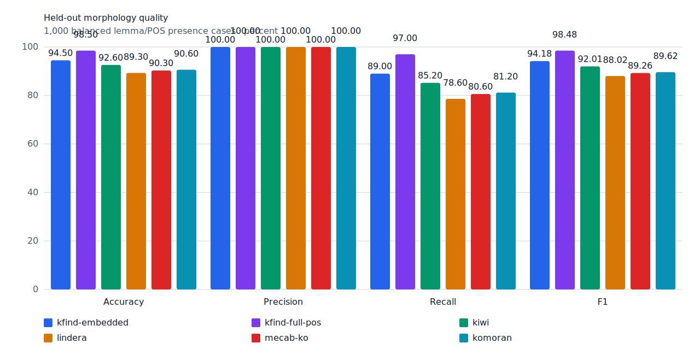
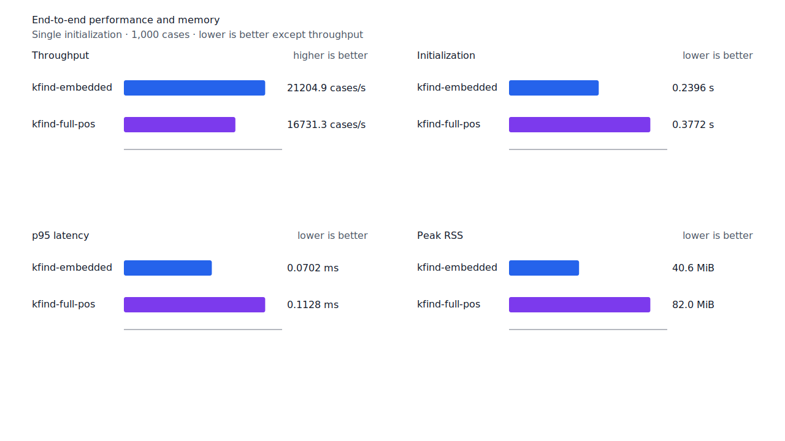
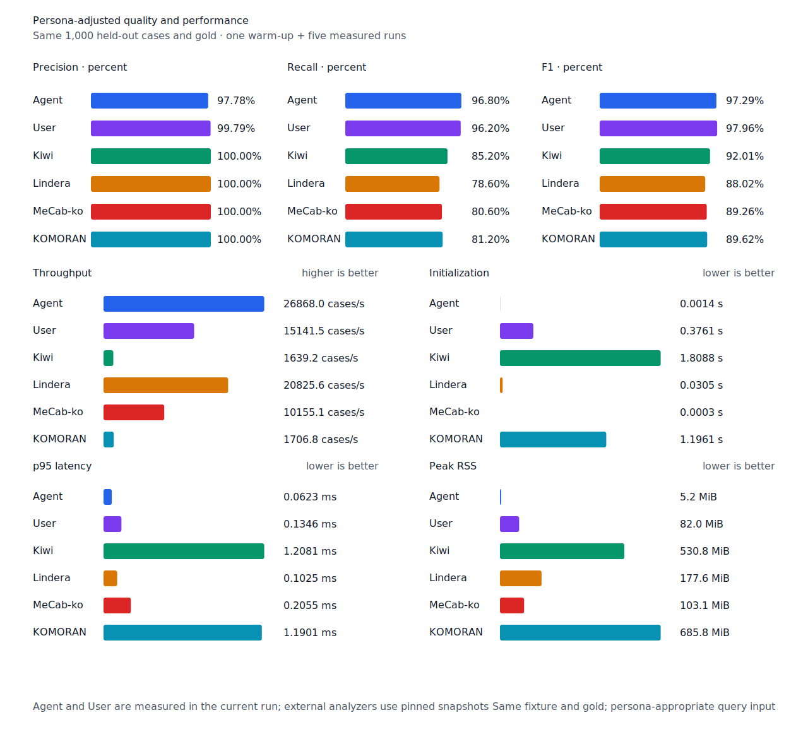

# 분해된 체언 host recall

- 측정일: 2026-07-17
- 최신 `origin/main` 및 기준 revision:
  `435bcd5e2d4a328ca547bdb62d56984f929a643f`
- 후보 revision: `16ec7e5d58961aea49096cdec6a59184cef5b1d5`
- 환경: Linux 6.12.76/linuxkit aarch64, 10 logical CPUs, Python 3.12.13,
  Rust 1.97.0, Docker 29.6.1
- 반복: fresh process warm-up 1회 뒤 5회 측정의 중앙값
- canonical test fixture:
  `933bc12197da866d2363d7df9107d4d9be89a65ddaafd73968ad5384832b21ff`
- canonical development fixture:
  `604c3a139854fcf59570392f48ab85028785f4a3561ea3c5e702f88b841f907c`
- explicit-POS matrix:
  `fbcce40b533655085ff8a4e9031559f99b54f86abe188b6ddc1d690dd44326c6`
- untagged matrix:
  `b9dd7601301fa19b35acba735a977eba7c56a0c9d67c65dee32db5c8028c71bb`
- development matrix:
  `bc67497c3dc966fb7453b238df52c6d781b1b4485d40e8a5d6a38104dcc7abed`
- hard-negative fixture:
  `f4d8829977ebfd061003724ee4aeb23b36dd901f6e46171c924a1f52a63f0ee5`
- 100 MiB corpus:
  `7692072cb7bff9261c1fa5933bde41b27e558170818eeac6d07cabdd673815ff`
- 기준 report SHA-256:
  `8f97bbe73e3b684aef657207e409c02da583586063acdebcb07fefbe702a42c8`
- 후보 report SHA-256:
  `467a9956cad8ef3250955a08d49e4da3fa7b9629f77718daeee16b6e0903a92f`

## 원인과 규칙

조사 앞 체언 전체가 component graph의 여러 명사 edge로만 구성되면 완성된 nominal host는
있지만 core 전체를 덮는 단일 edge가 없었다. 기존 resolver는 이 graph host를 구조 선택에는
사용하면서도 query pattern의 raw support로 승격하지 않아 후보를 거부했다.

체언 core가 token 왼쪽 경계부터 graph nominal host 전체와 정확히 같고, query program이
조사 연쇄를 token 끝까지 소비한 경우에만 runtime structural support를 추가한다. 따라서
`포터소만과`, `캠브리지는`, `대영제국의`, `바튼반도는`, `캔맥주와`, `막스주의의`를
회수한다. Host의 내부 substring, crossing span과 조사를 덜 소비한 후보는 열지 않는다.
Matrix contract 정의, annotation과 gate는 변경하지 않았다.

## Canonical 품질과 contract 지표

`PNᶜ`는 contract-positive 분모 `TPᶜ + FNᶜ`다. Canonical fixture의 `PNᶜ`는 500이며
reclassified case는 0건이다.

| fixture/profile | 기준 TPᶜ / FPᶜ / FNᶜ | 후보 TPᶜ / FPᶜ / FNᶜ | PNᶜ | recallᶜ |
| --- | ---: | ---: | ---: | ---: |
| development embedded `smart` | 453 / 4 / 47 | 455 / 4 / 45 | 500 | 90.6% → 91.0% |
| development full-POS `smart` | 465 / 4 / 35 | 467 / 4 / 33 | 500 | 93.0% → 93.4% |
| test embedded `smart` | 442 / 0 / 58 | 445 / 0 / 55 | 500 | 88.4% → 89.0% |
| test full-POS `smart` | 482 / 0 / 18 | 485 / 0 / 15 | 500 | 96.4% → 97.0% |
| Human full-POS `smart` | 478 / 1 / 22 | 481 / 1 / 19 | 500 | 95.6% → 96.2% |
| Agent embedded `any` | 484 / 11 / 16 | 484 / 11 / 16 | 500 | 96.8% → 96.8% |

Test embedded·full-POS·Human은 `포터소만과`, `캔맥주와`, `대영제국의`의 체언 3건을
회수했다. Canonical 명사 recallᶜ는 97.78%에서 99.44%가 됐다. Strict FP와 FPᶜ는 모든
profile에서 그대로다.

Hard-negative도 기준과 후보가 모두 strict `FP 6 / TN 32`, contract-adjusted
`TPᶜ 5 / FPᶜ 1 / TNᶜ 32 / FNᶜ 0`이다. Unit test는 완성된 `선거운동과`를 허용하면서
조사를 소비하지 않은 같은 후보를 거부한다.



## Query matrix strict·contract-adjusted 품질

현재 matrix의 reclassified case는 0건이므로 strict와 contract-adjusted confusion matrix가
같다. 두 지표 family는 report의 별도 필드로 검증했다. Test matrix의 `PNᶜ=1,401`,
development matrix의 `PNᶜ=1,391`이다.

| fixture/profile | 기준 TPᶜ / FPᶜ / FNᶜ | 후보 TPᶜ / FPᶜ / FNᶜ | PNᶜ | recallᶜ | 모든 contract 질의 회수 |
| --- | ---: | ---: | ---: | ---: | ---: |
| development embedded `smart` | 1,221 / 7 / 170 | 1,230 / 7 / 161 | 1,391 | 87.78% → 88.43% | 317 → 324 / 466 |
| development full-POS `smart` | 1,274 / 8 / 117 | 1,283 / 8 / 108 | 1,391 | 91.59% → 92.24% | 358 → 366 / 466 |
| test embedded `smart` | 1,252 / 5 / 149 | 1,258 / 5 / 143 | 1,401 | 89.36% → 89.79% | 333 → 338 / 468 |
| test full-POS `smart` | 1,329 / 5 / 72 | 1,335 / 5 / 66 | 1,401 | 94.86% → 95.29% | 400 → 406 / 468 |
| Human full-POS `smart` | 1,330 / 4 / 71 | 1,336 / 4 / 65 | 1,401 | 94.93% → 95.36% | 399 → 405 / 468 |
| Agent embedded `any` | 1,363 / 21 / 38 | 1,363 / 21 / 38 | 1,401 | 97.29% → 97.29% | 430 → 430 / 468 |

Test의 embedded·full-POS·Human은 다음 6건을 회수했다.

- `포터소만과`의 `포터소만`
- `캠브리지는`의 `캠브리지`
- `대영제국의`의 `대영제국`
- `바튼반도는`의 `바튼반도`
- `캔맥주와`의 `캔맥주`
- `막스주의의`의 `막스주의`

Full-POS와 Human의 완전 회수 문장은 6개 늘었다. Development matrix의 embedded와
full-POS는 각각 9건을 회수했고 새 strict FP·FPᶜ와 회귀는 없다.

## 성능

모든 morphology 행은 같은 환경에서 fresh process warm-up 1회 뒤 5회 측정한
`median [min, max]`다. 모든 변화는 10% 회귀 경고선 안이다.

| workload | revision | initialization (s) | cases/s | p95 (ms) | RSS (KiB) |
| --- | --- | ---: | ---: | ---: | ---: |
| canonical embedded `smart` | 기준 | 0.232522 [0.232155, 0.233560] | 22,122.3 [21,592.5, 22,449.8] | 0.0680 [0.0664, 0.0687] | 41,612 [41,604, 41,616] |
| canonical embedded `smart` | 후보 | 0.239570 [0.232640, 0.247021] | 21,204.9 [20,167.4, 22,311.5] | 0.0702 [0.0670, 0.0769] | 41,616 [41,612, 41,620] |
| canonical full-POS `smart` | 기준 | 0.375795 [0.374354, 0.378663] | 16,967.3 [16,837.5, 17,038.3] | 0.1105 [0.1091, 0.1120] | 83,976 [83,964, 83,984] |
| canonical full-POS `smart` | 후보 | 0.377184 [0.374477, 0.379435] | 16,731.3 [15,395.3, 16,863.8] | 0.1128 [0.1119, 0.1254] | 83,980 [83,968, 83,984] |
| canonical Agent `any` | 기준 | 0.001426 [0.001412, 0.001447] | 26,753.1 [25,594.9, 26,913.8] | 0.0628 [0.0617, 0.0648] | 5,340 [5,336, 5,348] |
| canonical Agent `any` | 후보 | 0.001435 [0.001431, 0.001461] | 26,868.0 [26,234.3, 27,088.5] | 0.0623 [0.0615, 0.0655] | 5,344 [5,336, 5,352] |
| canonical Human `smart` | 기준 | 0.375425 [0.373537, 0.378251] | 15,372.1 [15,314.9, 15,455.3] | 0.1323 [0.1312, 0.1338] | 84,004 [83,988, 84,004] |
| canonical Human `smart` | 후보 | 0.377152 [0.375214, 0.380628] | 15,360.0 [14,585.7, 15,368.7] | 0.1312 [0.1307, 0.1420] | 84,000 [83,988, 84,000] |
| matrix Agent `any` | 기준 | 0.001463 [0.001422, 0.001574] | 27,420.5 [26,245.9, 27,560.7] | 0.0609 [0.0602, 0.0650] | 8,440 [8,428, 8,448] |
| matrix Agent `any` | 후보 | 0.001478 [0.001426, 0.001530] | 27,483.0 [26,543.5, 27,614.1] | 0.0606 [0.0600, 0.0638] | 8,448 [8,436, 8,452] |
| matrix Human `smart` | 기준 | 0.378539 [0.375569, 0.393872] | 15,750.1 [14,787.7, 15,959.4] | 0.1385 [0.1343, 0.1452] | 84,728 [84,720, 84,732] |
| matrix Human `smart` | 후보 | 0.376697 [0.375828, 0.382881] | 15,977.9 [14,734.3, 16,087.8] | 0.1351 [0.1340, 0.1447] | 84,720 [84,720, 84,732] |

중앙값 기준 canonical embedded/full-POS/Agent/Human cases/s 변화는 각각 -4.15%, -1.39%,
+0.43%, -0.08%다. Matrix Agent와 Human은 각각 +0.23%, +1.45%다. 새 support는 기존에
계산하던 graph nominal host를 재사용하므로 별도 graph 탐색을 추가하지 않는다. 100 MiB CLI
처리량은 Agent 5,826.20→5,839.19 MiB/s(+0.22%), Human
351.24→351.13 MiB/s(-0.03%)다.

동일 canonical fixture의 후보 Agent는 26,868.0 cases/s로 Lindera 4.0.0 고정 snapshot의
20,825.6 cases/s보다 29.01% 빠르다. recallᶜ는 96.8% 대 78.6%, peak RSS는 5.2 MiB 대
177.6 MiB다.





## 남은 FN

Canonical test full-POS의 `PNᶜ`는 500, `FNᶜ`는 15다. Matrix full-POS의 `PNᶜ`는
1,401, `FNᶜ`는 66이다. 가장 큰 동일 질의 묶음은 각 3건인 부사 `안`, 동사 `오다`,
형용사 `이다`다. `안`과 `이다`는 비표준 붙여쓰기·축약·표기라 canonical 규칙에 합치지
않는다.

남은 standard-form canonical FN에는 `누구→누가`, `위하다→위해서는`, `오다→온지를`,
`어떻다→어떤가`처럼 서로 다른 표면·continuation 구조가 있다. 다음 작업은 matrix의 동일
원인 case까지 함께 묶어 가장 큰 typed 구조부터 연다.

## 재현

```console
git switch --detach 435bcd5e2d4a328ca547bdb62d56984f929a643f
KFIND_MORPH_IMAGE=kfind-morph-benchmark:graph-host-base-435bcd5 \
KFIND_MORPH_RUNS=5 \
scripts/benchmark-morphology.sh target/morph-graph-host-base-435bcd5

git switch --detach 16ec7e5d58961aea49096cdec6a59184cef5b1d5
KFIND_MORPH_IMAGE=kfind-morph-benchmark:graph-host-candidate-16ec7e5 \
KFIND_MORPH_RUNS=5 \
scripts/benchmark-morphology.sh target/morph-graph-host-candidate-16ec7e5

python3 tools/morph-compare/render_charts.py \
  target/morph-graph-host-candidate-16ec7e5/report.json \
  docs/benchmarks/assets \
  --prefix 2026-07-17-graph-nominal-host-recall-

python3 tools/morph-compare/export_site_snapshot.py \
  target/morph-graph-host-candidate-16ec7e5/report.json \
  docs/benchmarks/site-morphology.json \
  --revision 16ec7e5d58961aea49096cdec6a59184cef5b1d5
```

외부 분석기 snapshot은 fixture, adapter schema와 고정 버전·설정이 바뀌지 않아 갱신하지
않았다.
