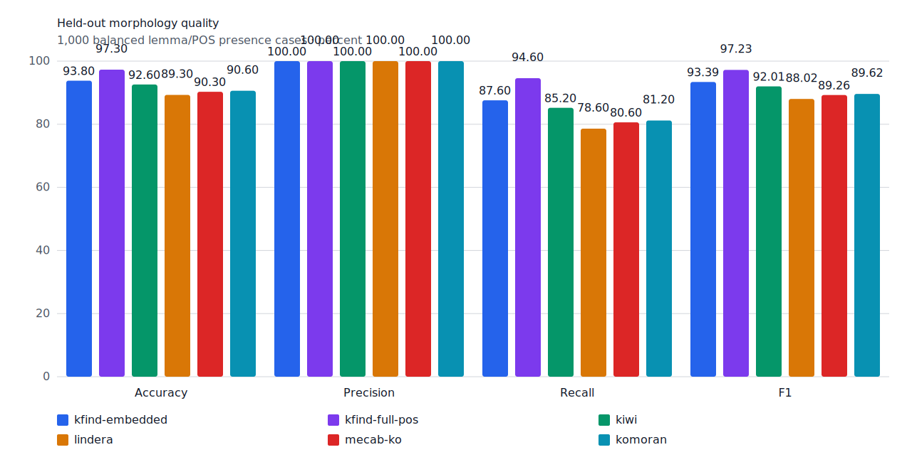
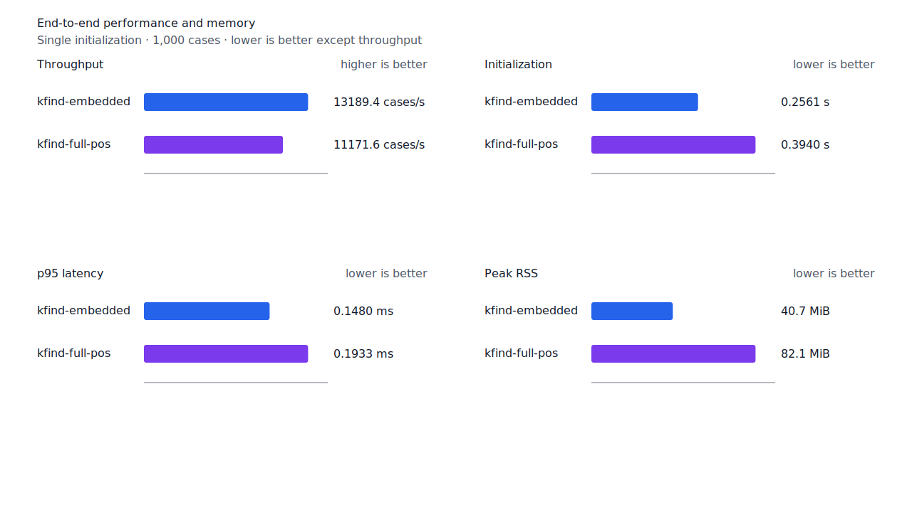
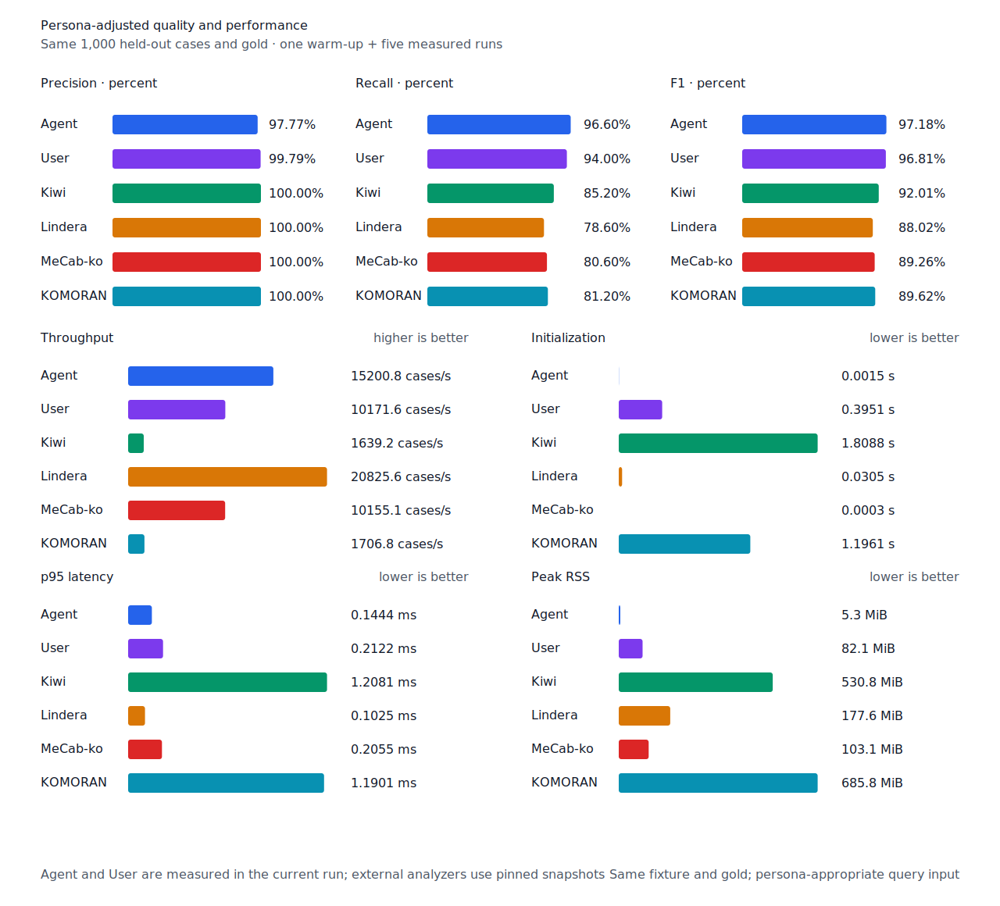

# 한글 수사 연쇄 recall

- 측정일: 2026-07-17
- 기준 revision: `f4752d77d5aa0fd521d3fa33d23efb99f5a845ae`
- 후보 revision: `ae7b1434561b140e24dbd0f22a423851b93dca9c`
- 환경: Linux 6.12.76/linuxkit aarch64, 10 logical CPUs, Python 3.12.13,
  Rust 1.97.0, Docker 29.6.1
- 반복: fresh process warm-up 1회 뒤 5회 측정의 중앙값
- canonical test fixture:
  `933bc12197da866d2363d7df9107d4d9be89a65ddaafd73968ad5384832b21ff`
- canonical development fixture:
  `604c3a139854fcf59570392f48ab85028785f4a3561ea3c5e702f88b841f907c`
- explicit-POS matrix:
  `fbcce40b533655085ff8a4e9031559f99b54f86abe188b6ddc1d690dd44326c6`
- untagged matrix:
  `b9dd7601301fa19b35acba735a977eba7c56a0c9d67c65dee32db5c8028c71bb`
- development matrix:
  `bc67497c3dc966fb7453b238df52c6d781b1b4485d40e8a5d6a38104dcc7abed`
- hard-negative fixture:
  `23bdd5dccc97399235ff4a2f57dcbf55cd94cf0a0da2632e3ded5f7d8e421eed`
- 100 MiB corpus:
  `7692072cb7bff9261c1fa5933bde41b27e558170818eeac6d07cabdd673815ff`
- 기준 report SHA-256:
  `b4f0b420fc192e332a1262a5877243cefacf0411fb59d34bc263e56ec046edba`
- 후보 report SHA-256:
  `71b2bcfdcd2a69acbadad8d8b4f6483872fc9fc16180aab9b3fa79a939757663`

## 규칙

token 왼쪽 경계부터 완성된 source 경로가 `NR` 둘 이상 뒤 선택적 `NNB/NNBC`와 조사 연쇄로
끝나거나, `NR` 하나 이상 뒤 `NNB/NNBC`와 선택적 조사 연쇄로 끝날 때만 한글 수사 구조를
선택한다. query core도 이 완성 경로의 `NR` span과 정렬돼야 한다. 일반 명사, unknown node와
불완전한 나머지는 허용하지 않는다.

한글 수사 구조가 선택돼도 수사 이외의 query pattern은 기존 nominal/runtime 구조 판정에
위임한다. 따라서 같은 token의 다른 정상 검색을 가리지 않는다.

## Canonical 품질과 contract 지표

`PNᶜ`는 contract-positive 분모 `TPᶜ + FNᶜ`다. Canonical fixture에는 strict gold와 다른
contract-positive가 없으므로 각 1,000-case 평가의 `PNᶜ`는 500이다.

| fixture/profile | 기준 TP / FP / FN | 후보 TP / FP / FN | PNᶜ | FNᶜ | recallᶜ |
| --- | ---: | ---: | ---: | ---: | ---: |
| development embedded `smart` | 450 / 4 / 50 | 452 / 4 / 48 | 500 | 50 → 48 | 90.0% → 90.4% |
| development full-POS `smart` | 459 / 4 / 41 | 461 / 4 / 39 | 500 | 41 → 39 | 91.8% → 92.2% |
| test embedded `smart` | 437 / 0 / 63 | 438 / 0 / 62 | 500 | 63 → 62 | 87.4% → 87.6% |
| test full-POS `smart` | 472 / 0 / 28 | 473 / 0 / 27 | 500 | 28 → 27 | 94.4% → 94.6% |
| Human full-POS `smart` | 469 / 1 / 31 | 470 / 1 / 30 | 500 | 31 → 30 | 93.8% → 94.0% |
| Agent embedded `any` | 483 / 11 / 17 | 483 / 11 / 17 | 500 | 17 → 17 | 96.6% → 96.6% |

Strict FP와 FPᶜ는 모두 변하지 않았다. 신규 `numeric-unit` hard-negative `백명사전`,
`일월산맥길`은 embedded와 full-POS에서 모두 strict FP 0, FPᶜ 0이다. 기존 hard-negative의
30건 판정도 변하지 않았다.

## Query matrix strict 품질

이 작업의 paired 비교는 strict 지표와 문장별 모든 positive query 회수 건수를 사용했다.
후속 [query matrix 보고서](2026-07-17-query-matrix.md)는 같은 fixture의 contract-adjusted
confusion matrix와 문장 회수율을 병렬로 기록한다.

| fixture/profile | 기준 TP / FP / FN | 후보 TP / FP / FN | recall | 모든 질의 회수 |
| --- | ---: | ---: | ---: | ---: |
| development embedded `smart` | 1,211 / 7 / 180 | 1,213 / 7 / 178 | 87.06% → 87.20% | 308 → 309 / 466 |
| development full-POS `smart` | 1,256 / 8 / 135 | 1,258 / 8 / 133 | 90.29% → 90.44% | 342 → 344 / 466 |
| test embedded `smart` | 1,235 / 5 / 166 | 1,237 / 5 / 164 | 88.15% → 88.29% | 318 → 320 / 468 |
| test full-POS `smart` | 1,299 / 5 / 102 | 1,301 / 5 / 100 | 92.72% → 92.86% | 373 → 375 / 468 |
| Human full-POS `smart` | 1,304 / 4 / 97 | 1,305 / 4 / 96 | 93.08% → 93.15% | 376 → 377 / 468 |
| Agent embedded `any` | 1,358 / 21 / 43 | 1,358 / 21 / 43 | 96.93% → 96.93% | 425 → 425 / 468 |

회귀하거나 새 FP가 된 matrix case는 없다. Full-POS explicit matrix에서 `수십만의`의 `만`과
`한줄로`의 `한`을 추가로 복구했다. Development matrix에서는 `수십만의`의 `만`과
`십일월에`의 `일`, Human matrix에서는 `수십만의`의 `만`을 복구했다.

| fixture | query | gold surface | 구조 근거 |
| --- | --- | --- | --- |
| development | `num:만` | `수십만의` | `수십/NR + 만/NR + 의/JKG` |
| development | `num:일` | `십일월에` | `십/NR + 일/NR + 월/NNBC + 에/JKB` |
| test/Human | `num:만` | `수십만의` | `수십/NR + 만/NR + 의/JKG` |
| test matrix | `num:한` | `한줄로` | `한/NR + 줄/NNB + 로/JKB` |



## 성능

기준과 후보는 같은 query-matrix benchmark 계약과 입력에서 각각 fresh process warm-up 1회 뒤
5회 측정했다. 모든 변화는 10% 경고선 안이다. 일반 token은 첫 source edge가 exact `NR`일
때만 한글 수사 경로를 계산한다.

| workload | metric | 기준 | 후보 | 증감 |
| --- | --- | ---: | ---: | ---: |
| canonical embedded `smart` | initialization | 0.244011 s | 0.256083 s | +4.95% |
| canonical embedded `smart` | cases/s | 13,880.7 | 13,189.4 | -4.98% |
| canonical embedded `smart` | p95 | 0.1441 ms | 0.1480 ms | +2.71% |
| canonical full-POS `smart` | initialization | 0.395001 s | 0.393999 s | -0.25% |
| canonical full-POS `smart` | cases/s | 11,315.4 | 11,171.6 | -1.27% |
| canonical full-POS `smart` | p95 | 0.1944 ms | 0.1933 ms | -0.57% |
| canonical Agent `any` | cases/s | 15,634.3 | 15,200.8 | -2.77% |
| canonical Human `smart` | cases/s | 10,381.2 | 10,178.3 | -1.95% |
| matrix Agent `any` | cases/s | 16,289.4 | 15,957.8 | -2.04% |
| matrix Human `smart` | cases/s | 10,588.0 | 10,674.1 | +0.81% |
| Agent 100 MiB CLI | throughput | 5,220.53 MiB/s | 5,481.48 MiB/s | +5.00% |
| Human 100 MiB CLI | throughput | 335.82 MiB/s | 342.78 MiB/s | +2.07% |

새 explicit-POS matrix에서 Agent는 15,957.8 cases/s로 Lindera 4.0.0 snapshot 19,829.6
cases/s의 80.47%다. 현재 19.53% 느리므로 이 workload에서는 아직 Lindera에 필적한다고
판정하지 않는다. Recall은 96.93% 대 80.51%, peak RSS는 8.4 MiB 대 199.5 MiB다.





## 남은 FN

Canonical development full-POS의 `PNᶜ`는 500, `FNᶜ`는 39다. 원인은
`boundary-rejected` 27건, `surface-missing` 6건, `span-mismatch` 4건,
`lexicon-missing` 2건이다. 남은 canonical 수사 FN `백명`은 source span 불일치다.

Explicit-POS matrix의 수사 strict recall은 87.50%에서 93.75%로 올랐고, 남은 수사 FN은
`6백미터`의 `백`, `5천톤`의 `천` 두 건이다. 다음 작업은 이 두 ASCII 숫자+한글 수사+일반
단위명사 구조와 canonical `백명`을 별도 typed path로 증명한다.

## 재현

```console
git switch --detach f4752d77d5aa0fd521d3fa33d23efb99f5a845ae
KFIND_MORPH_IMAGE=kfind-morph-benchmark:query-matrix-main-f475 \
KFIND_MORPH_RUNS=5 \
scripts/benchmark-morphology.sh target/morph-hangul-query-matrix-baseline

git switch --detach ae7b1434561b140e24dbd0f22a423851b93dca9c
KFIND_MORPH_IMAGE=kfind-morph-benchmark:query-matrix-hangul-ae7 \
KFIND_MORPH_RUNS=5 \
scripts/benchmark-morphology.sh target/morph-hangul-query-matrix-candidate

python3 tools/morph-compare/render_charts.py \
  target/morph-hangul-query-matrix-candidate/report.json docs/benchmarks/assets \
  --prefix 2026-07-17-hangul-numeral-recall-

python3 tools/morph-compare/export_site_snapshot.py \
  target/morph-hangul-query-matrix-candidate/report.json \
  docs/benchmarks/site-morphology.json --revision ae7b1434561b
```

외부 분석기 snapshot은 latest main의 query-matrix fixture와 고정 버전·설정을 그대로 사용했다.
