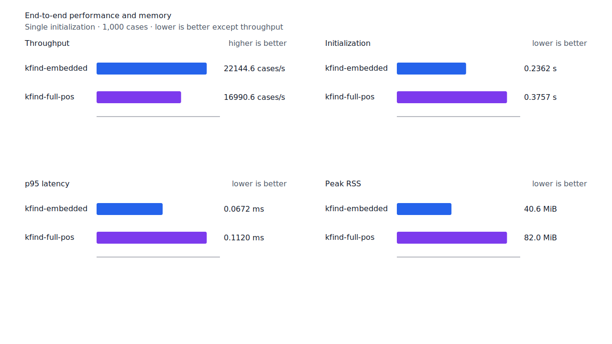
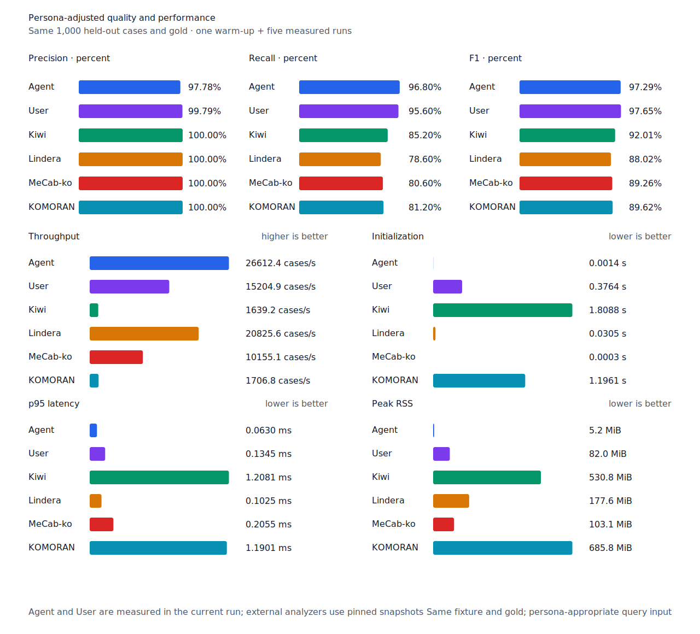
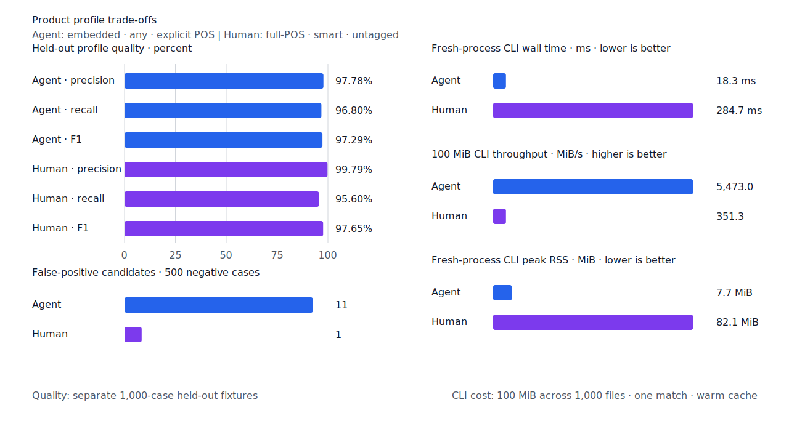

# anchor automaton 선구축 병목 제거

- 측정일: 2026-07-17
- 최신 `origin/main` 및 기준 revision:
  `dbe20275fcb1ed995f7e02d85e0d7c89e94426e0`
- 후보 revision: `ce6ca8b6de3ddabfa4c628ff0a3116214654995b`
- morphology 환경: Linux 6.12.76/aarch64, 10 logical CPUs, Python 3.12.13,
  Rust 1.97.0, Docker 29.6.1
- Criterion 환경: macOS 26.4.1, Apple M1 Max, Rust 1.97.0
- morphology 반복: fresh process 1회 warm-up 뒤 5회 측정의 중앙값
- Criterion 반복: 기본 warm-up 3초, 100 sample, sample별 `times[i] / iters[i]`의
  nearest-rank p95
- canonical test fixture:
  `933bc12197da866d2363d7df9107d4d9be89a65ddaafd73968ad5384832b21ff`
- development fixture:
  `604c3a139854fcf59570392f48ab85028785f4a3561ea3c5e702f88b841f907c`
- explicit-POS matrix fixture:
  `fbcce40b533655085ff8a4e9031559f99b54f86abe188b6ddc1d690dd44326c6`
- hard-negative fixture:
  `f4d8829977ebfd061003724ee4aeb23b36dd901f6e46171c924a1f52a63f0ee5`
- 무품사 fixture:
  `94ccd70a093ee7af8435371b2ffdb81534ec97e29ada705ea72c940938d0c592`
- 100 MiB corpus:
  `7692072cb7bff9261c1fa5933bde41b27e558170818eeac6d07cabdd673815ff`
- 기준 report SHA-256:
  `2b276817bd22b79e5371293f6794c110114c2e70fd3a649f916f807db49126cc`
- 후보 report SHA-256:
  `8fcc353b13b97832c6cd989583daced165427c4a5ddda89d175eb13e28c2216e`

## 병목

full-POS test fixture를 같은 순서로 100번 반복한 100,000-case 입력을 6초간 1 ms
간격으로 sampling했다. 입력 SHA-256은
`44a6ec1abc7b87cde76bbcc63a4eee248208e6c3bcd69f130b0b118745ed06f0`이다.
`run_kfind` 4,030 sample 중 query compile은 1,701개(42.2%), matcher 생성은
1,269개(31.5%)였다. `AnchorEngine::new_with_limits`에서 실행한 Aho-Corasick 생성은
1,001개로 전체의 24.8%를 차지했다.

1,000개 query의 anchor 수는 1개가 592건, 2개가 8건, 15~39개가 400건이었다. 기존
matcher는 여러 anchor가 있으면 검색할 입력 크기와 무관하게 automaton부터 만들었다.
profile에 나타난 noncontiguous NFA는
[aho-corasick 문서](https://docs.rs/aho-corasick/1.1.4/aho_corasick/struct.AhoCorasickBuilder.html#method.kind)에서도
가장 빨리 만들어지는 구현이다. 따라서 automaton 종류를 바꾸는 대신 짧은 일회성 검색에서
생성을 없앴다.

## 변경

- anchor 하나는 기존처럼 소유권을 가진 `memmem::Finder`를 사용한다.
- 여러 anchor의 짧은 검색은 finder별 다음 match를 `(end, start)` 순서로 합쳐 standard
  overlapping 결과 순서를 보존한다.
- 누적 `검색 byte × anchor 수`가 256 KiB 이상이면 automaton을 한 번만 생성해 재사용한다.
- direct finder와 automaton의 합산 메모리가 한도를 넘거나 생성에 실패하면 direct 검색을
  계속한다.

`build_and_find_short`는 실제 형태소 fixture의 32-anchor query와 짧은 문장을 함께
생성·검색한다. `scan_deterministic_corpus`는 승격 뒤 장문 반복 검색의 회귀를 감시한다.

## 품질과 contract

strict 결과와 contract-adjusted 결과는 기준과 후보가 모두 같다. Matrix contract 정의,
annotation과 gate는 수정하지 않았고 reclassified case도 0이다.

| fixture/workflow | PNᶜ | TPᶜ / FPᶜ / FNᶜ | recallᶜ | 후보 변화 |
| --- | ---: | ---: | ---: | ---: |
| canonical full-POS `smart` | 500 | 481 / 0 / 19 | 96.20% | 0 |
| canonical Human `smart` | 500 | 478 / 1 / 22 | 95.60% | 0 |
| canonical Agent `any` | 500 | 484 / 11 / 16 | 96.80% | 0 |
| matrix full-POS `smart` | 1,401 | 1,325 / 5 / 76 | 94.58% | 0 |
| matrix Human `smart` | 1,401 | 1,327 / 4 / 74 | 94.72% | 0 |
| matrix Agent `any` | 1,401 | 1,363 / 21 / 38 | 97.29% | 0 |

## matcher microbenchmark

| workload | 기준 p95 | 후보 p95 | 증감 |
| --- | ---: | ---: | ---: |
| `matcher/build_and_find_short` | 74.958 µs | 14.206 µs | -81.05% |
| `matcher/scan_deterministic_corpus` | 243.111 µs | 241.760 µs | -0.56% |

Criterion의 reused scan point estimate 변화는 +0.11%이고 `p=0.75`로 유의한 차이가
없었다. 즉 짧은 검색의 생성 비용을 없애면서 automaton 승격 뒤 scan 처리량은 유지했다.

## end-to-end morphology

각 값은 `중앙값 [최솟값, 최댓값]`이다. 처리량 증감은 기준 대비 후보다.

| workload | revision | initialization (s) | cases/s | p95 (ms) | peak RSS (KiB) | 처리량 증감 |
| --- | --- | ---: | ---: | ---: | ---: | ---: |
| embedded `smart` | 기준 | 0.234731 [0.232459, 0.235810] | 14,829.4 [14,531.5, 15,007.0] | 0.1293 [0.1259, 0.1321] | 41,720 [41,700, 41,728] | - |
| embedded `smart` | 후보 | 0.236234 [0.233581, 0.249913] | 22,144.6 [20,620.4, 22,465.2] | 0.0672 [0.0670, 0.0738] | 41,616 [41,608, 41,624] | +49.33% |
| full-POS `smart` | 기준 | 0.377929 [0.375072, 0.383114] | 12,108.0 [11,528.2, 12,364.4] | 0.1772 [0.1731, 0.1835] | 83,976 [83,972, 83,980] | - |
| full-POS `smart` | 후보 | 0.375721 [0.374978, 0.377630] | 16,990.6 [16,831.2, 17,005.3] | 0.1120 [0.1108, 0.1128] | 83,968 [83,964, 83,980] | +40.33% |
| Agent `any` | 기준 | 0.001417 [0.001408, 0.001489] | 16,911.2 [16,859.1, 16,933.8] | 0.1253 [0.1240, 0.1273] | 5,464 [5,456, 5,468] | - |
| Agent `any` | 후보 | 0.001430 [0.001418, 0.001615] | 26,612.4 [26,270.2, 26,935.5] | 0.0630 [0.0604, 0.0638] | 5,340 [5,332, 5,340] | +57.37% |
| Human `smart` | 기준 | 0.378084 [0.377512, 0.386165] | 11,168.5 [10,755.4, 11,265.6] | 0.1988 [0.1937, 0.2020] | 84,000 [83,992, 84,004] | - |
| Human `smart` | 후보 | 0.375574 [0.374479, 0.431000] | 14,967.7 [14,262.5, 15,440.7] | 0.1353 [0.1320, 0.1413] | 84,000 [84,000, 84,000] | +34.02% |
| matrix Agent `any` | 기준 | 0.001449 [0.001421, 0.001500] | 17,402.9 [17,118.4, 17,432.0] | 0.1225 [0.1219, 0.1246] | 8,544 [8,540, 8,552] | - |
| matrix Agent `any` | 후보 | 0.001444 [0.001428, 0.001541] | 27,514.2 [26,584.6, 27,651.3] | 0.0608 [0.0599, 0.0647] | 8,448 [8,444, 8,452] | +58.10% |
| matrix Human `smart` | 기준 | 0.377666 [0.375663, 0.378305] | 11,691.4 [11,379.2, 11,742.1] | 0.1972 [0.1953, 0.2028] | 84,728 [84,728, 84,732] | - |
| matrix Human `smart` | 후보 | 0.373845 [0.373251, 0.388196] | 16,162.0 [15,960.5, 16,184.1] | 0.1344 [0.1335, 0.1355] | 84,728 [84,712, 84,732] | +38.24% |

동일 explicit-POS fixture에서 후보 Agent는 Lindera 4.0.0 고정 snapshot의 20,825.6
cases/s보다 27.79% 빠르다. recallᶜ는 96.8% 대 78.6%, peak RSS는 5.2 MiB 대
177.6 MiB다.







## 100 MiB CLI

| workflow | 기준 throughput [min, max] | 후보 throughput [min, max] | 증감 | 기준 RSS [min, max] | 후보 RSS [min, max] |
| --- | ---: | ---: | ---: | ---: | ---: |
| Agent | 5,267.80 [5,240.53, 5,653.64] MiB/s | 5,473.00 [5,107.62, 5,744.05] MiB/s | +3.90% | 7,736 [7,724, 7,760] KiB | 7,868 [7,780, 7,964] KiB |
| Human | 348.28 [345.34, 349.44] MiB/s | 351.31 [340.23, 354.69] MiB/s | +0.87% | 84,004 [83,976, 84,040] KiB | 84,072 [84,052, 84,172] KiB |

두 CLI workload는 변화가 10% 회귀 경고선 안이다. 한 anchor를 사용하는 Agent CLI는 이번
다중 anchor 경로를 실행하지 않는다.

## 재현

기준 Criterion에는 제품 코드를 바꾸지 않고 후보의 benchmark hunk만 적용한다.

```console
git switch --detach dbe20275fcb1ed995f7e02d85e0d7c89e94426e0
git show ce6ca8b6de3 -- crates/kfind-testkit/benches/query_matcher.rs | git apply
scripts/benchmark-criterion.sh matcher/build_and_find_short
scripts/benchmark-criterion.sh matcher/scan_deterministic_corpus
git restore crates/kfind-testkit/benches/query_matcher.rs
KFIND_MORPH_IMAGE=kfind-morph-benchmark:lazy-anchor-base-dbe2027 \
KFIND_MORPH_RUNS=5 \
scripts/benchmark-morphology.sh target/morph-lazy-anchor-base-dbe2027

git switch --detach ce6ca8b6de3ddabfa4c628ff0a3116214654995b
scripts/benchmark-criterion.sh matcher/build_and_find_short
scripts/benchmark-criterion.sh matcher/scan_deterministic_corpus
KFIND_MORPH_IMAGE=kfind-morph-benchmark:lazy-anchor-candidate-ce6ca8b \
KFIND_MORPH_RUNS=5 \
scripts/benchmark-morphology.sh target/morph-lazy-anchor-candidate-ce6ca8b

python3 tools/morph-compare/render_charts.py \
  target/morph-lazy-anchor-candidate-ce6ca8b/report.json \
  docs/benchmarks/assets \
  --prefix 2026-07-17-lazy-anchor-automaton-performance-

python3 tools/morph-compare/export_site_snapshot.py \
  target/morph-lazy-anchor-candidate-ce6ca8b/report.json \
  docs/benchmarks/site-morphology.json \
  --revision ce6ca8b6de3
```

외부 분석기 snapshot은 fixture, adapter schema와 고정 버전·설정이 바뀌지 않아 갱신하지
않았다.
