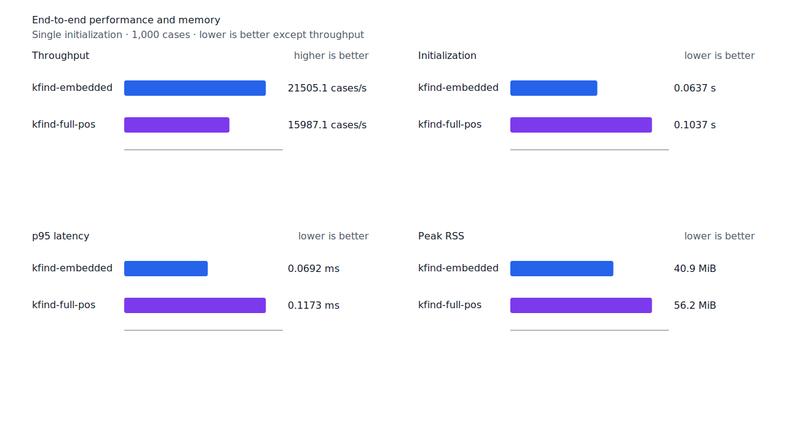
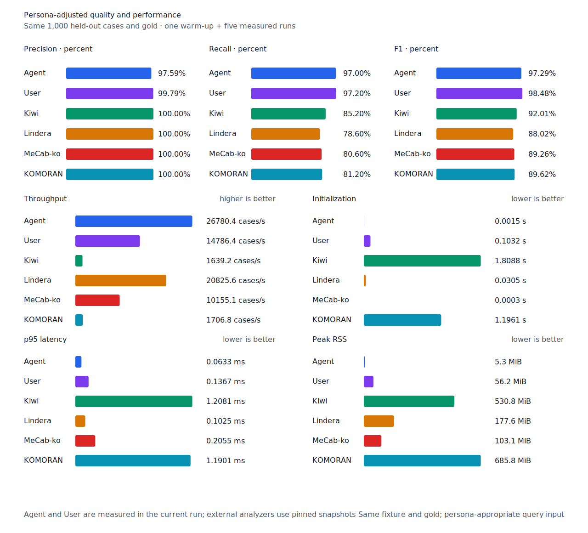

# 선두 부사 component recall

- 측정일: 2026-07-17
- 최신 `origin/main` 및 기준 revision:
  `b972a2fa7fd3e4038987b192654625cf99c363aa`
- 후보 revision: `3d6d5bda9617e927e2e4d0323a73375558170cac`
- 환경: Linux 6.12.76/linuxkit aarch64, 10 logical CPUs, Python 3.12.13,
  Rust 1.97.0, Docker 29.6.1
- 반복: fresh process warm-up 1회 뒤 5회 측정의 중앙값
- canonical test fixture:
  `933bc12197da866d2363d7df9107d4d9be89a65ddaafd73968ad5384832b21ff`
- canonical development fixture:
  `604c3a139854fcf59570392f48ab85028785f4a3561ea3c5e702f88b841f907c`
- explicit-POS matrix:
  `fbcce40b533655085ff8a4e9031559f99b54f86abe188b6ddc1d690dd44326c6`
- untagged matrix:
  `b9dd7601301fa19b35acba735a977eba7c56a0c9d67c65dee32db5c8028c71bb`
- development matrix:
  `bc67497c3dc966fb7453b238df52c6d781b1b4485d40e8a5d6a38104dcc7abed`
- hard-negative fixture:
  `f4d8829977ebfd061003724ee4aeb23b36dd901f6e46171c924a1f52a63f0ee5`
- 100 MiB corpus:
  `7692072cb7bff9261c1fa5933bde41b27e558170818eeac6d07cabdd673815ff`
- 기준 report SHA-256:
  `f2f58f162ff02f0f730462efcbef3cb4e172261a0a67bfb4507ecf9296172c47`
- 후보 report SHA-256:
  `071e93dd72d89162c30d131d910d7ad83d89aa756175170f16d93b9baa65166f`

## 원인과 규칙

Full-POS graph는 `안/MAG + 팔/VV + 아서/EC`, `오래/MAG + 동안/NNG`처럼 token 전체를
덮는 완전 경로를 이미 만들었다. 그러나 runtime exact component의 선두 허용 목록에서
`MAG`가 빠져 있어 마지막 구조 판정에서 부사만 거부했다.

Token 시작에 정렬된 `MAG` edge와 남은 suffix의 완전 경로가 있고 whole-token 분석이
경쟁하지 않을 때 선두 부사를 유지한다. `안팔아서`, `안좋습니다`, `드디어는`, `오래동안`을
회수하지만 whole-token 체언 분석이 있는 `안개`와 graph가 suffix를 완성하지 못하는 token은
계속 거부한다. Matrix contract 정의, annotation과 gate는 변경하지 않았다.

## 품질과 contract 지표

`PNᶜ = TPᶜ + FNᶜ`다. Matrix의 reclassified case는 0건이라 strict와 contract-adjusted
confusion matrix가 같다. 모든 FP와 FPᶜ case ID는 기준과 후보가 같다.

| matrix/profile | 기준 TPᶜ / FPᶜ / FNᶜ | 후보 TPᶜ / FPᶜ / FNᶜ | PNᶜ | recallᶜ | 모든 contract 질의 회수 |
| --- | ---: | ---: | ---: | ---: | ---: |
| test embedded `smart` | 1,266 / 5 / 135 | 1,270 / 5 / 131 | 1,401 | 90.36% → 90.65% | 346 → 348 / 468 |
| test full-POS `smart` | 1,351 / 5 / 50 | 1,355 / 5 / 46 | 1,401 | 96.43% → 96.72% | 421 → 424 / 468 |
| Human full-POS `smart` | 1,349 / 4 / 52 | 1,352 / 4 / 49 | 1,401 | 96.29% → 96.50% | 418 → 420 / 468 |
| Agent embedded `any` | 1,366 / 22 / 35 | 1,366 / 22 / 35 | 1,401 | 97.50% → 97.50% | 433 → 433 / 468 |
| development embedded `smart` | 1,236 / 7 / 155 | 1,237 / 7 / 154 | 1,391 | 88.86% → 88.93% | 329 → 329 / 466 |
| development full-POS `smart` | 1,293 / 8 / 98 | 1,294 / 8 / 97 | 1,391 | 92.95% → 93.03% | 375 → 376 / 466 |

Test explicit-POS의 두 smart profile은 `안팔아서→안`, `안좋습니다→안`,
`드디어는→드디어`, `오래동안→오래`를 회수했다. Human은 앞의 세 건, development의 두
explicit-POS profile은 `많이들→많이`를 회수했다. 다른 FN 이동은 없다.

Canonical embedded/full-POS는 `안팔아서→안`, `오래동안→오래`를 회수해 각각
`TPᶜ / FPᶜ / FNᶜ`가 `447 / 0 / 53`에서 `449 / 0 / 51`,
`489 / 0 / 11`에서 `491 / 0 / 9`가 됐다. Canonical Human은 `485 / 1 / 15`에서
`486 / 1 / 14`, Agent는 `485 / 12 / 15`로 같다.

Hard-negative 전체 결과도 같다. Embedded는 contract-adjusted
`TPᶜ 3 / FPᶜ 1 / TNᶜ 32 / FNᶜ 2`, full-POS는
`TPᶜ 5 / FPᶜ 1 / TNᶜ 32 / FNᶜ 0`이다.


## 성능

모든 morphology 행은 같은 환경에서 fresh process warm-up 1회 뒤 5회 측정한
`median [min, max]`다.

| workload | revision | initialization (s) | cases/s | p95 (ms) | RSS (KiB) |
| --- | --- | ---: | ---: | ---: | ---: |
| canonical embedded `smart` | 기준 | 0.064157 [0.062048, 0.071852] | 21,061.7 [19,945.7, 21,714.5] | 0.0713 [0.0677, 0.0746] | 41,860 [41,848, 41,876] |
| canonical embedded `smart` | 후보 | 0.063664 [0.062205, 0.073518] | 21,505.1 [18,665.8, 21,595.6] | 0.0692 [0.0681, 0.0804] | 41,860 [41,844, 41,864] |
| canonical full-POS `smart` | 기준 | 0.104892 [0.103360, 0.105781] | 16,364.5 [16,154.3, 16,467.6] | 0.1150 [0.1130, 0.1167] | 57,536 [57,492, 57,564] |
| canonical full-POS `smart` | 후보 | 0.103657 [0.102511, 0.112896] | 15,987.1 [15,339.8, 16,510.3] | 0.1173 [0.1133, 0.1276] | 57,520 [57,496, 57,564] |
| canonical Agent `any` | 기준 | 0.001521 [0.001453, 0.001537] | 26,041.5 [25,829.0, 26,680.5] | 0.0643 [0.0637, 0.0655] | 5,392 [5,376, 5,408] |
| canonical Agent `any` | 후보 | 0.001470 [0.001409, 0.001546] | 26,780.4 [25,674.6, 27,036.7] | 0.0633 [0.0618, 0.0668] | 5,396 [5,380, 5,404] |
| canonical Human `smart` | 기준 | 0.104507 [0.102691, 0.109174] | 14,847.6 [14,609.0, 14,896.7] | 0.1364 [0.1347, 0.1391] | 57,520 [57,516, 57,584] |
| canonical Human `smart` | 후보 | 0.103807 [0.102307, 0.108344] | 14,817.0 [14,787.6, 14,878.6] | 0.1361 [0.1358, 0.1377] | 57,580 [57,520, 57,584] |
| matrix Agent `any` | 기준 | 0.001451 [0.001421, 0.001474] | 27,473.3 [27,065.4, 27,545.3] | 0.0608 [0.0603, 0.0627] | 8,500 [8,488, 8,508] |
| matrix Agent `any` | 후보 | 0.001444 [0.001434, 0.001522] | 27,614.7 [27,418.0, 27,792.7] | 0.0602 [0.0598, 0.0613] | 8,500 [8,488, 8,508] |
| matrix Human `smart` | 기준 | 0.103490 [0.103050, 0.105523] | 15,523.6 [15,370.4, 15,534.1] | 0.1396 [0.1390, 0.1410] | 58,320 [58,256, 58,320] |
| matrix Human `smart` | 후보 | 0.101869 [0.101528, 0.102389] | 15,342.6 [15,279.3, 15,574.4] | 0.1402 [0.1385, 0.1410] | 58,252 [58,252, 58,320] |

중앙값 기준 canonical embedded/full-POS/Agent/Human cases/s 변화는 각각 +2.11%, -2.31%,
+2.84%, -0.21%다. Matrix Agent와 Human은 +0.51%, -1.17%다. 모든 morphology 변화는
10% 회귀 경고선 안이고 측정 범위가 겹친다.

100 MiB CLI 처리량은 Agent 5,250.56→5,507.53 MiB/s(+4.89%), Human
949.91→936.88 MiB/s(-1.37%)다. 동일 canonical fixture의 후보 Agent는
26,780.4 cases/s로 Lindera 4.0.0 고정 snapshot의 20,825.6 cases/s보다 28.60% 빠르다.
Recallᶜ는 97.0% 대 78.6%, peak RSS는 5.3 MiB 대 177.6 MiB다.





## 남은 FN

Test matrix full-POS의 `PNᶜ`는 1,401, `FNᶜ`는 46이고 Human `FNᶜ`는 49다.
Development full-POS의 `PNᶜ`는 1,391, `FNᶜ`는 97이다. Test full-POS FNᶜ는
`boundary-rejected` 22건, `gold-or-adapter` 15건, `surface-missing` 6건,
`continuation-rejected` 2건, `span-mismatch` 1건이다.

남은 부사 경계 거부는 graph가 suffix를 완성하지 못한 `못해요→못`, `안나와요→안` 두
건이다. 이 규칙의 완전 경로 조건을 약화하지 않고 별도 원인으로 다룬다.

## 재현

```console
git switch --detach 3d6d5bda9617e927e2e4d0323a73375558170cac
KFIND_MORPH_IMAGE=kfind-morph-benchmark:leading-adverb-candidate-3d6d5bd \
KFIND_MORPH_RUNS=5 \
scripts/benchmark-morphology.sh target/morph-leading-adverb-candidate-3d6d5bd

git switch --detach b972a2fa7fd3e4038987b192654625cf99c363aa
KFIND_MORPH_IMAGE=kfind-morph-benchmark:leading-adverb-base-b972a2f \
KFIND_MORPH_RUNS=5 \
scripts/benchmark-morphology.sh target/morph-leading-adverb-base-b972a2f

python3 tools/morph-compare/render_charts.py \
  target/morph-leading-adverb-candidate-3d6d5bd/report.json \
  docs/benchmarks/assets \
  --prefix 2026-07-17-leading-adverb-component-recall-

python3 tools/morph-compare/export_site_snapshot.py \
  target/morph-leading-adverb-candidate-3d6d5bd/report.json \
  docs/benchmarks/site-morphology.json \
  --revision 3d6d5bda9617e927e2e4d0323a73375558170cac
```

외부 분석기 snapshot은 fixture, adapter schema와 고정 버전·설정이 바뀌지 않아 갱신하지
않았다.
