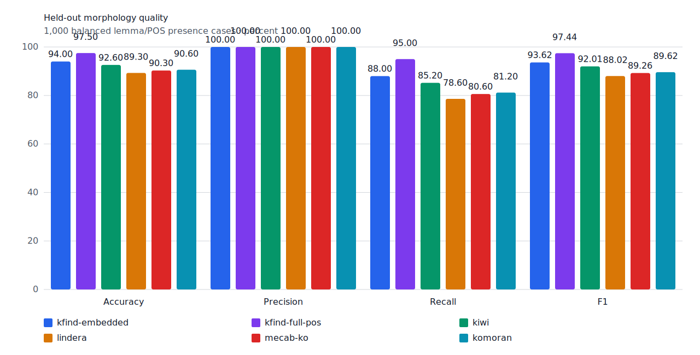
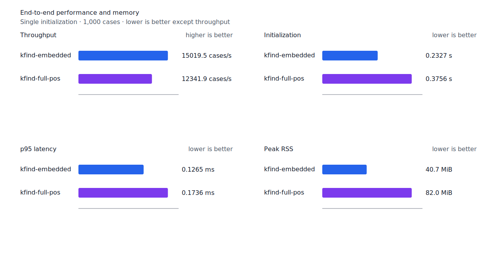
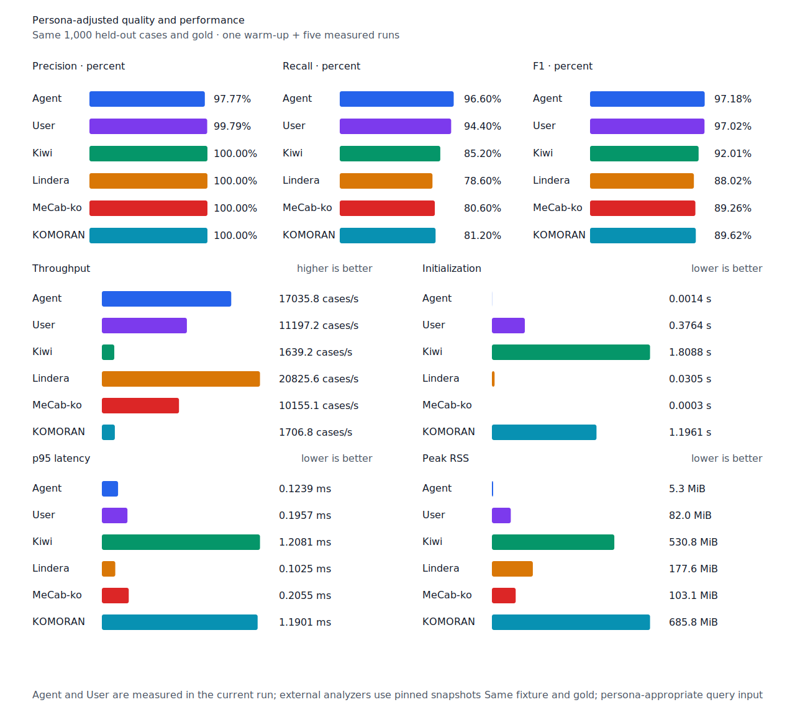

# 혼합 수량 구조 recall

- 측정일: 2026-07-17
- 기준 revision: `9d3a470554fe3453e0b14f84b18e8fc9472057eb`
- 후보 revision: `27cd009db4274e8350e7c44e194bb9ff180d5fd0`
- 환경: Linux 6.12.76/linuxkit aarch64, 10 logical CPUs, Python 3.12.13,
  Rust 1.97.0, Docker 29.6.1
- 반복: fresh process warm-up 1회 뒤 5회 측정의 중앙값
- canonical test fixture:
  `933bc12197da866d2363d7df9107d4d9be89a65ddaafd73968ad5384832b21ff`
- canonical development fixture:
  `604c3a139854fcf59570392f48ab85028785f4a3561ea3c5e702f88b841f907c`
- explicit-POS matrix:
  `fbcce40b533655085ff8a4e9031559f99b54f86abe188b6ddc1d690dd44326c6`
- untagged matrix:
  `b9dd7601301fa19b35acba735a977eba7c56a0c9d67c65dee32db5c8028c71bb`
- development matrix:
  `bc67497c3dc966fb7453b238df52c6d781b1b4485d40e8a5d6a38104dcc7abed`
- 기준 hard-negative fixture:
  `23bdd5dccc97399235ff4a2f57dcbf55cd94cf0a0da2632e3ded5f7d8e421eed`
- 후보 hard-negative fixture:
  `a1e87b1430b034cc03a93368e4abf035c1d083960c0eff38a32f729234f466bc`
- 100 MiB corpus:
  `7692072cb7bff9261c1fa5933bde41b27e558170818eeac6d07cabdd673815ff`
- 기준 report SHA-256:
  `2c84816e2e3b35a82732e1b522b6279e90b513f7f2508ead0832df69c2c6c267`
- 후보 report SHA-256:
  `4e08ddbc83aca5e316a900300612b852192717f84ea7a03b23da8bfe1e9699d1`

## 규칙

ASCII 숫자 뒤에 source `NR`이 하나 이상 있고 `NNB/NNBC` 단위가 이어지며, 나머지가 없거나
완성된 조사 연쇄일 때만 혼합 수량 구조를 선택한다. query core도 이 완성 경로의 `NR` span과
정렬돼야 한다. `NR` 없는 단위, 일반·고유 명사, unknown node와 불완전한 나머지는 허용하지
않는다.

따라서 `5천톤의`의 `천`과 `6백미터`의 `백`은 지원하지만 `3천사`, `197명사`, `5천톤사`는
거부한다. 숫자 직후 exact `NR` edge가 있고 기존 숫자+단위 경로가 없을 때만 제한된 수사
경로를 계산한다.

## Canonical 품질과 contract 지표

`PNᶜ`는 contract-positive 분모 `TPᶜ + FNᶜ`다. Canonical fixture에는 strict gold와 다른
contract-positive가 없으므로 각 1,000-case 평가의 `PNᶜ`는 500이다.

| fixture/profile | 기준 TP / FP / FN | 후보 TP / FP / FN | PNᶜ | FNᶜ | recallᶜ |
| --- | ---: | ---: | ---: | ---: | ---: |
| development embedded `smart` | 452 / 4 / 48 | 452 / 4 / 48 | 500 | 48 → 48 | 90.4% → 90.4% |
| development full-POS `smart` | 461 / 4 / 39 | 461 / 4 / 39 | 500 | 39 → 39 | 92.2% → 92.2% |
| test embedded `smart` | 438 / 0 / 62 | 440 / 0 / 60 | 500 | 62 → 60 | 87.6% → 88.0% |
| test full-POS `smart` | 473 / 0 / 27 | 475 / 0 / 25 | 500 | 27 → 25 | 94.6% → 95.0% |
| Human full-POS `smart` | 470 / 1 / 30 | 472 / 1 / 28 | 500 | 30 → 28 | 94.0% → 94.4% |
| Agent embedded `any` | 483 / 11 / 17 | 483 / 11 / 17 | 500 | 17 → 17 | 96.6% → 96.6% |

복구한 두 case는 `5천톤의`의 `천`과 `6백미터`의 `백`이다. 회귀하거나 새 FP가 된 canonical
case는 없다. 신규 hard-negative `3천사를 만났다.`는 embedded와 full-POS에서 모두 strict FP
0, FPᶜ 0이며 `numeric-unit` 대조군 7건을 모두 거부했다.



## Query matrix strict·contract-adjusted 품질

Query matrix의 contract 정의와 주석은 이 작업 범위에 포함하지 않았다. 최신 main의 같은
fixture에서 strict와 contract-adjusted confusion matrix, 문장별 완전 회수율을 각각 paired
비교했다.

| fixture/profile | 기준 TP / FP / FN | 후보 TP / FP / FN | recall | 모든 질의 회수 |
| --- | ---: | ---: | ---: | ---: |
| development embedded `smart` | 1,213 / 7 / 178 | 1,213 / 7 / 178 | 87.20% → 87.20% | 309 → 309 / 466 |
| development full-POS `smart` | 1,258 / 8 / 133 | 1,258 / 8 / 133 | 90.44% → 90.44% | 344 → 344 / 466 |
| test embedded `smart` | 1,237 / 5 / 164 | 1,239 / 5 / 162 | 88.29% → 88.44% | 320 → 321 / 468 |
| test full-POS `smart` | 1,301 / 5 / 100 | 1,303 / 5 / 98 | 92.86% → 93.00% | 375 → 376 / 468 |
| Human full-POS `smart` | 1,305 / 4 / 96 | 1,307 / 4 / 94 | 93.15% → 93.29% | 377 → 378 / 468 |
| Agent embedded `any` | 1,358 / 21 / 43 | 1,358 / 21 / 43 | 96.93% → 96.93% | 425 → 425 / 468 |

현재 matrix에는 사전 선언된 `contract_expected`가 없어 reclassified case는 0건이다. 따라서
strict와 contract-adjusted 값은 같지만 두 축을 별도 필드로 검증했다. Test matrix의
`PNᶜ=1,401`, development matrix의 `PNᶜ=1,391`이다.

| fixture/profile | 기준 TPᶜ / FPᶜ / FNᶜ | 후보 TPᶜ / FPᶜ / FNᶜ | PNᶜ | recallᶜ | 모든 contract 질의 회수 |
| --- | ---: | ---: | ---: | ---: | ---: |
| development embedded `smart` | 1,213 / 7 / 178 | 1,213 / 7 / 178 | 1,391 | 87.20% → 87.20% | 309 → 309 / 466 |
| development full-POS `smart` | 1,258 / 8 / 133 | 1,258 / 8 / 133 | 1,391 | 90.44% → 90.44% | 344 → 344 / 466 |
| test embedded `smart` | 1,237 / 5 / 164 | 1,239 / 5 / 162 | 1,401 | 88.29% → 88.44% | 320 → 321 / 468 |
| test full-POS `smart` | 1,301 / 5 / 100 | 1,303 / 5 / 98 | 1,401 | 92.86% → 93.00% | 375 → 376 / 468 |
| Human full-POS `smart` | 1,305 / 4 / 96 | 1,307 / 4 / 94 | 1,401 | 93.15% → 93.29% | 377 → 378 / 468 |
| Agent embedded `any` | 1,358 / 21 / 43 | 1,358 / 21 / 43 | 1,401 | 96.93% → 96.93% | 425 → 425 / 468 |

Embedded, full-POS와 Human은 모두 `5천톤`의 `천`, `6백미터`의 `백` 두 건을 복구했다. 두
문장 중 하나에는 다른 미복구 질의가 남아 있어 완전 회수 문장은 각 profile에서 한 건 늘었다.
회귀하거나 새 strict FP·FPᶜ가 된 matrix case는 없다.

## 성능

모든 morphology 행은 같은 환경에서 fresh process warm-up 1회 뒤 5회 측정한
`median [min, max]`다. 모든 변화는 10% 경고선 안이다.

| workload | revision | initialization (s) | cases/s | p95 (ms) | RSS (KiB) |
| --- | --- | ---: | ---: | ---: | ---: |
| canonical embedded `smart` | 기준 | 0.232663 [0.231663, 0.241308] | 14,718.3 [14,265.8, 15,050.5] | 0.1332 [0.1270, 0.1370] | 41,720 [41,704, 41,724] |
| canonical embedded `smart` | 후보 | 0.232685 [0.232514, 0.234645] | 15,019.5 [14,958.7, 15,145.4] | 0.1265 [0.1247, 0.1275] | 41,716 [41,704, 41,724] |
| canonical full-POS `smart` | 기준 | 0.377789 [0.373935, 0.378297] | 12,400.3 [12,318.2, 12,419.1] | 0.1726 [0.1716, 0.1733] | 83,976 [83,976, 83,980] |
| canonical full-POS `smart` | 후보 | 0.375561 [0.373495, 0.385447] | 12,341.9 [12,188.7, 12,412.8] | 0.1736 [0.1700, 0.1767] | 83,980 [83,972, 83,980] |
| canonical Human `smart` | 기준 | 0.377181 [0.376204, 0.377659] | 11,290.8 [10,812.1, 11,351.8] | 0.1940 [0.1938, 0.2051] | 84,004 [84,000, 84,004] |
| canonical Human `smart` | 후보 | 0.376386 [0.375350, 0.379945] | 11,321.3 [10,981.5, 11,395.9] | 0.1928 [0.1911, 0.1997] | 84,004 [84,000, 84,004] |
| matrix Agent `any` | 기준 | 0.001509 [0.001417, 0.001525] | 16,929.1 [16,502.3, 17,558.3] | 0.1283 [0.1228, 0.1307] | 8,548 [8,536, 8,552] |
| matrix Agent `any` | 후보 | 0.001399 [0.001385, 0.001458] | 17,558.2 [17,506.3, 17,584.3] | 0.1218 [0.1214, 0.1223] | 8,548 [8,540, 8,552] |
| matrix Human `smart` | 기준 | 0.375449 [0.373913, 0.382670] | 11,782.9 [11,012.4, 11,882.0] | 0.1950 [0.1923, 0.2060] | 84,728 [84,724, 84,732] |
| matrix Human `smart` | 후보 | 0.374137 [0.373825, 0.379473] | 11,800.5 [11,299.8, 11,810.8] | 0.1935 [0.1923, 0.1984] | 84,728 [84,720, 84,732] |

중앙값 기준 canonical embedded/full-POS/Human cases/s 변화는 각각 +2.05%, -0.47%,
+0.27%다. Matrix Agent는 +3.72%, Human은 +0.15%다. 100 MiB CLI 처리량은 Agent
5,678.05→5,727.72 MiB/s(+0.87%), Human 354.19→354.24 MiB/s(+0.01%)다.

후보 matrix Agent는 17,558.2 cases/s로 같은 fixture의 Lindera 4.0.0 snapshot 19,829.6
cases/s보다 11.45% 느리다. Recall은 96.93% 대 80.51%, peak RSS는 8.4 MiB 대 199.5 MiB다.
새 typed path는 `smart`에서만 실행되므로 Agent `any` 변화는 측정 잡음으로 본다.





## 남은 FN

Canonical test full-POS의 `PNᶜ`는 500, `FNᶜ`는 25다. 이 중 제품 판정으로 분류된 strict FN은
`boundary-rejected` 12건과 `surface-missing` 2건이며, 나머지 11건은 gold·adapter 정렬
문제다. Development full-POS의 `FNᶜ` 39건은 이번 test-only 구조가 없어 변하지 않았다.

Development의 `백명`은 제품이 실제 `백` span을 반환하지만 UD KSL 원문이 `이 백 명`을
`Typo=Yes`와 `goeswith`로 연결하면서 gold span이 앞의 `이`를 가리키는 adapter 문제다. 혼합
수량 제품 경로를 더 열어 해결하지 않는다.

다음 제품 recall slice는 matrix full-POS에 반복된 `이다` 계열 12건을 surface-missing 8건과
boundary-rejected 4건으로 먼저 분리하고, source component로 증명되는 공통 경로만 연다.
gold·adapter 문제와 의미상 동음이의어는 별도 버킷으로 유지한다.

## 재현

```console
git switch --detach 9d3a470554fe3453e0b14f84b18e8fc9472057eb
KFIND_MORPH_IMAGE=kfind-morph-benchmark:mixed-numeral-main-9d3 \
KFIND_MORPH_RUNS=5 \
scripts/benchmark-morphology.sh target/morph-mixed-numeral-baseline

git switch --detach 27cd009db4274e8350e7c44e194bb9ff180d5fd0
KFIND_MORPH_IMAGE=kfind-morph-benchmark:mixed-numeral-27cd009 \
KFIND_MORPH_RUNS=5 \
scripts/benchmark-morphology.sh target/morph-mixed-numeral-candidate

python3 tools/morph-compare/render_charts.py \
  target/morph-mixed-numeral-candidate/report.json docs/benchmarks/assets \
  --prefix 2026-07-17-mixed-numeral-unit-recall-

python3 tools/morph-compare/export_site_snapshot.py \
  target/morph-mixed-numeral-candidate/report.json \
  docs/benchmarks/site-morphology.json --revision 27cd009db427
```

외부 분석기 snapshot은 latest main의 같은 query-matrix fixture와 고정 버전·설정을 사용했다.
