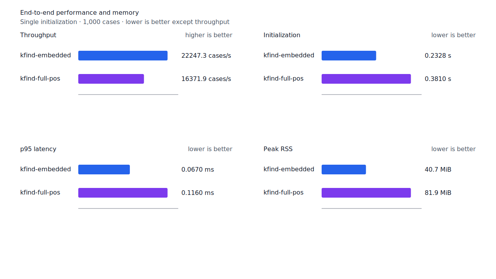
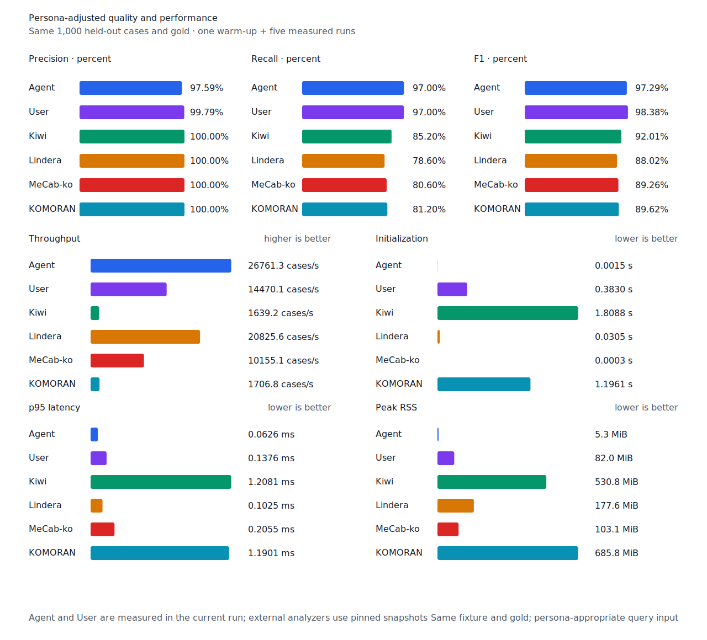

# 관형사 뒤 명사 component recall

- 측정일: 2026-07-17
- 최신 `origin/main` 및 기준 revision:
  `072bd9063f676ccd09f4487475edf5cf8b8235d3`
- 후보 revision: `ee99c73cf02187c899d45c8ed1f7061667c8e262`
- 환경: Linux 6.12.76/linuxkit aarch64, 10 logical CPUs, Python 3.12.13,
  Rust 1.97.0, Docker 29.6.1
- 반복: fresh process warm-up 1회 뒤 5회 측정의 중앙값
- canonical test fixture:
  `933bc12197da866d2363d7df9107d4d9be89a65ddaafd73968ad5384832b21ff`
- canonical development fixture:
  `604c3a139854fcf59570392f48ab85028785f4a3561ea3c5e702f88b841f907c`
- explicit-POS matrix:
  `fbcce40b533655085ff8a4e9031559f99b54f86abe188b6ddc1d690dd44326c6`
- untagged matrix:
  `b9dd7601301fa19b35acba735a977eba7c56a0c9d67c65dee32db5c8028c71bb`
- development matrix:
  `bc67497c3dc966fb7453b238df52c6d781b1b4485d40e8a5d6a38104dcc7abed`
- hard-negative fixture:
  `f4d8829977ebfd061003724ee4aeb23b36dd901f6e46171c924a1f52a63f0ee5`
- 100 MiB corpus:
  `7692072cb7bff9261c1fa5933bde41b27e558170818eeac6d07cabdd673815ff`
- 기준 report SHA-256:
  `b748743ed79a5ec2823eafe9807899f365d4bf1a69dea9aca8ce52b27c2664f1`
- 후보 report SHA-256:
  `8b2f96c7aee2943ceb0798c4bfafb39276b28e074560bcaa214d8c579452a31c`

## 원인과 규칙

`어느날`과 `칠월`에는 token 왼쪽 경계의 `MM` 뒤에 `NNG` 또는 `NNBC`가 이어지는 완성
source path가 있다. 기존 선호 path는 체언으로만 시작해야 해서 뒤 명사 component를 구조
근거로 쓰지 못했다.

Token 또는 조사 host가 정확한 `MM`으로 시작하고 나머지가 `NNG/NNP/NNB/NNBC`로 끝나는
경우에만 정렬된 명사 component를 연다. 한 음절 `MM + 명사` 두 성분 구조는 같은 선행
span의 `NR` 근거도 요구한다. 따라서 `칠/MM|NR + 월/NNBC`은 지원하지만
`소/MM + 년/NNB`은 거부한다. Token-level 보조 경로도 선택된 host가 query core 바로 앞에서
끝날 때만 사용해 더 긴 경쟁 분석을 우회하지 않는다.

고정 resource 단위 검증은 `어느날→날`, `칠월→월`을 지원하고 `매일→일`, `아무나→나`,
`소년→년`을 거부한다. Matrix contract 정의, annotation과 gate는 변경하지 않았다.

## 숫자 경로와 `년`

현재 제품의 수사 판정은 숫자값을 산출하는 산술 파서가 아니라 token 왼쪽 경계부터 완성된
`NR` 연쇄와 선택적 `NNB/NNBC`, 조사 연쇄를 검사하는 구조 경로다. 실제 후보 바이너리는
`사십구억오천이백육십오만이천백팔십칠`에서 `억`, `천`, `칠`을 numeral component로
찾는다. 같은 바이너리에서 `소년은→년`은 거부하고 `2025년에는→년`은 지원한다.

단위 크기의 순서나 숫자값의 유효성은 아직 검산하지 않는다. 이 산술 제약은 이번 명사
component recall 계약과 분리한다.

## 품질과 contract 지표

`PNᶜ`는 contract-positive 분모 `TPᶜ + FNᶜ`다. 최신 matrix의 reclassified case는 0건이라
strict와 contract-adjusted confusion matrix가 같다.

Canonical test와 development의 모든 profile은 기준과 같다. Test embedded/full-POS/Human의
`PNᶜ=500`, `FNᶜ`는 각각 53, 11, 15이고 Agent `FNᶜ`는 15다. Development
embedded/full-POS의 `PNᶜ=500`, `FNᶜ`는 45, 32다. FP와 FPᶜ도 변하지 않았다.

| matrix/profile | 기준 TPᶜ / FPᶜ / FNᶜ | 후보 TPᶜ / FPᶜ / FNᶜ | PNᶜ | recallᶜ | 모든 contract 질의 회수 |
| --- | ---: | ---: | ---: | ---: | ---: |
| test embedded `smart` | 1,263 / 5 / 138 | 1,264 / 5 / 137 | 1,401 | 90.15% → 90.22% | 343 → 344 / 468 |
| test full-POS `smart` | 1,348 / 5 / 53 | 1,349 / 5 / 52 | 1,401 | 96.22% → 96.29% | 418 → 419 / 468 |
| Human full-POS `smart` | 1,346 / 4 / 55 | 1,347 / 4 / 54 | 1,401 | 96.07% → 96.15% | 415 → 416 / 468 |
| Agent embedded `any` | 1,366 / 22 / 35 | 1,366 / 22 / 35 | 1,401 | 97.50% → 97.50% | 433 → 433 / 468 |
| development embedded `smart` | 1,234 / 7 / 157 | 1,234 / 7 / 157 | 1,391 | 88.71% → 88.71% | 327 → 327 / 466 |
| development full-POS `smart` | 1,291 / 8 / 100 | 1,291 / 8 / 100 | 1,391 | 92.81% → 92.81% | 373 → 373 / 466 |

세 smart profile은 `저는 작년 칠월에 친구랑 설악산에 갔어요.`의 `월` 1건만 회수했다.
Agent `any`는 기존에도 surface를 반환했다. 새 FP·FPᶜ와 회귀는 없다. Hard-negative 결과도
기준과 같다. Embedded는 strict `FP 4 / TN 34`, contract-adjusted
`TPᶜ 3 / FPᶜ 1 / TNᶜ 32 / FNᶜ 2`이고 full-POS는 strict `FP 6 / TN 32`,
contract-adjusted `TPᶜ 5 / FPᶜ 1 / TNᶜ 32 / FNᶜ 0`이다. `numeric-unit` slice의
7건은 두 profile 모두 `FPᶜ 0 / TNᶜ 7`이며 `소년→년`도 거부한다.


## 성능

모든 morphology 행은 같은 환경에서 fresh process warm-up 1회 뒤 5회 측정한
`median [min, max]`다. 모든 변화는 10% 회귀 경고선 안이다.

| workload | revision | initialization (s) | cases/s | p95 (ms) | RSS (KiB) |
| --- | --- | ---: | ---: | ---: | ---: |
| canonical embedded `smart` | 기준 | 0.233427 [0.232231, 0.233987] | 21,452.1 [20,979.6, 22,394.1] | 0.0709 [0.0669, 0.0730] | 41,660 [41,656, 41,668] |
| canonical embedded `smart` | 후보 | 0.232762 [0.232095, 0.243554] | 22,247.3 [20,861.1, 22,357.8] | 0.0670 [0.0665, 0.0742] | 41,664 [41,656, 41,672] |
| canonical full-POS `smart` | 기준 | 0.376820 [0.374669, 0.392107] | 16,465.6 [15,780.0, 16,838.7] | 0.1136 [0.1130, 0.1210] | 83,960 [83,944, 83,968] |
| canonical full-POS `smart` | 후보 | 0.380960 [0.376704, 0.386558] | 16,371.9 [15,612.2, 16,891.5] | 0.1160 [0.1118, 0.1218] | 83,872 [83,860, 83,956] |
| canonical Agent `any` | 기준 | 0.001447 [0.001428, 0.001484] | 26,869.9 [25,435.8, 26,905.4] | 0.0617 [0.0615, 0.0657] | 5,392 [5,380, 5,400] |
| canonical Agent `any` | 후보 | 0.001498 [0.001425, 0.001581] | 26,761.3 [25,339.3, 26,896.0] | 0.0626 [0.0617, 0.0670] | 5,388 [5,368, 5,392] |
| canonical Human `smart` | 기준 | 0.377520 [0.375847, 0.379578] | 15,283.0 [15,191.9, 15,323.4] | 0.1334 [0.1330, 0.1341] | 83,988 [83,976, 83,988] |
| canonical Human `smart` | 후보 | 0.381296 [0.378647, 0.382613] | 15,268.7 [15,168.4, 15,329.5] | 0.1341 [0.1320, 0.1355] | 83,888 [83,876, 83,952] |
| matrix Agent `any` | 기준 | 0.001489 [0.001422, 0.001531] | 27,579.2 [27,494.2, 27,633.4] | 0.0605 [0.0601, 0.0609] | 8,500 [8,496, 8,500] |
| matrix Agent `any` | 후보 | 0.001427 [0.001411, 0.001461] | 27,624.1 [27,474.7, 27,715.9] | 0.0605 [0.0597, 0.0606] | 8,500 [8,480, 8,500] |
| matrix Human `smart` | 기준 | 0.374995 [0.374118, 0.375750] | 15,883.6 [15,672.6, 15,999.9] | 0.1367 [0.1348, 0.1386] | 84,712 [84,692, 84,716] |
| matrix Human `smart` | 후보 | 0.384541 [0.378484, 0.389328] | 15,726.2 [15,509.7, 15,889.9] | 0.1387 [0.1380, 0.1402] | 84,708 [84,692, 84,712] |

중앙값 기준 canonical embedded/full-POS/Agent/Human cases/s 변화는 각각 +3.71%, -0.57%,
-0.40%, -0.09%다. Matrix Agent와 Human은 +0.16%, -0.99%다. 동일 explicit fixture의
무품사 User는 15,133.4→14,470.1 cases/s(-4.38%)이고 측정 범위가 겹친다. 100 MiB CLI
처리량은 Agent 6,031.82→5,846.26 MiB/s(-3.08%), Human 351.11→347.79 MiB/s(-0.95%)다.

동일 canonical fixture의 후보 Agent는 26,761.3 cases/s로 Lindera 4.0.0 고정 snapshot의
20,825.6 cases/s보다 28.51% 빠르다. recallᶜ는 97.0% 대 78.6%, peak RSS는
5.3 MiB 대 177.6 MiB다. Candidate hot path는 기존 `TokenEvidence`와 numeral path를
재사용하며 token별 보조 collection을 추가하지 않는다.





## 남은 FN

Canonical test full-POS의 `PNᶜ`는 500, `FNᶜ`는 11이다. Matrix full-POS의 `PNᶜ`는
1,401, `FNᶜ`는 52다. 이번 규칙은 표준형 `어느날→날`도 지원하지만 고정 matrix의 추가
회수는 `칠월→월` 한 건이다.

남은 `1년간→간`은 ASCII 숫자와 `NNBC` 뒤 nominal tail이 필요한 별도 구조다.
`첫번째로→번째`는 `번/NNBC + 째/XSN` 경계를 가로지르므로 exact component 계약으로 열지
않는다. 한글 수사 연쇄는 긴 수를 이미 구조적으로 처리하지만 단위 크기 순서는 검산하지 않는다.

## 재현

```console
git switch --detach ee99c73cf02187c899d45c8ed1f7061667c8e262
KFIND_MORPH_IMAGE=kfind-morph-benchmark:modifier-noun-candidate-ee99c73 \
KFIND_MORPH_RUNS=5 \
scripts/benchmark-morphology.sh target/morph-modifier-noun-candidate-ee99c73

git switch --detach 072bd9063f676ccd09f4487475edf5cf8b8235d3
KFIND_MORPH_IMAGE=kfind-morph-benchmark:modifier-noun-base-072bd90 \
KFIND_MORPH_RUNS=5 \
scripts/benchmark-morphology.sh target/morph-modifier-noun-base-072bd90

python3 tools/morph-compare/render_charts.py \
  target/morph-modifier-noun-candidate-ee99c73/report.json \
  docs/benchmarks/assets \
  --prefix 2026-07-17-modifier-noun-component-recall-

python3 tools/morph-compare/export_site_snapshot.py \
  target/morph-modifier-noun-candidate-ee99c73/report.json \
  docs/benchmarks/site-morphology.json \
  --revision ee99c73cf02187c899d45c8ed1f7061667c8e262
```

외부 분석기 snapshot은 fixture, adapter schema와 고정 버전·설정이 바뀌지 않아 갱신하지
않았다.
