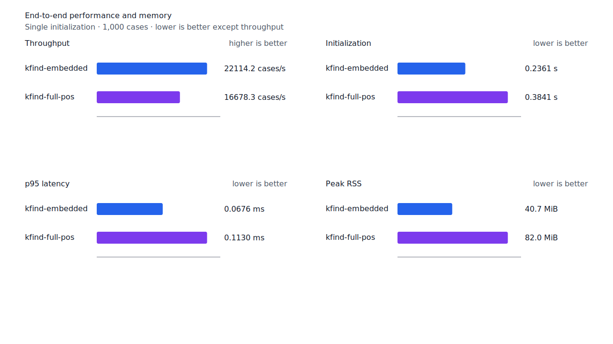
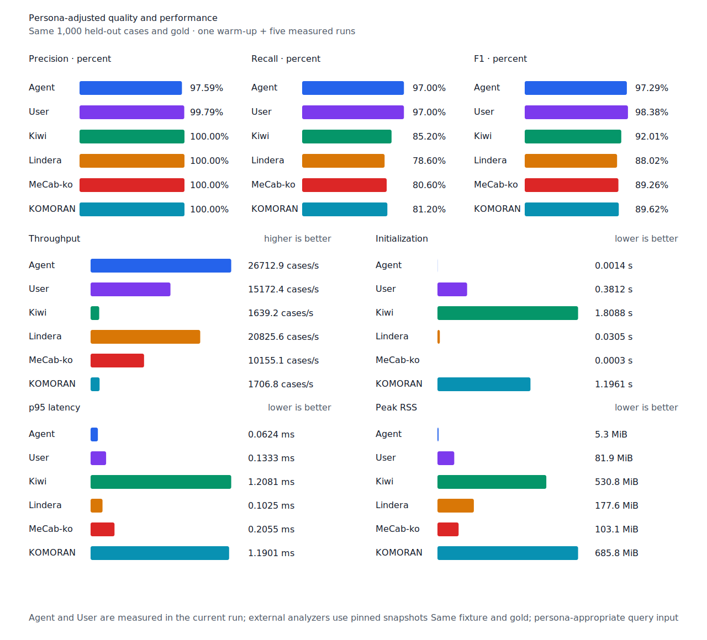

# 관형사 뒤 명사 우선 경로 recall

- 측정일: 2026-07-17
- 최신 `origin/main` 및 기준 revision:
  `8384f76af27b54619002a2cd1eb49ac95bab450b`
- 후보 revision: `c3879b183a7f553e65c459bfac690527694b850a`
- 환경: Linux 6.12.76/linuxkit aarch64, 10 logical CPUs, Python 3.12.13,
  Rust 1.97.0, Docker 29.6.1
- 반복: fresh process warm-up 1회 뒤 5회 측정의 중앙값
- canonical test fixture:
  `933bc12197da866d2363d7df9107d4d9be89a65ddaafd73968ad5384832b21ff`
- canonical development fixture:
  `604c3a139854fcf59570392f48ab85028785f4a3561ea3c5e702f88b841f907c`
- explicit-POS matrix:
  `fbcce40b533655085ff8a4e9031559f99b54f86abe188b6ddc1d690dd44326c6`
- untagged matrix:
  `b9dd7601301fa19b35acba735a977eba7c56a0c9d67c65dee32db5c8028c71bb`
- development matrix:
  `bc67497c3dc966fb7453b238df52c6d781b1b4485d40e8a5d6a38104dcc7abed`
- hard-negative fixture:
  `f4d8829977ebfd061003724ee4aeb23b36dd901f6e46171c924a1f52a63f0ee5`
- 100 MiB corpus:
  `7692072cb7bff9261c1fa5933bde41b27e558170818eeac6d07cabdd673815ff`
- 기준 report SHA-256:
  `550141ee71a450bbc21b9e518a0a6f2fbecaebabaf79c3515bac2bde462a200a`
- 후보 report SHA-256:
  `36209186abfee353a3d6107093403f003c621b74f9de8c747e28f0ace5b4e8c9`

## 원인과 규칙

`어느날`의 고정 component graph에는 완성 경로 `어느/MM + 날/NNG`와 더 짧은 용언 prefix로
시작하는 `어/VV + 느/NNG + 날/NNG`가 함께 있다. 기존 predicate-frame 방어는 후자의
`어/VV`만 보고 token 끝의 한 음절 명사 `날`을 거부했다. 이는 최소 component 수의 완성
`MM + 명사` 경로를 우선한다는 기존 계약과 어긋났다.

정확한 `MM + 명사`가 token 전체를 덮는 우선 경로임을 증명하면 더 짧은 predicate prefix가
같이 있다는 이유만으로 마지막 명사를 폐기하지 않는다. 이 경로 검사는 먼저 실제 terminal
nominal/predicate-frame 충돌을 확인한 후보에만 단락 평가한다. 일반 명사 후보마다 graph를
다시 순회하지 않는다.

`매일→일`, `아무나→나`, `소년→년`은 계속 거부한다. Matrix contract 정의, annotation과
gate는 변경하지 않았다.

## 품질과 contract 지표

`PNᶜ = TPᶜ + FNᶜ`다. Matrix의 reclassified case는 0건이라 strict와 contract-adjusted
confusion matrix가 같다. Canonical test, development matrix와 Agent 품질은 기준과 같다.

| matrix/profile | 기준 TPᶜ / FPᶜ / FNᶜ | 후보 TPᶜ / FPᶜ / FNᶜ | PNᶜ | recallᶜ | 모든 contract 질의 회수 |
| --- | ---: | ---: | ---: | ---: | ---: |
| test embedded `smart` | 1,265 / 5 / 136 | 1,266 / 5 / 135 | 1,401 | 90.29% → 90.36% | 345 → 346 / 468 |
| test full-POS `smart` | 1,350 / 5 / 51 | 1,351 / 5 / 50 | 1,401 | 96.36% → 96.43% | 420 → 421 / 468 |
| Human full-POS `smart` | 1,348 / 4 / 53 | 1,349 / 4 / 52 | 1,401 | 96.22% → 96.29% | 417 → 418 / 468 |
| Agent embedded `any` | 1,366 / 22 / 35 | 1,366 / 22 / 35 | 1,401 | 97.50% → 97.50% | 433 → 433 / 468 |
| development embedded `smart` | 1,236 / 7 / 155 | 1,236 / 7 / 155 | 1,391 | 88.86% → 88.86% | 329 → 329 / 466 |
| development full-POS `smart` | 1,293 / 8 / 98 | 1,293 / 8 / 98 | 1,391 | 92.95% → 92.95% | 375 → 375 / 466 |

Test의 세 smart profile은 `어느날→날`을 회수했다. 기준과 후보의 failure record를 case ID,
예측값과 span으로 대조했으며 다른 이동은 없다. Canonical embedded/full-POS의 FNᶜ는 각각
53, 11이고 Agent/Human의 canonical FNᶜ는 각각 15, 15로 변하지 않았다.

Hard-negative 전체 결과도 같다. Embedded는 contract-adjusted
`TPᶜ 3 / FPᶜ 1 / TNᶜ 32 / FNᶜ 2`, full-POS는
`TPᶜ 5 / FPᶜ 1 / TNᶜ 32 / FNᶜ 0`이다.


## 성능

모든 morphology 행은 같은 환경에서 fresh process warm-up 1회 뒤 5회 측정한
`median [min, max]`다.

| workload | revision | initialization (s) | cases/s | p95 (ms) | RSS (KiB) |
| --- | --- | ---: | ---: | ---: | ---: |
| canonical embedded `smart` | 기준 | 0.235853 [0.234521, 0.247771] | 22,040.8 [20,172.3, 22,323.4] | 0.0675 [0.0664, 0.0750] | 41,664 [41,656, 41,664] |
| canonical embedded `smart` | 후보 | 0.236135 [0.234742, 0.237958] | 22,114.2 [20,595.8, 22,236.2] | 0.0676 [0.0669, 0.0741] | 41,664 [41,660, 41,668] |
| canonical full-POS `smart` | 기준 | 0.383208 [0.379224, 0.391761] | 16,666.9 [16,306.1, 16,758.4] | 0.1125 [0.1117, 0.1178] | 83,872 [83,868, 83,936] |
| canonical full-POS `smart` | 후보 | 0.384103 [0.380667, 0.395746] | 16,678.3 [15,715.9, 16,774.9] | 0.1130 [0.1108, 0.1197] | 83,932 [83,868, 83,964] |
| canonical Agent `any` | 기준 | 0.001434 [0.001414, 0.001483] | 26,550.6 [25,894.9, 26,975.4] | 0.0634 [0.0614, 0.0660] | 5,396 [5,380, 5,400] |
| canonical Agent `any` | 후보 | 0.001437 [0.001398, 0.001467] | 26,712.9 [26,609.1, 26,873.5] | 0.0624 [0.0615, 0.0638] | 5,384 [5,376, 5,400] |
| canonical Human `smart` | 기준 | 0.383990 [0.380985, 0.384298] | 15,104.4 [14,211.2, 15,174.3] | 0.1356 [0.1321, 0.1422] | 83,944 [83,888, 84,016] |
| canonical Human `smart` | 후보 | 0.382076 [0.380926, 0.384443] | 15,193.7 [14,570.4, 15,230.3] | 0.1342 [0.1338, 0.1366] | 83,888 [83,888, 83,952] |
| matrix Agent `any` | 기준 | 0.001447 [0.001442, 0.001537] | 27,346.7 [26,652.6, 27,551.7] | 0.0612 [0.0605, 0.0638] | 8,500 [8,496, 8,504] |
| matrix Agent `any` | 후보 | 0.001484 [0.001409, 0.001511] | 27,499.6 [27,105.3, 27,630.0] | 0.0605 [0.0602, 0.0619] | 8,496 [8,484, 8,500] |
| matrix Human `smart` | 기준 | 0.383366 [0.381070, 0.383888] | 15,845.7 [15,822.3, 15,866.8] | 0.1371 [0.1371, 0.1375] | 84,744 [84,744, 84,744] |
| matrix Human `smart` | 후보 | 0.380808 [0.379004, 0.382352] | 15,815.9 [14,756.9, 15,896.5] | 0.1368 [0.1363, 0.1455] | 84,692 [84,680, 84,748] |

중앙값 기준 canonical embedded/full-POS/Agent/Human cases/s 변화는 각각 +0.33%, +0.07%,
+0.61%, +0.59%다. Matrix Agent와 Human은 +0.56%, -0.19%다. 동일 explicit fixture의
무품사 User는 14,983.4→15,172.4 cases/s(+1.26%)다. 모든 morphology 변화는 측정 범위가
겹치며 회귀로 판정하지 않는다.

100 MiB CLI 처리량은 Agent 5,806.25→5,863.97 MiB/s(+0.99%), Human
342.09→346.63 MiB/s(+1.33%)다. 후보 Agent는 동일 canonical fixture에서
26,712.9 cases/s로 Lindera 4.0.0 고정 snapshot의 20,825.6 cases/s보다 28.27% 빠르다.
recallᶜ는 97.0% 대 78.6%, peak RSS는 5.3 MiB 대 177.6 MiB다.





## 남은 FN

Test matrix full-POS의 `PNᶜ`는 1,401, `FNᶜ`는 50이고 Human `FNᶜ`는 52다.
Development full-POS의 `PNᶜ`는 1,391, `FNᶜ`는 98이다. 반복 2건 이상인 test FN은
비표준·붙여쓰기 또는 무표면 지정사이므로 canonical 규칙으로 넓히지 않는다.

한글 수사 단위 순서와 산술값 검산은 recall 경로와 분리한 precision 후보다. 다음 작업은
새 recall 규칙을 억지로 넓히기보다 profile로 현재 scan/startup의 실제 병목을 다시 고른다.

## 재현

```console
git switch --detach c3879b183a7f553e65c459bfac690527694b850a
KFIND_MORPH_IMAGE=kfind-morph-benchmark:modifier-prefix-candidate-c3879b1 \
KFIND_MORPH_RUNS=5 \
scripts/benchmark-morphology.sh target/morph-modifier-prefix-candidate-c3879b1

git switch --detach 8384f76af27b54619002a2cd1eb49ac95bab450b
KFIND_MORPH_IMAGE=kfind-morph-benchmark:modifier-prefix-base-8384f76 \
KFIND_MORPH_RUNS=5 \
scripts/benchmark-morphology.sh target/morph-modifier-prefix-base-8384f76

python3 tools/morph-compare/render_charts.py \
  target/morph-modifier-prefix-candidate-c3879b1/report.json \
  docs/benchmarks/assets \
  --prefix 2026-07-17-modifier-noun-preferred-path-recall-

python3 tools/morph-compare/export_site_snapshot.py \
  target/morph-modifier-prefix-candidate-c3879b1/report.json \
  docs/benchmarks/site-morphology.json \
  --revision c3879b183a7f553e65c459bfac690527694b850a
```

외부 분석기 snapshot은 fixture, adapter schema와 고정 버전·설정이 바뀌지 않아 갱신하지
않았다.
