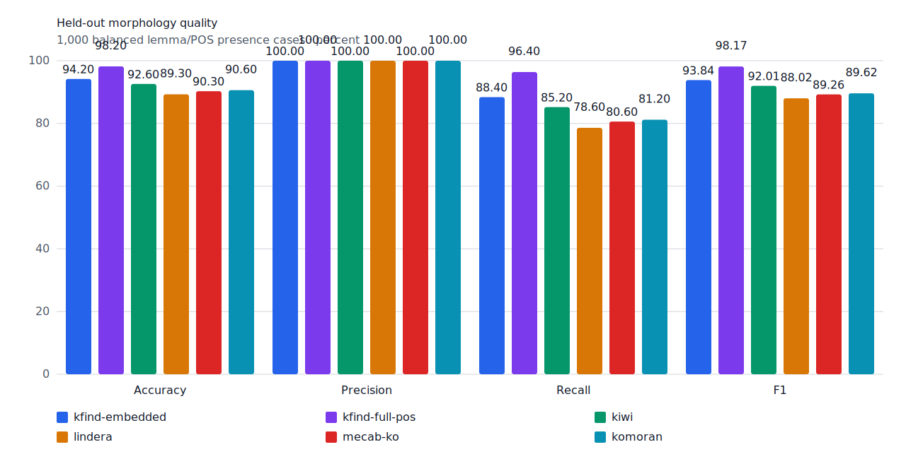
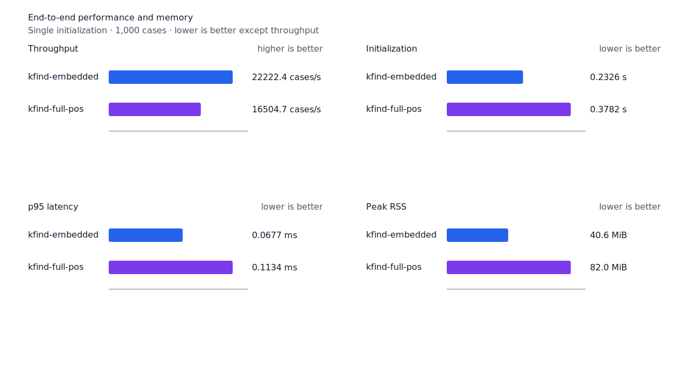
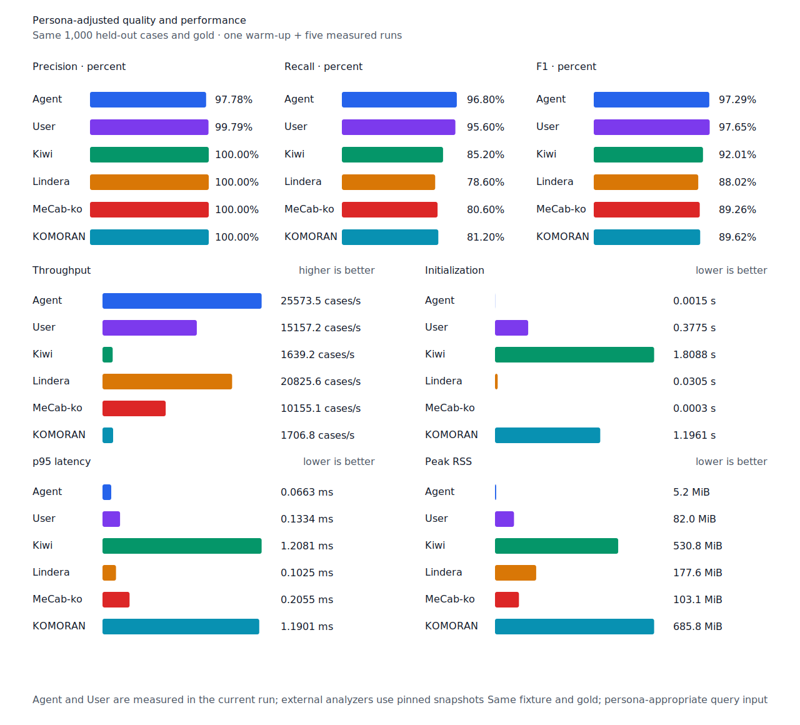

# 지정사 앞 체언 recall

- 측정일: 2026-07-17
- 최신 `origin/main` 및 기준 revision:
  `dfc6e7cb7a18e72a668cd5e1e9e4c71f6bbf46ae`
- 후보 revision: `8eb4e0b1f9a855bafd657d030b42e83535ca4ae6`
- 환경: Linux 6.12.76/linuxkit aarch64, 10 logical CPUs, Python 3.12.13,
  Rust 1.97.0, Docker 29.6.1
- 반복: fresh process warm-up 1회 뒤 5회 측정의 중앙값
- canonical test fixture:
  `933bc12197da866d2363d7df9107d4d9be89a65ddaafd73968ad5384832b21ff`
- canonical development fixture:
  `604c3a139854fcf59570392f48ab85028785f4a3561ea3c5e702f88b841f907c`
- explicit-POS matrix:
  `fbcce40b533655085ff8a4e9031559f99b54f86abe188b6ddc1d690dd44326c6`
- untagged matrix:
  `b9dd7601301fa19b35acba735a977eba7c56a0c9d67c65dee32db5c8028c71bb`
- development matrix:
  `bc67497c3dc966fb7453b238df52c6d781b1b4485d40e8a5d6a38104dcc7abed`
- hard-negative fixture:
  `f4d8829977ebfd061003724ee4aeb23b36dd901f6e46171c924a1f52a63f0ee5`
- 100 MiB corpus:
  `7692072cb7bff9261c1fa5933bde41b27e558170818eeac6d07cabdd673815ff`
- 기준 report SHA-256:
  `8d7265d63e7073c9ec3c4a047c1d908258f34cba38fdb6e6673d22b27029f803`
- 후보 report SHA-256:
  `73632ce3838414567b4b214da4b4db4cf19fea96e6ea2cbac1f4fb8e60932959`

## 원인과 규칙

명사 query 뒤 suffix가 `이` 또는 `입`으로 시작하면 기존 조사 allomorph 선검사가 지정사의
첫 음절을 조사로 해석해 구조 판정 전에 후보를 거부했다. 이 경우에만 token 왼쪽 경계부터
query 끝까지 완성된 체언 host가 있고, 이어지는 source component가 `VCP + E+ + J*`로 token
끝에 닿는지 확인한다. 해당 구조가 확인되면 조사 모양의 suffix 거부를 건너뛴다.

따라서 `결과이다`, `고체이긴`, `왕친입니다`, `것이었다`의 체언을 회수한다. 중간 체언이
남는 `홍씨이다`의 `홍`, 지정사가 아닌 `맛있다`의 `맛`, 어미가 끝나지 않은 `결과이`, 체언
질의 `이`가 `이다`와 겹치는 경우는 열지 않는다. 구조 graph는 명사 후보의 실제 suffix가
`이` 또는 `입`으로 시작할 때만 계산한다. Matrix contract 정의, annotation과 gate는
변경하지 않았다.

## Canonical 품질과 contract 지표

`PNᶜ`는 contract-positive 분모 `TPᶜ + FNᶜ`다. Canonical fixture에는 strict gold와 다른
contract-positive가 없으므로 각 1,000-case 평가의 `PNᶜ`는 500이다.

| fixture/profile | 기준 TPᶜ / FPᶜ / FNᶜ | 후보 TPᶜ / FPᶜ / FNᶜ | PNᶜ | recallᶜ |
| --- | ---: | ---: | ---: | ---: |
| development embedded `smart` | 452 / 4 / 48 | 453 / 4 / 47 | 500 | 90.4% → 90.6% |
| development full-POS `smart` | 464 / 4 / 36 | 465 / 4 / 35 | 500 | 92.8% → 93.0% |
| test embedded `smart` | 441 / 0 / 59 | 442 / 0 / 58 | 500 | 88.2% → 88.4% |
| test full-POS `smart` | 481 / 0 / 19 | 482 / 0 / 18 | 500 | 96.2% → 96.4% |
| Human full-POS `smart` | 478 / 1 / 22 | 478 / 1 / 22 | 500 | 95.6% → 95.6% |
| Agent embedded `any` | 484 / 11 / 16 | 484 / 11 / 16 | 500 | 96.8% → 96.8% |

Canonical embedded와 full-POS는 `것이었다`의 `것`을 회수했다. Human의 자동 plan은 이
case에 같은 명사 구조를 선택하지 않아 품질이 변하지 않았다. Strict FP와 FPᶜ는 모든
profile에서 그대로다.

Hard-negative는 기준과 후보 모두 strict `FP 6 / TN 32`, contract-adjusted
`TPᶜ 5 / FPᶜ 1 / TNᶜ 32 / FNᶜ 0`이다. `홍씨이다`, `맛있다`, `이다`와 불완전한
`결과이`를 대상으로 한 unit·integration 대조군도 모두 거부했다.



## Query matrix strict·contract-adjusted 품질

현재 matrix의 reclassified case는 0건이므로 strict와 contract-adjusted confusion matrix가
같다. 두 지표 family는 report의 별도 필드로 검증했다. Test matrix의 `PNᶜ=1,401`,
development matrix의 `PNᶜ=1,391`이다.

| fixture/profile | 기준 TPᶜ / FPᶜ / FNᶜ | 후보 TPᶜ / FPᶜ / FNᶜ | PNᶜ | recallᶜ | 모든 contract 질의 회수 |
| --- | ---: | ---: | ---: | ---: | ---: |
| development embedded `smart` | 1,219 / 7 / 172 | 1,221 / 7 / 170 | 1,391 | 87.63% → 87.78% | 315 → 317 / 466 |
| development full-POS `smart` | 1,272 / 8 / 119 | 1,274 / 8 / 117 | 1,391 | 91.45% → 91.59% | 356 → 358 / 466 |
| test embedded `smart` | 1,248 / 5 / 153 | 1,252 / 5 / 149 | 1,401 | 89.08% → 89.36% | 329 → 333 / 468 |
| test full-POS `smart` | 1,325 / 5 / 76 | 1,329 / 5 / 72 | 1,401 | 94.58% → 94.86% | 396 → 400 / 468 |
| Human full-POS `smart` | 1,327 / 4 / 74 | 1,330 / 4 / 71 | 1,401 | 94.72% → 94.93% | 396 → 399 / 468 |
| Agent embedded `any` | 1,363 / 21 / 38 | 1,363 / 21 / 38 | 1,401 | 97.29% → 97.29% | 430 → 430 / 468 |

Test의 embedded와 full-POS는 다음 4건을 회수했다.

- `결과이다`의 `결과`
- `고체이긴`의 `고체`
- `왕친입니다`의 `왕친`
- `것이었다`의 `것`

Human은 이 가운데 3건을 회수했다. 각 full-POS case가 속한 문장의 다른 contract 질의도
이미 회수되고 있어 완전 회수 문장이 4개 늘었다. Development matrix의 embedded와
full-POS는 각각 2건을 추가 회수했다. 새 strict FP·FPᶜ와 회귀는 없다.

## 성능

모든 morphology 행은 같은 환경에서 fresh process warm-up 1회 뒤 5회 측정한
`median [min, max]`다. 모든 변화는 10% 회귀 경고선 안이다.

| workload | revision | initialization (s) | cases/s | p95 (ms) | RSS (KiB) |
| --- | --- | ---: | ---: | ---: | ---: |
| canonical embedded `smart` | 기준 | 0.234976 [0.232721, 0.240880] | 21,637.4 [20,328.3, 22,240.9] | 0.0690 [0.0668, 0.0789] | 41,612 [41,596, 41,616] |
| canonical embedded `smart` | 후보 | 0.232595 [0.232209, 0.255609] | 22,222.4 [21,871.9, 22,337.7] | 0.0677 [0.0664, 0.0707] | 41,612 [41,604, 41,616] |
| canonical full-POS `smart` | 기준 | 0.376248 [0.375767, 0.388476] | 16,790.3 [16,045.0, 17,016.9] | 0.1144 [0.1109, 0.1177] | 83,980 [83,980, 83,984] |
| canonical full-POS `smart` | 후보 | 0.378227 [0.374338, 0.399355] | 16,504.7 [15,337.7, 16,909.1] | 0.1134 [0.1113, 0.1233] | 83,976 [83,960, 83,980] |
| canonical Agent `any` | 기준 | 0.001434 [0.001410, 0.001501] | 26,703.7 [26,625.9, 26,979.3] | 0.0621 [0.0611, 0.0630] | 5,348 [5,328, 5,352] |
| canonical Agent `any` | 후보 | 0.001537 [0.001513, 0.001606] | 25,573.5 [25,399.4, 25,943.2] | 0.0663 [0.0655, 0.0671] | 5,340 [5,336, 5,344] |
| canonical Human `smart` | 기준 | 0.376828 [0.376114, 0.378675] | 15,430.1 [15,265.8, 15,479.8] | 0.1326 [0.1314, 0.1329] | 84,004 [83,996, 84,004] |
| canonical Human `smart` | 후보 | 0.381785 [0.377098, 0.390755] | 14,626.4 [13,810.3, 15,196.5] | 0.1393 [0.1337, 0.1452] | 84,000 [83,996, 84,000] |
| matrix Agent `any` | 기준 | 0.001490 [0.001434, 0.001557] | 27,430.1 [26,791.5, 27,601.4] | 0.0616 [0.0601, 0.0637] | 8,444 [8,440, 8,448] |
| matrix Agent `any` | 후보 | 0.001446 [0.001432, 0.001488] | 27,481.4 [26,905.4, 27,575.0] | 0.0607 [0.0603, 0.0623] | 8,444 [8,440, 8,452] |
| matrix Human `smart` | 기준 | 0.374453 [0.373301, 0.388334] | 15,989.1 [15,294.1, 16,084.7] | 0.1354 [0.1344, 0.1402] | 84,724 [84,716, 84,732] |
| matrix Human `smart` | 후보 | 0.378705 [0.376824, 0.382566] | 15,959.7 [15,747.6, 16,042.2] | 0.1351 [0.1346, 0.1372] | 84,728 [84,708, 84,732] |

중앙값 기준 canonical embedded/full-POS/Agent/Human cases/s 변화는 각각 +2.70%, -1.70%,
-4.23%, -5.21%다. Matrix Agent와 Human은 각각 +0.19%, -0.18%다. 체언-지정사 구조를
실행하지 않는 Agent의 차이는 이번 코드 경로에서 발생한 비용이 아니다. 100 MiB CLI
처리량은 Agent 5,826.95→5,626.05 MiB/s(-3.45%), Human
349.63→347.87 MiB/s(-0.50%)다.

동일 canonical fixture의 후보 Agent는 25,573.5 cases/s로 Lindera 4.0.0 고정 snapshot의
20,825.6 cases/s보다 22.80% 빠르다. recallᶜ는 96.8% 대 78.6%, peak RSS는 5.2 MiB 대
177.6 MiB다. Recall 규칙은 suffix 후보에서만 구조 graph를 계산해 현재 처리량 우위를
유지한다.





## 남은 FN

Canonical test full-POS의 `PNᶜ`는 500, `FNᶜ`는 18이다. Matrix full-POS의 `PNᶜ`는
1,401, `FNᶜ`는 72다. 가장 큰 동일 질의 묶음은 각 3건인 부사 `안`, 동사 `오다`,
형용사 `이다`다.

`안` 3건은 모두 비표준 붙여쓰기이고, `이다`는 무표면 축약 `겁니다` 2건과 비표준 표기
`이예요` 1건이다. `오다`는 서로 다른 활용·결합 원인으로 갈린다. 이 묶음들을 canonical
규칙으로 강제하지 않고, 다음 작업은 남은 standard-form FN을 cause별로 다시 묶어 가장 큰
공통 구조를 고른다. 비표준 입력은 별도 noisy-text robustness 축에서 다룬다.

## 재현

```console
git switch --detach dfc6e7cb7a18e72a668cd5e1e9e4c71f6bbf46ae
KFIND_MORPH_IMAGE=kfind-morph-benchmark:nominal-copula-base-dfc6e7c \
KFIND_MORPH_RUNS=5 \
scripts/benchmark-morphology.sh target/morph-nominal-copula-base-dfc6e7c

git switch --detach 8eb4e0b1f9a855bafd657d030b42e83535ca4ae6
KFIND_MORPH_IMAGE=kfind-morph-benchmark:nominal-copula-candidate-8eb4e0b \
KFIND_MORPH_RUNS=5 \
scripts/benchmark-morphology.sh target/morph-nominal-copula-candidate-8eb4e0b

python3 tools/morph-compare/render_charts.py \
  target/morph-nominal-copula-candidate-8eb4e0b/report.json \
  docs/benchmarks/assets \
  --prefix 2026-07-17-nominal-copula-host-recall-

python3 tools/morph-compare/export_site_snapshot.py \
  target/morph-nominal-copula-candidate-8eb4e0b/report.json \
  docs/benchmarks/site-morphology.json \
  --revision 8eb4e0b1f9a855bafd657d030b42e83535ca4ae6
```

외부 분석기 snapshot은 fixture, adapter schema와 고정 버전·설정이 바뀌지 않아 갱신하지
않았다.
