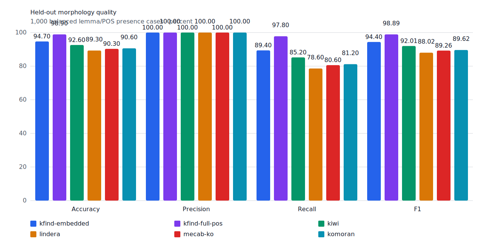
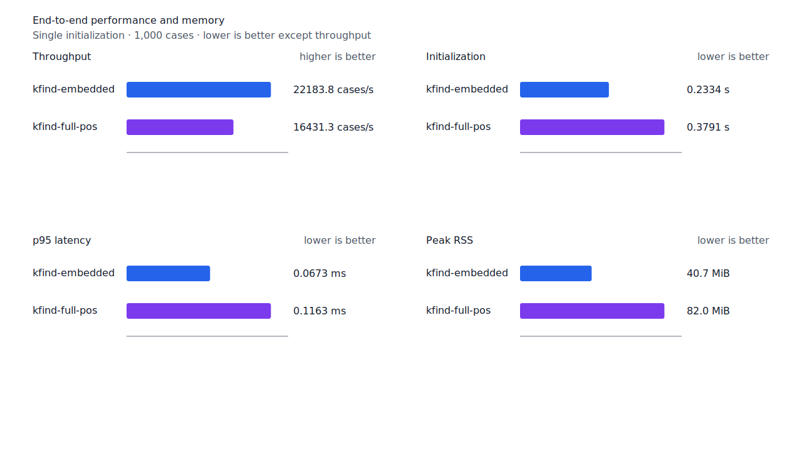
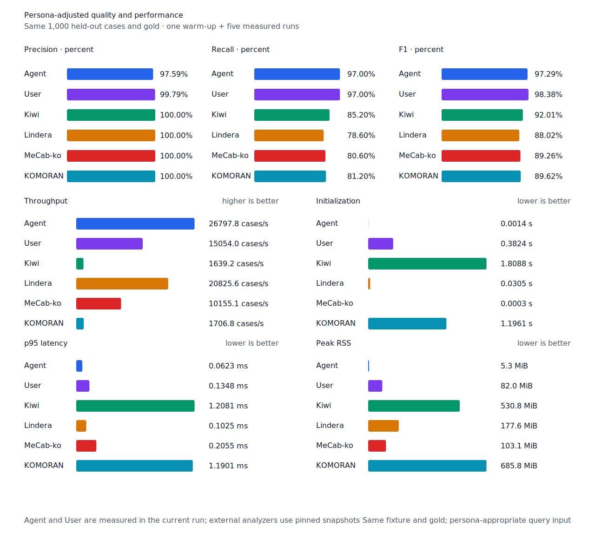

# 숫자 단위 뒤 의존명사 tail recall

- 측정일: 2026-07-17
- 최신 `origin/main` 및 기준 revision:
  `7bf893cc37aaae060b84490f06572d47328fd853`
- 후보 revision: `89639d43d5dbd7c2c357a319aa4945cb161974ca`
- 환경: Linux 6.12.76/linuxkit aarch64, 10 logical CPUs, Python 3.12.13,
  Rust 1.97.0, Docker 29.6.1
- 반복: fresh process warm-up 1회 뒤 5회 측정의 중앙값
- canonical test fixture:
  `933bc12197da866d2363d7df9107d4d9be89a65ddaafd73968ad5384832b21ff`
- canonical development fixture:
  `604c3a139854fcf59570392f48ab85028785f4a3561ea3c5e702f88b841f907c`
- explicit-POS matrix:
  `fbcce40b533655085ff8a4e9031559f99b54f86abe188b6ddc1d690dd44326c6`
- untagged matrix:
  `b9dd7601301fa19b35acba735a977eba7c56a0c9d67c65dee32db5c8028c71bb`
- development matrix:
  `bc67497c3dc966fb7453b238df52c6d781b1b4485d40e8a5d6a38104dcc7abed`
- hard-negative fixture:
  `f4d8829977ebfd061003724ee4aeb23b36dd901f6e46171c924a1f52a63f0ee5`
- 100 MiB corpus:
  `7692072cb7bff9261c1fa5933bde41b27e558170818eeac6d07cabdd673815ff`
- 기준 report SHA-256:
  `cb98a1ace7a517058ed100c4c79acc8e079b1270381885cb0f501073a35822d9`
- 후보 report SHA-256:
  `2f9049b705f5504bd3ad72fc8d66c93e8c30720108fca7c05946a75b37eef3d2`

## 원인과 규칙

기존 ASCII 숫자 경로는 숫자 바로 뒤의 `NNB/NNBC/NR` 단위와 선택적 조사만 하나의 완성
경로로 유지했다. `1년간`은 `년/NNBC` 뒤에 `간/NNB`가 남기 때문에 `간`을 구조 근거로
사용하지 못했고, `8시간쯤`과 `15층이상`은 단위 뒤 의존명사 tail 때문에 앞 단위도 token
끝까지 소비하지 못했다.

숫자 뒤 단위 prefix를 탐색할 때 정확한 `NNB/NNBC` node 하나와 선택적 조사 연쇄까지 같은
완성 경로로 보존한다. 같은 범위를 긴 단일 단위와 짧은 단위+tail이 모두 덮으면 단일 단위를
우선해 `10시간`을 `10시+간`으로 바꾸지 않는다. 단위와 tail 후보는 같은 prefix traversal에서
수집하므로 숫자 token마다 전체 graph scan을 한 번 더 추가하지 않는다.

일반 `NNG/NNP` tail과 node 경계를 가로지르는 후보는 열지 않는다. 따라서 `197명사→사`와
`소년→년`은 계속 거부한다. Matrix contract 정의, annotation과 gate는 변경하지 않았다.

## 품질과 contract 지표

`PNᶜ = TPᶜ + FNᶜ`다. Matrix의 reclassified case는 0건이라 strict와 contract-adjusted
confusion matrix가 같다. Canonical test와 development의 품질은 기준과 같고, canonical
embedded/full-POS/Human/Agent의 `FNᶜ`는 각각 53, 11, 15, 15다.

| matrix/profile | 기준 TPᶜ / FPᶜ / FNᶜ | 후보 TPᶜ / FPᶜ / FNᶜ | PNᶜ | recallᶜ | 모든 contract 질의 회수 |
| --- | ---: | ---: | ---: | ---: | ---: |
| test embedded `smart` | 1,264 / 5 / 137 | 1,265 / 5 / 136 | 1,401 | 90.22% → 90.29% | 344 → 345 / 468 |
| test full-POS `smart` | 1,349 / 5 / 52 | 1,350 / 5 / 51 | 1,401 | 96.29% → 96.36% | 419 → 420 / 468 |
| Human full-POS `smart` | 1,347 / 4 / 54 | 1,348 / 4 / 53 | 1,401 | 96.15% → 96.22% | 416 → 417 / 468 |
| Agent embedded `any` | 1,366 / 22 / 35 | 1,366 / 22 / 35 | 1,401 | 97.50% → 97.50% | 433 → 433 / 468 |
| development embedded `smart` | 1,234 / 7 / 157 | 1,236 / 7 / 155 | 1,391 | 88.71% → 88.86% | 327 → 329 / 466 |
| development full-POS `smart` | 1,291 / 8 / 100 | 1,293 / 8 / 98 | 1,391 | 92.81% → 92.95% | 373 → 375 / 466 |

Test의 세 smart profile은 `1년간→간`을 회수했다. Development의 두 explicit-POS profile은
`8시간쯤→시간`, `15층이상→층`을 회수했다. 기준과 후보의 failure record를 case ID와 예측
span으로 대조했으며 다른 이동은 없다.

Hard-negative 전체 결과도 같다. Embedded는 contract-adjusted
`TPᶜ 3 / FPᶜ 1 / TNᶜ 32 / FNᶜ 2`, full-POS는
`TPᶜ 5 / FPᶜ 1 / TNᶜ 32 / FNᶜ 0`이다. `numeric-unit` 7건은 두 profile 모두
`FPᶜ 0 / TNᶜ 7`이다.



## 성능

모든 morphology 행은 같은 환경에서 fresh process warm-up 1회 뒤 5회 측정한
`median [min, max]`다.

| workload | revision | initialization (s) | cases/s | p95 (ms) | RSS (KiB) |
| --- | --- | ---: | ---: | ---: | ---: |
| canonical embedded `smart` | 기준 | 0.233813 [0.233330, 0.238319] | 22,035.1 [21,692.5, 22,254.3] | 0.0678 [0.0671, 0.0693] | 41,664 [41,656, 41,668] |
| canonical embedded `smart` | 후보 | 0.233423 [0.232598, 0.240157] | 22,183.8 [21,485.9, 22,201.3] | 0.0673 [0.0668, 0.0706] | 41,664 [41,660, 41,672] |
| canonical full-POS `smart` | 기준 | 0.381219 [0.379874, 0.418981] | 16,119.6 [15,407.4, 16,787.5] | 0.1168 [0.1128, 0.1250] | 83,932 [83,868, 83,992] |
| canonical full-POS `smart` | 후보 | 0.379135 [0.377684, 0.394798] | 16,431.3 [15,791.8, 16,812.4] | 0.1163 [0.1116, 0.1257] | 83,932 [83,868, 83,960] |
| canonical Agent `any` | 기준 | 0.001425 [0.001412, 0.001446] | 26,824.0 [26,707.3, 26,912.5] | 0.0625 [0.0622, 0.0632] | 5,392 [5,384, 5,400] |
| canonical Agent `any` | 후보 | 0.001426 [0.001415, 0.001431] | 26,797.8 [26,524.0, 26,973.2] | 0.0623 [0.0612, 0.0632] | 5,388 [5,376, 5,392] |
| canonical Human `smart` | 기준 | 0.382458 [0.381807, 0.384590] | 15,181.9 [15,039.2, 15,277.8] | 0.1344 [0.1328, 0.1357] | 83,952 [83,888, 83,956] |
| canonical Human `smart` | 후보 | 0.385426 [0.382176, 0.388444] | 15,018.3 [14,842.9, 15,228.1] | 0.1343 [0.1336, 0.1370] | 83,952 [83,888, 83,956] |
| matrix Agent `any` | 기준 | 0.001487 [0.001403, 0.001521] | 27,674.4 [26,915.5, 27,727.0] | 0.0600 [0.0599, 0.0630] | 8,500 [8,496, 8,500] |
| matrix Agent `any` | 후보 | 0.001444 [0.001429, 0.001549] | 27,485.9 [26,756.6, 27,586.4] | 0.0603 [0.0599, 0.0635] | 8,496 [8,492, 8,500] |
| matrix Human `smart` | 기준 | 0.380559 [0.379077, 0.381371] | 15,828.7 [15,629.5, 15,997.6] | 0.1379 [0.1360, 0.1390] | 84,708 [84,684, 84,748] |
| matrix Human `smart` | 후보 | 0.379947 [0.378300, 0.386682] | 15,446.3 [14,733.4, 15,927.2] | 0.1385 [0.1358, 0.1464] | 84,740 [84,692, 84,752] |

중앙값 기준 canonical embedded/full-POS/Agent/Human cases/s 변화는 각각 +0.67%, +1.93%,
-0.10%, -1.08%다. Matrix Agent와 Human은 -0.68%, -2.42%다. 동일 explicit fixture의
무품사 User는 15,065.5→15,054.0 cases/s(-0.08%)다. 모든 morphology 변화는 10% 회귀
경고선 안이고 측정 범위가 겹친다.

100 MiB CLI 처리량은 Agent 5,029.47→5,718.89 MiB/s(+13.71%), Human
346.74→349.13 MiB/s(+0.69%)다. Agent 증가는 양쪽 측정 범위가 겹쳐 개선으로 판정하지 않는다.

동일 canonical fixture의 후보 Agent는 26,797.8 cases/s로 Lindera 4.0.0 고정 snapshot의
20,825.6 cases/s보다 28.68% 빠르다. recallᶜ는 97.0% 대 78.6%, peak RSS는
5.3 MiB 대 177.6 MiB다.





## 남은 FN

Test matrix full-POS의 `PNᶜ`는 1,401, `FNᶜ`는 51이고 Human `FNᶜ`는 53이다.
Development full-POS의 `PNᶜ`는 1,391, `FNᶜ`는 98이다. 숫자 단위 뒤 의존명사 tail에서
확인된 회수 대상은 모두 닫혔다.

한글 수사 연쇄는 `사십구억오천이백육십오만이천백팔십칠` 같은 긴 수의 정렬된 `NR`
component를 지원하지만 단위 크기 순서와 산술값을 검산하지 않는다. 이는 recall 경로와 분리한
precision 후보로 남긴다.

## 재현

```console
git switch --detach 89639d43d5dbd7c2c357a319aa4945cb161974ca
KFIND_MORPH_IMAGE=kfind-morph-benchmark:numeric-tail-candidate-89639d4 \
KFIND_MORPH_RUNS=5 \
scripts/benchmark-morphology.sh target/morph-numeric-tail-candidate-89639d4

git switch --detach 7bf893cc37aaae060b84490f06572d47328fd853
KFIND_MORPH_IMAGE=kfind-morph-benchmark:numeric-tail-base-7bf893c \
KFIND_MORPH_RUNS=5 \
scripts/benchmark-morphology.sh target/morph-numeric-tail-base-7bf893c

python3 tools/morph-compare/render_charts.py \
  target/morph-numeric-tail-candidate-89639d4/report.json \
  docs/benchmarks/assets \
  --prefix 2026-07-17-numeric-unit-dependent-tail-recall-

python3 tools/morph-compare/export_site_snapshot.py \
  target/morph-numeric-tail-candidate-89639d4/report.json \
  docs/benchmarks/site-morphology.json \
  --revision 89639d43d5dbd7c2c357a319aa4945cb161974ca
```

외부 분석기 snapshot은 fixture, adapter schema와 고정 버전·설정이 바뀌지 않아 갱신하지
않았다.
