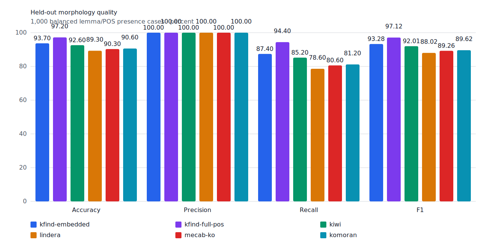
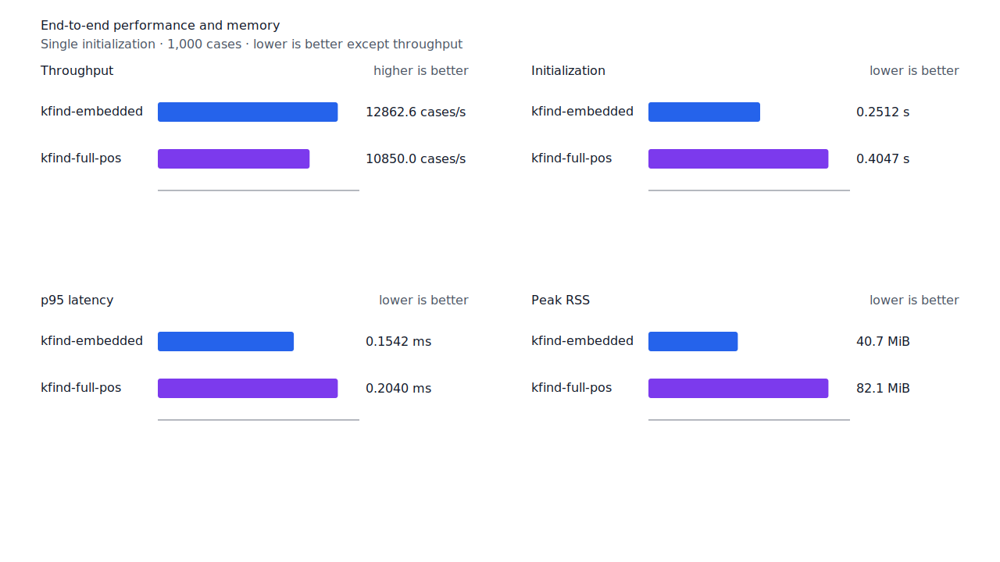
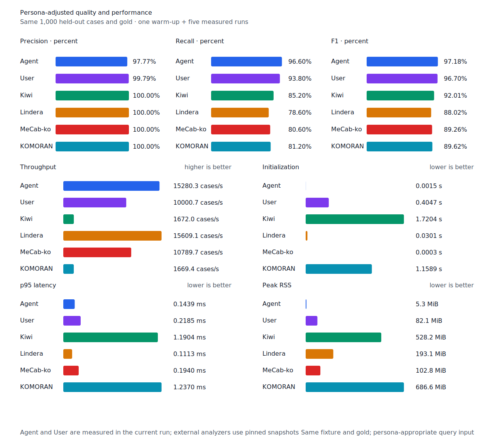

# 숫자 뒤 단위 구조 recall

- 측정일: 2026-07-17
- 기준 revision: `de30936c662e7406b98496eb9d2f7241633ec2a6`
- 후보 revision: `cdfd10fc397a420a7501cc65aa5dfb6cb7941908`
- 환경: Linux 6.12.76/aarch64, 10 logical CPUs, Python 3.12.13, Rust 1.97.0,
  Docker 29.6.1
- 반복: fresh process 1회 warm-up 뒤 5회 측정의 중앙값
- test fixture: `933bc12197da866d2363d7df9107d4d9be89a65ddaafd73968ad5384832b21ff`
- development fixture: `604c3a139854fcf59570392f48ab85028785f4a3561ea3c5e702f88b841f907c`
- hard-negative fixture: `d427f65731dee8954cdefd2730a2c583e3ffe300f57b7dc004230da4c1027ff1`
- 무품사 fixture: `94ccd70a093ee7af8435371b2ffdb81534ec97e29ada705ea72c940938d0c592`
- 100 MiB corpus: `7692072cb7bff9261c1fa5933bde41b27e558170818eeac6d07cabdd673815ff`
- 기준 report SHA-256: `8bc5b41a18751149bd92d2d41ed717e466fc4357698c7a45ae741457156cd70a`
- 후보 report SHA-256: `65fc637be365562ba39984917daf670d05fe4c2a718928e549e4e0dd4302d4fd`

## 규칙

token 선두의 ASCII 숫자 연속과 바로 뒤의 source `NNB`, `NNBC`, `NR` 단위를 하나의 typed
구조로 판정한다. 단위 뒤에는 token 끝이나 완성된 조사 연쇄만 허용한다. query pattern도 단위
span과 정렬된 의존명사 또는 수사여야 한다. 일반 숫자+명사, unknown node와 한글 수사 연쇄는
열지 않는다.

일반 token에서는 숫자 구조의 graph 분기와 `NNBC` 변환을 실행하지 않는다. 숫자로 시작하는
token만 별도 수집 경로로 보내고, 나머지는 const-specialized 공통 경로를 사용한다.

## 품질

| fixture/profile | 기준 TP / FP / FN | 후보 TP / FP / FN | 기준 recall | 후보 recall |
| --- | ---: | ---: | ---: | ---: |
| development embedded `smart` | 447 / 4 / 53 | 450 / 4 / 50 | 89.4% | 90.0% |
| development full-POS `smart` | 456 / 4 / 44 | 459 / 4 / 41 | 91.2% | 91.8% |
| test embedded `smart` | 435 / 0 / 65 | 437 / 0 / 63 | 87.0% | 87.4% |
| test full-POS `smart` | 470 / 0 / 30 | 472 / 0 / 28 | 94.0% | 94.4% |
| Human full-POS `smart` | 467 / 1 / 33 | 469 / 1 / 31 | 93.4% | 93.8% |
| Agent embedded `any` | 483 / 11 / 17 | 483 / 11 / 17 | 96.6% | 96.6% |

development full-POS precision은 99.13%에서 99.14%로 유지됐다. test full-POS precision은
100%다. 신규 `numeric-unit` hard-negative 4건은 embedded와 full-POS 모두 strict FP 0이며,
기존 hard-negative의 판정도 변하지 않았다.

development에서 복구한 case는 세 건이다.

| query | gold surface | 구조 근거 |
| --- | --- | --- |
| `num:천` | `4천` | ASCII 숫자 + `NR` |
| `n:년` | `2014년` | ASCII 숫자 + `NNBC` |
| `n:명` | `197명이` | ASCII 숫자 + `NNBC` + `JKS` |

고정 test에서는 `27일`의 `n:일`과 `100억`의 `num:억`을 복구했다. `소년`, `추천`, `익명이`,
`197명사`는 계속 거부한다.



## 성능

기존 report와 현재 실행 환경의 차이를 배제하기 위해 기준과 후보를 같은 benchmark lock에서
새로 측정했다. 각 값은 5회 중앙값이며 증감은 기준 대비 후보다.

| workload | metric | 기준 | 후보 | 증감 |
| --- | --- | ---: | ---: | ---: |
| embedded `smart` | initialization | 0.242666 s | 0.251236 s | +3.53% |
| embedded `smart` | cases/s | 13,783.1 | 12,862.6 | -6.68% |
| embedded `smart` | p95 | 0.1444 ms | 0.1542 ms | +6.79% |
| embedded `smart` | peak RSS | 41,720 KiB | 41,720 KiB | 0.00% |
| full-POS `smart` | initialization | 0.414271 s | 0.404732 s | -2.30% |
| full-POS `smart` | cases/s | 10,909.1 | 10,850.0 | -0.54% |
| full-POS `smart` | p95 | 0.2058 ms | 0.2040 ms | -0.87% |
| full-POS `smart` | peak RSS | 84,044 KiB | 84,044 KiB | 0.00% |
| Agent `any` | cases/s | 15,530.9 | 15,280.3 | -1.61% |
| Human `smart` | cases/s | 10,083.3 | 10,062.2 | -0.21% |
| Agent 100 MiB CLI | throughput | 5,382.66 MiB/s | 4,906.07 MiB/s | -8.85% |
| Human 100 MiB CLI | throughput | 328.84 MiB/s | 317.09 MiB/s | -3.57% |

모든 변화는 10% 경고선 안이다. Agent는 동일 explicit-POS fixture의 Lindera 4.0.0 고정
snapshot 15,609.1 cases/s보다 2.11% 느리다. recall은 96.6% 대 78.6%, peak RSS는
5.3 MiB 대 193.1 MiB다.





## 남은 FN

development full-POS FN은 41건이다. `boundary-rejected` 29건, `surface-missing` 6건,
`span-mismatch` 4건, `lexicon-missing` 2건이다. 남은 수사 세 건은 `수십만`, `십일월`,
`백명`이다. 다음 작업은 완성된 `NR` 연쇄와 뒤따르는 단위 POS를 함께 증명하는 typed path를
검토한다. `5천톤`, `6백미터`처럼 ASCII 숫자 뒤 수사와 일반 단위명사가 이어지는 형태는 이
규칙과 분리한다.

## 재현

```console
git switch --detach de30936c662e7406b98496eb9d2f7241633ec2a6
KFIND_MORPH_IMAGE=kfind-morph-benchmark:numeric-current-baseline \
KFIND_MORPH_RUNS=5 \
scripts/benchmark-morphology.sh target/morph-numeric-current-baseline

git switch --detach cdfd10fc397a420a7501cc65aa5dfb6cb7941908
KFIND_MORPH_IMAGE=kfind-morph-benchmark:numeric-unit-fast-path \
KFIND_MORPH_RUNS=5 \
scripts/benchmark-morphology.sh target/morph-numeric-unit-fast-path

python3 tools/morph-compare/render_charts.py \
  target/morph-numeric-unit-fast-path/report.json docs/benchmarks/assets \
  --prefix 2026-07-17-numeric-unit-recall-

python3 tools/morph-compare/export_site_snapshot.py \
  target/morph-numeric-unit-fast-path/report.json docs/benchmarks/site-morphology.json \
  --revision cdfd10fc397a
```

외부 분석기 snapshot은 fixture, adapter schema와 고정 버전·설정이 바뀌지 않아 갱신하지
않았다.
