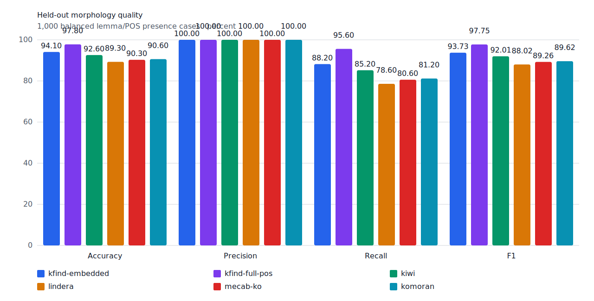
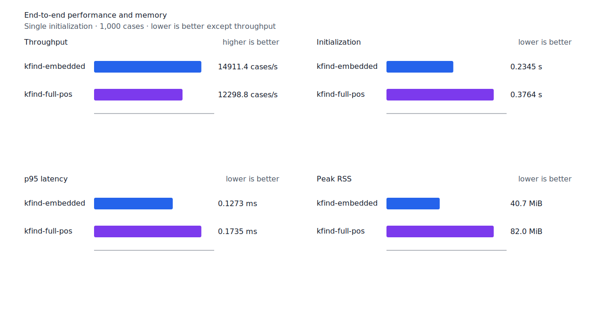
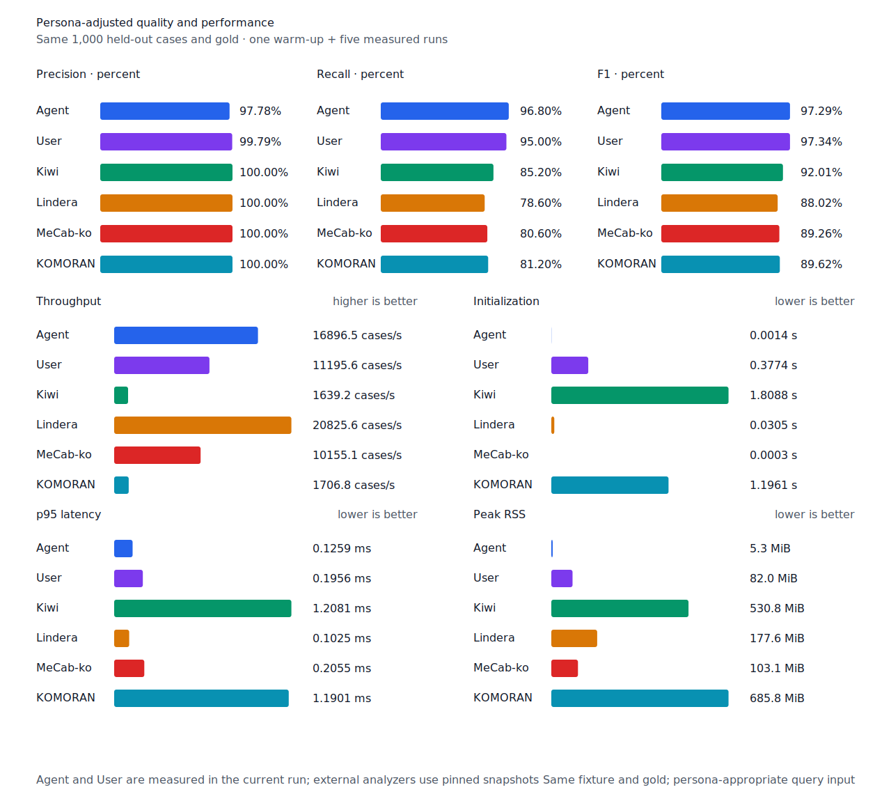

# source 어미 경로 recall

- 측정일: 2026-07-17
- 기준 revision: `00c87b0e31865de7a70612013549f820b9df87bb`
- 후보 revision: `1890643c20ac786e4b44f76e929471652cd6c996`
- 환경: Linux 6.12.76/linuxkit aarch64, 10 logical CPUs, Python 3.12.13,
  Rust 1.97.0, Docker 29.6.1
- 반복: fresh process warm-up 1회 뒤 5회 측정의 중앙값
- canonical test fixture:
  `933bc12197da866d2363d7df9107d4d9be89a65ddaafd73968ad5384832b21ff`
- canonical development fixture:
  `604c3a139854fcf59570392f48ab85028785f4a3561ea3c5e702f88b841f907c`
- explicit-POS matrix:
  `fbcce40b533655085ff8a4e9031559f99b54f86abe188b6ddc1d690dd44326c6`
- untagged matrix:
  `b9dd7601301fa19b35acba735a977eba7c56a0c9d67c65dee32db5c8028c71bb`
- development matrix:
  `bc67497c3dc966fb7453b238df52c6d781b1b4485d40e8a5d6a38104dcc7abed`
- 기준 hard-negative fixture:
  `ae504aff331d4dbb8837198d607d19b31e85424535e960b1f5c608d270ed8a2e`
- 후보 hard-negative fixture:
  `bceb92a0790686a283441b613d505b98b9d770863c428e2a5f4c2b2a92fc6e84`
- 100 MiB corpus:
  `7692072cb7bff9261c1fa5933bde41b27e558170818eeac6d07cabdd673815ff`
- 기준 report SHA-256:
  `7a07e5b59a9744460c345a2080fde1ea55a26fe4c06cf9c7f6b860e58c43f7ff`
- 후보 report SHA-256:
  `57a15911927a2d37cf45a95ce5098999253151a8ad97e4d59950b07fc10337e3`

## 규칙

Generator branch가 어휘 교체형과 일부 어미만 소비한 뒤 token 내부에 멈추면, 같은 predicate
품사의 source component가 query core부터 token 끝까지 `EP/EC/EF/ETM/ETN`으로 완성되는지
검증한다. 일반 용언은 core가 token 왼쪽 경계에서 시작하고 continuation state가 non-terminal일
때만 이 경로를 사용한다. token 전체에 `MM/MAG/MAJ` 분석이 있거나 남은 suffix가 조사
allomorph로 시작하면 거부한다. 지정사의 기존 체언 host 조건은 유지한다.

따라서 `왔으니까`, `왔었다`, `싸웠으나`, `바꾸었음을`은 source 어미 경로로 복구하지만
`왔다를`, `왔다는`, `만들려` 안의 `말다`, `미친다` 안의 `치다`, 동사 `한다` 안의 형용사
`하다`는 열지 않는다. Matrix contract 정의, annotation과 gate는 변경하지 않았다.

## Canonical 품질과 contract 지표

`PNᶜ`는 contract-positive 분모 `TPᶜ + FNᶜ`다. Canonical fixture에는 strict gold와 다른
contract-positive가 없으므로 각 1,000-case 평가의 `PNᶜ`는 500이다.

| fixture/profile | 기준 TPᶜ / FPᶜ / FNᶜ | 후보 TPᶜ / FPᶜ / FNᶜ | PNᶜ | recallᶜ |
| --- | ---: | ---: | ---: | ---: |
| development embedded `smart` | 452 / 4 / 48 | 452 / 4 / 48 | 500 | 90.4% → 90.4% |
| development full-POS `smart` | 461 / 4 / 39 | 462 / 4 / 38 | 500 | 92.2% → 92.4% |
| test embedded `smart` | 441 / 0 / 59 | 441 / 0 / 59 | 500 | 88.2% → 88.2% |
| test full-POS `smart` | 476 / 0 / 24 | 478 / 0 / 22 | 500 | 95.2% → 95.6% |
| Human full-POS `smart` | 473 / 1 / 27 | 475 / 1 / 25 | 500 | 94.6% → 95.0% |
| Agent embedded `any` | 484 / 11 / 16 | 484 / 11 / 16 | 500 | 96.8% → 96.8% |

Test full-POS와 Human은 `싸웠으나`, `바꾸었음을` 2건을 복구했다. Development full-POS는
`좋았을텐데요` 1건을 복구했다. Embedded와 Agent는 이 full-POS source 경로를 사용하지 않아
변하지 않았다. 후보 hard-negative 37건 중 신규 `문서에는 왔다를 적었다.`는 embedded와
full-POS에서 모두 거부했고, 기존 36건의 예측도 변하지 않았다.



## Query matrix strict·contract-adjusted 품질

현재 matrix의 reclassified case는 0건이므로 strict와 contract-adjusted confusion matrix가
같다. 두 지표 family는 report의 별도 필드로 검증했다. Test matrix의 `PNᶜ=1,401`,
development matrix의 `PNᶜ=1,391`이다.

| fixture/profile | 기준 TPᶜ / FPᶜ / FNᶜ | 후보 TPᶜ / FPᶜ / FNᶜ | PNᶜ | recallᶜ | 모든 contract 질의 회수 |
| --- | ---: | ---: | ---: | ---: | ---: |
| development embedded `smart` | 1,218 / 7 / 173 | 1,219 / 7 / 172 | 1,391 | 87.56% → 87.63% | — |
| development full-POS `smart` | 1,263 / 8 / 128 | 1,265 / 8 / 126 | 1,391 | 90.80% → 90.94% | — |
| test embedded `smart` | 1,248 / 5 / 153 | 1,248 / 5 / 153 | 1,401 | 89.08% → 89.08% | 329 → 329 / 468 |
| test full-POS `smart` | 1,312 / 5 / 89 | 1,319 / 5 / 82 | 1,401 | 93.65% → 94.15% | 384 → 390 / 468 |
| Human full-POS `smart` | 1,314 / 4 / 87 | 1,321 / 4 / 80 | 1,401 | 93.79% → 94.29% | 384 → 390 / 468 |
| Agent embedded `any` | 1,363 / 21 / 38 | 1,363 / 21 / 38 | 1,401 | 97.29% → 97.29% | 430 → 430 / 468 |

Test full-POS와 Human은 다음 7건을 복구했다.

- `없겠으며`의 `없다`
- `바빠셔서`의 `바쁘다`
- `왔으니까`와 `왔었다`의 `오다`
- `싸웠으나`의 `싸우다`
- `바꾸었음을`의 `바꾸다`
- `좋겠어`의 `좋다`

한 문장 안의 다른 질의 누락이 함께 해소된 결과 완전 회수 문장은 6개 늘었다. Agent는
기준에서도 일곱 건을 회수했다. Development matrix는 embedded 1건, full-POS 2건을 추가
회수했다. 새 strict FP·FPᶜ와 회귀는 없다.

## 성능

모든 morphology 행은 같은 환경에서 fresh process warm-up 1회 뒤 5회 측정한
`median [min, max]`다. 모든 변화는 10% 경고선 안이다.

| workload | revision | initialization (s) | cases/s | p95 (ms) | RSS (KiB) |
| --- | --- | ---: | ---: | ---: | ---: |
| canonical embedded `smart` | 기준 | 0.233119 [0.232579, 0.234586] | 14,914.6 [14,241.5, 14,969.6] | 0.1279 [0.1268, 0.1371] | 41,720 [41,712, 41,720] |
| canonical embedded `smart` | 후보 | 0.234518 [0.232715, 0.245073] | 14,911.4 [14,156.0, 15,025.8] | 0.1273 [0.1242, 0.1391] | 41,724 [41,720, 41,728] |
| canonical full-POS `smart` | 기준 | 0.376456 [0.373496, 0.389904] | 12,287.7 [12,198.7, 12,354.4] | 0.1742 [0.1718, 0.1753] | 83,980 [83,972, 83,980] |
| canonical full-POS `smart` | 후보 | 0.376415 [0.374107, 0.387229] | 12,298.8 [11,886.3, 12,346.8] | 0.1735 [0.1727, 0.1789] | 83,980 [83,964, 83,984] |
| canonical Human `smart` | 기준 | 0.377951 [0.374520, 0.379179] | 11,351.6 [10,898.2, 11,400.1] | 0.1925 [0.1921, 0.1998] | 84,000 [83,988, 84,004] |
| canonical Human `smart` | 후보 | 0.376198 [0.374961, 0.394306] | 11,285.3 [10,398.5, 11,321.0] | 0.1945 [0.1923, 0.2121] | 84,004 [83,992, 84,004] |
| matrix Agent `any` | 기준 | 0.001471 [0.001464, 0.001518] | 17,413.1 [17,356.2, 17,448.6] | 0.1225 [0.1222, 0.1230] | 8,552 [8,548, 8,556] |
| matrix Agent `any` | 후보 | 0.001436 [0.001409, 0.001514] | 17,373.7 [17,121.9, 17,446.0] | 0.1228 [0.1217, 0.1255] | 8,488 [8,472, 8,492] |
| matrix Human `smart` | 기준 | 0.374803 [0.373371, 0.381052] | 11,582.1 [9,026.0, 11,817.3] | 0.1950 [0.1926, 0.3078] | 84,728 [84,716, 84,732] |
| matrix Human `smart` | 후보 | 0.378367 [0.373810, 0.431747] | 11,569.8 [10,985.2, 11,717.4] | 0.1983 [0.1956, 0.2080] | 84,728 [84,712, 84,732] |

중앙값 기준 canonical embedded/full-POS/Human cases/s 변화는 각각 -0.02%, +0.09%,
-0.58%다. Canonical Agent는 16,883.3→16,896.5 cases/s(+0.08%), matrix Agent는 -0.23%,
matrix Human은 -0.11%다. 100 MiB CLI 처리량은 Agent
5,858.25→5,433.70 MiB/s(-7.25%), Human 350.95→348.92 MiB/s(-0.58%)다. Agent CLI는
변경 경로를 실행하지 않으며 run 범위가 겹치므로 회귀로 판정하지 않았다.

동일 canonical fixture의 후보 Agent는 16,896.5 cases/s로 Lindera 4.0.0 snapshot
20,825.6 cases/s보다 18.87% 느리다. Recall은 96.8% 대 78.6%, peak RSS는 5.3 MiB 대
177.6 MiB다. 이 recall slice에서는 Lindera 처리량 격차를 줄이지 않았다. 후속 성능 작업은
프로파일에서 큰 비중을 차지하는 평가 경로만 대상으로 한다.





## 남은 FN

Canonical test full-POS의 `PNᶜ`는 500, `FNᶜ`는 22다. Matrix full-POS의 `PNᶜ`는
1,401, `FNᶜ`는 82다. 가장 큰 동일 질의 묶음은 동사 `지다` 4건이다. `오다`와 동사
`있다`는 각각 3건이며, `오다`는 이번 source 어미 경로로 5건 중 2건을 복구했다.

다음 recall 작업은 `지다` 4건을 case-level로 다시 분류한다. 보조용언·피동/결과 구조와
동음이의 독립 동사를 섞지 않고 공통 구조가 확인될 때만 제품 규칙을 연다.

## 재현

```console
git switch --detach 00c87b0e31865de7a70612013549f820b9df87bb
KFIND_MORPH_IMAGE=kfind-morph-benchmark:predicate-ending-base-00c87b0 \
KFIND_MORPH_RUNS=5 \
scripts/benchmark-morphology.sh target/morph-predicate-ending-base-00c87b0

git switch --detach 1890643c20ac786e4b44f76e929471652cd6c996
KFIND_MORPH_IMAGE=kfind-morph-benchmark:predicate-ending-candidate-1890643 \
KFIND_MORPH_RUNS=5 \
scripts/benchmark-morphology.sh target/morph-predicate-ending-candidate-1890643

python3 tools/morph-compare/render_charts.py \
  target/morph-predicate-ending-candidate-1890643/report.json docs/benchmarks/assets \
  --prefix 2026-07-17-predicate-ending-path-recall-

python3 tools/morph-compare/export_site_snapshot.py \
  target/morph-predicate-ending-candidate-1890643/report.json \
  docs/benchmarks/site-morphology.json \
  --revision 1890643c20ac786e4b44f76e929471652cd6c996
```

외부 분석기 snapshot은 고정 버전·설정과 같은 canonical fixture를 사용했다.
