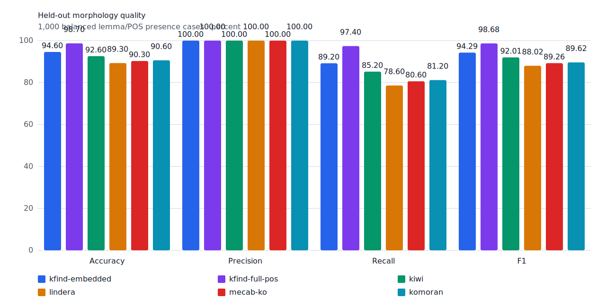
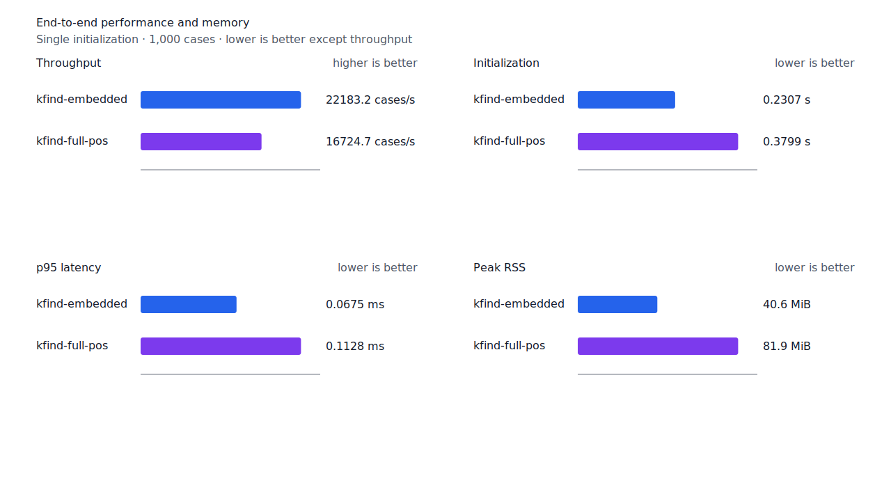
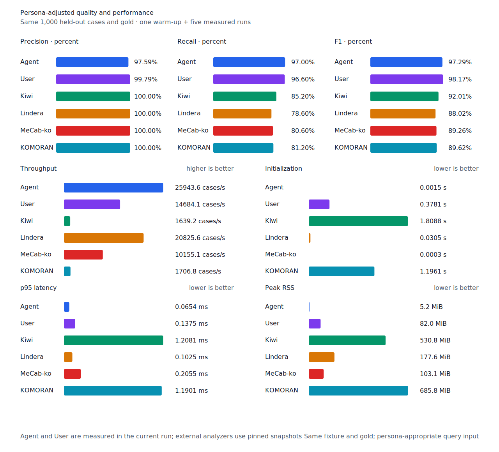

# 대명사 축약 표면 recall

- 측정일: 2026-07-17
- 최신 `origin/main` 및 기준 revision:
  `0f1f59a2a7f3e9d1aed8e075da5cb2a05c65294a`
- 후보 revision: `63902a5b19d835e2b880c8aa798aa2d08e5b464d`
- 환경: Linux 6.12.76/linuxkit aarch64, 10 logical CPUs, Python 3.12.13,
  Rust 1.97.0, Docker 29.6.1
- 반복: fresh process warm-up 1회 뒤 5회 측정의 중앙값
- canonical test fixture:
  `933bc12197da866d2363d7df9107d4d9be89a65ddaafd73968ad5384832b21ff`
- canonical development fixture:
  `604c3a139854fcf59570392f48ab85028785f4a3561ea3c5e702f88b841f907c`
- explicit-POS matrix:
  `fbcce40b533655085ff8a4e9031559f99b54f86abe188b6ddc1d690dd44326c6`
- untagged matrix:
  `b9dd7601301fa19b35acba735a977eba7c56a0c9d67c65dee32db5c8028c71bb`
- development matrix:
  `bc67497c3dc966fb7453b238df52c6d781b1b4485d40e8a5d6a38104dcc7abed`
- hard-negative fixture:
  `f4d8829977ebfd061003724ee4aeb23b36dd901f6e46171c924a1f52a63f0ee5`
- 100 MiB corpus:
  `7692072cb7bff9261c1fa5933bde41b27e558170818eeac6d07cabdd673815ff`
- 기준 report SHA-256:
  `b30c5a2a6a03d4b02c9ff5a76967820b66392838ee4d3a84381d491cad14be6a`
- 후보 report SHA-256:
  `c2a48d2bea74add4b0b0051687fe9cdb8a313195a1389578a73056a9d50dfd4d`

## 원인과 규칙

기존 대명사 override에는 `나+가→내가`, `너+가→네가`, `저+가→제가`만 있었다. 따라서
`누구+가→누가`와 속격 축약 `저+의→제`를 생성하지 못했다. 주격 override는 기본 조사 결합을
교체하지만 `저의`와 `제`는 모두 표준이므로 속격 override는 기본 결합을 보존하는 alias로
분리했다.

`누구`에 주격 `누가`, `저`에 속격 `제`를 추가했다. Query compiler는
`particle.genitive` alias만 기본 조사 branch를 막지 않는다. 기존 `누구를`, `저의`와
주격 replacement의 거부 계약을 함께 회귀 검사한다. Matrix contract 정의, annotation과
gate는 변경하지 않았다.

## Canonical 품질과 contract 지표

`PNᶜ`는 contract-positive 분모 `TPᶜ + FNᶜ`다. Canonical fixture의 `PNᶜ`는 500이며
reclassified case는 0건이다.

| fixture/profile | 기준 TPᶜ / FPᶜ / FNᶜ | 후보 TPᶜ / FPᶜ / FNᶜ | PNᶜ | recallᶜ |
| --- | ---: | ---: | ---: | ---: |
| development embedded `smart` | 455 / 4 / 45 | 455 / 4 / 45 | 500 | 91.0% → 91.0% |
| development full-POS `smart` | 468 / 4 / 32 | 468 / 4 / 32 | 500 | 93.6% → 93.6% |
| test embedded `smart` | 445 / 0 / 55 | 446 / 0 / 54 | 500 | 89.0% → 89.2% |
| test full-POS `smart` | 486 / 0 / 14 | 487 / 0 / 13 | 500 | 97.2% → 97.4% |
| Human full-POS `smart` | 482 / 1 / 18 | 483 / 1 / 17 | 500 | 96.4% → 96.6% |
| Agent embedded `any` | 484 / 11 / 16 | 485 / 12 / 15 | 500 | 96.8% → 97.0% |

Test의 모든 profile은 `누구→누가` 1건을 회수했다. Smart profile의 FP와 FPᶜ는 변하지
않았다. Agent `any`는 같은 positive를 회수했지만 paired negative의 `체제`와 `경제` 안에
있는 `제`도 속격 축약 후보로 잡아 한 case가 `TNᶜ→FPᶜ`로 이동했다. 두 위치의 smart
lattice 판정은 모두 reject다. Agent precision은 97.78%→97.59%, F1은 97.29%로 같고
FNᶜ는 16→15다.

Hard-negative도 기준과 후보가 모두 strict `FP 6 / TN 32`, contract-adjusted
`TPᶜ 5 / FPᶜ 1 / TNᶜ 32 / FNᶜ 0`이다.



## Query matrix strict·contract-adjusted 품질

현재 matrix의 reclassified case는 0건이므로 strict와 contract-adjusted confusion matrix가
같다. Test matrix의 `PNᶜ=1,401`, development matrix의 `PNᶜ=1,391`이다.

| fixture/profile | 기준 TPᶜ / FPᶜ / FNᶜ | 후보 TPᶜ / FPᶜ / FNᶜ | PNᶜ | recallᶜ | 모든 contract 질의 회수 |
| --- | ---: | ---: | ---: | ---: | ---: |
| development embedded `smart` | 1,230 / 7 / 161 | 1,233 / 7 / 158 | 1,391 | 88.43% → 88.64% | 324 → 326 / 466 |
| development full-POS `smart` | 1,287 / 8 / 104 | 1,290 / 8 / 101 | 1,391 | 92.52% → 92.74% | 370 → 372 / 466 |
| test embedded `smart` | 1,258 / 5 / 143 | 1,261 / 5 / 140 | 1,401 | 89.79% → 90.01% | 338 → 341 / 468 |
| test full-POS `smart` | 1,341 / 5 / 60 | 1,344 / 5 / 57 | 1,401 | 95.72% → 95.93% | 411 → 414 / 468 |
| Human full-POS `smart` | 1,339 / 4 / 62 | 1,342 / 4 / 59 | 1,401 | 95.57% → 95.79% | 408 → 411 / 468 |
| Agent embedded `any` | 1,363 / 21 / 38 | 1,366 / 22 / 35 | 1,401 | 97.29% → 97.50% | 430 → 433 / 468 |

Test matrix의 smart profile은 `제 생각`, `제 전공`, `누가 당선` 3건을 회수했다. 새 smart
FP·FPᶜ와 회귀는 없다. Agent `any`도 세 건을 회수했고 canonical과 같은 paired negative 한
case가 `TNᶜ→FPᶜ`로 이동했다. Precision은 98.48%→98.41%, recallᶜ는
97.29%→97.50%, F1은 97.88%→97.96%다.

## 성능

모든 morphology 행은 같은 환경에서 fresh process warm-up 1회 뒤 5회 측정한
`median [min, max]`다. 모든 변화는 10% 회귀 경고선 안이다.

| workload | revision | initialization (s) | cases/s | p95 (ms) | RSS (KiB) |
| --- | --- | ---: | ---: | ---: | ---: |
| canonical embedded `smart` | 기준 | 0.232868 [0.232587, 0.235365] | 21,986.6 [20,616.5, 22,359.0] | 0.0675 [0.0671, 0.0736] | 41,600 [41,584, 41,600] |
| canonical embedded `smart` | 후보 | 0.230679 [0.229745, 0.240991] | 22,183.2 [22,012.8, 22,326.1] | 0.0675 [0.0672, 0.0680] | 41,600 [41,592, 41,604] |
| canonical full-POS `smart` | 기준 | 0.378957 [0.375475, 0.381850] | 16,836.2 [16,524.3, 17,019.9] | 0.1118 [0.1102, 0.1147] | 83,960 [83,928, 83,964] |
| canonical full-POS `smart` | 후보 | 0.379895 [0.376709, 0.385472] | 16,724.7 [15,793.6, 16,954.2] | 0.1128 [0.1097, 0.1203] | 83,872 [83,852, 83,932] |
| canonical Agent `any` | 기준 | 0.001427 [0.001405, 0.001459] | 26,838.6 [26,578.4, 26,871.1] | 0.0620 [0.0616, 0.0633] | 5,328 [5,308, 5,340] |
| canonical Agent `any` | 후보 | 0.001515 [0.001439, 0.001612] | 25,943.6 [25,808.9, 26,216.6] | 0.0654 [0.0642, 0.0662] | 5,328 [5,308, 5,336] |
| canonical Human `smart` | 기준 | 0.378977 [0.377803, 0.433773] | 15,295.7 [14,394.0, 15,411.3] | 0.1320 [0.1315, 0.1384] | 83,980 [83,976, 84,008] |
| canonical Human `smart` | 후보 | 0.375146 [0.373980, 0.379953] | 14,100.7 [13,645.0, 15,217.7] | 0.1421 [0.1332, 0.1486] | 83,980 [83,976, 83,988] |
| matrix Agent `any` | 기준 | 0.001448 [0.001423, 0.001605] | 27,423.5 [26,697.1, 27,489.7] | 0.0607 [0.0604, 0.0630] | 8,432 [8,424, 8,432] |
| matrix Agent `any` | 후보 | 0.001515 [0.001427, 0.001700] | 27,425.9 [26,796.1, 27,611.8] | 0.0609 [0.0601, 0.0621] | 8,436 [8,432, 8,440] |
| matrix Human `smart` | 기준 | 0.383111 [0.377354, 0.386781] | 15,660.7 [14,911.7, 16,045.1] | 0.1375 [0.1343, 0.1455] | 84,708 [84,696, 84,712] |
| matrix Human `smart` | 후보 | 0.374382 [0.373950, 0.386580] | 15,511.3 [14,845.5, 16,051.3] | 0.1384 [0.1348, 0.1456] | 84,708 [84,700, 84,712] |

중앙값 기준 canonical embedded/full-POS/Agent/Human cases/s 변화는 각각 +0.89%, -0.66%,
-3.33%, -7.81%다. Matrix Agent와 Human은 각각 +0.01%, -0.95%다. 100 MiB CLI 처리량은
Agent 5,897.05→5,817.14 MiB/s(-1.36%), Human 351.79→352.21 MiB/s(+0.12%)다.

동일 canonical fixture의 후보 Agent는 25,943.6 cases/s로 Lindera 4.0.0 고정 snapshot의
20,825.6 cases/s보다 24.58% 빠르다. recallᶜ는 97.0% 대 78.6%, peak RSS는
5.2 MiB 대 177.6 MiB다.





## 남은 FN

Canonical test full-POS의 `PNᶜ`는 500, `FNᶜ`는 13이다. Matrix full-POS의 `PNᶜ`는
1,401, `FNᶜ`는 57이다. 가장 큰 동일 질의 묶음인 부사 `안` 3건과 형용사 `이다` 3건은
비표준 붙여쓰기·축약·표기다.

남은 표준형인 `오다→온지를`는 생성 후보가 adnominal `온`까지 도달한 뒤 nominalizer와
조사를 남기는 구조다. 다음 작업은 hard-negative의 `nominalizer-particle` slice와 함께 source
`용언 + ETM + NNB/NNG + J*` 경로를 검증한다.

## 재현

```console
git switch --detach 0f1f59a2a7f3e9d1aed8e075da5cb2a05c65294a
KFIND_MORPH_IMAGE=kfind-morph-benchmark:pronoun-surface-base-0f1f59a \
KFIND_MORPH_RUNS=5 \
scripts/benchmark-morphology.sh target/morph-pronoun-surface-base-0f1f59a

git switch --detach 63902a5b19d835e2b880c8aa798aa2d08e5b464d
KFIND_MORPH_IMAGE=kfind-morph-benchmark:pronoun-surface-candidate-63902a5 \
KFIND_MORPH_RUNS=5 \
scripts/benchmark-morphology.sh target/morph-pronoun-surface-candidate-63902a5

python3 tools/morph-compare/render_charts.py \
  target/morph-pronoun-surface-candidate-63902a5/report.json \
  docs/benchmarks/assets \
  --prefix 2026-07-17-pronoun-surface-recall-

python3 tools/morph-compare/export_site_snapshot.py \
  target/morph-pronoun-surface-candidate-63902a5/report.json \
  docs/benchmarks/site-morphology.json \
  --revision 63902a5b19d835e2b880c8aa798aa2d08e5b464d
```

외부 분석기 snapshot은 fixture, adapter schema와 고정 버전·설정이 바뀌지 않아 갱신하지
않았다.
