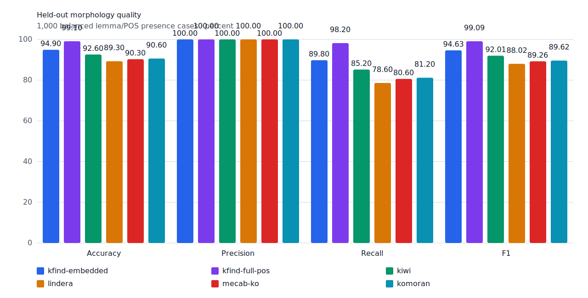
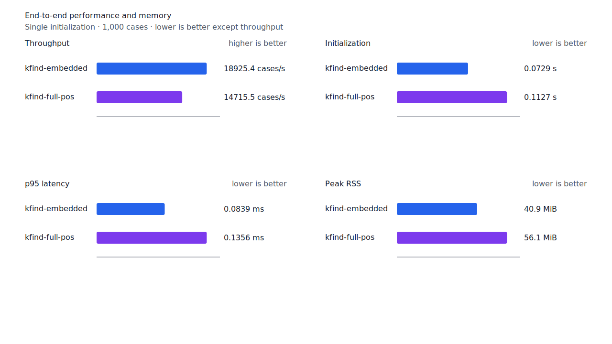
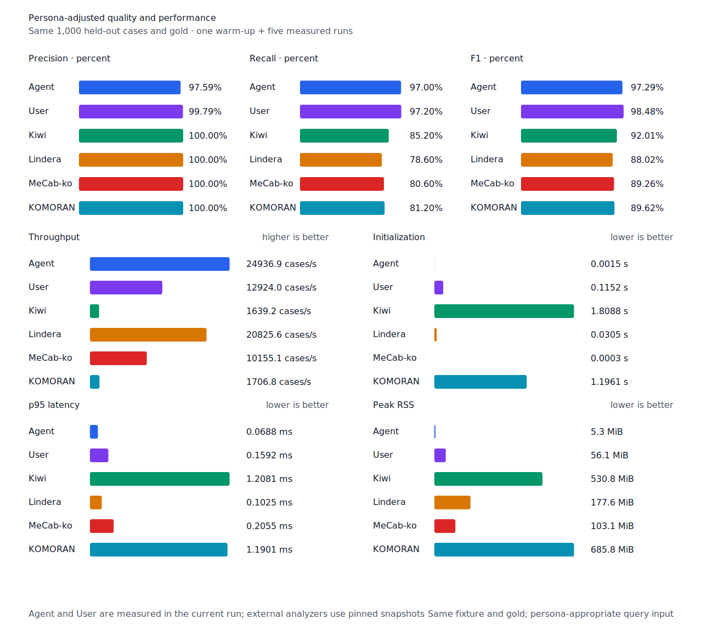

# 전망 종결형 `-(으)리라` recall

- 측정일: 2026-07-17
- 최신 `origin/main` 및 기준 revision:
  `99cbb978b4b5b6c3d0e48cc69081159e5284a89f`
- 후보 revision: `c83f31f5a3f52e8e22599cd4941ff76f6d13f492`
- 환경: Linux 6.12.76/linuxkit aarch64, 10 logical CPUs, Python 3.12.13,
  Rust 1.97.0, Docker 29.6.1
- 반복: fresh process warm-up 1회 뒤 5회 측정의 중앙값
- canonical test fixture:
  `933bc12197da866d2363d7df9107d4d9be89a65ddaafd73968ad5384832b21ff`
- canonical development fixture:
  `604c3a139854fcf59570392f48ab85028785f4a3561ea3c5e702f88b841f907c`
- explicit-POS matrix:
  `fbcce40b533655085ff8a4e9031559f99b54f86abe188b6ddc1d690dd44326c6`
- untagged matrix:
  `b9dd7601301fa19b35acba735a977eba7c56a0c9d67c65dee32db5c8028c71bb`
- development matrix:
  `bc67497c3dc966fb7453b238df52c6d781b1b4485d40e8a5d6a38104dcc7abed`
- hard-negative fixture:
  `f4d8829977ebfd061003724ee4aeb23b36dd901f6e46171c924a1f52a63f0ee5`
- 100 MiB corpus:
  `7692072cb7bff9261c1fa5933bde41b27e558170818eeac6d07cabdd673815ff`
- 기준 report SHA-256:
  `5fd7a49f04b1a199e92480327e296c4fc4fff4e49ceb874aaac6c9c0a2f406a2`
- 후보 report SHA-256:
  `7e64949e416c62151e1132bb15aaaea278bcd8b1acec3a0ef2cb45d34e29ada5`

## 원인과 규칙

`Eu` continuation은 표준 전망 인용형 `-(으)리라고`만 선언하고 전망 종결형
`-(으)리라`를 누락했다. 그래서 `않으` anchor가 있어도 `리라`를 소비하지 못해
`않으리라`가 `any`와 `smart` 모두에서 거부됐다.

규칙형·불규칙형·ㄹ 받침 어간에 `-(으)리라`를 terminal ending으로 추가하고, production과
독립 reference verifier에 같은 표준 어미를 선언했다. `리라` 뒤 임의 suffix는 소비하지
않는다. 비표준 `보로`는 `any`에서도 계속 거부한다. Matrix contract 정의, annotation과
gate는 변경하지 않았다.

## 품질과 contract 지표

`PNᶜ = TPᶜ + FNᶜ`다. Matrix의 reclassified case는 0건이라 strict와
contract-adjusted confusion matrix가 같다. 모든 FP와 FPᶜ case ID는 기준과 후보가 같다.

| matrix/profile | 기준 TPᶜ / FPᶜ / FNᶜ | 후보 TPᶜ / FPᶜ / FNᶜ | PNᶜ | recallᶜ | 모든 contract 질의 회수 |
| --- | ---: | ---: | ---: | ---: | ---: |
| test embedded `smart` | 1,271 / 5 / 130 | 1,272 / 5 / 129 | 1,401 | 90.72% → 90.79% | 349 → 350 / 468 |
| test full-POS `smart` | 1,357 / 5 / 44 | 1,358 / 5 / 43 | 1,401 | 96.86% → 96.93% | 425 → 426 / 468 |
| Human full-POS `smart` | 1,354 / 4 / 47 | 1,355 / 4 / 46 | 1,401 | 96.65% → 96.72% | 421 → 422 / 468 |
| Agent embedded `any` | 1,366 / 22 / 35 | 1,367 / 22 / 34 | 1,401 | 97.50% → 97.57% | 433 → 434 / 468 |
| development embedded `smart` | 1,237 / 7 / 154 | 1,237 / 7 / 154 | 1,391 | 88.93% → 88.93% | 329 → 329 / 466 |
| development full-POS `smart` | 1,294 / 8 / 97 | 1,294 / 8 / 97 | 1,391 | 93.03% → 93.03% | 376 → 376 / 466 |

네 test workflow는 모두 `matrix:pos:ud-korean-kaist:MH2_0010-s165:3`의
`않으리라→않다`를 회수했다. 다른 TP/FN 이동이나 신규 FP는 없다. Canonical과 development
결과도 같다.

Canonical embedded/full-POS의 `TPᶜ / FPᶜ / FNᶜ`는 각각 `449 / 0 / 51`,
`491 / 0 / 9`다. Canonical Human은 `486 / 1 / 14`, Agent는 `485 / 12 / 15`다.
Hard-negative 전체 결과도 같다. Embedded는 contract-adjusted
`TPᶜ 3 / FPᶜ 1 / TNᶜ 32 / FNᶜ 2`, full-POS는
`TPᶜ 5 / FPᶜ 1 / TNᶜ 32 / FNᶜ 0`이다.



## 성능

모든 morphology 행은 같은 환경에서 fresh process warm-up 1회 뒤 5회 측정한
`median [min, max]`다. 후보 확인 run을 최종값으로 사용했다.

| workload | revision | initialization (s) | cases/s | p95 (ms) | RSS (KiB) |
| --- | --- | ---: | ---: | ---: | ---: |
| canonical embedded `smart` | 기준 | 0.075155 [0.074121, 0.079789] | 19,547.6 [18,541.9, 20,312.1] | 0.0781 [0.0735, 0.0864] | 41,884 [41,876, 41,892] |
| canonical embedded `smart` | 후보 | 0.072857 [0.071889, 0.079831] | 18,925.4 [18,316.9, 19,283.2] | 0.0839 [0.0803, 0.0873] | 41,884 [41,872, 41,888] |
| canonical full-POS `smart` | 기준 | 0.114549 [0.112328, 0.118562] | 15,004.3 [14,417.1, 15,137.3] | 0.1300 [0.1244, 0.1408] | 57,520 [57,516, 57,528] |
| canonical full-POS `smart` | 후보 | 0.112684 [0.105444, 0.115442] | 14,715.5 [11,731.1, 15,316.9] | 0.1356 [0.1219, 0.1605] | 57,456 [57,440, 57,524] |
| canonical Agent `any` | 기준 | 0.001517 [0.001479, 0.001600] | 24,944.4 [23,426.5, 25,340.1] | 0.0680 [0.0667, 0.0745] | 5,348 [5,336, 5,356] |
| canonical Agent `any` | 후보 | 0.001513 [0.001502, 0.001559] | 24,936.9 [24,414.6, 25,171.9] | 0.0688 [0.0678, 0.0708] | 5,412 [5,408, 5,416] |
| canonical Human `smart` | 기준 | 0.115037 [0.111217, 0.119022] | 13,103.4 [12,948.3, 13,435.9] | 0.1573 [0.1540, 0.1618] | 57,480 [57,464, 57,540] |
| canonical Human `smart` | 후보 | 0.117004 [0.114671, 0.120375] | 12,534.4 [12,148.6, 12,669.9] | 0.1655 [0.1587, 0.1722] | 57,540 [57,476, 57,544] |
| matrix Agent `any` | 기준 | 0.001598 [0.001460, 0.001706] | 25,957.2 [25,345.5, 26,300.8] | 0.0665 [0.0651, 0.0670] | 8,456 [8,440, 8,460] |
| matrix Agent `any` | 후보 | 0.001595 [0.001509, 0.001692] | 25,230.3 [23,980.6, 25,673.2] | 0.0687 [0.0659, 0.0731] | 8,520 [8,516, 8,524] |
| matrix Human `smart` | 기준 | 0.117958 [0.110735, 0.124296] | 13,591.3 [12,954.0, 14,283.5] | 0.1577 [0.1504, 0.1642] | 58,272 [58,212, 58,276] |
| matrix Human `smart` | 후보 | 0.116931 [0.114793, 0.123325] | 13,402.4 [11,730.2, 13,758.7] | 0.1596 [0.1554, 0.1769] | 58,272 [58,212, 58,280] |

중앙값 기준 canonical embedded/full-POS/Agent/Human cases/s 변화는 각각 -3.18%, -1.92%,
-0.03%, -4.34%다. Matrix Agent와 Human은 -2.80%, -1.39%다. 모든 변화는 10% 경고선
안이다.

100 MiB CLI 처리량은 Agent 4,430.86→4,890.99 MiB/s(+10.38%), Human
793.48→826.68 MiB/s(+4.18%)다. 동일 canonical fixture의 후보 Agent는
24,936.9 cases/s로 Lindera 4.0.0 고정 snapshot의 20,825.6 cases/s보다 19.74% 빠르다.
Recallᶜ는 97.0% 대 78.6%, peak RSS는 5.3 MiB 대 177.6 MiB다.





## 남은 FN

Raw test matrix full-POS의 `PNᶜ`는 1,401, `FNᶜ`는 43이고 Human `FNᶜ`는 46이다.
Development full-POS의 `PNᶜ`는 1,391, `FNᶜ`는 97이다. Raw test full-POS FNᶜ는
`boundary-rejected` 20건, `gold-or-adapter` 15건, `surface-missing` 6건,
`continuation-rejected` 1건, `span-mismatch` 1건이다.

남은 `continuation-rejected`는 비표준 `보로→보다`이므로 제품 recall 후보에서 제외한다.
다음 탐색은 raw FN 수치에서 표준어 case만 먼저 분리하고, 확인된 표준형의 공통 구조가 있을
때만 구현한다. 비표준·오타 robustness는 별도 후속 목표로 유지한다.

## 재현

```console
git switch --detach c83f31f5a3f52e8e22599cd4941ff76f6d13f492
KFIND_MORPH_RUNS=5 \
scripts/benchmark-morphology.sh target/morph-prospective-final-candidate-confirm

git switch --detach 99cbb978b4b5b6c3d0e48cc69081159e5284a89f
KFIND_MORPH_RUNS=5 \
scripts/benchmark-morphology.sh target/morph-prospective-final-baseline-final

python3 tools/morph-compare/render_charts.py \
  target/morph-prospective-final-candidate-confirm/report.json \
  docs/benchmarks/assets \
  --prefix 2026-07-17-prospective-final-recall-

python3 tools/morph-compare/export_site_snapshot.py \
  target/morph-prospective-final-candidate-confirm/report.json \
  docs/benchmarks/site-morphology.json \
  --revision c83f31f5a3f52e8e22599cd4941ff76f6d13f492
```

외부 분석기 snapshot은 fixture, adapter schema와 고정 버전·설정이 바뀌지 않아 갱신하지
않았다.
